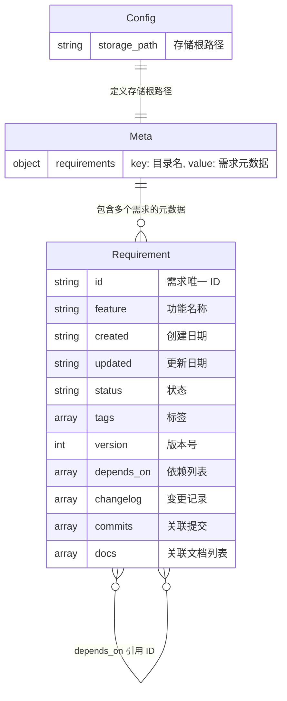
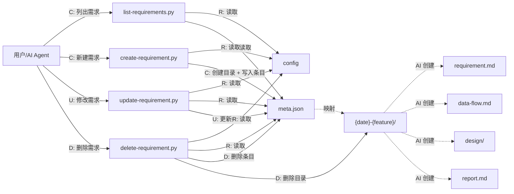
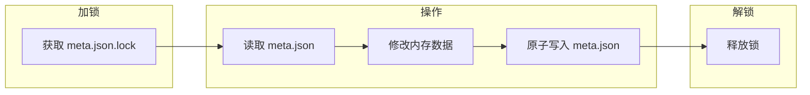

# 数据模型：需求管理脚本系统

> 场景类型：简单 CRUD
> 状态：草案

## 1. 实体清单

| 实体 | 说明 | 存储形式 |
|------|------|----------|
| Config | 存储配置（storage_path） | `.requirements/config` |
| Meta | 所有需求的元数据集合 | `.requirements/meta.json` |
| Requirement | 单个需求的目录和内容 | `{date}-{feature}/` |

## 2. ER 图



### 字段说明

| 实体 | 字段 | 类型 | 约束 | 说明 |
|------|------|------|------|------|
| Config | storage_path | string | 必填 | 需求存储的根目录路径 |
| Meta | requirements | object | 必填 | 所有需求的元数据，key 为目录名 |

#### 标识字段

| 字段 | 类型 | 约束 | 生成/维护 | 说明 |
|------|------|------|-----------|------|
| `id` | string | 必填，全局唯一，不可修改 | 自动生成 `REQ-NNN` | 需求唯一标识。create 时取现有最大编号 +1，首条为 `REQ-001`。不可被 update 修改，delete 后编号不回收 |
| `feature` | string | 必填 | 用户输入 | 功能名称（中文），作为目录名生成依据（`{date}-{feature}`） |

#### 状态字段

| 字段 | 类型 | 约束 | 生成/维护 | 说明 |
|------|------|------|-----------|------|
| `status` | string | 必填 | 用户 / update | 需求状态，枚举值见下方状态表 |
| `tags` | array | 必填 | 用户 | 标签列表，至少 1 个。create 默认 `["feat"]`。update 支持 `add` / `remove` / `set`，remove 最后一个标签时报错 |
| `version` | int | 必填 | 自动递增 | 版本号。create 时 = 1，每次 update 时自动 +1 |
| `created` | string | 必填 | 自动，不可修改 | 创建日期，格式 `YYYY-MM-DD` |
| `updated` | string | 必填 | 自动刷新 | 更新日期，`YYYY-MM-DD`。create 时 = created，每次 update 刷新为当前日期 |

#### 关系字段

| 字段 | 类型 | 约束 | 生成/维护 | 说明 |
|------|------|------|-----------|------|
| `depends_on` | array | 可选 | 用户 | 依赖的**需求 ID** 列表（如 `["REQ-001", "REQ-002"]`）。update 支持 `add` / `remove` / `set`。校验规则：①目标 ID 必须存在；②不能为自身；③不能形成循环依赖 |

#### 审计字段

| 字段 | 类型 | 约束 | 生成/维护 | 说明 |
|------|------|------|-----------|------|
| `changelog` | array | 可选 | 自动追加 | 变更记录。create 时 = `["初始创建"]`。每次 update 自动追加格式 `"YYYY-MM-DD v{version}: {message}"` |
| `commits` | array | 可选 | 用户 / CI | 关联的 git commit hash 列表。初始 = `[]`，仅支持追加，不支持删除 |

#### 关联文档字段

| 字段 | 类型 | 约束 | 生成/维护 | 说明 |
|------|------|------|-----------|------|
| `docs` | array | 可选 | AI / 用户 | 关联文档列表，每项包含 `path`（文档路径）和 `type`（文档类型），初始 = `[]` |

#### 状态枚举

| 状态值 | 含义 | 典型用法 |
|--------|------|----------|
| `草案` | 需求初建，内容尚未评审 | create 默认状态 |
| `已确认` | 需求评审通过，可进入设计 | update 流转 |
| `设计中` | 设计文档编写中 | update 流转 |
| `实施中` | 开发编码阶段 | update 流转 |
| `已完成` | 开发与验收均通过 | update 流转 |
| `已取消` | 需求废弃，保留记录不删除 | update 流转 |

## 3. 数据流图



### 数据流说明

| 流向 | 触发条件 | 操作 | 说明 |
|------|----------|------|------|
| 用户 → list | 用户执行列表命令 | R | 读取 config + meta.json，输出筛选结果 |
| 用户 → create | 用户执行新建命令 | C | 创建需求目录 + 写入 meta.json |
| 用户 → update | 用户执行修改命令 | R + U | 读取现有条目，更新指定字段 |
| 用户 → delete | 用户执行删除命令 | R + D | 读取确认后删除目录 + 移除条目 |
| meta.json → 需求目录 | 逻辑映射 | — | meta.json 的 key 指向真实目录 |

脚本只管理和 meta.json 同层的需求目录结构，不操作 requirement.md 的内容（由 AI 管理）。

## 4. meta.json 结构

```json
{
  "requirements": {
    "2026-06-11-requirement-management": {
      "id": "REQ-001",
      "feature": "需求管理脚本系统",
      "created": "2026-06-11",
      "updated": "2026-06-11",
      "status": "草案",
      "tags": ["feat", "tool"],
      "version": 3,
      "depends_on": [],
      "changelog": [
        "初始创建",
        "2026-06-11 v2: 确定技术选型为 Python",
        "2026-06-11 v3: 新增并发安全设计"
      ],
      "commits": [],
      "docs": [
        {"path": "data-flow.md", "type": "data_flow"}
      ]
    }
  }
}
```

### 字段生命周期速查

| 字段 | create | list | update | delete | 说明 |
|------|:---:|:---:|:---:|:---:|------|
| `id` | 自动生成 | 筛选 / 展示 | 不可修改 | — | 全局唯一标识 |
| `feature` | 必填（`--feature`） | 展示 / 搜索 | 可选修改 | — | 功能名称 |
| `status` | 默认 `草案` | 筛选 `--status` | `--status` | — | 需求生命周期状态 |
| `tags` | 默认 `["feat"]` | 筛选 `--tag` | `add` / `remove` / `set` | — | remove 不能删掉最后一个 |
| `version` | 自动 = 1 | 展示 | 自动 +1 | — | 每次修改递增 |
| `created` | 自动 <当前日期> | 筛选 `--from`/`--to` | 不可修改 | — | 创建时间戳 |
| `updated` | 自动 = created | 展示 | 自动刷新 | — | 最后修改时间 |
| `depends_on` | `--depends-on` | 展示 / `--deps` | `add` / `remove` / `set` | 清理引用 | 校验存在性 + 无循环 |
| `changelog` | 自动 `["初始创建"]` | 展示 | `--changelog` 追加 | — | 格式：`日期 v{N}: 内容` |
| `commits` | 自动 = `[]` | 展示 | `--commit` 追加 | — | 仅追加，不删除 |
| `docs` | 自动 = `[]` | 展示 | `--docs add/remove/set` | — | 关联文档列表，支持增删改 |

## 5. 脚本清单与功能规格

| 脚本 | 核心功能 | CLI 关键参数 |
|------|----------|-------------|
| `list-requirements.py` | 查询列表 + 指定需求详情 + 依赖展开 + 反向依赖 | `--id` / `--status` / `--tag` / `--deps` / `--rev-deps` / `--deps-depth` / `--columns` / `--json` |
| `create-requirement.py` | 新建需求 + ID 自增 + 依赖校验 | `--feature` / `--tags` / `--depends-on` / `--status` / `--dir-name` |
| `update-requirement.py` | 修改字段 + 版号自增 + 循环依赖检测 + 标签管理 | `<REQ-ID>` / `--status` / `--tag add/remove/set` / `--depends-on add/remove/set` / `--commit` / `--docs add/remove/set` / `--changelog` |
| `delete-requirement.py` | 安全删除 + 反向依赖检查 + 级联清理引用 + 预演模式 | `<REQ-ID>` / `--force` / `--dry-run` |

### 各脚本详细功能

#### list-requirements.py

```
用法：list-requirements.py [选项]

无参数：
  列出所有需求（表格模式），默认列：ID | 功能名称 | 状态 | 标签 | 版本 | 更新日期

筛选：
  --id REQ-001            精确匹配需求 ID，展示完整信息 + 关联依赖详情
  --status 进行中          按状态筛选
  --tag feat              按标签筛选（可重复 --tag 实现 AND）
  --from 2026-01-01       更新日期起
  --to   2026-12-31       更新日期止
  --search keyword         全文搜索 feature 名称

关联查询（与 --id 配合）：
  --deps                   展开 depends_on 列表，列出每个依赖需求的完整信息
  --rev-deps               反向依赖：列出哪些需求的 depends_on 包含本 ID
  --deps-depth 2           依赖展开深度（1=直接依赖，2=间接依赖，默认 1）

输出控制：
  --json                   JSON 格式输出
  --columns id,status,tags 自定义显示列（逗号分隔）
  --no-color               禁用颜色输出
```

#### create-requirement.py

```
用法：create-requirement.py --feature "名称" [选项]

必填：
  --feature "功能名称"         需求名称（中文）

可选：
  --tags feat,tool             标签，逗号分隔（至少一个，默认 ["feat"]）
  --depends-on REQ-001,REQ-002 依赖的需求 ID（校验：所有 ID 必须已存在）
  --status 草案                 初始状态（默认 "草案"）
  --dir-name custom-name        自定义目录名（默认 {date}-{feature}）

自动行为：
  ① 读取 meta.json，计算 id = "REQ-" + (最大编号 + 1)，首条为 REQ-001
  ② 创建目录 {date}-{feature}/（确保不冲突）
  ③ 写入 meta.json（加锁 + 原子写），docs 字段初始化为 `[]`
  ④ 输出：ID、目录名、meta.json 路径
```

#### update-requirement.py

```
用法：update-requirement.py <REQ-ID> [选项]

位置参数：
  REQ-ID                      要修改的需求 ID（如 REQ-001）

字段操作：
  --status 进行中              更新状态
  --feature "新名称"           更新功能名称
  --tag add feat               添加标签（重复添加幂等）
  --tag remove deprecated      移除标签（最后一个时报错）
  --tag set feat,tool          覆盖整个标签列表
  --depends-on add REQ-005     添加依赖（校验：存在 + 非自身 + 无循环）
  --depends-on remove REQ-003  移除依赖（不存在时幂等）
  --depends-on set REQ-001,002 覆盖依赖列表
  --commit abc1234             追加 commit hash（去重，已存在则不重复添加）
  --docs add path,type         添加关联文档（路径和类型，逗号分隔）
  --docs remove path           移除关联文档（按路径匹配）
  --docs set path1,type1;path2,type2  覆盖整个文档列表
  --changelog "增加了xxx"      追加变更记录

自动行为：
  ① updated 刷新为当前日期
  ② version 自动 +1
  ③ changelog 追加 "YYYY-MM-DD v{version}: {message}"

额外校验：
  --depends-on add 时检测循环依赖（BFS/DFS 遍历依赖图）
```

#### delete-requirement.py

```
用法：delete-requirement.py <REQ-ID> [选项]

位置参数：
  REQ-ID                      要删除的需求 ID

执行模式：
  （默认）                     交互确认模式，展示摘要后等待 y/N
  --force                     跳过确认，直接删除
  --dry-run                   仅展示将被删除/清理的内容，不实际执行

删除前检查：
  ① 需求 ID 是否存在
  ② 反向依赖扫描：查找所有 depends_on 中包含本 ID 的需求
     → 有反向依赖时：展示列表 + 警告，用户需确认
     → --force 模式：同样展示警告但继续

删除动作（加锁 + 原子写）：
  ① 从 meta.json.requirements 移除本条目
  ② 遍历所有其他需求，从 depends_on 中清理指向本 ID 的引用
  ③ 删除目录 {date}-{feature}/

输出：
  删除的 ID、目录路径、清理的依赖引用数量
```

## 6. 目录结构

```
.requirements/
├── config
├── meta.json
├── scripts/
│   ├── list-requirements.py
│   ├── create-requirement.py
│   ├── update-requirement.py
│   └── delete-requirement.py
└── {date}-{feature}/
    ├── requirement.md
    ├── data-flow.md
    ├── design/
    └── report.md
```

## 7. 待确认事项

无待确认事项。

## 8. 文档 Frontmatter 规范

### 分工

| | `meta.json`（脚本维护） | Frontmatter（AI 维护） |
|---|---|---|
| 职责 | 权威数据源，程序化查询/筛选 | 人类快速浏览，文档自描述 |
| 维护方 | 脚本 CRUD | AI 编写/更新文档时同步写入 |
| 一致性 | 脚本保证 | AI 承诺同步，脚本不校验 frontmatter |

### 格式

每个需求目录下的 Markdown 文档顶部使用 YAML frontmatter：

```yaml
---
id: REQ-001
feature: 需求管理脚本系统
status: 草案
created: 2026-06-11
updated: 2026-06-11
version: 3
tags: [feat, tool]
depends_on: []
author: AI
document_type: requirement
---
```

### 字段说明

| 字段 | 对应 meta.json | 类型 | 说明 |
|------|:---:|------|------|
| `id` | ✅ | string | 需求唯一标识，从 meta.json 同步 |
| `feature` | ✅ | string | 功能名称 |
| `status` | ✅ | string | 同 meta.json 状态枚举 |
| `created` | ✅ | string | 创建日期 `YYYY-MM-DD` |
| `updated` | ✅ | string | 更新日期 `YYYY-MM-DD` |
| `version` | ✅ | int | 版本号 |
| `tags` | ✅ | array | 标签列表 |
| `depends_on` | ✅ | array | 依赖的需求 ID 列表 |
| `author` | ❌ | string | 文档作者类型：`AI` / `Human` / `AI+Human` |
| `document_type` | ❌ | string | 文档类型枚举（见下表） |

### `document_type` 枚举

| 值 | 对应文件 | 说明 |
|----|----------|------|
| `requirement` | `requirement.md` | 需求描述文档 |
| `data_flow` | `data-flow.md` | 数据模型与数据流图 |
| `design` | `design/*.md` | 设计文档 |
| `report` | `report.md` | 实现总结报告 |

### 同步时机

| 操作 | 动作 |
|------|------|
| AI 创建 `requirement.md` | 从 meta.json 读取最新字段填入 frontmatter |
| AI 更新文档内容 | 刷新 `updated`、`version`、`status` 字段 |
| `update-requirement.py` 修改 meta.json | AI 后续编辑文档时重新同步 frontmatter（脚本不碰文档内容） |

## 9. 技术选型：Python vs Node.js

### 对比矩阵

| 维度 | Python 3.x | Node.js | 胜出 |
|------|-----------|---------|------|
| 原子写入 | `tempfile` + `os.replace()` 标准库原生支持 | `fs.rename()` 原子，但需手动管理临时文件 | **Python** |
| 文件锁（并发） | `fcntl.flock`（Unix）/ `msvcrt.locking`（Windows）标准库 | 需 `proper-lockfile` 等第三方 npm 包 | **Python** |
| CLI 参数解析 | `argparse` 标准库，功能完整 | `process.argv` 需手动解析，或引入 `commander` | **Python** |
| JSON 操作 | `json` 标准库 | 原生 `JSON.parse/stringify` | 平手 |
| 跨平台路径 | `pathlib` 标准库 | `path` 模块 | 平手 |
| 零依赖 | ✅ 全部标准库 | ❌ 并发场景需第三方包 | **Python** |

### 结论

**选择 Python 3.x**。核心原因：并发文件锁和原子写入**全部由标准库覆盖**，零外部依赖。作为放在 `.requirements/scripts/` 里的独立工具脚本，"零依赖"是决定性优势。

---

## 10. 原子写入策略

### 问题

`meta.json` 写入中途崩溃（进程被杀、断电）会导致文件内容不完整或损坏，所有需求元数据丢失。

### 方案：写临时文件 + 原子替换

```python
import json
import os
import tempfile
from pathlib import Path

def atomic_write_json(filepath: Path, data: dict) -> None:
    """原子写入 JSON 文件：先写临时文件，再 os.replace 原子替换"""
    filepath = Path(filepath)
    # 在同一目录下创建临时文件，保证 os.replace 在同一文件系统（原子操作前提）
    with tempfile.NamedTemporaryFile(
        mode='w',
        encoding='utf-8',
        suffix='.tmp',
        dir=filepath.parent,
        delete=False  # 保留临时文件以便 rename
    ) as f:
        json.dump(data, f, ensure_ascii=False, indent=2)
        tmp_path = f.name

    # os.replace 是原子操作：要么旧文件完整保留，要么新文件完全替换
    os.replace(tmp_path, filepath)
```

### 关键保证

| 保证 | 机制 |
|------|------|
| 不会出现半个文件 | `os.replace` 是 POSIX 原子系统调用 |
| 崩溃恢复 | 旧文件在 `os.replace` 成功前始终完整 |
| 跨文件系统兼容 | 临时文件与目标在同一目录，确保同文件系统 |
| 进度残留清理 | `tempfile` 自动生成唯一文件名，无冲突风险 |

---

## 11. 并发文件锁设计

### 场景

多个 AI Agent 或用户进程可能同时执行脚本操作 `meta.json`，典型冲突：

- 两个 `create` 同时写入 → 后者覆盖前者的新需求
- 一个 `update` 和一个 `delete` 同时操作 → 状态不一致

### 方案：排他文件锁 + 超时重试

```python
import time
import os

if os.name == 'nt':  # Windows
    import msvcrt
else:                 # Unix/Linux/Mac
    import fcntl

LOCK_TIMEOUT = 5      # 最大等待时间（秒）
LOCK_RETRY_INTERVAL = 0.1  # 重试间隔


class FileLock:
    """跨平台排他文件锁，支持超时自动重试"""

    def __init__(self, filepath: str):
        self.lockfile = filepath + '.lock'
        self.fd = None

    def acquire(self) -> bool:
        """获取锁，超时返回 False"""
        deadline = time.time() + LOCK_TIMEOUT
        while time.time() < deadline:
            try:
                self.fd = open(self.lockfile, 'w')
                if os.name == 'nt':
                    msvcrt.locking(self.fd.fileno(), msvcrt.LK_NBLCK, 1)
                else:
                    fcntl.flock(self.fd.fileno(), fcntl.LOCK_EX | fcntl.LOCK_NB)
                return True
            except (IOError, OSError):
                if self.fd:
                    self.fd.close()
                    self.fd = None
                time.sleep(LOCK_RETRY_INTERVAL)
        return False

    def release(self):
        """释放锁"""
        if self.fd:
            if os.name == 'nt':
                msvcrt.locking(self.fd.fileno(), msvcrt.LK_UNLCK, 1)
            else:
                fcntl.flock(self.fd.fileno(), fcntl.LOCK_UN)
            self.fd.close()
            try:
                os.unlink(self.lockfile)
            except OSError:
                pass
            self.fd = None

    def __enter__(self):
        if not self.acquire():
            raise TimeoutError(f"无法在 {LOCK_TIMEOUT}s 内获取 meta.json 锁")
        return self

    def __exit__(self, *args):
        self.release()
```

### 使用方式（以 `create-requirement.py` 为例）

```python
meta_path = Path(storage_root) / 'meta.json'
with FileLock(str(meta_path)):
    data = load_meta(meta_path)
    data['requirements'][dir_name] = new_entry
    atomic_write_json(meta_path, data)
```

### 锁策略要点

| 要点 | 设计 |
|------|------|
| 锁粒度 | 对 `meta.json` 整体加排他锁（`.meta.json.lock`） |
| 锁模式 | 排他锁（`LOCK_EX`），读写统一互斥 |
| 超时 | 5s 超时 + 0.1s 重试间隔，避免死锁阻塞 |
| 异常处理 | 超时抛出 `TimeoutError`，调用方可重试整个操作 |
| 锁清理 | `__exit__` 自动释放 + 删除 `.lock` 文件 |

### 数据流更新（加入锁步骤）


