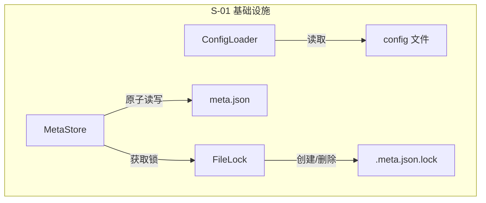

# S-01 基础设施层设计

## 1. 术语

| 术语 | 定义 |
|------|------|
| `ConfigLoader` | 读取 `.requirements/config`，提供 `storage_path` |
| `MetaStore` | 封装 `meta.json` 的读写，内置原子写入 |
| `FileLock` | 跨平台排他文件锁（`fcntl` / `msvcrt`） |
| `atomic_write` | 写临时文件 + `os.replace()` 原子替换 |
| `REQ-NNN` | 需求 ID 格式，NNN 为 3 位左补零自增编号 |

## 2. 现状分析 (AS-IS)

无现有实现。`.requirements/` 目录目前仅有手写的 `config` 文件和需求目录，缺少程序化读写基础设施。

## 3. 方案设计 (TO-BE)

### 模块架构



### 模块职责

| 模块 | 文件 | 职责 |
|------|------|------|
| `ConfigLoader` | `config_loader.py` | 读取 `.requirements/config`，缓存 `storage_path`，校验路径有效性 |
| `MetaStore` | `meta_store.py` | 加载/保存 `meta.json`，内部调用 `atomic_write` 和 `FileLock` |
| `FileLock` | `file_lock.py` | 跨平台排他锁，5s 超时 + 0.1s 重试 |
| `id_generator` | `id_generator.py` | `gen_next_id(requirements: dict) -> str` |

### 4. 接口设计

```python
# config_loader.py
class ConfigLoader:
    def __init__(self, config_path: str = ".requirements/config"):
        """初始化，配置路径可覆盖"""
        ...

    def read(self) -> Path:
        """读取 config 并返回 storage_path。
        
        Returns:
            Path: 存储根路径
        
        Raises:
            FileNotFoundError: config 文件不存在
            ValueError: storage_path 为空或无效
        """
        ...


# meta_store.py
class MetaStore:
    def __init__(self, storage_root: Path):
        """storage_root 从 ConfigLoader.read() 获取"""
        ...

    def load(self) -> dict:
        """读取 meta.json，返回完整字典。
        
        Returns:
            dict: {"requirements": {...}}
            若文件不存在返回 {"requirements": {}}
        
        Raises:
            json.JSONDecodeError: JSON 格式损坏
        """
        ...

    def save(self, data: dict) -> None:
        """原子写入 meta.json（内部调用 atomic_write）。
        
        注意：调用方需先获取 FileLock。
        """
        ...


# file_lock.py
class FileLock:
    def __init__(self, filepath: str):
        """filepath 为目标文件路径，锁文件 = filepath + '.lock'"""
        ...

    def acquire(self) -> bool:
        """获取排他锁，5s 内未获取返回 False"""
        ...

    def release(self) -> None:
        """释放锁并删除 .lock 文件"""
        ...

    def __enter__(self):
        """上下文管理器入口，超时抛 TimeoutError"""
        ...

    def __exit__(self, *args):
        """上下文管理器出口，自动 release"""
        ...


# id_generator.py
def gen_next_id(requirements: dict) -> str:
    """根据现有需求生成下一个 ID。
    
    Args:
        requirements: meta.json 中的 requirements 字典
    
    Returns:
        str: "REQ-001" (首条) 或 "REQ-NNN"
    
    Raises:
        ValueError: 编号超过 999
    """
    ...
```

## 5. 关键决策点

### 决策 1：锁粒度 — 文件级 vs 条目级

| 方案 | 描述 | 优劣 |
|------|------|------|
| 文件级排他锁 | 对 `meta.json` 整体加锁 | ✅ 实现简单 ✅ 绝对安全 ❌ 粒度粗 |
| 条目级锁 | 对单个需求条目加锁 | ✅ 并发度高 ❌ 实现复杂 ❌ 死锁风险高 |

**决定**：文件级排他锁。需求管理场景并发度低（单用户 + 少数 AI Agent），实现简单优于并发度。

### 决策 2：ID 编号策略

| 方案 | 描述 | 优劣 |
|------|------|------|
| UUID | `uuid4` 随机 | ❌ 不可读 ❌ 不便于 CLI 输入 |
| 时间戳 | `REQ-20260611-001` | ⚠️ 一天内排序难 ❌ 过长 |
| **自增编号** | `REQ-001` | ✅ 简短 ✅ 可读 ✅ 自然排序 |

**决定**：自增编号 `REQ-NNN`。读取现有最大编号 +1，编号永不回收。

## 6. 数据模型

### config 文件格式

```
storage_path=.requirements
```

纯文本，`key=value` 格式，每行一条。当前仅 `storage_path` 一个键。

### meta.json 完整 Schema

```json
{
  "requirements": {
    "<dir-name>": {
      "id": "REQ-001",
      "feature": "需求管理脚本系统",
      "created": "2026-06-11",
      "updated": "2026-06-11",
      "status": "草案",
      "tags": ["feat", "tool"],
      "version": 1,
      "depends_on": [],
      "changelog": ["初始创建"],
      "commits": [],
      "data_flow": "",
      "report": ""
    }
  }
}
```

字段约束详见 `data-flow.md` §2 字段说明。

## 7. 异常处理 & 边界情况

| 场景 | 行为 |
|------|------|
| `config` 文件不存在 | `ConfigLoader.read()` 抛 `FileNotFoundError`："请先创建 .requirements/config" |
| `storage_path` 为空 | 抛 `ValueError` |
| `meta.json` 不存在 | `MetaStore.load()` 返回 `{"requirements": {}}`（首次使用） |
| `meta.json` JSON 损坏 | 抛 `json.JSONDecodeError`，不尝试修复 |
| 锁超时（5s） | `FileLock.__enter__` 抛 `TimeoutError`，调用方处理 |
| 进程崩溃未释放锁 | `.lock` 文件残留，下次启动时忽略（锁基于 fd 而非文件存在性） |
| ID 编号超过 999 | `gen_next_id()` 抛 `ValueError`（1000 个需求理论上够用） |
