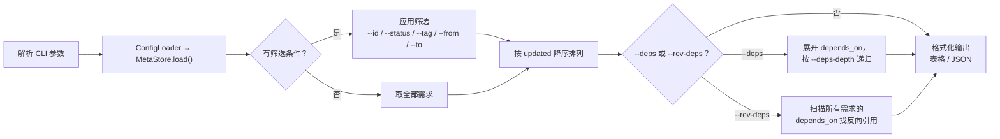
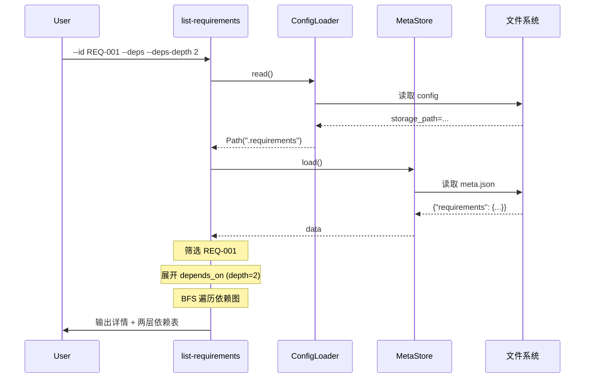

# S-02 list-requirements.py 设计

## 1. 术语

| 术语 | 定义 |
|------|------|
| 表格模式 | 默认输出格式，ASCII 表格，对齐排列 |
| JSON 模式 | `--json` 触发，输出 JSON 数组 |
| 依赖展开 | `--deps` 将 `depends_on` 中的 ID 展开为完整需求信息 |
| 反向依赖 | `--rev-deps` 查找所有 `depends_on` 包含本 ID 的需求 |
| `deps-depth` | 依赖展开深度，1=直接依赖，2=含间接依赖 |

## 2. 现状分析 (AS-IS)

无现有实现。

## 3. 方案设计 (TO-BE)

### 处理流程



### 筛选逻辑

| 参数 | 逻辑 |
|------|------|
| `--id REQ-001` | 精确匹配 `requirements[*].id` |
| `--status 进行中` | 精确匹配 |
| `--tag feat` | 多个 `--tag` 为 AND 关系 |
| `--from 2026-01-01` | `updated >= from` |
| `--to 2026-06-11` | `updated <= to` |
| `--search keyword` | `keyword in feature`（不区分大小写） |

### 输出格式

**表格模式（默认）**：

```
┌─────────┬──────────────────────┬──────────┬──────────────────┬──────┬────────────┐
│ ID      │ 功能名称               │ 状态     │ 标签              │ 版本 │ 更新日期    │
├─────────┼──────────────────────┼──────────┼──────────────────┼──────┼────────────┤
│ REQ-002 │ 用户认证模块           │ 实施中   │ feat, backend     │ 5    │ 2026-06-10 │
│ REQ-001 │ 需求管理脚本系统       │ 设计中   │ feat, tool        │ 4    │ 2026-06-11 │
└─────────┴──────────────────────┴──────────┴──────────────────┴──────┴────────────┘
```

**--id 详情模式**：单需求全字段展示 + changelog 列表。

**--id + --deps 模式**：详情 + 依赖表格（列：ID / 名称 / 状态 / 标签）。

**JSON 模式**：输出 `[{"id": "REQ-001", ...}, ...]`。

## 4. 接口设计

### CLI 参数

```
list-requirements.py [--id ID] [--status STATUS] [--tag TAG ...]
                     [--from DATE] [--to DATE] [--search KW]
                     [--deps] [--rev-deps] [--deps-depth N]
                     [--json] [--columns COL1,COL2] [--no-color]
```

| 参数 | 类型 | 默认 | 说明 |
|------|------|------|------|
| `--id` | str | — | 精确匹配 |
| `--status` | str | — | 按状态筛选 |
| `--tag` | str (可重复) | — | AND 标签筛选 |
| `--from` | str (YYYY-MM-DD) | — | 更新日期起 |
| `--to` | str (YYYY-MM-DD) | — | 更新日期止 |
| `--search` | str | — | 模糊搜索 feature |
| `--deps` | flag | — | 展开直接依赖 |
| `--rev-deps` | flag | — | 反向依赖查询 |
| `--deps-depth` | int | 1 | 依赖递归深度 |
| `--json` | flag | — | JSON 输出 |
| `--columns` | str | id,feature,status,tags,version,updated | 自定义列 |
| `--no-color` | flag | — | 禁用 ANSI 颜色 |

### 函数签名

```python
def list_requirements(
    storage_root: Path,
    req_id: str | None = None,
    status: str | None = None,
    tags: list[str] | None = None,
    date_from: str | None = None,
    date_to: str | None = None,
    search: str | None = None,
    deps: bool = False,
    rev_deps: bool = False,
    deps_depth: int = 1,
    json_output: bool = False,
    columns: list[str] | None = None,
    no_color: bool = False,
) -> str:
    """返回格式化后的输出字符串，调用方直接 print。"""
    ...
```

## 5. 关键决策点

### 决策 1：--deps 展示格式

| 方案 | 优劣 |
|------|------|
| 内联展开（依赖信息嵌入详情表下方） | ✅ 一目了然 ❌ 递归层级深时拥挤 |
| 单独表格（先主表再依赖表） | ✅ 结构清晰 ✅ 支持多层级 |

**决定**：单独表格。先展示主需求详情，下方列出依赖表格。

### 决策 2：--rev-deps 遍历策略

| 方案 | 优劣 |
|------|------|
| 全量扫描 | ✅ 简单 ❌ 需求多时慢 |
| 反向索引缓存 | ✅ 快 ❌ 增加复杂度 |

**决定**：全量扫描。需求数量预期 < 100，O(n) 遍历完全可接受。

## 6. 关键流程时序图



## 7. 异常处理

| 场景 | 行为 | 退出码 |
|------|------|:---:|
| config 不存在 | 打印错误，退出 | 1 |
| meta.json 不存在 | 输出空列表 | 0 |
| --id 指定的 ID 不存在 | "未找到需求 REQ-XXX" | 1 |
| 筛选条件无匹配 | 输出空表 / `[]` | 0 |
| deps 时依赖 ID 不存在 | 标注 `[不存在]`，不中断 | 0 |

## 8. 性能考虑

| 指标 | 预期 | 说明 |
|------|------|------|
| 需求数量 | < 100 | 全量扫描 O(n) |
| 表格列宽 | 动态计算 | 按每列最长值 + 2 空格 |
| 依赖深度限制 | `--deps-depth` 上限 5 | 防止递归爆炸 |
| JSON 输出 | `json.dumps(indent=2)` | 标准库，无性能问题 |
