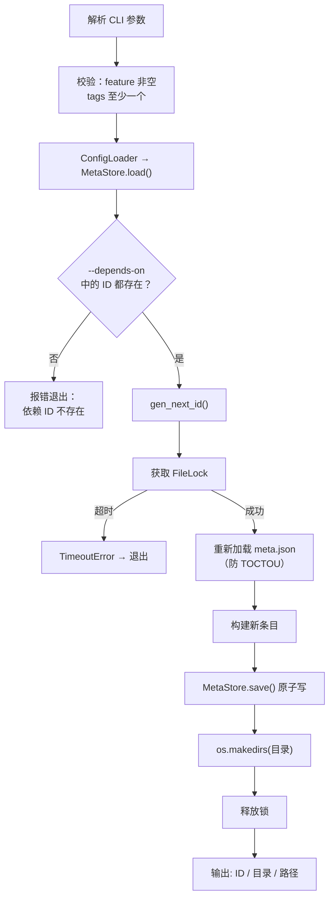
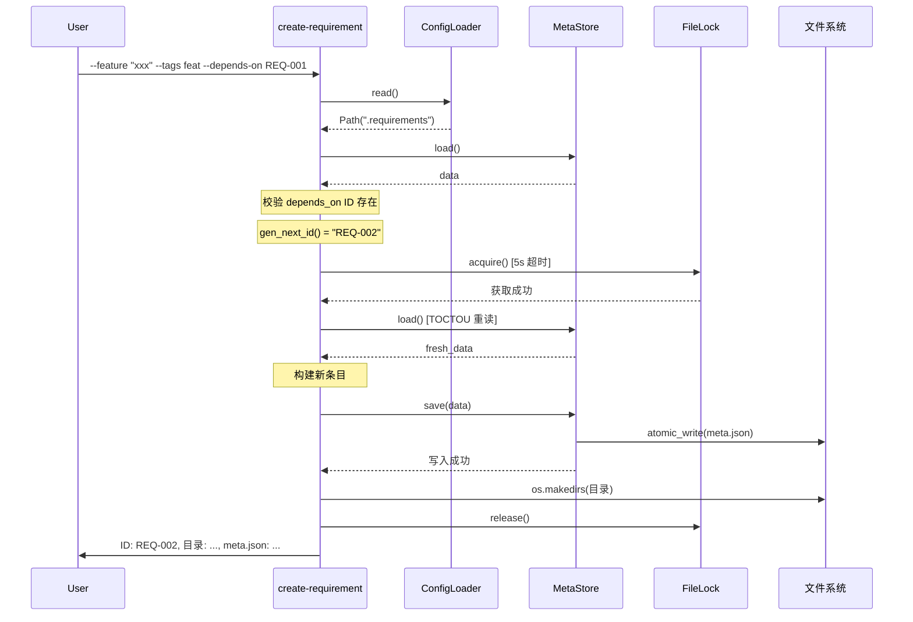

# S-03 create-requirement.py 设计

## 1. 术语

| 术语 | 定义 |
|------|------|
| ID 自增 | 读取现有最大编号 +1 生成新 ID |
| 目录冲突 | 目标目录 `{date}-{feature}` 已存在 |
| 依赖预校验 | 写入前检查 `--depends-on` 中所有 ID 是否已在 meta.json 中存在 |

## 2. 现状分析 (AS-IS)

无现有实现。

## 3. 方案设计 (TO-BE)

### 处理流程



### 条目构建

```python
today = date.today().isoformat()
new_entry = {
    "id": req_id,                    # 自动生成
    "feature": args.feature,         # 用户输入
    "created": today,                # 自动
    "updated": today,                # 自动
    "status": args.status or "草案",  # 默认
    "tags": args.tags or ["feat"],    # 默认
    "version": 1,                    # 固定
    "depends_on": args.depends_on or [],
    "changelog": ["初始创建"],
    "commits": [],
    "data_flow": "",
    "report": "",
}
```

### 目录名生成

```
默认：{date}-{feature}
     2026-06-11-需求管理脚本系统

--dir-name：直接使用用户输入，冲突时报错
```

## 4. 接口设计

### CLI 参数

```
create-requirement.py --feature "名称"
                      [--tags feat,tool]
                      [--depends-on REQ-001,REQ-002]
                      [--status 草案]
                      [--dir-name custom-name]
```

| 参数 | 类型 | 必填 | 默认 | 校验 |
|------|------|:---:|------|------|
| `--feature` | str | ✅ | — | 非空 |
| `--tags` | str (逗号分隔) | ❌ | `"feat"` | 至少 1 个 |
| `--depends-on` | str (逗号分隔) | ❌ | — | 每个 ID 必须存在 |
| `--status` | str | ❌ | `"草案"` | 枚举值之一 |
| `--dir-name` | str | ❌ | `{date}-{feature}` | 目录不冲突 |

### 函数签名

```python
def create_requirement(
    storage_root: Path,
    feature: str,
    tags: list[str] | None = None,
    depends_on: list[str] | None = None,
    status: str = "草案",
    dir_name: str | None = None,
) -> dict:
    """创建需求，返回 {"id": "...", "dir": "...", "meta_path": "..."}
    
    Raises:
        ValueError: feature 为空 / tags 为空 / 依赖 ID 不存在
        FileExistsError: 目录名冲突
        TimeoutError: 获取锁超时
    """
    ...
```

## 5. 关键决策点

### 决策 1：目录名生成策略

| 方案 | 优劣 |
|------|------|
| 纯日期 `2026-06-11-1` | ❌ 无法从目录名识别功能 |
| 纯功能名 `需求管理脚本系统` | ❌ 无时间信息，URL 不安全 |
| **日期+功能名** `2026-06-11-requirement-management` | ✅ 兼顾时间和可读性 |

**决定**：日期+功能名。用户可通过 `--dir-name` 覆盖。

### 决策 2：ID 并发分配

问题：两个 create 同时执行，读到相同的最大编号。

| 方案 | 优劣 |
|------|------|
| 不加锁直接分配 | ❌ ID 重复 |
| **加锁后重新读取** | ✅ 防 TOCTOU ✅ 简单 |

**决定**：获取锁后重新读取 `meta.json`（防 TOCTOU 窗口），再计算 ID。

### 决策 3：依赖 ID 不存在时的处理

**决定**：前置校验阶段报错，拒绝创建。不允许创建指向不存在的依赖。

## 6. 异常处理

| 场景 | 行为 | 退出码 |
|------|------|:---:|
| `--feature` 为空 | "feature 不能为空" | 1 |
| `--tags` 为空 | "至少需要一个标签" | 1 |
| `--depends-on` 含不存在 ID | "依赖需求 REQ-XXX 不存在" | 1 |
| 目录名冲突 | "目录已存在: ..." | 1 |
| 锁超时 | "无法获取锁，请稍后重试" | 2 |
| ID 编号超过 999 | "需求编号已达上限" | 1 |
| 磁盘满 | OS 异常透传 | 1 |

## 7. 关键流程时序图


