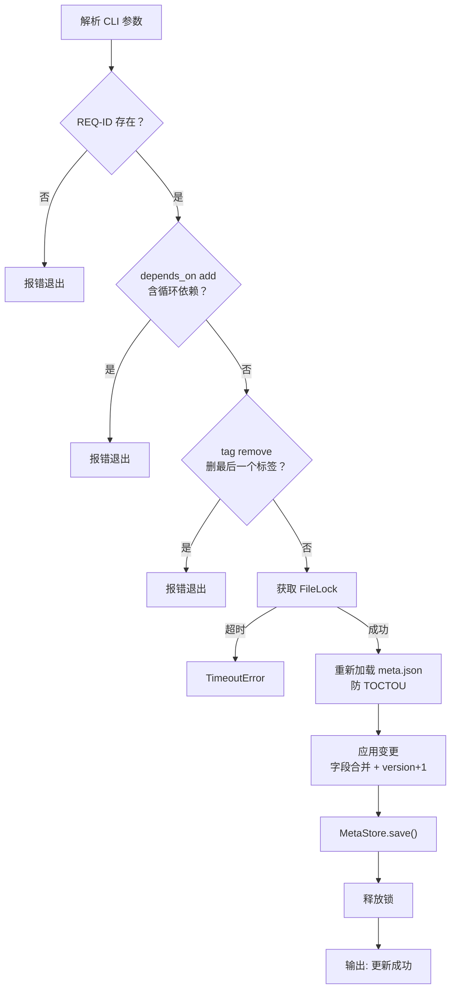
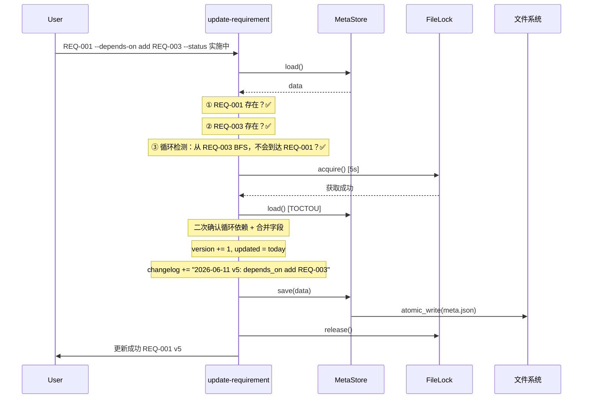

# S-04 update-requirement.py 设计

## 1. 术语

| 术语 | 定义 |
|------|------|
| 循环依赖 | A→B→A 的依赖链，BFS/DFS 检测 |
| 标签幂等 | `--tag add feat` 重复执行不报错，不重复添加 |
| 版号自增 | 每次 update 时 `version += 1`，`updated` 刷新 |

## 2. 现状分析 (AS-IS)

无现有实现。

## 3. 方案设计 (TO-BE)

### 处理流程



### 字段操作语义

| 操作 | 语法 | 逻辑 |
|------|------|------|
| `--status` | `--status 已完成` | 直接覆盖 |
| `--feature` | `--feature "新名称"` | 直接覆盖 |
| `--tag add` | `--tag add deploy` | 追加，已存在则幂等跳过 |
| `--tag remove` | `--tag remove feat` | 删除，最后 1 个时报错 |
| `--tag set` | `--tag set feat,deploy` | 覆盖整个列表 |
| `--depends-on add` | `--depends-on add REQ-003` | 追加 + 循环检测，已存在则幂等 |
| `--depends-on remove` | `--depends-on remove REQ-003` | 删除，不存在则幂等 |
| `--depends-on set` | `--depends-on set REQ-001,002` | 覆盖列表 |
| `--commit` | `--commit abc1234` | 追加，去重 |
| `--changelog` | `--changelog "修复XX"` | 追加 `"YYYY-MM-DD v{N}: 修复XX"` |

### 循环依赖检测算法

```python
def has_circular_dep(requirements: dict, start_id: str, target_id: str) -> bool:
    """检测将 target_id 加入 start_id 的 depends_on 后是否形成环。
    
    等价于：从 target_id 出发 BFS，看能否到达 start_id。
    """
    visited = set()
    queue = [target_id]
    while queue:
        current_id = queue.pop(0)
        if current_id == start_id:
            return True  # 形成环
        if current_id in visited:
            continue
        visited.add(current_id)
        # 找到 current_id 对应的需求
        for dir_name, req in requirements.items():
            if req["id"] == current_id:
                queue.extend(req.get("depends_on", []))
                break
    return False
```

## 4. 接口设计

### CLI 参数

```
update-requirement.py REQ-ID
                     [--status STATUS]
                     [--feature NAME]
                     [--tag add|remove|set VALUE]
                     [--depends-on add|remove|set IDS]
                     [--commit HASH]
                     [--data-flow PATH]
                     [--report PATH]
                     [--changelog MESSAGE]
```

| 参数 | 说明 |
|------|------|
| `REQ-ID` | 位置参数，如 `REQ-001`，必须存在 |
| `--status` | 直接覆盖状态 |
| `--feature` | 直接覆盖名称 |
| `--tag add X` | 追加标签 X |
| `--tag remove X` | 删除标签 X |
| `--tag set A,B` | 覆盖标签列表 |
| `--depends-on add X` | 追加依赖（含循环检测） |
| `--depends-on remove X` | 移除依赖 |
| `--depends-on set A,B` | 覆盖依赖列表 |
| `--commit` | 追加 commit hash |
| `--data-flow` | 设置数据流文档路径 |
| `--report` | 设置实现报告路径 |
| `--changelog` | 追加变更记录 |

### 函数签名

```python
def update_requirement(
    storage_root: Path,
    req_id: str,
    status: str | None = None,
    feature: str | None = None,
    tag_op: tuple[str, str] | None = None,        # ("add", "feat") / ("remove", "feat") / ("set", "feat,deploy")
    depends_on_op: tuple[str, str] | None = None,  # ("add", "REQ-003") / ("remove", "REQ-003") / ("set", "REQ-001,002")
    commit: str | None = None,
    data_flow: str | None = None,
    report: str | None = None,
    changelog: str | None = None,
) -> dict:
    """返回更新后的需求条目。
    
    Raises:
        ValueError: REQ-ID 不存在 / 循环依赖 / 删最后一个标签
        TimeoutError: 锁超时
    """
    ...
```

## 5. 关键决策点

### 决策 1：add/remove/set 三态设计

**决定**：使用子命令风格 `--tag add X` / `--tag remove X` / `--tag set A,B`。argparse 通过 `nargs` 和自定义 action 实现。

否决方案：
- 仅覆盖式 `--tags A,B` → ❌ 无法增量操作，每次需要补全所有标签
- 增删分离参数 `--add-tag` / `--remove-tag` → ❌ 参数数量膨胀

### 决策 2：循环依赖检测时机

| 方案 | 优劣 |
|------|------|
| 写入 meta.json 后被动发现 | ❌ 脏数据进入存储 |
| **前置校验**（加锁前） | ✅ 不进入锁临界区 ✅ 快速失败 |

**决定**：加锁前前置校验。但校验时读取的 `depends_on` 可能已过期，加锁后仍需二次确认（加锁后重读是 S-01 MetaStore 的约定）。

### 决策 3：幂等策略

- `--tag add` 已存在：跳过，不报错
- `--tag remove` 不存在：跳过，不报错
- `--depends-on add` 已存在：跳过（循环检测仍执行，结果不变）
- `--commit` 已存在：跳过，去重

**决定**：所有追加/删除操作对"已存在/不存在"幂等。

## 6. 异常处理

| 场景 | 行为 | 退出码 |
|------|------|:---:|
| REQ-ID 不存在 | "未找到需求 REQ-XXX" | 1 |
| `--tag remove` 删最后一个 | "不能删除最后一个标签" | 1 |
| `--depends-on add` 含自身 | "不能依赖自身" | 1 |
| 循环依赖 | "添加 REQ-005 会形成循环依赖: REQ-001→REQ-005→REQ-001" | 1 |
| `--depends-on add` 目标不存在 | "依赖需求 REQ-XXX 不存在" | 1 |
| 锁超时 | "无法获取锁，请稍后重试" | 2 |
| 无任何 `--` 参数 | "请指定至少一个要修改的字段" | 1 |

## 7. 关键流程时序图


