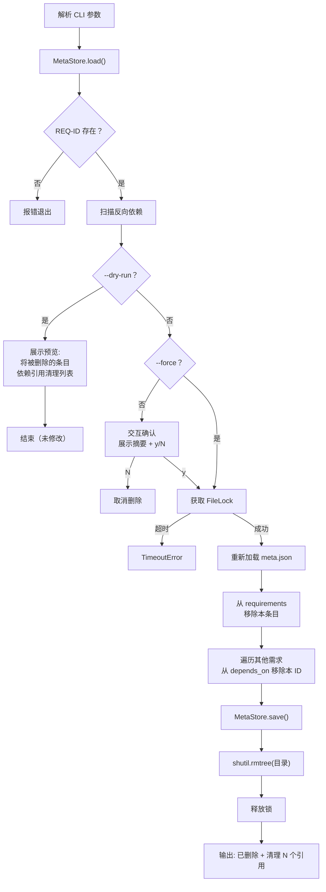
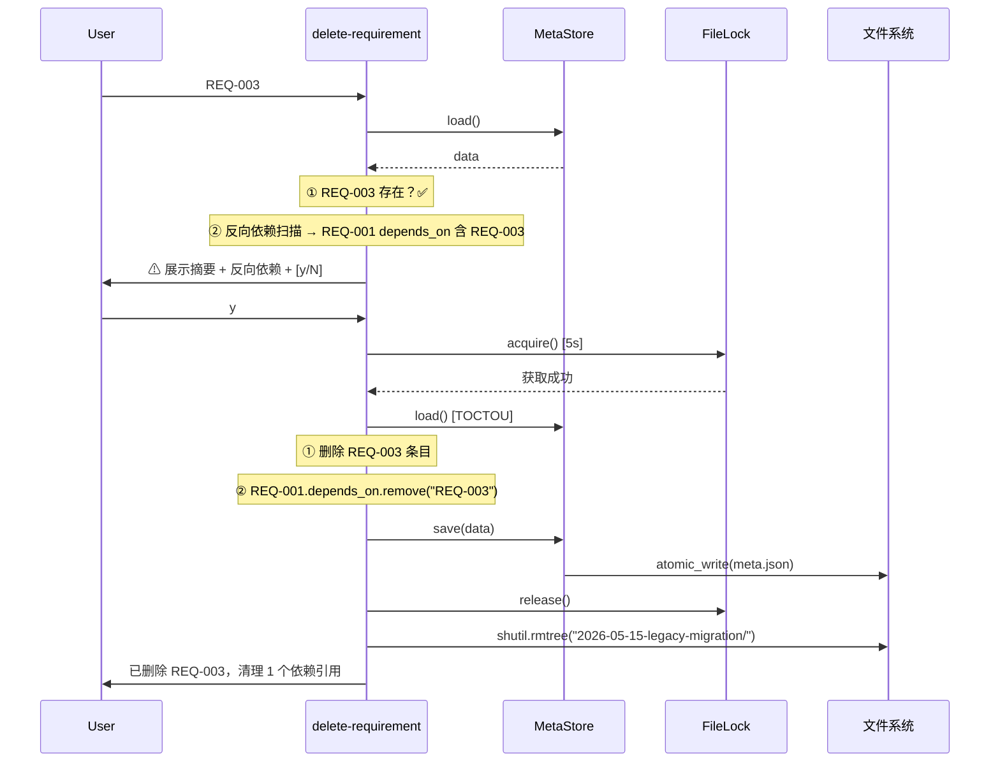

# S-05 delete-requirement.py 设计

## 1. 术语

| 术语 | 定义 |
|------|------|
| 反向依赖 | 查找所有 `depends_on` 中包含本 ID 的需求 |
| 级联清理 | 删除自身条目 + 清理其他需求中对本 ID 的 `depends_on` 引用 |
| dry-run | `--dry-run` 仅展示操作预览，不实际修改 |
| force | `--force` 跳过交互确认，直接执行 |

## 2. 现状分析 (AS-IS)

无现有实现。

## 3. 方案设计 (TO-BE)

### 处理流程



### 反向依赖扫描

```python
def find_rev_deps(requirements: dict, target_id: str) -> list[dict]:
    """找到所有 depends_on 中包含 target_id 的需求。
    
    Returns:
        [{ "id": "REQ-003", "feature": "...", "depends_on": [...] }, ...]
    """
    result = []
    for dir_name, req in requirements.items():
        if target_id in req.get("depends_on", []):
            result.append({
                "id": req["id"],
                "feature": req["feature"],
                "depends_on": req.get("depends_on", []),
            })
    return result
```

### 确认交互协议

```
$ delete-requirements.py REQ-003

⚠ 确认删除
──────────────────────────────────
ID:        REQ-003
名称:      旧模块迁移工具
目录:      2026-05-15-legacy-migration
状态:      已取消

反向依赖（1 项将清理引用）：
  REQ-001  需求管理脚本系统 → depends_on 移除此 ID

确认删除？[y/N]: _
```

### dry-run 输出

```
$ delete-requirements.py REQ-003 --dry-run

🔍 预删除检查
──────────────────────────────────
ID:        REQ-003
名称:      旧模块迁移工具
目录:      2026-05-15-legacy-migration

将执行：
  ① 从 meta.json 删除 REQ-003 条目
  ② 从 REQ-001.depends_on 移除 REQ-003
  ③ 删除目录：2026-05-15-legacy-migration/

⚠ --dry-run 模式，未做任何修改。
```

## 4. 接口设计

### CLI 参数

```
delete-requirement.py REQ-ID [--force] [--dry-run]
```

| 参数 | 类型 | 说明 |
|------|------|------|
| `REQ-ID` | str (位置) | 要删除的需求 ID |
| `--force` | flag | 跳过交互确认 |
| `--dry-run` | flag | 仅预览，不实际删除 |

### 函数签名

```python
def delete_requirement(
    storage_root: Path,
    req_id: str,
    force: bool = False,
    dry_run: bool = False,
) -> dict:
    """删除需求。返回删除摘要。
    
    Returns:
        {"id": "REQ-003", "dir": "...", "cleaned_refs": ["REQ-001"]}
    
    Raises:
        ValueError: REQ-ID 不存在
        TimeoutError: 锁超时
        OSError: 目录删除失败
    """
    ...
```

## 5. 关键决策点

### 决策 1：反向依赖时的默认行为

| 方案 | 优劣 |
|------|------|
| 阻止删除 | ✅ 安全 ❌ 用户无法删除被依赖的需求 |
| **警告 + 确认** | ✅ 保留用户控制权 ✅ 同步清理引用 |
| 静默清理 | ❌ 危险，用户无感知 |

**决定**：警告 + 确认。展示反向依赖列表，用户确认后级联清理 `depends_on` 引用。

### 决策 2：清理引用的粒度

| 方案 | 优劣 |
|------|------|
| 只删本条目的 `depends_on` 引用 | ❌ 其他需求留下悬空引用 |
| **清理所有需求中对本 ID 的引用** | ✅ 数据一致 ✅ 无悬空引用 |

**决定**：遍历所有需求，清理 `depends_on` 中包含本 ID 的条目。

### 决策 3：dry-run 实现方式

**决定**：dry-run 在加锁前执行所有读取和预览，不进入任何写路径。`--dry-run` 与 `--force` 互斥。

### 决策 4：目录删除失败的处理

**决定**：先完成 `meta.json` 的清理（加锁写），再尝试删除目录。目录删除失败仅打印警告，不影响 meta.json 的一致性（条目已删除，残留目录可手动清理）。

## 6. 异常处理

| 场景 | 行为 | 退出码 |
|------|------|:---:|
| REQ-ID 不存在 | "未找到需求 REQ-XXX" | 1 |
| `--dry-run` + `--force` 同时使用 | "互斥参数" | 1 |
| 用户取消确认 (N) | "已取消" | 0 |
| 锁超时 | "无法获取锁，请稍后重试" | 2 |
| 目录删除失败 | 打印警告，仍然退出成功 | 0 (警告) |
| 进程中删除目录中断 | `rmtree` 部分删除 → 残留目录不阻塞下次 create | 1 |

## 7. 关键流程时序图


