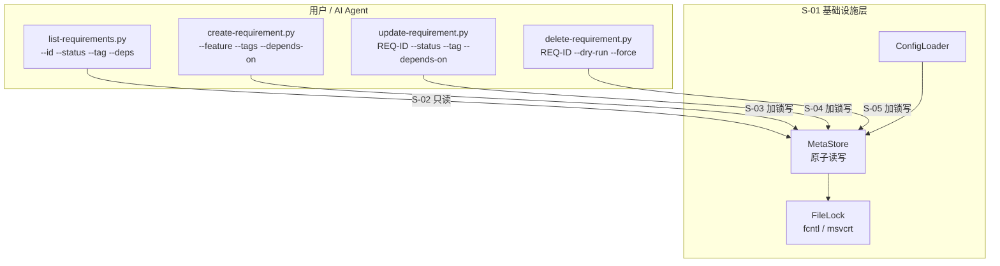
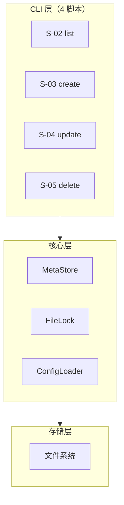

# 需求管理脚本系统 — 设计文档

> 状态：草案

## 1. 需求背景 & 目标

### 背景

`.requirements/` 目录下的需求信息分散在各文档的 YAML frontmatter 中，AI Agent 查询和更新效率低。

### 目标

提供一套零依赖的 Python CRUD 脚本工具，使用集中式 `meta.json` 管理所有需求元数据，支持并发安全操作。

### 不在范围内

- Web 界面或 GUI
- 需求文档内容自动生成（文档由 AI 管理）
- 与外部系统（Jira、TAPD 等）的同步
- 多项目/多仓库需求聚合

---

## 2. 关键环节一览图

> S-02 ~ S-05 全部依赖 S-01，四脚本之间无互依赖，可并行开发。

---

## 3. 总体方案设计

### 架构分层

### 技术选型

- **语言**：Python 3.x（零依赖）
- **原子写入**：`tempfile` + `os.replace()`
- **并发安全**：`fcntl.flock` / `msvcrt.locking` 排他锁 + 5s 超时
- **CLI**：`argparse` 标准库

### 共享术语速查

| 术语 | 定义 | 引用子需求 |
|------|------|:---:|
| `meta.json` | 集中元数据存储文件 | S-01 |
| `REQ-NNN` | 需求唯一 ID 格式，自增编号 | S-01 |
| 原子写入 | 先写临时文件再 `os.replace` 替换 | S-01 |
| `depends_on` | 需求间依赖关系，存储 ID 列表 | S-01, S-03, S-04, S-05 |
| 反向依赖 | 哪些需求的 `depends_on` 包含本 ID | S-02, S-05 |
| 循环依赖 | A→B→A 的依赖链 | S-04 |

---

## 4. 全局风险 & 跨子需求依赖

### 跨子需求风险

| 风险 | 影响范围 | 缓解措施 |
|------|----------|----------|
| `meta.json` 结构变更 | S-01 ~ S-05 全部 | 版本号管理，向下兼容 |
| ID 生成策略调整 | S-01, S-03 | 封装在 `gen_next_id()` 中 |
| 锁超时导致操作失败 | S-03, S-04, S-05 | 调用方实现重试，脚本返回明确错误码 |
| Frontmatter 与 meta.json 不一致 | 文档读取方 | AI 承诺同步，明确分工，脚本不校验 frontmatter |

### 接口契约

| 接口 | 提供方 | 消费方 | 关键约束 |
|------|:---:|:---:|------|
| `ConfigLoader.read() → Path` | S-01 | S-02~S-05 | 读取失败时立即退出 |
| `MetaStore.load() → dict` | S-01 | S-02~S-05 | 返回 `{"requirements": {...}}` |
| `MetaStore.save(data: dict)` | S-01 | S-03~S-05 | 内部原子写入，调用方需先获取锁 |
| `FileLock` 上下文管理器 | S-01 | S-03~S-05 | 5s 超时，异常抛出 `TimeoutError` |
| `gen_next_id(reqs: dict) → str` | S-01 | S-03 | 返回 `"REQ-NNN"` |
