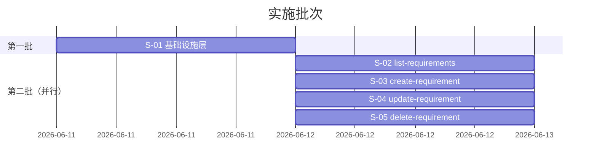

# 需求管理脚本系统 — 实施计划

> 关联设计文档：`requirement-management_DESIGN.md`

## 批次划分总览

| 批次 | 子需求 | 依赖 | 可并行 | 预估工期 |
|:---:|--------|------|:---:|:---:|
| 第一期 | S-01 基础设施层 | 无 | — | 1d |
| 第二期 | S-02 ~ S-05（四脚本） | S-01 | ✅ 四脚本互不依赖 | 1d |

---

## 第一期：基础设施层

### 五元组

| 维度 | 内容 |
|------|------|
| **范围** | `file_lock.py` / `config_loader.py` / `meta_store.py` / `id_generator.py` 四个模块 + 单元测试 |
| **产出物** | 4 个 `.py` 文件 + `tests/test_infra.py` + `.requirements/meta.json` 示例 |
| **依赖** | 无外部依赖，纯 Python 标准库 |
| **风险** | 跨平台文件锁兼容性（Windows `msvcrt` vs Unix `fcntl`） |
| **验收标准** | ① `ConfigLoader.read()` 正确解析 config；② `MetaStore.save()` 原子写入可通过断电模拟测试；③ `FileLock` 并发测试（两个进程同时 acquire，一个超时）；④ `gen_next_id` 空集合返回 `REQ-001`，3 条目后返回 `REQ-004` |

### 实施步骤

| 步骤 | 文件 | 说明 |
|:--:|------|------|
| 1.1 | `file_lock.py` | 跨平台 FileLock 类，含上下文管理器 |
| 1.2 | `config_loader.py` | ConfigLoader，读取 `.requirements/config` |
| 1.3 | `meta_store.py` | MetaStore，封装 load/save + atomic_write |
| 1.4 | `id_generator.py` | `gen_next_id()` 函数 |
| 1.5 | `tests/test_infra.py` | 单元测试：锁并发、原子写一致性、ID 生成边界 |

---

## 第二期：CRUD 脚本（四脚本并行）

### S-02 `list-requirements.py`

| 维度 | 内容 |
|------|------|
| **范围** | CLI 参数解析 + 筛选逻辑 + 表格/JSON 格式化输出 + 依赖展开 |
| **产出物** | `list-requirements.py` + `tests/test_list.py` |
| **依赖** | S-01（ConfigLoader, MetaStore） |
| **风险** | 表格列宽计算在 CJK 字符下的对齐问题 |
| **验收标准** | ① 无参数列出全部需求；② `--id REQ-001 --deps` 展示完整详情+依赖表；③ `--status 草案` 仅返回匹配项；④ `--json` 输出合法 JSON；⑤ `--rev-deps` 正确返回反向引用 |

### S-03 `create-requirement.py`

| 维度 | 内容 |
|------|------|
| **范围** | CLI 参数解析 + ID 自增 + 依赖预校验 + 加锁原子写入 + 目录创建 |
| **产出物** | `create-requirement.py` + `tests/test_create.py` |
| **依赖** | S-01（ConfigLoader, MetaStore, FileLock, gen_next_id） |
| **风险** | 并发 create 时 ID 冲突（TOCTOU 防范） |
| **验收标准** | ① `--feature "xxx"` 创建成功，目录和 meta.json 一致；② ID 正确自增；③ `--depends-on` 不存在的 ID 时报错；④ 目录冲突时报错；⑤ 并发测试无 ID 重复 |

### S-04 `update-requirement.py`

| 维度 | 内容 |
|------|------|
| **范围** | CLI 参数解析 + 字段合并 + 循环依赖检测 + 标签/依赖增删改语义 + 版号自增 |
| **产出物** | `update-requirement.py` + `tests/test_update.py` |
| **依赖** | S-01（ConfigLoader, MetaStore, FileLock） |
| **风险** | 循环依赖检测在边界情况（长链、自引用）漏判 |
| **验收标准** | ① `--status 已完成` 正确更新；② `--tag add X` 幂等；③ `--tag remove` 最后一个报错；④ `--depends-on add` 循环依赖时报错并提示路径；⑤ version 自动 +1 |

### S-05 `delete-requirement.py`

| 维度 | 内容 |
|------|------|
| **范围** | CLI 参数解析 + 反向依赖扫描 + 交互确认/dry-run/force 三模式 + 级联清理 |
| **产出物** | `delete-requirement.py` + `tests/test_delete.py` |
| **依赖** | S-01（ConfigLoader, MetaStore, FileLock） |
| **风险** | 目录删除失败后 meta.json 已清理（孤儿目录） |
| **验收标准** | ① 交互确认模式 y/N 正确；② `--dry-run` 仅展示不变更；③ `--force` 跳过确认；④ 反向依赖清理正确；⑤ 幂等（重复删除不存在的 ID 报错） |

---

## 跨批次约定

| 约定 | 说明 |
|------|------|
| 代码风格 | PEP 8，4 空格缩进，`snake_case` |
| shebang | `#!/usr/bin/env python3` |
| 错误退出码 | 0=成功，1=参数错误/业务错误，2=锁超时可重试 |
| 文件编码 | UTF-8（含 `# -*- coding: utf-8 -*-` 声明） |
| 脚本位置 | `.requirements/scripts/` |
| 测试框架 | `unittest`（标准库，零依赖） |
| 锁超时 | 统一 5s，通过环境变量 `REQ_LOCK_TIMEOUT` 可覆盖 |
