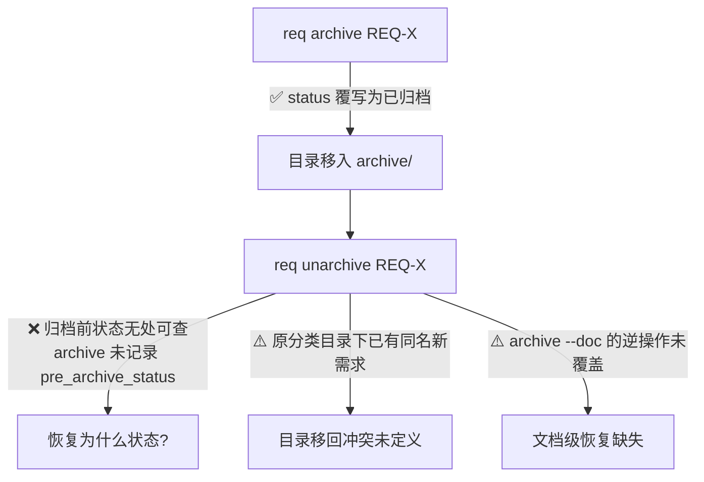
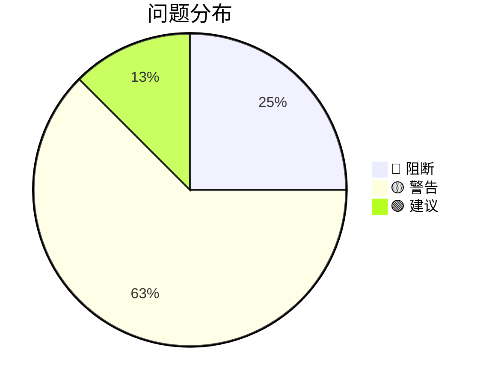

# 场景推演结果：REQ-20260730-001

> 推演时间：2026-07-30
> 推演对象：**需求文档模式**（仅 requirement.md，无 DESIGN.md）
> 验证维度：场景完整性 / 验收可达性 / 需求一致性 / 角色对齐 / 边界异常覆盖 / 术语一致性
> 推演结论：❌ 不通过（2 个阻断）——均为需求文档层面补定义即可，不动摇整体方案

## 1. 角色清单

| # | 角色 | 类型 | 推演重点 |
|---|------|------|---------|
| 1 | AI 调用方 | 程序 | req 的主要用户：解析输出、非交互执行 |
| 2 | 人类开发者 | 用户 | 终端交互、误操作恢复 |
| 3 | 并发 req 进程 | 程序 | 新命令（restore/unarchive/doctor --fix）的锁语义 |

## 2. 推演矩阵

| 场景组 \ 角色 | AI | 人类 | 并发进程 |
|---|:-:|:-:|:-:|
| S1 列表查询（O-01/04/10） | ✅ | ✅ | - |
| S2 分支元数据（O-02/03） | ✅ | ✅ | - |
| S3 数据可靠性（O-05/06/07） | ✅ | ✅ | ✅ |
| S4 归档恢复（O-08） | ✅ | ✅ | ✅ |
| S5 写命令 JSON（O-09） | ✅ | - | - |

## 3. 关键场景推演

### S4 归档恢复 —— 发现 1 个阻断

| # | 验证问题 | 结果 | 说明 |
|---|---------|:---:|------|
| 1 | "默认恢复为归档前状态"可达吗？ | ❌ | archive.py L154 直接覆写 status，changelog 只记"归档: 原因"不含旧状态。需 O-08 前置要求 archive 结构化记录 `pre_archive_status`，并定义存量已归档需求（无此字段）恢复策略 |
| 2 | 归档后原位置被同名新需求占用，unarchive 移回？ | ⚠️ | 目录冲突行为未定义 |
| 3 | 归档 parent 后 unarchive，父子关系如何恢复？ | ⚠️ | 未定义 |
| 4 | `archive --doc` 归档单文档的恢复？ | ⚠️ | O-08 只覆盖需求级 |

### S5 AI 调用写命令 —— 发现 1 个高危缺口

| # | 验证问题 | 结果 | 说明 |
|---|---------|:---:|------|
| 1 | AI 执行 `req delete X --json`（不带 --force）？ | ❌ | delete 有 `input()` 交互确认，AI 场景会挂起。需定义 `--json` 隐含非交互 |
| 2 | 命令失败时 `--json` 输出什么？ | ⚠️ | 需求只定义成功输出；AI 需要结构化错误 |

### S3 数据可靠性 —— restore 是"半个需求"

| # | 验证问题 | 结果 | 说明 |
|---|---------|:---:|------|
| 1 | `.bak` 不存在 / `backup_enabled=false`（当前默认值）时 restore？ | ⚠️ | 未定义；默认关闭备份意味着多数用户 restore 无米下锅 |
| 2 | restore 恢复旧 meta 后 `id_counters` 一起回滚 → O-05 的 ID 复用风险借道回归 | ⚠️ | O-05 与 O-06 交互未定义 |
| 3 | restore 只回滚 meta 不回滚目录 → 制造 O-07 要检的漂移 | ⚠️ | 需求未定义 restore 后衔接 doctor |
| 4 | restore/doctor --fix 需要加锁？ | ⚠️ | 未提锁语义 |
| 5 | doctor `--fix` 每类漂移的修复动作是什么？ | ⚠️ | "可安全自动修复的项"未枚举 |

### S1/S2 展示与校验 —— 边界小缺口

| # | 验证问题 | 结果 | 说明 |
|---|---------|:---:|------|
| 1 | config 白名单为空（=不限制）时 O-04 的 --tag/--category 校验？ | ⚠️ | 白名单为空时应跳过校验 |
| 2 | `--limit -1`？ | ⚠️ | 负值行为未定义（建议报错） |
| 3 | branch 写错后如何清除？ | ⚠️ | 空白拒绝导致无法移除，需定义显式清除 |
| 4 | commits 为 0 时默认列显示 `0` 还是 `—`？ | 🟢 | 展示细节未定 |

## 4. 问题汇总

| # | 类型 | 场景 | 问题 | 严重度 |
|---|------|------|------|:---:|
| 1 | 需求缺口 | S4 | unarchive"恢复归档前状态"不可达：archive 无结构化 pre_archive_status，存量恢复状态未定义 | 🔴 |
| 2 | 需求缺口 | S5 | `--json` 与交互确认组合未定义，AI 调用 delete 会挂起；错误场景 JSON 输出未定义 | 🔴 |
| 3 | 需求缺口 | S4 | unarchive 目录冲突 / 父子关系恢复 / `--doc` 文档级恢复均未定义 | 🟡 |
| 4 | 需求缺口 | S3 | restore 缺 `.bak` 不存在、backup 默认关闭、锁语义、与 doctor/id_counters 的衔接 4 项定义 | 🟡 |
| 5 | 需求缺口 | S3 | doctor `--fix` 各类漂移的修复动作未枚举 | 🟡 |
| 6 | 需求缺口 | S1 | config 白名单为空（=不限制）时 O-04 校验策略未定义 | 🟡 |
| 7 | 需求缺口 | S2 | branch 清除操作未定义 | 🟡 |
| 8 | 边界 | S1/S2 | `--limit` 负值、commits=0 显示形态、`--from > --to` 逻辑校验 | 🟢 |

## 5. 修订落实

以上 8 条已全部并入 requirement.md（v4）：

- #1 → O-08 增加"archive 前置记录 `pre_archive_status`"子项 + 存量降级策略（待确认决策点 5）
- #2 → O-09 增加"`--json` 隐含非交互"约定 + 失败输出契约
- #3 → O-08 补目录冲突、父子关系、文档级恢复归备选项
- #4 → O-06 补 4 项推演细节 + 待确认决策点 4（backup 默认值）
- #5 → O-07 补 `--fix` 动作枚举表
- #6 → O-04 补白名单为空语义
- #7 → O-02 补 branch 清除规则
- #8 → O-01/O-03/O-10 补边界定义
