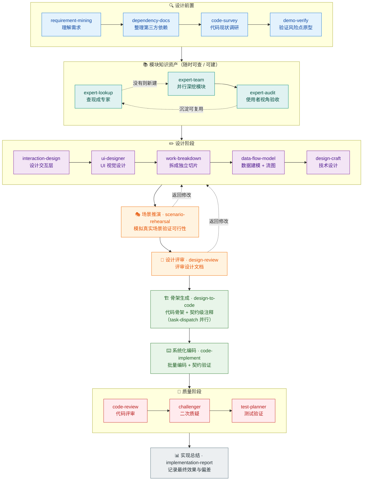

<div align="center">

# Skills

一套面向软件工程全流程的 AI Agent 技能集。从需求挖掘到技术设计，从代码评审到交互设计，覆盖"想清楚 → 设计好 → 写对代码"的完整链路。

[](./LICENSE) [](./skills) [](./rules) [](./scripts)

</div>

---

## 📑 目录

- [🚀 快速开始](#quickstart)
- [✨ 特性](#features)
- [🔄 设计流程](#workflow)
- [🧩 技能一览](#skills-index)
- [📜 规则](#rules)
- [📦 需求管理 CLI](#req-cli)
- [🗂️ 项目结构](#structure)
- [📚 文档导航](#docs)
- [🌟 其他优秀项目](#projects)
- [🤝 贡献](#contributing)
- [📄 许可证](#license)

---

<a id="quickstart"></a>
## 🚀 快速开始

一条命令将全部技能安装到目标项目（Linux / macOS）：

```bash
curl -fsSL https://raw.githubusercontent.com/HACK-WU/skills/master/scripts/skill-install.sh | \
  bash -s -- -t /path/to/your-project
# → 将 48 个技能写入 /path/to/your-project/skills/（经 ~/.hackwu-skills/ 管理源同步）
```

也可以直接使用 [`npx skills`](https://skills.sh/) 安装（无需本仓库脚本）：

```bash
# 安装全部技能到当前目录的 skills/
npx skills add HACK-WU/skills --agent openclaw -y

# 只安装指定技能
npx skills add HACK-WU/skills --skill code-review design-craft --agent openclaw -y
```

> `--agent openclaw` 将技能写入当前目录 `skills/`。直接使用 `npx skills` 不生成管理源，无法用本仓库脚本的 `--update` / `--remove` / `--list` 持续跟踪——如需后续管理，请用上方 `skill-install.sh`。

安装后即可在对话中触发技能，无需其他配置：

- "帮我分析这个需求" → `requirement-mining`
- "review 这个提交" → `code-review`
- "排查这个 bug" → `debug`

> Windows / PowerShell 及完整参数说明见[安装指南](./docs/installation.md)。

<a id="features"></a>
## ✨ 特性

- **覆盖全流程**：需求挖掘 → 技术设计 → 代码骨架 → 编码实现 → 质量保障 → 实现总结，一条链路打穿
- **可串联使用**：技能按下方设计流程图组合成完整流水线，支持"返回修改"回环与随时查阅的模块知识资产
- **需求可管理**：内置 `req` CLI，以编程方式管理需求元数据（增删改查、归档、依赖追踪）
- **规则与技能互补**：附带 AI 协作规则（GitNexus 强制规则、自动审查闭环、任务分级委派）

<a id="workflow"></a>
## 🔄 设计流程

这些技能可以串联使用，自上而下形成完整的设计-开发流程（实线为主链路，虚线为"返回修改"回环；中部"模块知识资产"随时可查、可建）：



<a id="skills-index"></a>
## 🧩 技能一览

48 个技能按用途分为 4 类。每个技能触发方式见对应 SKILL.md 的 frontmatter description。

### 需求与设计

| 技能 | 作用 | 触发词 |
|------|------|--------|
| **[requirement-mining](./skills/requirement-mining/SKILL.md)** | 深度挖掘真实需求，打穿表象找根因，转译为技术需求清单，集成 CRUD 脚本持久化 | "我想做一个xxx"、"帮我分析需求" |
| **[interaction-design](./skills/interaction-design/SKILL.md)** | 设计人机交互层——谁在用、怎么操作、看到什么、出错怎么办 | "设计一下怎么用"、"交互怎么设计" |
| **[ui-designer](./skills/ui-designer/SKILL.md)** | 设计界面视觉方案（页面结构、布局栅格、组件状态、配色、字体、响应式），可按场景加载外部风格工具库（taste-skill / anthropics/skills），并编写零构建可运行的 HTML demo | "设计这个界面"、"页面怎么布局"、"写个 HTML demo" |
| **[work-breakdown](./skills/work-breakdown/SKILL.md)** | 将需求拆分为完全独立的垂直切片工作项，每个切片贯穿所有层 | "拆成独立任务"、"怎么并行开发" |
| **[data-flow-model](./skills/data-flow-model/SKILL.md)** | 构建 ER 图和数据流图，支持并发/分布式/实时流/批处理等场景分析 | "画 ER 图"、"数据怎么流"、"设计数据模型" |
| **[design-craft](./skills/design-craft/SKILL.md)** | 将需求描述转化为面向技术评审的设计文档，默认多文档结构 | "写设计文档"、"帮我设计"、"dd" |
| **[negative-requirement](./skills/negative-requirement/SKILL.md)** | 从正向需求出发分析负向场景，设计程序的检测、恢复和引导策略 | "错误处理"、"异常场景"、"边界情况" |
| **[api-design](./skills/api-design/SKILL.md)** | 基于设计文档生成详细的 API 设计文档，含完整接口契约和错误码定义 | "设计 API"、"接口设计"、"api design" |
| **[frontend-api-guide](./skills/frontend-api-guide/SKILL.md)** | 将 API 设计转化为前端可直接编码的调用流程文档，含 UI 映射和错误处理速查 | "生成前端 API 文档"、"API 调用流程" |
| **[demo-verify](./skills/demo-verify/SKILL.md)** | 针对设计中的风险点构建验证原型，确认可行后再投入开发（复杂需求自动触发） | "先做个 demo 验证"、"试试看" |
| **[design-review](./skills/design-review/SKILL.md)** | 对设计文档进行结构化评审，产出分级问题清单 | "评审设计"、"review 设计文档" |
| **[scenario-rehearsal](./skills/scenario-rehearsal/SKILL.md)** | 模拟真实使用场景推演，支持设计文档（验证设计点可行性）、需求文档（验证需求完整性/一致性/验收可达）与 Skill（验证触发准确性等质量维度）三种模式 | "推演一下这个设计"、"推演一下这个需求"、"推演一下这个 skill" |
| **[request-guard](./skills/request-guard/SKILL.md)** | 在用户突然提出修改请求时快速检查合理性，防止被突发奇想带着跑 | "改一下"、"改成"、"优化一下" |
| **[implementation-report](./skills/implementation-report/SKILL.md)** | 需求完成后生成实现总结报告，记录最终实现效果和偏差 | "生成实现报告"、"记录完成情况" |
| **[dependency-docs](./skills/dependency-docs/SKILL.md)** | 设计前识别并整理第三方依赖文档，每个依赖独立成文，≥2 个时 task-dispatch 并行收集 | "整理第三方依赖"、"收集 API 文档" |
| **[code-survey](./skills/code-survey/SKILL.md)** | 设计前对代码库按需调研 13 个维度，ki 优先，≥2 个维度时 task-dispatch 并行搜索 | "代码调研"、"了解现有代码" |
| **[design-to-code](./skills/design-to-code/SKILL.md)** | 从设计文档生成代码骨架+契约级注释，同批顺序无关时 task-dispatch 并行加速 | "生成代码骨架"、"搭骨架" |
| **[code-implement](./skills/code-implement/SKILL.md)** | 系统化地从骨架填充实现，参考 code-survey + dependency-docs，分批编码 + 契约验证 | "编码实施"、"填充骨架"、"实现代码" |
| **[module-teach](./skills/module-teach/SKILL.md)** | 按渐进流程分析讲解代码模块，区分通用与专用知识，产出含 Mermaid 图与 HTML 的学习材料 | "讲讲这个模块"、"学习代码"、"帮我搞懂这块代码" |

### 代码质量

| 技能 | 作用 | 触发词 |
|------|------|--------|
| **[code-review](./skills/code-review/SKILL.md)** | 多语言多维度 Code Review，覆盖安全、性能、架构等七大维度 | "review 这个提交"、"code review" |
| **[debug](./skills/debug/SKILL.md)** | 系统化排错，运行时证据驱动的复现→假设→验证→定位→修复闭环，修复后可接力 bug-impact-analysis 质检 | "排查这个 bug"、"debug 一下"、"为什么会报错" |
| **[challenger](./skills/challenger/SKILL.md)** | 质疑者，对代码变更/设计文档/分析报告进行二次质疑，代码支持三种策略、设计文档与报告复用设计质疑策略 | "质疑这个修复"、"质疑这个设计"、"二次审查" |
| **[auto-review](./skills/auto-review/SKILL.md)** | 文件写入后自动触发审查修复闭环，判断复杂场景并调用 challenger | "review 这个提交"、"code review" |
| **[test-planner](./skills/test-planner/SKILL.md)** | 自动生成结构化测试计划，支持需求文档/设计文档/API 设计三种来源模式 | "生成测试计划"、"从设计生成测试"、"API 契约测试" |
| **[bug-impact-analysis](./skills/bug-impact-analysis/SKILL.md)** | Bug 修复影响分析，分析根因是否被真正解决、修复是否引入副作用 | "分析 bug 影响"、"评估修复风险" |
| **[api-testing](./skills/api-testing/SKILL.md)** | 基于 httpflex-py 的 HTTP API 自主测试，自动解析接口描述、生成客户端、设计用例矩阵并断言 | "测试 API"、"自动化接口测试"、"验证接口" |
| **[e2e-testing](./skills/e2e-testing/SKILL.md)** | 对真实运行系统执行端到端验证，按业务旅程编排多类型步骤，验证跨组件终态 | "端到端验证"、"真实链路测试"、"跑一遍完整流程" |

### 质量与优化

评审、优化、专家资产与方案沉淀等质量治理能力：

| 技能 | 作用 | 触发词 |
|------|------|--------|
| **[review-panel](./skills/review-panel/SKILL.md)** | 启动多角色评审团进行方案评审 | "评审团评审"、"review panel" |
| **[content-simplifier](./skills/content-simplifier/SKILL.md)** | 精简 skill 和 rules 文件内容，识别冗余，优化决策流程清晰度 | "精简skill"、"优化rules"、"清理冗余" |
| **[skill-amplifier](./skills/skill-amplifier/SKILL.md)** | 执行模式增强器，将目标 skill 能力拆成多个评估维度交子 Agent 并行深调研，汇总后主 Agent 交叉复核再出结论 | "放大执行"、"拆维度并行审查"、"深度模式跑一遍" |
| **[artifact-optimizer](./skills/artifact-optimizer/SKILL.md)** | 对代码、设计文档、Skill 文件进行系统化优化分析，根据用户意图调用对应的优化子流程 | "优化代码"、"优化设计文档"、"优化 skill" |
| **[harness-review](./skills/harness-review/SKILL.md)** | 对项目 AI 工作流配置做五维轻量体检，按证据状态阶梯评分（存在≠被用≠有效），零依赖纯 Markdown | "体检一下工作流"、"harness review"、"评估 AI 配置" |
| **[expert-lookup](./skills/expert-lookup/SKILL.md)** | 查找并复用已沉淀的业务专家资产包，通过语义匹配定位可复用的分析框架 | "查找专家"、"复用分析框架"、"有类似分析吗" |
| **[expert-team](./skills/expert-team/SKILL.md)** | 派出多专家子 agent 并行深挖业务模块，各自独立分析后合并成完整画像 | "深挖模块"、"专家团队分析"、"并行分析" |
| **[expert-audit](./skills/expert-audit/SKILL.md)** | 站在零上下文使用者视角审查 expert-team 专家资产的可读性与格式合规（R1–R7/CR1–CR9/INDEX），格式问题自动修复 | "核对专家团"、"审查专家资产"、"expert audit" |
| **[loop-discovery](./skills/loop-discovery/SKILL.md)** | 沉淀路由门：新建 skill/rule/solution/memory 前先过证据门→覆盖阶梯→载体选择三步检查，避免重复建设与载体过重 | "要不要沉淀"、"建个 skill 吧"、"loop discovery" |
| **[solution-capture](./skills/solution-capture/SKILL.md)** | 将解决非平凡问题的过程沉淀为可复用的解决方案 skill，存入 .solutions/ | "记录这个方案"、"沉淀一下"、"保存解决方案" |
| **[solution-lookup](./skills/solution-lookup/SKILL.md)** | 查找并复用已沉淀的解决方案 skill，通过关键词匹配定位 .solutions/ 中的方案 | "有没有类似方案"、"之前怎么解决的"、"查找方案" |

### 开发与工具

文档生成、技能创建、记忆管理、任务调度等开发辅助能力：

| 技能 | 作用 | 触发词 |
|------|------|--------|
| **[document-writer](./skills/document-writer/SKILL.md)** | 为项目生成高质量 README 及子文档，根据项目类型自动选择策略 | "生成 README"、"写项目文档" |
| **[create-rules](./skills/create-rules/SKILL.md)** | 引导创建符合规范的 AI 规则文件 | "创建规则"、"写一个规则" |
| **[create-skill](./skills/create-skill/SKILL.md)** | 引导创建新的 Agent Skill | "创建 skill"、"写一个技能" |
| **[create-sub-agent](./skills/create-sub-agent/SKILL.md)** | 指导用户创建符合规范的自定义子 Agent（agent.md + rules/ + skills/） | "创建子agent"、"新建agent" |
| **[memory-creator](./skills/memory-creator/SKILL.md)** | 指导 AI 生成简洁的记忆内容描述 | "记住这个"、"创建记忆" |
| **[migrate-to-codehub](./skills/migrate-to-codehub/SKILL.md)** | 从其他项目提取优秀设计，迁移到 CodeHub | "迁移到 CodeHub" |
| **[requirement-doc-store](./skills/requirement-doc-store/SKILL.md)** | 需求相关文档通用存储规范，按文档类型自动决定存储路径 | 需求文档落盘时自动触发 |
| **[task-dispatch](./skills/task-dispatch/SKILL.md)** | 将编码任务拆分为子任务并行分配给子 agent，主 agent 合并集成 | "并行开发"、"拆分子任务并行执行" |
| **[topic-teach](./skills/topic-teach/SKILL.md)** | 教学通用知识主题（k8s/docker/Python 等技术与投资/理财等非技术领域），产出含类比、Mermaid 图与 HTML 的学习材料，支持课程制/速览双模式 | "教我k8s"、"讲讲Python装饰器"、"什么是ETF" |
| **[ui-to-ascii](./skills/ui-to-ascii/SKILL.md)** | 把 UI 设计稿/截图转成纯文本 ASCII 框线布局图+标注存入 md（供无视觉模型查阅、可 diff），也支持按文字描述直接生成 ASCII 草图 | "ui to ascii"、"把设计图转成文本"、"画个界面草图" |

<a id="rules"></a>
## 📜 规则

| 规则 | 作用 | 适用场景 |
|------|------|----------|
| **[gitnexus-mcp-rules](./rules/gitnexus-mcp-rules.md)** | GitNexus MCP 强制规则，指导工具选择和使用方式 | 使用 GitNexus MCP 时 |
| **[writing-pipeline](./rules/writing-pipeline.md)** | 自动审查修复闭环，复杂场景调用 challenger 二次质疑 | 文档或代码编写完成后 |
| **[expert-solution-workflow](./rules/expert-solution-workflow.md)** | 资产复用工作流，区分"业务专家团（expert-lookup/team）"与"解决方案（solution-lookup/capture）"两类资产的本质区别与调用场景 | 遇到业务模块任务 / 具体技术问题时 |
| **[task-delegation](./agents/sub-agent/rules/task-delegation.md)** | 任务分级委派，低认知密度任务默认委派子 Agent，主 Agent 聚焦核心决策与核心代码 | 默认生效 |
| **[disable-task-delegation](./agents/sub-agent/rules/disable-task-delegation.md)** | 关闭任务分级委派，主 Agent 退回全包模式 | 需停用委派机制时 |

> **安装约定**：`task-delegation` 与 `disable-task-delegation` 互斥，不应同时部署到同一工作区。默认只装前者；需关闭时用后者覆盖。

<a id="req-cli"></a>
## 📦 需求管理 CLI

项目内置 Python CRUD 脚本，通过 `req` CLI 统一入口，以编程方式管理需求元数据：

```bash
curl -fsSL https://raw.githubusercontent.com/HACK-WU/skills/master/scripts/install-latest.sh | bash
# → 安装 requirement-mgr 最新版本（req --version 验证）
```

| 命令 | 功能 |
|------|------|
| `req list` | 查询需求列表，支持按状态/标签/依赖筛选，表格或 JSON 输出 |
| `req create` | 新建需求，自动生成 REQ-NNN 全局 ID，原子写入 meta.json |
| `req update` | 修改需求元数据（状态/标签/依赖/提交/变更记录），版本号自增 |
| `req delete` | 安全删除需求，反向依赖检查，级联清理引用，支持 dry-run |
| `req archive` | 归档需求或单个文档到 archive/，支持 dry-run 和 --force |

<a id="structure"></a>
## 🗂️ 项目结构

```
skills/       # AI 技能定义（技能一览见上）
rules/        # 通用 AI 规则（详见"规则"节）
agents/       # 子 Agent 提示词与专属规则
scripts/      # 一键安装器 + 需求管理 CLI（req）
docs/         # 文档（安装指南 / req CLI / 需求文档）
```

<a id="docs"></a>
## 📚 文档导航

| 文档 | 内容 |
|------|------|
| [安装指南](./docs/installation.md) | 跨平台安装、参数说明、目标目录配置、req CLI 安装 |
| [req 快速开始](./docs/README.md) | req 安装、配置、核心命令速览 |
| [req 命令参考](./docs/command-reference.md) | 所有命令及其参数和输出示例 |
| [req 配置指南](./docs/configuration.md) | 配置文件格式、配置项详解和约束规则 |
| [req 架构文档](./docs/requirement-mgr-guide.md) | 系统架构、技术实现细节、数据模型 |
| [req 故障排查](./docs/troubleshooting.md) | 常见问题及解决方案 |

<a id="projects"></a>
## 🌟 其他优秀项目

社区中还有不少优秀的 Agent Skill 项目，一并推荐供参考：

| 项目 | 简介 |
|------|------|
| [mattpocock/skills](https://github.com/mattpocock/skills) | 面向真实工程的技能集，涵盖 TDD、调试、架构改进、需求对齐 |
| [anthropics/skills](https://github.com/anthropics/skills) | Anthropic 官方 Agent Skills 示例集，附带 Agent Skills 规范 |
| [obra/superpowers](https://github.com/obra/superpowers) | Claude Code 增强技能集 |
| [Leonxlnx/taste-skill](https://github.com/Leonxlnx/taste-skill) | 专为 AI 代理设计的前端框架技能集合，提升 AI 生成界面的设计质量 |
| [QoderAI/better-harness](https://github.com/QoderAI/better-harness) | 审查与改进 AI 编码工作流的工具，本项目的 loop-discovery / harness-review 及证据状态纪律借鉴自此 |

> 如果你有好的技能项目，欢迎提 PR 添加到这里。

<a id="contributing"></a>
## 🤝 贡献

1. Fork 本项目
2. 创建你的技能目录（参考 [create-skill](./skills/create-skill/SKILL.md)）
3. 提交 PR

<a id="license"></a>
## 📄 许可证

[MIT](./LICENSE)
