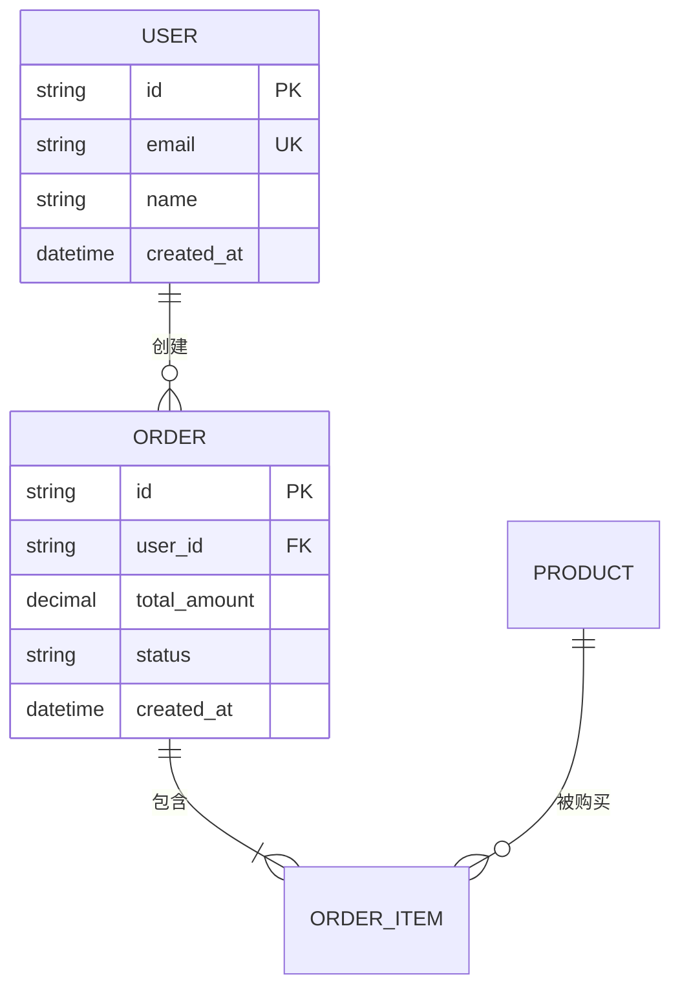
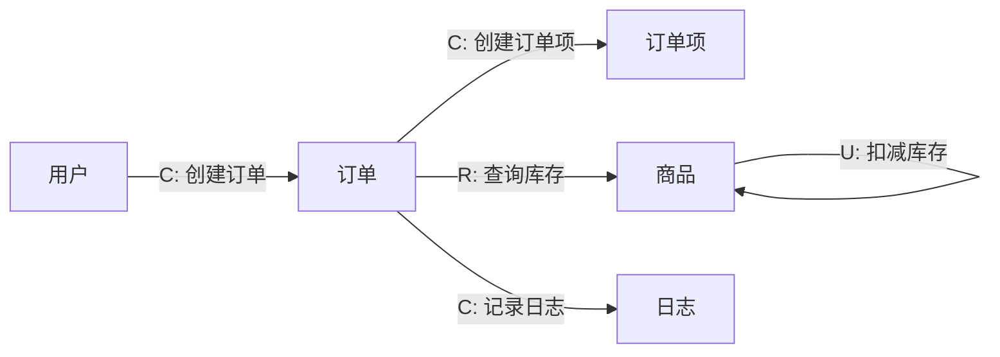

# Data Flow Model（数据建模与流图）

在技术设计之前，先理清两件事：**数据长什么样**、**数据怎么流**。

## 定位

```
requirement-mining → interaction-design → work-breakdown → data-flow-model → design-craft
      理解需求            设计交互层           拆成独立切片       数据建模+流图        技术设计
```

- **输入**：需求描述、需求挖掘报告、或交互设计文档
- **输出**：数据模型文档（ER 图 + 数据流图 + 场景分析）
- **边界**：只管数据结构和数据流向，不管具体实现方案

## 核心原则

1. **先建模后流动**：先定义数据是什么（ER），再描述数据怎么流（数据流图）
2. **场景自适应**：根据场景类型（简单/并发/分布式/实时流/批处理）叠加特定分析
3. **不脑补实现**：只描述数据结构和流向，不规定用什么数据库、什么消息队列
4. **必须可验证**：每个实体、每条数据流都必须对应到具体的业务场景
5. **分层分析**：通用层（所有场景必做）+ 场景层（按需叠加）

## 工作流总览

```
阶段 1：场景类型识别     → 识别数据场景类型
阶段 2：实体识别         → 提取核心数据实体
阶段 3：ER 图            → 定义实体关系
阶段 4：数据流图         → 描述数据在组件间的流动
阶段 5：场景特定分析     → 根据场景类型叠加分析
阶段 6：落盘输出         → 生成数据模型文档
```

**未得到用户对当前阶段的确认前，不进入下一阶段。**

### 快速通道

当需求同时满足以下全部条件时，跳过阶段 5（场景特定分析）：

- 简单 CRUD 场景
- 无并发冲突
- 单机部署
- 数据量级低

---

## 阶段 1：场景类型识别

### 数据场景类型

| 场景类型 | 特征 | 核心关注点 |
|----------|------|-----------|
| **简单 CRUD** | 单机、低并发、数据量小 | 实体关系、字段定义 |
| **并发** | 多用户同时读写同一数据 | 事务、锁、隔离级别、冲突处理 |
| **分布式** | 数据跨节点存储或处理 | 一致性、复制、分区、网络分区 |
| **实时流** | 数据以事件流形式持续产生 | 消息顺序、幂等、背压、延迟 |
| **批处理** | 大量数据定时或按需处理 | 管道设计、检查点、错误恢复、数据量 |

一个系统可能涉及多种场景（如"用户注册是简单 CRUD，订单处理是并发，日志分析是批处理"），按主要场景选择，次要场景在对应实体中标注。

### 输出格式

```text
📊 场景类型
━━━━━━━━━━━━━━━━

主要场景：[简单 CRUD / 并发 / 分布式 / 实时流 / 批处理]

涉及的数据操作：
| 操作 | 数据实体 | 场景类型 | 说明 |
|------|----------|----------|------|
| 用户注册 | 用户 | 简单 CRUD | 单条写入 |
| 订单创建 | 订单 | 并发 | 可能并发下单 |
| 日志分析 | 日志 | 批处理 | 定时批量处理 |

请确认场景识别是否准确。
```

---

## 阶段 2：实体识别

从需求中提取核心数据实体。

### 实体识别方法

1. **名词提取法**：从需求描述中提取名词，筛选出需要持久化的
2. **操作反推法**：从用户操作反推需要什么数据支撑
3. **事件溯源法**：从事件/消息反推需要记录什么数据

### 输出格式

```text
📦 核心实体
━━━━━━━━━━━━━━━━

| 实体 | 说明 | 来源 | 场景类型 |
|------|------|------|----------|
| 用户 | 系统的使用者 | 需求描述 | 简单 CRUD |
| 订单 | 用户的购买记录 | 操作反推 | 并发 |
| 日志 | 系统操作记录 | 事件溯源 | 批处理 |

请确认实体是否完整、有无遗漏。
```

---

## 阶段 3：ER 图

定义实体间的关系和实体的字段。

### ER 图规则

- 使用 mermaid erDiagram 语法
- 每个实体标注关键字段（不需要全部字段，只列核心的）
- 关系标注基数（1:1、1:N、M:N）
- 字段标注类型和约束（PK、FK、必填、唯一）

### 输出格式

```text
🔗 ER 图
━━━━━━━━━━━━━━━━



### 字段说明

| 实体 | 字段 | 类型 | 约束 | 说明 |
|------|------|------|------|------|
| USER | id | string | PK | 用户唯一标识 |
| USER | email | string | UK, 必填 | 登录邮箱 |
| ORDER | user_id | string | FK, 必填 | 关联用户 |
| ORDER | status | string | 必填 | 订单状态：pending/paid/cancelled |

请确认：
1. 实体关系是否准确
2. 字段是否完整（有无遗漏的关键字段）
3. 约束是否合理
```

---

## 阶段 4：数据流图

描述数据在组件间的流动方向和触发条件。

### 数据流图规则

- 使用 mermaid flowchart 语法
- 节点 = 实体 / 组件 / 外部系统 / 用户
- 连线 = 数据流向 + 触发条件
- 标注数据在流转过程中的变化（创建/读取/更新/删除）

### CRUD 标注

每条数据流标注操作类型：

| 标注 | 含义 |
|------|------|
| **C** | Create — 创建新数据 |
| **R** | Read — 读取数据 |
| **U** | Update — 更新已有数据 |
| **D** | Delete — 删除数据 |

### 输出格式

```text
🔀 数据流图
━━━━━━━━━━━━━━━━



### 数据流说明

| 流向 | 触发条件 | 操作 | 数据变化 | 备注 |
|------|----------|------|----------|------|
| 用户 → 订单 | 用户提交购买 | C | 新增订单记录 | 状态为 pending |
| 订单 → 商品 | 创建订单时 | R + U | 库存减少 | 需要并发控制 |

请确认数据流是否完整、方向是否准确。
```

---

## 阶段 5：场景特定分析

根据阶段 1 识别的场景类型，叠加特定分析。

### 并发场景

| 分析维度 | 问题 | 需要定义 |
|----------|------|----------|
| **事务边界** | 哪些操作必须在同一事务中？ | 事务范围 |
| **锁策略** | 用乐观锁还是悲观锁？ | 锁类型、锁粒度 |
| **隔离级别** | 能容忍什么程度的脏读/不可重复读？ | 隔离级别 |
| **冲突处理** | 两个用户同时修改同一条数据怎么办？ | 冲突检测 + 解决策略 |

```text
⚡ 并发分析
━━━━━━━━━━━━━━━━

| 操作 | 事务范围 | 锁策略 | 隔离级别 | 冲突处理 |
|------|----------|--------|----------|----------|
| 扣减库存 | 订单创建+库存扣减 | 乐观锁（版本号） | READ COMMITTED | 版本冲突时重试 |
| 订单支付 | 支付+状态更新 | 悲观锁（行锁） | SERIALIZABLE | 等待锁释放 |

请确认并发策略是否合理。
```

### 分布式场景

| 分析维度 | 问题 | 需要定义 |
|----------|------|----------|
| **一致性模型** | 强一致还是最终一致？ | 一致性级别 |
| **数据复制** | 数据复制到哪些节点？ | 复制策略、副本数 |
| **分区策略** | 数据按什么维度分区？ | 分区键、分区方式 |
| **网络分区** | 网络断开时怎么处理？ | 降级策略 |

```text
🌐 分布式分析
━━━━━━━━━━━━━━━━

| 数据实体 | 一致性 | 复制策略 | 分区键 | 网络分区处理 |
|----------|--------|----------|--------|-------------|
| 用户 | 强一致 | 主从复制 | user_id | 拒绝写入，等待恢复 |
| 日志 | 最终一致 | 多主复制 | timestamp | 本地缓存，异步同步 |

请确认分布式策略是否合理。
```

### 实时流场景

| 分析维度 | 问题 | 需要定义 |
|----------|------|----------|
| **消息模型** | 点对点还是发布订阅？ | 模型类型 |
| **顺序保证** | 消息需要有序处理吗？ | 顺序约束 |
| **幂等性** | 重复消息怎么处理？ | 幂等策略 |
| **背压** | 消费速度跟不上生产速度怎么办？ | 背压策略 |

```text
📡 实时流分析
━━━━━━━━━━━━━━━━

| 事件类型 | 消息模型 | 顺序保证 | 幂等策略 | 背压处理 |
|----------|----------|----------|----------|----------|
| 订单事件 | 发布订阅 | 同一用户有序 | 基于事件 ID 去重 | 缓冲队列 + 丢弃旧消息 |
| 日志事件 | 点对点 | 无序 | 不需要 | 批量消费 |

请确认实时流策略是否合理。
```

### 批处理场景

| 分析维度 | 问题 | 需要定义 |
|----------|------|----------|
| **管道设计** | 数据经过哪些处理阶段？ | 阶段列表、顺序 |
| **批次大小** | 每批处理多少数据？ | 批次大小 |
| **检查点** | 处理中断后从哪里恢复？ | 检查点策略 |
| **错误处理** | 单条数据处理失败怎么办？ | 重试/跳过/终止 |

```text
📦 批处理分析
━━━━━━━━━━━━━━━━

| 处理管道 | 批次大小 | 检查点 | 错误处理 |
|----------|----------|--------|----------|
| 日志采集 → 清洗 → 聚合 → 存储 | 10000 条 | 每批次完成时 | 失败重试 3 次，仍失败则跳过 |

请确认批处理策略是否合理。
```

---

## 阶段 6：落盘输出

将确认后的所有内容合并为数据模型文档。

### 文档结构

```markdown
# 数据模型：{功能名称}

> 场景类型：[简单 CRUD / 并发 / 分布式 / 实时流 / 批处理]
> 状态：草案

## 1. 实体清单
（阶段 2 确认内容）

## 2. ER 图
（阶段 3 确认内容，含 mermaid 图 + 字段说明）

## 3. 数据流图
（阶段 4 确认内容，含 mermaid 图 + 流向说明）

## 4. 场景分析
（阶段 5 确认内容，按场景类型输出对应分析）

## 5. 待确认事项
| 编号 | 事项 | 影响范围 | 状态 |
|------|------|----------|------|
| ... | ... | ... | 待确认 |
```

### 质量自检

```text
✅ 数据模型文档已生成

📄 <路径>

🔍 质量自检清单
━━━━━━━━━━━━━━━━

☐ 所有核心实体都有 ER 图表示
☐ 实体关系的基数标注正确
☐ 关键字段（PK/FK/必填/唯一）已标注
☐ 数据流图覆盖所有核心操作
☐ 每条数据流都有 CRUD 标注
☐ 场景特定分析与场景类型匹配
☐ 并发场景：事务边界、锁策略已定义
☐ 分布式场景：一致性、复制策略已定义
☐ 实时流场景：顺序、幂等策略已定义
☐ 批处理场景：管道、检查点已定义

下一步建议：
- 是否需要将数据模型文档传递给 design-craft 进行技术设计？
- 是否需要将关键数据决策存入共享记忆？
```

---

## 与 design-craft 的衔接

数据模型文档产出后，design-craft 可以：

- **数据模型章**：直接引用 ER 图和字段定义
- **接口设计章**：参考数据流图定义接口的输入输出
- **时序图章**：参考数据流图的流向绘制时序
- **异常处理章**：参考场景分析中的冲突处理、错误恢复策略

## 反模式

- ❌ 跳过 ER 图直接画数据流图 → 不知道数据长什么样就谈流动，空中楼阁
- ❌ ER 图字段过于详细（列所有字段）→ 此阶段只列核心字段，细节留给 design-craft
- ❌ 数据流图只画 happy path → 必须覆盖主要异常路径
- ❌ 并发场景不定义锁策略 → 并发问题不提前定义，实现时必然出问题
- ❌ 分布式场景不定义一致性模型 → 强一致和最终一致的实现完全不同
- ❌ 跳过确认直接进入下一阶段 → 数据模型是后续设计的基础，必须确认
