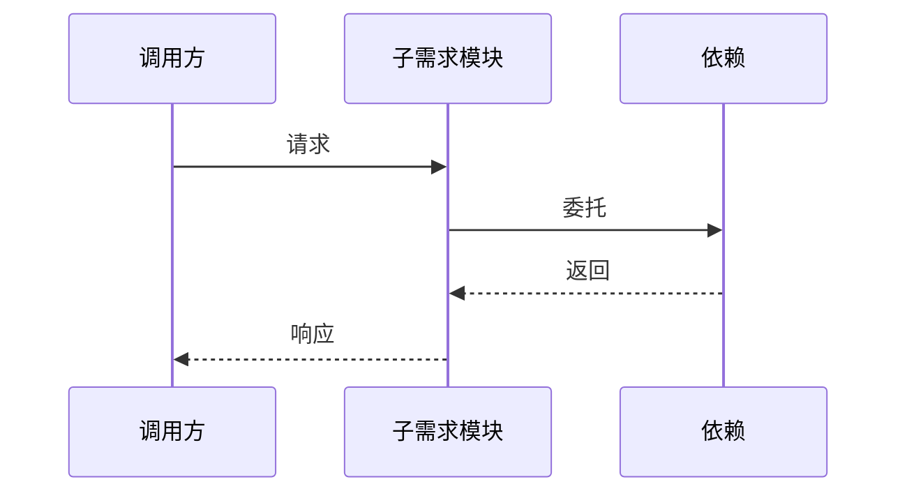

# 子需求章节模板（按需取用）

> 每个子需求至少包含 4 个核心章节（标记 ★），其余章节按触发条件追加。
> 子需求中引用的接口签名、术语必须与父文档第 4 章保持一致。

---

## 章节选择规则

### ★ 核心章节（必含）

| 章节 | 适用场景 | 说明 |
|------|---------|------|
| 1. 术语 | 全部 | 本子需求特有术语的定义，≤ 7 条。共享术语引用父文档第 4 章 |
| 2. 现状（AS-IS） | 全部 | 本子需求范围的现状描述和痛点 |
| 3. 方案（TO-BE） | 全部 | 本子需求的设计方案 |
| 4. 接口 / 数据模型 | 全部 | 二选一或两者皆有：新增接口 → 接口设计；新增数据结构 → 数据模型 |

### + 触发章节（按需追加）

| 触发条件 | 追加章节 |
|---------|---------|
| 含复杂时序流程 | +5. 时序图 |
| 含异常路径需说明 | +6. 异常处理 |
| 含性能敏感路径 | +7. 性能 & 安全 |
| 含需明确的测试范围 | +8. 测试方案 |
| 含"重构/合并/统一/简化/替换"等关键词 | +在现状章追加 AS-IS 流程图、方案章追加 TO-BE 流程图、+9. 迁移策略 |
| 涉及 ≥2 个文件改动 | +10. 影响范围 |
| 存在未决事项（自动追踪） | +11. 待定问题 |

---

## ★ 1. 术语

只列本子需求特有的术语。跨子需求共享术语写"见父文档第 4 章共享术语速查"。

| 术语 | 含义 | 引用 |
| --- | --- | --- |
| `<术语 A>` | `<本子需求中的精确含义>` | — |
| `<术语 B>` | `<...>` | 见父文档 §4.3 |

> 超过 7 条建议拆分；5~7 条需给出不拆分理由。

---

## ★ 2. 现状（AS-IS）

### 2.1 现状描述

`<当前实现是怎样的，关键模块/链路简述>`

### 2.2 痛点

- 痛点 1：`<具体表现 + 影响>`
- 痛点 2：`<具体表现 + 影响>`

> 不写"代码不优雅"、"维护困难"等抽象描述，必须给出**具体表现**。

### 2.3 AS-IS 流程图（仅重构场景追加）


---

## ★ 3. 方案（TO-BE）

### 3.1 方案概述

`<1~3 句话讲清楚本子需求的方案>`

### 3.2 关键决策点

| 决策 | 选择 | 理由 | 备选方案 | 否决原因 |
| --- | --- | --- | --- | --- |
| `<决策点 1>` | `<选择>` | `<理由>` | `<方案 A>` | `<否决原因>` |
| | | | `<方案 B>` | `<否决原因>` |

> 规则：
> 1. 无备选方案的决策不算决策点，不填入此表
> 2. 每个决策点至少 1 个备选方案；重大决策（影响 ≥2 个子需求）至少 2 个
> 3. "否决原因"必须是具体的技术/成本/风险理由，不能写"不合适"/"不推荐"

### 3.3 TO-BE 流程图（仅重构场景追加）


### 3.4 行为差异对照表（仅重构场景追加）

| 场景 | AS-IS | TO-BE | 影响 |
|------|-------|-------|------|
| `<场景 1>` | `<旧行为>` | `<新行为>` | `<兼容/破坏性变更>` |

---

## ★ 4a. 接口设计（纯函数/接口新增场景）

### 4a.1 对外接口

```typescript
function publicApi(arg1: Type1, arg2?: Type2): Result;
```

| 接口 | 输入 | 输出 | 异常 |
| --- | --- | --- | --- |
| `publicApi` | `arg1, arg2` | `Result` | `ErrorType` |

### 4a.2 内部协作接口

`<仅在多模块协作时列出>`

### 4a.3 契约变更声明

| 变更类型 | 接口 | 变更内容 | 影响的子需求 |
|---------|------|---------|------------|
| 新增 / 修改 / 废弃 | `<接口名>` | `<具体变更>` | S-XX |

> 变更类型枚举：新增、修改、废弃。此声明必须在填充阶段 4 开始前与父文档第 4 章对齐。

---

## ★ 4b. 数据模型（纯数据变更场景）

### 4b.1 持久化结构

```typescript
interface NewModel {
  fieldA: string;   // 含义
  fieldB: number;   // 含义
}
```

无持久化时写"不涉及持久化"。

### 4b.2 传输/中间结构

```typescript
interface DTO {
  fieldA: string;
}
```

---

## +5. 时序图（含复杂时序流程时追加）



> 仅画关键路径，简单同步流程不追加此章。

---

## +6. 异常处理（含异常路径需说明时追加）

| 场景 | 行为 | 是否对外暴露 |
| --- | --- | --- |
| `<输入异常>` | `<抛 ErrorType>` | 是/否 |
| `<下游超时>` | `<重试 N 次后失败>` | 是/否 |

---

## +7. 性能 & 安全（含性能敏感路径时追加）

### 性能

- 预期量级：`<QPS / 延迟 / 数据量>`
- 关键瓶颈：`<...>`
- 不做的优化：`<避免过度设计>`

### 安全

- 输入校验：`<...>`
- 权限边界：`<...>`

---

## +8. 测试方案（含需明确的测试范围时追加）

| 类型 | 范围 | 工具 |
| --- | --- | --- |
| 单元测试 | `<核心函数>` | `<框架>` |
| 集成测试 | `<跨模块路径>` | `<框架>` |

不在测试范围内：

- `<不做的测试场景及理由>`

---

## +9. 迁移策略（仅重构场景追加）

### 存量数据处理

`<旧 scope / 旧文件 / 旧数据结构如何处理>`

### 旧接口/命令废弃

| 旧接口/命令 | 处理方式 | 废弃时间线 |
|------------|---------|-----------|
| `<旧名称>` | `<保留兼容 / 直接移除 / 迁移脚本>` | `<何时移除>` |

### 回滚方案

`<出问题时如何回退到旧行为>`

---

## +10. 影响范围（涉及 ≥2 个文件改动时追加）

| 影响对象 | 影响类型 | 影响描述 | 是否破坏性变更 |
|---------|---------|---------|:----------:|
| `<文件/模块/接口>` | 接口变更/行为变更/数据变更 | `<具体影响>` | 是/否 |

> 影响类型枚举：接口变更、行为变更、数据变更、配置变更、依赖变更。

---

## +11. 待定问题（自动追踪，无待定问题则不输出）

填充过程中遇到以下情况时，必须记录为待定问题：

1. 存在 ≥2 种可行方案但缺乏决策依据
2. 依赖外部系统的接口/行为尚未确认
3. 性能/容量指标缺乏基线数据
4. 迁移步骤涉及用户操作，未确认用户接受度

| 编号 | 问题 | 影响范围 | 建议决策时间 | 负责人 |
|------|------|---------|------------|--------|
| T-01 | `<问题描述>` | `<影响的子需求>` | `<最晚决策时间>` | `<谁决定>` |

> 待定问题必须在阶段 5 质量自检中汇总到父文档第 4 章，确保不遗漏。
