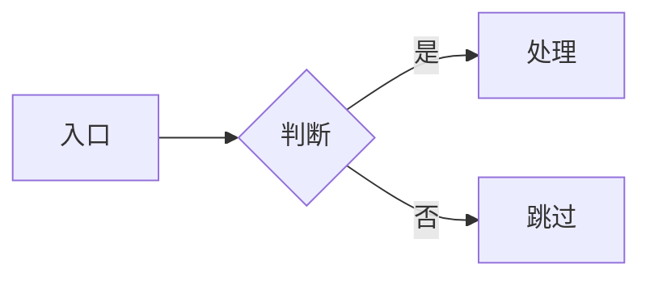
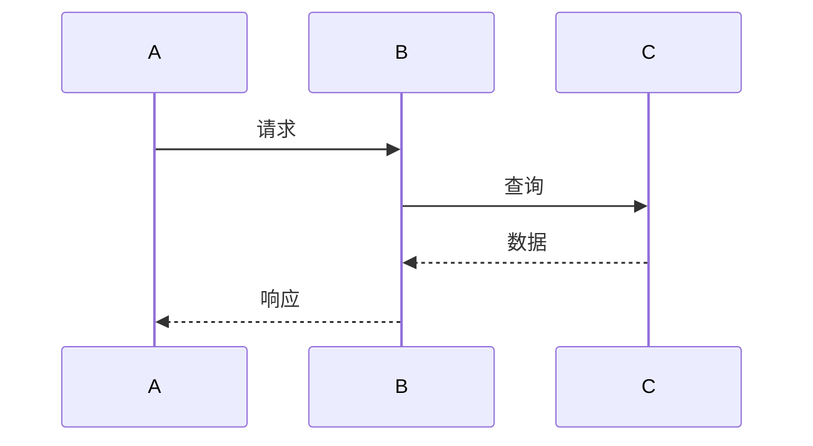
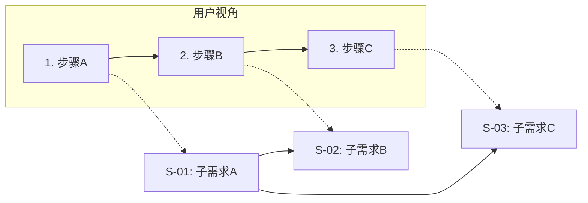
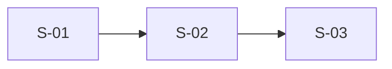
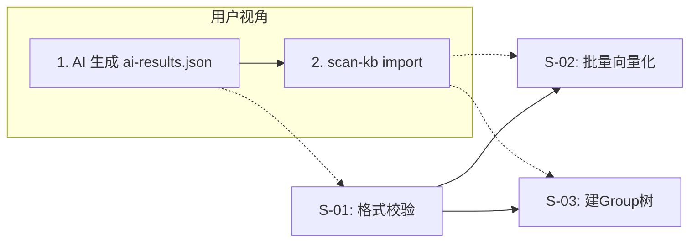

# 设计文档生成器参考资料

## 一、语义分析示例

### 模糊词 → 明确语义

**输入**："给任务系统加一个幂等能力。"

**输出**：
```text
【语义拆解】
- "幂等" 可能指：A.接口幂等 / B.任务幂等 / C.消息幂等
- "任务系统" 推断为 Celery → 倾向 B

【价值判定】
- ⚠️ 现有任务是否已天然幂等？若是，需求 ❌，建议改为"梳理幂等性清单"
- ⚠️ 全量还是仅关键任务？

请选择：A/B/C？任务比例？接受标记粒度？
```

### 场景不成立 → 劝退

**输入**："给内部脚本工具加限流。"

**输出**：
```text
❌ 场景不成立：调用方为开发者本人，QPS 极低
→ 建议：加全局开关 / 在下游服务侧做限流
```

### 用户说"按你判断"

```text
收到。采纳：幂等=任务幂等(B)、标记粒度、Redis 去重。
与预期不符请在阶段 3 纠正。→ 进入阶段 3。
```

---

## 二、阶段 0 成熟度判定示例

**场景**：上下文已通过 requirement-mining 和多轮讨论完成分析。

**输出**：
```text
⚡ 已有理解摘要（基于上下文讨论）

核心诉求：简化导入流程，7 步 → 2 步
关键决策：消除中间产物、AI 生成 ai-results.json、CLI 批量向量化、
         group-index 新增 source 块
涉及模块：scan-kb.ts, import-kb.ts, scope.ts

确认后直接进入需求拆分。有偏差请纠正。
```

---

## 三、需求拆分示例

### 默认拆分（含一览图）

**输入**："把导入流程从 7 步简化为 2 步。"

**输出**：
```text
【复杂度判定】
含流程变化 + 4+ 文件 + 跨模块 → 默认拆分 → 6 个子需求

【子需求清单】
S-01: source 块 ｜ S-02: ai-results 格式 ｜ S-03: 批量向量化
S-04: 统一导入 ｜ S-05: diff 子命令 ｜ S-06: 增量导入

【关键环节一览图】
|—— 用户视角：AI 生成 ai-results.json → scan-kb import ——|
   内部：S-02(校验) → S-03(向量化) → S-04(建Group→写元数据→S-01记录source)
   增量：S-05(diff) → S-06(增量导入) → S-04

【依赖】S-01/S-02/S-03 → S-04; S-03/S-05 → S-06
【分期】第一期 S-01~S-03 / 第二期 S-04 / 第三期 S-05~S-06
```

### 走快速通道

**输入**："给 User 模型加 avatar_url 字段。"

```text
无流程变化 + 2 文件 + 无跨模块 → 单文档快速通道
```

---

## 四、Mermaid 速查

### 流程图


### 时序图


### 节点图（一览图专用）

**最小必要元素**：一览图必须包含 ① 用户视角的操作步骤（外部 subgraph）② 每个步骤对应的子需求编号（内部节点）③ 子需求间的依赖连线。

**标准模板**：


> 虚线（`-.->`）表示"步骤对应的内部子需求"，实线（`-->`）表示子需求间的依赖。若子需求间无依赖，只画虚线即可。

---

## 五、常见歧义词速查

| 词 | 可能语义 |
| --- | --- |
| 幂等 | 接口/任务/消息 |
| 缓存 | 进程内/分布式/CDN |
| 异步 | 线程/协程/消息队列 |
| 限流 | 单机/全局/用户/接口 |
| 通知 | 推送/邮件/站内信/Webhook |
| 锁 | 进程/线程/分布式/乐观锁 |
| 事务 | 数据库/业务/分布式 |
| 监控 | 日志/指标/链路追踪 |
| 重构 | 内部重写/接口调整/拆分合并 |
| 扩展 | 加配置/加模块/加接口/加插件 |

---

## 六、一览图反模式示例

### ❌ 不合格一览图：缺少用户视角



**问题**：只有子需求节点和依赖，缺少用户操作步骤，读者无法理解"这些子需求在什么场景下被触发"。

### ❌ 不合格一览图：节点含义模糊


**问题**：节点没有标注子需求编号，无法与子文档对应。

### ✅ 合格一览图



**合格要素**：① 用户视角步骤 ② 子需求编号+名称 ③ 虚线标注步骤→子需求映射 ④ 实线标注子需求间依赖。

---

## 七、决策点表格合格/不合格对比

### ❌ 不合格：无备选方案

| 决策 | 选择 | 理由 |
|------|------|------|
| 存储方案 | Redis | 性能好 |

**问题**：无备选方案，无法判断"选择"是否经过权衡。

### ❌ 不合格：否决理由写空话

| 决策 | 选择 | 理由 | 备选方案 | 否决原因 |
|------|------|------|---------|---------|
| 存储方案 | Redis | 性能好 | SQLite | 不合适 |

**问题**：否决原因"不合适"没有给出具体技术/成本/风险理由。

### ✅ 合格

| 决策 | 选择 | 理由 | 备选方案 | 否决原因 |
|------|------|------|---------|---------|
| 存储方案 | Redis | 读写延迟 <1ms，支持 TTL 自动过期 | SQLite | 单文件锁竞争，高并发写入延迟 >50ms |
| | | | 内存 Map | 无持久化，进程重启丢失，不符合可用性要求 |

---

## 八、子文档间术语冲突识别与解决示例

**场景**：S-01 定义 `batch` = "一次 CLI 调用处理的全部条目"，S-03 定义 `batch` = "一次 mem store 调用写入的单条记忆"。

**识别信号**：两个子文档的术语表中出现相同术语但含义不同。

**解决规则**：
1. 若含义可统一 → 在父文档第 4 章共享术语速查中定义唯一含义，子文档删除本地定义
2. 若含义不可统一 → 至少一方改名（如 S-03 改为 `storeUnit`），在父文档第 4 章标注"本项目中 batch 有两种语义，S-01 用法见 §4.1，S-03 用 `storeUnit` 见 §4.2"
3. **禁止**两个子文档各自定义同名不同义的术语且父文档无标注

---

## 九、反模式清单（完整）

### 结构层面
- ❌ 需求含流程变化时用单文档承载：复杂度被章节边界稀释
- ❌ 拆分后不提供一览图：子文档碎片化，用户无法建立全局感
- ❌ 术语表跨子需求混排：术语失去归属
- ❌ 子文档引用父文档不存在的接口定义

### 流程层面
- ❌ 跳过阶段 0 复述已有讨论
- ❌ 跳过阶段 2 直接出大纲
- ❌ 用户没确认就连续输出多个阶段
- ❌ 出现 ❌ 子需求时仍硬写设计
- ❌ 回退时保留旧产出

### 内容层面
- ❌ 章节内容堆砌（"为了让本章满"）
- ❌ "众所周知""显而易见""业界通用做法"
- ❌ "不在范围内"写成空话
- ❌ 子文档重复写共享术语和背景
- ❌ 关键决策点无"被否决方案"
- ❌ 复制需求 PRD 大段原文
