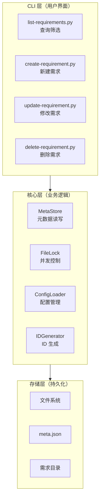
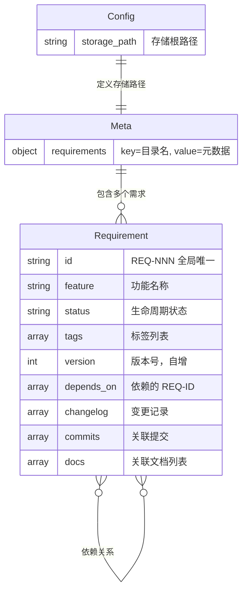
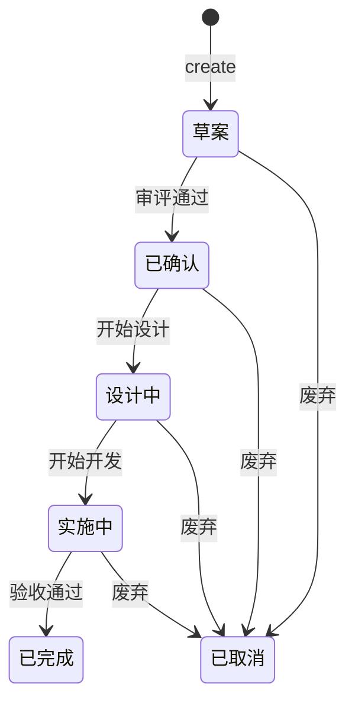
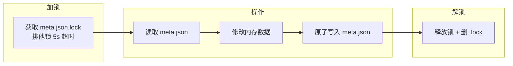
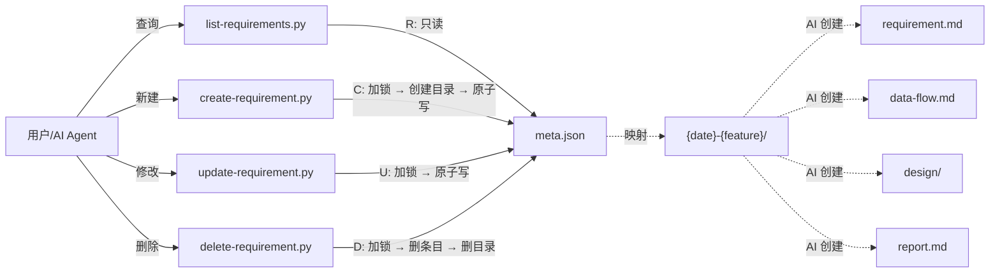
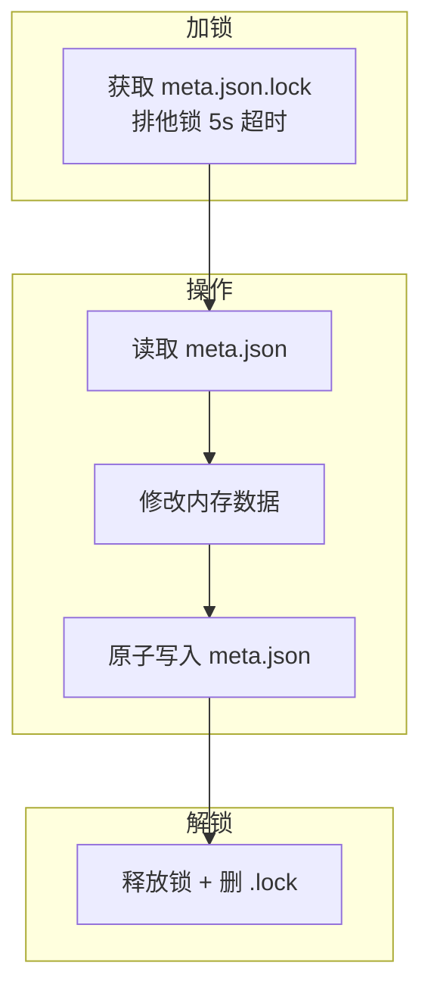

# 需求管理脚本系统 — 完整指南

> 基于 `meta.json` 集中元数据的零依赖 Python CRUD 工具，支持原子写入、并发文件锁、依赖追踪。

## 目录

- [1. 系统概述](#1-系统概述)
  - [1.1 是什么](#11-是什么)
  - [1.2 核心价值](#12-核心价值)
  - [1.3 适用场景](#13-适用场景)
- [2. 快速开始](#2-快速开始)
  - [2.1 环境要求](#21-环境要求)
  - [2.2 安装配置](#22-安装配置)
  - [2.3 首次使用](#23-首次使用)
- [3. 系统架构](#3-系统架构)
  - [3.1 技术栈](#31-技术栈)
  - [3.2 分层架构](#32-分层架构)
  - [3.3 数据模型](#33-数据模型)
- [4. 核心功能详解](#4-核心功能详解)
  - [4.1 需求生命周期管理](#41-需求生命周期管理)
  - [4.2 依赖关系管理](#42-依赖关系管理)
  - [4.3 并发安全机制](#43-并发安全机制)
  - [4.4 原子写入保障](#44-原子写入保障)
- [5. 使用场景与工作流](#5-使用场景与工作流)
  - [5.1 AI Skill 落盘需求](#51-ai-skill-落盘需求)
  - [5.2 需求状态流转](#52-需求状态流转)
  - [5.3 依赖分析与影响评估](#53-依赖分析与影响评估)
  - [5.4 批量操作与清理](#54-批量操作与清理)
- [6. 详细使用说明](#6-详细使用说明)
  - [6.1 查询需求 (list-requirements)](#61-查询需求-list-requirements)
  - [6.2 新建需求 (create-requirement)](#62-新建需求-create-requirement)
  - [6.3 修改需求 (update-requirement)](#63-修改需求-update-requirement)
  - [6.4 删除需求 (delete-requirement)](#64-删除需求-delete-requirement)
- [7. 技术实现细节](#7-技术实现细节)
  - [7.1 数据流图](#71-数据流图)
  - [7.2 文件锁流程](#72-文件锁流程)
  - [7.3 meta.json 结构](#73-metajson-结构)
- [8. 故障排查](#8-故障排查)
- [9. 附录](#9-附录)

---

## 1. 系统概述

### 1.1 是什么

需求管理脚本系统是一套**零外部依赖**的 Python 命令行工具集，专门用于管理项目需求文档的元数据。它通过集中式的 `meta.json` 文件，为 AI Agent 和开发者提供结构化、并发安全的需求 CRUD 操作。

**核心组件**：
- **4 个 Python 脚本**：`list-requirements.py`、`create-requirement.py`、`update-requirement.py`、`delete-requirement.py`
- **集中元数据存储**：`.requirements/meta.json` 文件
- **配置管理**：`.requirements/config` 文件
- **需求目录结构**：`{date}-{feature}/` 格式的需求文档目录

### 1.2 核心价值

| 特性 | 说明 | 业务价值 |
|------|------|----------|
| **零依赖** | 全部使用 Python 标准库 | 部署简单，无外部依赖风险 |
| **并发安全** | 排他文件锁 + 原子写入 | 多 Agent/用户同时操作不冲突 |
| **结构化数据** | JSON 集中存储 | 支持程序化查询、筛选、分析 |
| **依赖追踪** | 需求间依赖关系管理 | 影响分析、循环检测 |
| **审计追踪** | 完整的变更日志和版本控制 | 可追溯性、合规性 |

### 1.3 适用场景

**适用**：
- AI Agent 管理项目需求文档的元数据
- 多人协作的需求文档管理
- 需求状态跟踪和生命周期管理
- 需求依赖关系分析和影响评估
- 自动化需求文档生成流水线

**不适用**：
- 替代 Jira、TAPD 等专业需求管理工具
- 需求文档内容自动生成（文档内容由 AI 管理）
- 多项目/多仓库需求聚合
- Web 界面或 GUI 管理

---

## 2. 快速开始

### 2.1 环境要求

- Python 3.10+
- `uv`（推荐）或直接使用 `python`
- 项目根目录可写权限

### 2.2 安装配置

**方式一：一键安装（推荐）**
```bash
curl -fsSL https://raw.githubusercontent.com/HACK-WU/skills/master/scripts/skill-install.sh | bash -s -- /path/to/project --scripts
```

**方式二：手动安装**
```bash
# 1. 克隆或下载脚本到 scripts/requirement-mgr/ 目录
# 2. 创建配置文件
mkdir -p .requirements
echo "storage_path=.requirements" > .requirements/config
```

**配置文件模板**：

创建 `.requirements/config` 文件，使用以下模板：

```ini
storage_path=.requirements

# 需求功能分类配置
# 多个分类用逗号分隔，例如：告警,监控,日志,权限
# 默认值为空，表示不进行功能分类
feature_categories=

# 需求标签配置
# tags 字段的可选值必须从此配置中选取，不能凭空创造
# 多个标签用逗号分隔
requirement_tags=feat,fix,refactor,tool,integration,security,performance,ux,infra,bugfix,optimization,documentation
```

**配置说明**：

| 配置项 | 说明 | 示例值 |
|--------|------|--------|
| `storage_path` | 需求文档存储路径 | `.requirements` |
| `feature_categories` | 功能分类配置，多个分类用逗号分隔 | `告警,监控,日志,权限,安全,性能,用户体验,集成` |
| `requirement_tags` | 需求标签配置，tags 字段必须从此配置中选取 | `feat,fix,refactor,tool,integration,security,performance,ux,infra` |

**约束规则**：

1. **标签来源约束**：tags 字段的值必须从 `requirement_tags` 配置中选取，不能凭空创造
2. **功能分类约束**：必须包含一个功能分类标签，该标签必须从 `feature_categories` 配置中选取
3. **配置优先级**：配置文件中的值优先于默认值

**方式三：Windows PowerShell**
```powershell
# 使用 PowerShell 安装脚本
.\scripts\skill-install.ps1 -Scripts
```

### 2.3 首次使用

```bash
# 1. 查看当前需求（首次使用为空）
uv run python scripts/requirement-mgr/list-requirements.py

# 2. 创建第一个需求
uv run python scripts/requirement-mgr/create-requirement.py \
  --feature "需求管理脚本系统" \
  --tags feat,tool \
  --status 已确认

# 3. 查看创建的需求
uv run python scripts/requirement-mgr/list-requirements.py --id REQ-001
```

---

## 3. 系统架构

### 3.1 技术栈

| 组件 | 技术选择 | 选择理由 |
|------|----------|----------|
| **语言** | Python 3.x | 零依赖、标准库完善 |
| **原子写入** | `tempfile` + `os.replace()` | POSIX 原子操作，崩溃安全 |
| **文件锁** | `fcntl.flock` / `msvcrt.locking` | 跨平台标准库支持 |
| **CLI 解析** | `argparse` | 标准库，功能完整 |
| **JSON 处理** | `json` | 标准库，性能良好 |

### 3.2 分层架构



### 3.3 数据模型



---

## 4. 核心功能详解

### 4.1 需求生命周期管理

需求状态遵循以下状态机：



**状态说明**：
- `草案`：需求初建，内容尚未评审（默认状态）
- `已确认`：需求评审通过，可进入设计
- `设计中`：设计文档编写中
- `实施中`：开发编码阶段
- `已完成`：开发与验收均通过（终态）
- `已取消`：需求废弃，保留记录不删除（终态）

### 4.2 依赖关系管理

**依赖类型**：
- **直接依赖**：A 依赖 B（`A.depends_on` 包含 `B.id`）
- **间接依赖**：A 依赖 B，B 依赖 C → A 间接依赖 C
- **反向依赖**：哪些需求依赖了当前需求

**依赖约束**：
1. **存在性校验**：依赖的 ID 必须已存在
2. **自依赖禁止**：不能依赖自己
3. **循环检测**：不能形成 A→B→A 的循环依赖

**依赖操作**：
```bash
# 添加依赖
uv run python scripts/requirement-mgr/update-requirement.py REQ-002 --depends-on add REQ-001

# 查看依赖树
uv run python scripts/requirement-mgr/list-requirements.py --id REQ-002 --deps --deps-depth 3

# 查看反向依赖（谁依赖了我）
uv run python scripts/requirement-mgr/list-requirements.py --id REQ-001 --rev-deps
```

### 4.3 并发安全机制

**问题场景**：
- 多个 AI Agent 同时创建需求
- 用户和 CI 同时修改需求
- 读取和写入同时发生

**解决方案**：


**设计要点**：
- **锁粒度**：对 `meta.json` 整体加排他锁
- **锁模式**：`LOCK_EX`（Unix）/ `LK_NBLCK`（Windows）
- **超时机制**：5s 超时 + 0.1s 重试间隔
- **TOCTOU 防护**：加锁后重新读取 meta.json
- **list 无锁**：只读操作，读取的是完整快照

### 4.4 原子写入保障

**问题**：写入中途崩溃（进程被杀、断电）会导致文件损坏。

**解决方案**：
```python
def atomic_write_json(filepath: Path, data: dict) -> None:
    """原子写入 JSON 文件：先写临时文件，再 os.replace 原子替换"""
    with tempfile.NamedTemporaryFile(
        mode='w', encoding='utf-8', suffix='.tmp',
        dir=filepath.parent, delete=False
    ) as f:
        json.dump(data, f, ensure_ascii=False, indent=2)
        tmp_path = f.name
    
    # os.replace 是原子操作：要么旧文件完整保留，要么新文件完全替换
    os.replace(tmp_path, filepath)
```

**保证**：
- 不会出现"半个 JSON"文件
- 崩溃恢复：旧文件在替换成功前始终完整
- 跨文件系统兼容：临时文件与目标在同一目录

---

## 5. 使用场景与工作流

### 5.1 AI Skill 落盘需求

**场景**：AI Agent 使用 `requirement-mining` skill 发现需求后，需要将需求注册到系统中。

**工作流**：
```bash
# 1. 检查是否已存在类似需求
uv run python scripts/requirement-mgr/list-requirements.py --search "用户认证" --json

# 2. 创建新需求
uv run python scripts/requirement-mgr/create-requirement.py \
  --feature "用户认证模块" \
  --tags feat,backend,security \
  --status 已确认

# 3. AI 生成需求文档
# AI 使用 write_to_file 写入 requirement.md 到脚本创建的目录

# 4. 验证创建成功
uv run python scripts/requirement-mgr/list-requirements.py --id REQ-001
```

### 5.2 需求状态流转

**场景**：需求从创建到完成的完整生命周期管理。

**工作流**：
```bash
# 1. 需求评审通过
uv run python scripts/requirement-mgr/update-requirement.py REQ-001 \
  --status 已确认 --changelog "需求评审通过，可以进入设计"

# 2. 开始设计
uv run python scripts/requirement-mgr/update-requirement.py REQ-001 \
  --status 设计中 --data-flow data-flow.md

# 3. 开始开发
uv run python scripts/requirement-mgr/update-requirement.py REQ-001 \
  --status 实施中 --commit abc1234

# 4. 验收完成
uv run python scripts/requirement-mgr/update-requirement.py REQ-001 \
  --status 已完成 --changelog "功能验收通过"
```

### 5.3 依赖分析与影响评估

**场景**：评估某个需求变更对其他需求的影响。

**工作流**：
```bash
# 1. 查看当前需求的依赖树
uv run python scripts/requirement-mgr/list-requirements.py \
  --id REQ-001 --deps --deps-depth 5

# 2. 查看哪些需求依赖了当前需求（影响分析）
uv run python scripts/requirement-mgr/list-requirements.py \
  --id REQ-001 --rev-deps

# 3. 根据影响范围决定变更策略
```

### 5.4 批量操作与清理

**场景**：清理废弃需求或批量查看需求状态。

**工作流**：
```bash
# 1. 查看所有已取消的需求
uv run python scripts/requirement-mgr/list-requirements.py \
  --json --status 已取消

# 2. 预览删除操作
for id in $(uv run python scripts/requirement-mgr/list-requirements.py \
  --json --status 已取消 | jq -r '.[].id'); do
  uv run python scripts/requirement-mgr/delete-requirement.py $id --dry-run
done

# 3. 确认后删除
uv run python scripts/requirement-mgr/delete-requirement.py REQ-099 --force
```

---

## 6. 详细使用说明

### 6.1 查询需求 (list-requirements)

**职责**：无锁只读，支持筛选、详情、依赖展开、反向依赖。

**基本用法**：
```bash
# 列出所有需求
uv run python scripts/requirement-mgr/list-requirements.py

# JSON 格式输出（适合脚本消费）
uv run python scripts/requirement-mgr/list-requirements.py --json

# 精确查询 + 依赖展开
uv run python scripts/requirement-mgr/list-requirements.py --id REQ-001 --deps

# 反向依赖查询
uv run python scripts/requirement-mgr/list-requirements.py --id REQ-001 --rev-deps
```

**筛选参数**：
| 参数 | 说明 | 示例 |
|------|------|------|
| `--id` | 精确匹配需求 ID | `--id REQ-001` |
| `--status` | 按状态筛选 | `--status 实施中` |
| `--tag` | 按标签筛选（可重复） | `--tag feat --tag backend` |
| `--from` | 更新日期起 | `--from 2026-01-01` |
| `--to` | 更新日期止 | `--to 2026-12-31` |
| `--search` | 模糊搜索功能名称 | `--search "用户认证"` |

**输出控制**：
| 参数 | 说明 |
|------|------|
| `--json` | JSON 格式输出 |
| `--columns` | 自定义显示列 |
| `--no-color` | 禁用 ANSI 颜色 |

### 6.2 新建需求 (create-requirement)

**职责**：加锁 → 自增 ID → 创建目录 → 原子写入 `meta.json`。

**基本用法**：
```bash
# 快速新建
uv run python scripts/requirement-mgr/create-requirement.py \
  --feature "用户认证模块" --tags feat,backend

# 带依赖创建
uv run python scripts/requirement-mgr/create-requirement.py \
  --feature "支付网关" \
  --tags feat,payment \
  --depends-on REQ-001,REQ-002 \
  --status 已确认

# 自定义目录名
uv run python scripts/requirement-mgr/create-requirement.py \
  --feature "自定义目录" --dir-name "custom-dir-name"
```

**自动填充字段**：
| 字段 | 值 |
|------|-----|
| `id` | `REQ-NNN`（最大编号 +1） |
| `created` | 当前日期 |
| `updated` | 当前日期 |
| `version` | 1 |
| `changelog` | `["初始创建"]` |
| `commits` | `[]` |

### 6.3 修改需求 (update-requirement)

**职责**：加锁 → 校验（循环依赖 / 标签下限）→ 字段合并 → 版号自增 → 原子写入。

**状态流转**：
```bash
# 评审通过
uv run python scripts/requirement-mgr/update-requirement.py REQ-001 \
  --status 已确认 --changelog "需求评审通过"

# 进入设计
uv run python scripts/requirement-mgr/update-requirement.py REQ-001 \
  --status 设计中 --data-flow data-flow.md

# 开始开发
uv run python scripts/requirement-mgr/update-requirement.py REQ-001 \
  --status 实施中 --commit abc1234

# 验收完成
uv run python scripts/requirement-mgr/update-requirement.py REQ-001 \
  --status 已完成 --changelog "功能验收通过"
```

**依赖管理**：
```bash
# 添加依赖
uv run python scripts/requirement-mgr/update-requirement.py REQ-002 \
  --depends-on add REQ-001

# 循环检测（自动拒绝）
uv run python scripts/requirement-mgr/update-requirement.py REQ-001 \
  --depends-on add REQ-002
# → 错误: 添加 REQ-002 会形成循环依赖 (REQ-001→REQ-002→REQ-001)

# 删除依赖
uv run python scripts/requirement-mgr/update-requirement.py REQ-002 \
  --depends-on remove REQ-001
```

**标签管理**：
```bash
# 添加标签
uv run python scripts/requirement-mgr/update-requirement.py REQ-001 \
  --tag add deploy

# 删除标签
uv run python scripts/requirement-mgr/update-requirement.py REQ-001 \
  --tag remove deprecated

# 覆盖标签
uv run python scripts/requirement-mgr/update-requirement.py REQ-001 \
  --tag set feat,backend,security
```

### 6.4 删除需求 (delete-requirement)

**职责**：反向依赖扫描 → 确认 → 加锁 → 删条目 → 清理引用 → 删目录。

**安全删除（默认交互）**：
```bash
uv run python scripts/requirement-mgr/delete-requirement.py REQ-003
```

输出示例：
```
──────────────────────────────────────────────────
  ID:        REQ-003
  名称:      旧模块迁移工具
  目录:      2026-05-15-legacy-migration
  状态:      已取消

  反向依赖（1 项将清理引用）：
    REQ-001  需求管理脚本系统
──────────────────────────────────────────────────
⚠ 警告: 有 1 个需求的 depends_on 将被清理

确认删除？[y/N]: _
```

**预览模式**：
```bash
uv run python scripts/requirement-mgr/delete-requirement.py REQ-003 --dry-run
```

**自动化删除**：
```bash
uv run python scripts/requirement-mgr/delete-requirement.py REQ-003 --force
```

---

## 7. 技术实现细节

### 7.1 数据流图



### 7.2 文件锁流程



**锁策略要点**：
| 项目 | 说明 |
|------|------|
| 锁粒度 | `meta.json` 整体排他锁（`.meta.json.lock`） |
| 锁模式 | `LOCK_EX`（Unix fcntl）/ `LK_NBLCK`（Windows msvcrt） |
| 超时 | 5s + 0.1s 重试间隔，超时退出码 2 |
| list 无锁 | 只读操作，读取的是 `os.replace` 保证的完整快照 |
| TOCTOU 防护 | create/update/delete 加锁后均**重读** meta.json |

### 7.3 meta.json 结构

```json
{
  "requirements": {
    "2026-06-11-requirement-management": {
      "id": "REQ-001",
      "feature": "需求管理脚本系统",
      "created": "2026-06-11",
      "updated": "2026-06-11",
      "status": "设计中",
      "tags": ["feat", "tool"],
      "version": 3,
      "depends_on": [],
      "changelog": [
        "初始创建",
        "2026-06-11 v2: 确定技术选型为 Python",
        "2026-06-11 v3: 新增并发安全设计"
      ],
      "commits": [],
      "docs": [
        {"path": "data-flow.md", "type": "data_flow"}
      ]
    }
  }
}
```

**字段生命周期**：
| 字段 | create | list | update | delete |
|------|:---:|:---:|:---:|:---:|
| `id` | 自动生成 | 筛选/展示 | 不可修改 | — |
| `feature` | 必填 | 展示/搜索 | 可修改 | — |
| `status` | 默认"草案" | 筛选 | 覆盖 | — |
| `tags` | 默认["feat"] | 筛选 | 增/删/改 | — |
| `version` | =1 | 展示 | +1 | — |
| `created` | 自动 | 展示 | 不可修改 | — |
| `updated` | =created | 展示 | 自动刷新 | — |
| `depends_on` | 可选 | 展示/展开+反向 | 增/删/改+循环检测 | 清理引用 |
| `changelog` | ["初始创建"] | 展示 | 追加 | — |
| `commits` | [] | 展示 | 追加+去重 | — |
| `docs` | [] | 展示 | 增/删/改 | — |

---

## 8. 故障排查

| 现象 | 原因 | 解决 |
|------|------|------|
| `配置文件不存在` | `.requirements/config` 未创建 | `echo storage_path=.requirements > .requirements/config` |
| `无法在 5s 内获取文件锁` | 其他进程持有锁或残留 `.lock` | 等待后重试，或手动删除残留 `.meta.json.lock` |
| `依赖需求 REQ-XXX 不存在` | depends-on 指向不存在的 ID | 先 `create` 依赖需求，或修正 ID |
| `不能删除最后一个标签` | 标签列表至少保留 1 个 | 先 `--tag add` 再加 `--tag remove` |
| `会形成循环依赖` | 添加依赖后形成 A→B→A | 检查依赖链，调整设计 |
| `目录已存在` (create) | 同名目录残留 | 指定 `--dir-name` 或清理旧目录 |
| create 后 meta.json 有条目但无目录 | 进程崩溃（已修复：先建目录再写） | 不应出现（v2 已修复顺序） |
| Python 版本不兼容 | 脚本需要 Python 3.10+ | 升级 Python 或使用 `uv run` |

---

## 9. 附录

### 9.1 目录结构

```
项目根目录/
├── .requirements/
│   ├── config              # storage_path 配置
│   ├── meta.json           # 集中元数据（脚本管理）
│   └── {date}-{feature}/   # 单需求目录（AI 管理内容）
│       ├── requirement.md
│       ├── data-flow.md
│       ├── design/
│       └── report.md
└── scripts/
    └── requirement-mgr/    # CRUD 脚本
        ├── list-requirements.py
        ├── create-requirement.py
        ├── update-requirement.py
        ├── delete-requirement.py
        ├── config_loader.py
        ├── file_lock.py
        ├── id_generator.py
        ├── meta_store.py
        └── requirement_utils.py
```

### 9.2 状态枚举

| 状态 | 含义 | 典型过渡 |
|------|------|----------|
| `草案` | 初建，尚未评审 | create 默认 |
| `已确认` | 评审通过 | → 设计中 |
| `设计中` | 设计文档编写中 | → 实施中 / 已取消 |
| `实施中` | 开发编码 | → 已完成 / 已取消 |
| `已完成` | 验收通过 | 终态 |
| `已取消` | 废弃保留 | 终态 |

### 9.3 退出码

| 退出码 | 含义 |
|:--:|------|
| 0 | 成功（含无匹配结果） |
| 1 | 参数/校验错误 |
| 2 | 锁超时（可重试） |

### 9.4 环境变量

| 变量 | 说明 | 默认值 |
|------|------|--------|
| `REQ_LOCK_TIMEOUT` | 文件锁超时秒数 | 5 |

---

> **文档版本**：v1.0  
> **最后更新**：2026-06-11  
> **维护者**：AI Agent