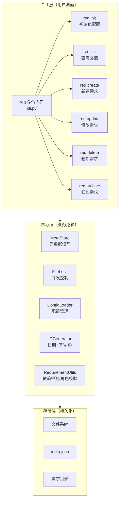
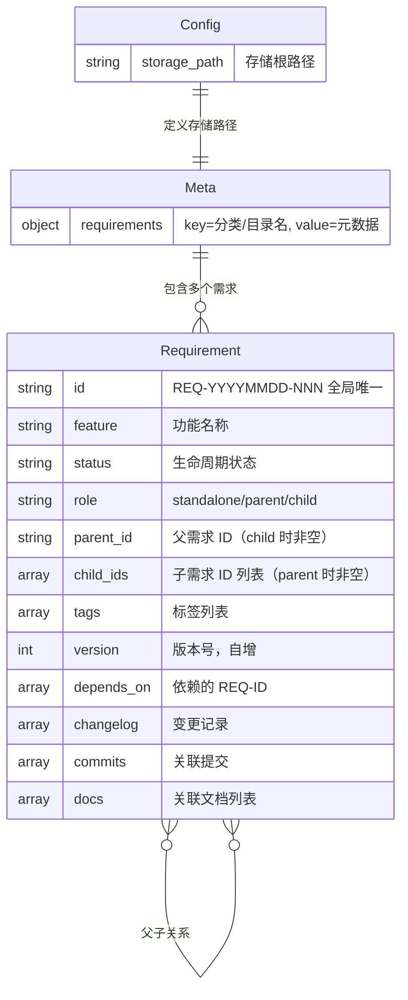
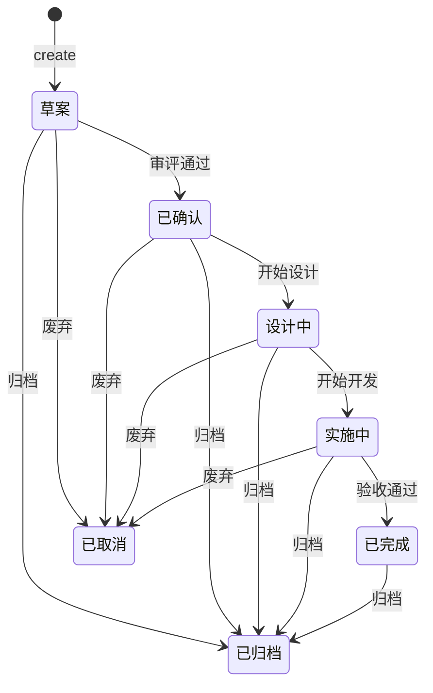
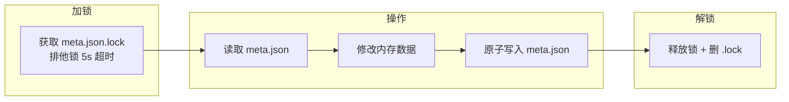
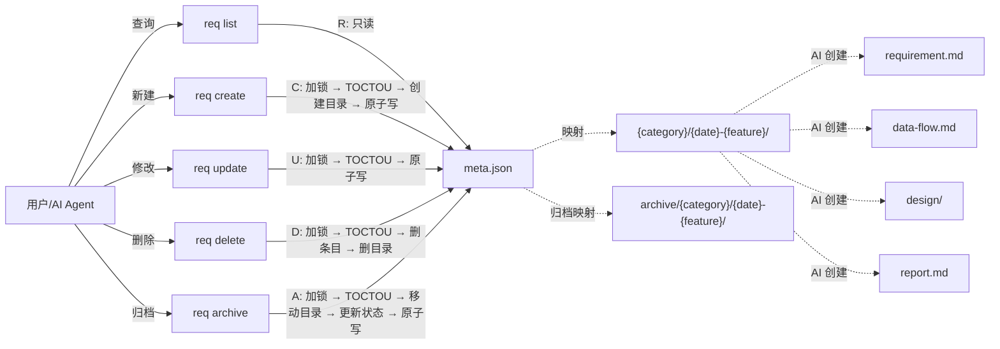
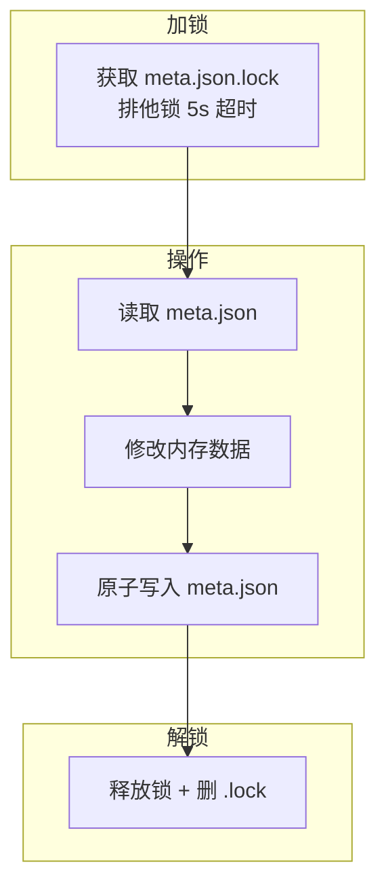

# 需求管理脚本系统 — 完整指南

> 基于 `meta.json` 集中元数据的零依赖 Python 包（CLI 工具），支持原子写入、并发文件锁、父子需求层级、依赖追踪。

## 目录

- [1. 系统概述](#1-系统概述)
  - [1.1 是什么](#11-是什么)
  - [1.2 核心价值](#12-核心价值)
  - [1.3 适用场景](#13-适用场景)
- [2. 快速开始](#2-快速开始)
  - [2.1 环境要求](#21-环境要求)
  - [2.2 安装配置](#22-安装配置)
  - [2.3 首次使用](#23-首次使用)
- [3. 系统架构](#3-系统架构)
  - [3.1 技术栈](#31-技术栈)
  - [3.2 分层架构](#32-分层架构)
  - [3.3 数据模型](#33-数据模型)
- [4. 核心功能详解](#4-核心功能详解)
  - [4.1 需求生命周期管理](#41-需求生命周期管理)
  - [4.2 依赖关系管理](#42-依赖关系管理)
  - [4.3 并发安全机制](#43-并发安全机制)
  - [4.4 原子写入保障](#44-原子写入保障)
- [5. 使用场景与工作流](#5-使用场景与工作流)
  - [5.1 AI Skill 落盘需求](#51-ai-skill-落盘需求)
  - [5.2 需求状态流转](#52-需求状态流转)
  - [5.3 依赖分析与影响评估](#53-依赖分析与影响评估)
  - [5.4 批量操作与清理](#54-批量操作与清理)
- [6. 详细使用说明](#6-详细使用说明)
  - [6.1 查询需求 (req list)](#61-查询需求-req-list)
  - [6.2 新建需求 (req create)](#62-新建需求-req-create)
  - [6.3 修改需求 (req update)](#63-修改需求-req-update)
  - [6.4 删除需求 (req delete)](#64-删除需求-req-delete)
  - [6.5 归档需求 (req archive)](#65-归档需求-req-archive)
- [7. 技术实现细节](#7-技术实现细节)
  - [7.1 数据流图](#71-数据流图)
  - [7.2 文件锁流程](#72-文件锁流程)
  - [7.3 meta.json 结构](#73-metajson-结构)
- [8. 故障排查](#8-故障排查)
- [9. 附录](#9-附录)

---

## 1. 系统概述

### 1.1 是什么

需求管理系统是一个 **零外部依赖** 的 Python 包，提供 `req` 命令行工具，专门用于管理项目需求文档的元数据。它通过集中式的 `meta.json` 文件，为 AI Agent 和开发者提供结构化、并发安全的需求 CRUD 操作。

**核心组件**：
- **Python 包**：`src/requirement_mgr/`（CLI 入口 + 6 个命令模块 + 6 个核心模块）
- **CLI 入口**：`req` 命令（通过 `uv tool install` 注册）
- **集中元数据存储**：`.requirements/meta.json` 文件
- **配置管理**：`.requirements/config` 文件
- **需求目录结构**：`{category}/{date}-{feature}/` 格式的需求文档目录
- **单元测试**：`tests/` 目录，包含所有命令和核心模块的测试用例

### 1.2 核心价值

| 特性 | 说明 | 业务价值 |
|------|------|----------|
| **零依赖** | 全部使用 Python 标准库 | 部署简单，无外部依赖风险 |
| **CLI 包** | `uv tool install` 一键安装，`req` 命令全局可用 | 无需 `uv run python` 前缀 |
| **并发安全** | 排他文件锁 + 原子写入 + TOCTOU 防护 | 多 Agent/用户同时操作不冲突 |
| **父子需求** | standalone / parent / child 角色自动升降级 | 支持需求分解与层级管理 |
| **日期 ID** | `REQ-YYYYMMDD-NNN` 格式，按天自增 | 有序、可读、兼容旧格式 |
| **Config 驱动** | statuses/roles/id_prefix 等全部可配置 | 适配不同项目工作流 |
| **结构化数据** | JSON 集中存储 | 支持程序化查询、筛选、分析 |
| **依赖追踪** | 需求间依赖关系管理 | 影响分析、循环检测 |
| **审计追踪** | 完整的变更日志和版本控制 | 可追溯性、合规性 |

### 1.3 适用场景

**适用**：
- AI Agent 管理项目需求文档的元数据
- 多人协作的需求文档管理
- 需求状态跟踪和生命周期管理
- 需求依赖关系分析和影响评估
- 自动化需求文档生成流水线

**不适用**：
- 替代 Jira、TAPD 等专业需求管理工具
- 需求文档内容自动生成（文档内容由 AI 管理）
- 多项目/多仓库需求聚合
- Web 界面或 GUI 管理

---

## 2. 快速开始

### 2.1 环境要求

- Python 3.10+
- `uv`（推荐）或直接使用 `python`
- 项目根目录可写权限

### 2.2 安装配置

**方式一：uv tool install（推荐）**
```bash
# 在项目根目录执行
cd /path/to/project
uv tool install scripts/requirement-mgr/

# 安装后全局可用
req --version
req init  # 初始化当前项目的 .requirements/config
```

**方式二：从 GitHub Release 安装**
```bash
# 从 GitHub Release 安装（无需本地构建）
uv tool install https://github.com/HACK-WU/skills/releases/download/requirement-mgr-v1.0.0/requirement_mgr-1.0.0-py3-none-any.whl
```

**方式三：开发模式安装**
```bash
cd scripts/requirement-mgr/
uv tool install . --force --no-cache
```

**方式四：Windows PowerShell**
```powershell
# 使用 PowerShell 安装脚本
.\scripts\skill-install.ps1 -Scripts
```

**初始化配置**：

安装后运行 `req init` 自动生成 `.requirements/config`：

```bash
req init
# 自动生成:
# storage_path=.requirements
# feature_categories=
# requirement_tags=feat,fix,refactor,tool,security
```

**配置文件模板**：

创建 `.requirements/config` 文件，使用以下模板：

```ini
storage_path=.requirements

# 需求功能分类配置
# 多个分类用逗号分隔
# 默认值为空，表示不进行功能分类
feature_categories=security,performance,integration,monitoring,logging

# 需求标签配置
# tags 字段的可选值必须从此配置中选取，不能凭空创造
# 多个标签用逗号分隔
requirement_tags=feat,fix,refactor,tool,integration,security,performance,ux,infra,bugfix,optimization,documentation
```

**配置说明**：

| 配置项 | 说明 | 默认值 |
|--------|------|--------|
| `storage_path` | 需求文档存储路径 | （必填） |
| `feature_categories` | 功能分类配置，多个分类用逗号分隔 | 空 |
| `requirement_tags` | 需求标签配置，tags 字段必须从此配置中选取 | 空 |
| `requirement_statuses` | 需求状态列表 | `草案,已确认,设计中,实施中,已完成,已取消` |
| `requirement_roles` | 需求角色列表 | `standalone,parent,child` |
| `id_prefix` | ID 前缀 | `REQ` |
| `id_digits` | ID 日期后序号位数 | `3` |
| `lock_timeout` | 文件锁超时秒数 | `5` |
| `backup_enabled` | 写入前是否备份 meta.json | `false` |

**约束规则**：

1. **标签来源约束**：tags 字段的值必须从 `requirement_tags` 配置中选取，不能凭空创造
2. **功能分类约束**：如果配置了 `feature_categories`，必须包含一个功能分类标签，该标签必须从 `feature_categories` 配置中选取
3. **功能分类唯一性**：功能分类标签有且只能有一个
4. **功能分类变更限制**：功能分类标签与目录位置关联，不允许删除或更改功能分类标签（如需更改，请删除并重新创建需求）
5. **配置优先级**：配置文件中的值优先于默认值

### 2.3 首次使用

```bash
# 1. 初始化项目配置（首次使用）
req init

# 2. 查看当前需求（首次使用为空）
req list

# 3. 创建第一个需求（必须包含功能分类标签）
req create --feature "需求管理脚本系统" --tags feat,tool,security --status 已确认

# 4. 查看创建的需求
req list --id REQ-20260611-001
```

---

## 3. 系统架构

### 3.1 技术栈

| 组件 | 技术选择 | 选择理由 |
|------|----------|----------|
| **语言** | Python 3.10+ | 零依赖、标准库完善 |
| **构建** | hatchling + pyproject.toml | PEP 517 标准构建 |
| **安装** | uv tool install | 全局 CLI 注册 |
| **原子写入** | `tempfile` + `os.replace()` | POSIX 原子操作，崩溃安全 |
| **文件锁** | `fcntl.flock` / `msvcrt.locking` | 跨平台标准库支持 |
| **CLI 解析** | `argparse` 子命令模式 | 标准库，支持 help、version |
| **JSON 处理** | `json` | 标准库，性能良好 |

### 3.2 分层架构


```mermaid
graph TB
    subgraph CLI["CLI 层（用户界面）"]
        REQ["req 命令入口<br/>cli.py"]
        S1["req init<br/>初始化配置"]
        S2["req list<br/>查询筛选"]
        S3["req create<br/>新建需求"]
        S4["req update<br/>修改需求"]
        S5["req delete<br/>删除需求"]
        S6["req archive<br/>归档需求"]
    end
    
    subgraph Core["核心层（业务逻辑）"]
        MetaS["MetaStore<br/>元数据读写"]
        LockF["FileLock<br/>并发控制"]
        ConfigL["ConfigLoader<br/>配置管理"]
        IDGen["IDGenerator<br/>日期+序号 ID"]
        Utils["RequirementUtils<br/>依赖检测/角色校验"]
    end
    
    subgraph Store["存储层（持久化）"]
        FS["文件系统"]
        JSON["meta.json"]
        DIR["需求目录"]
    end
    
    REQ --> S1 & S2 & S3 & S4 & S5 & S6
    CLI --> Core
    Core --> Store
```

### 3.3 数据模型


```mermaid
erDiagram
    Config ||--|| Meta : "定义存储路径"
    Meta ||--o{ Requirement : "包含多个需求"
    Requirement }o--o{ Requirement : "依赖关系"
    Requirement }o--o{ Requirement : "父子关系"
    
    Config {
        string storage_path "存储根路径"
    }
    
    Meta {
        object requirements "key=分类/目录名, value=元数据"
    }
    
    Requirement {
        string id "REQ-YYYYMMDD-NNN 全局唯一"
        string feature "功能名称"
        string status "生命周期状态"
        string role "standalone/parent/child"
        string parent_id "父需求 ID（child 时非空）"
        array child_ids "子需求 ID 列表（parent 时非空）"
        array tags "标签列表"
        int version "版本号，自增"
        array depends_on "依赖的 REQ-ID"
        array changelog "变更记录"
        array commits "关联提交"
        array docs "关联文档列表"
    }
```

---

## 4. 核心功能详解

### 4.1 需求生命周期管理

需求状态遵循以下状态机：


```mermaid
stateDiagram-v2
    [*] --> 草案 : create
    草案 --> 已确认 : 审评通过
    已确认 --> 设计中 : 开始设计
    设计中 --> 实施中 : 开始开发
    实施中 --> 已完成 : 验收通过
    
    草案 --> 已取消 : 废弃
    已确认 --> 已取消 : 废弃
    设计中 --> 已取消 : 废弃
    实施中 --> 已取消 : 废弃
    
    草案 --> 已归档 : 归档
    已确认 --> 已归档 : 归档
    设计中 --> 已归档 : 归档
    实施中 --> 已归档 : 归档
    已完成 --> 已归档 : 归档
```

**状态说明**：
- `草案`：需求初建，内容尚未评审（默认状态）
- `已确认`：需求评审通过，可进入设计
- `设计中`：设计文档编写中
- `实施中`：开发编码阶段
- `已完成`：开发与验收均通过（终态）
- `已取消`：需求废弃，保留记录不删除（终态）
- `已归档`：需求归档，移动到 `archive/` 目录（终态）

### 4.2 父子需求层级

需求支持三种角色：

| 角色 | 说明 | 自动升降级 |
|------|------|------------|
| `standalone` | 独立需求（默认） | — |
| `parent` | 父需求（有子需求） | standalone→parent（首次挂子需求时自动升级） |
| `child` | 子需求（隶属于父需求） | — |

**升降级规则**：
- 创建子需求时，如果父需求是 standalone，自动升级为 parent
- 删除最后一个子需求时，parent 自动降级为 standalone
- child 角色的 parent_id 不能指向自己
- 子需求变更角色为 standalone/parent 时，自动清除 parent_id

```bash
# 创建父子需求
req create --feature "认证模块" --tags feat,security     # → standalone
req create --feature "JWT 鉴权" --tags feat \
  --parent-id REQ-20260611-001                             # → child，父自动升级为 parent
req create --feature "OAuth2 鉴权" --tags feat \
  --role child --parent-id REQ-20260611-001                # → child

# 查询父子关系
req list --id REQ-20260611-001       # 显示 child_ids
req list --parent-id REQ-20260611-001 # 查看所有子需求
req list --role parent                # 查看所有父需求
```

### 4.3 依赖关系管理

**依赖类型**：
- **直接依赖**：A 依赖 B（`A.depends_on` 包含 `B.id`）
- **间接依赖**：A 依赖 B，B 依赖 C → A 间接依赖 C
- **反向依赖**：哪些需求依赖了当前需求

**依赖约束**：
1. **存在性校验**：依赖的 ID 必须已存在
2. **自依赖禁止**：不能依赖自己
3. **循环检测**：不能形成 A→B→A 的循环依赖

**依赖操作**：
```bash
# 添加依赖
req update REQ-20260611-002 --depends-on add REQ-20260611-001

# 查看依赖树
req list --id REQ-20260611-002 --deps --deps-depth 3

# 查看反向依赖（谁依赖了我）
req list --id REQ-20260611-001 --rev-deps
```

### 4.4 并发安全机制

**问题场景**：
- 多个 AI Agent 同时创建需求
- 用户和 CI 同时修改需求
- 读取和写入同时发生

**解决方案**：

```mermaid
flowchart LR
    subgraph 加锁
        Lock["获取 meta.json.lock<br/>排他锁 5s 超时"]
    end
    
    subgraph 操作
        Read["读取 meta.json"]
        Modify["修改内存数据"]
        Atomic["原子写入 meta.json"]
    end
    
    subgraph 解锁
        Unlock["释放锁 + 删 .lock"]
    end
    
    Lock --> Read --> Modify --> Atomic --> Unlock
```

**设计要点**：
- **锁粒度**：对 `meta.json` 整体加排他锁
- **锁模式**：`LOCK_EX`（Unix）/ `LK_NBLCK`（Windows）
- **超时机制**：5s 超时 + 0.1s 重试间隔
- **TOCTOU 防护**：加锁后重新读取 meta.json
- **list 无锁**：只读操作，读取的是完整快照

### 4.4 原子写入保障

**问题**：写入中途崩溃（进程被杀、断电）会导致文件损坏。

**解决方案**：
```python
def atomic_write_json(filepath: Path, data: dict) -> None:
    """原子写入 JSON 文件：先写临时文件，再 os.replace 原子替换"""
    with tempfile.NamedTemporaryFile(
        mode='w', encoding='utf-8', suffix='.tmp',
        dir=filepath.parent, delete=False
    ) as f:
        json.dump(data, f, ensure_ascii=False, indent=2)
        tmp_path = f.name
    
    # os.replace 是原子操作：要么旧文件完整保留，要么新文件完全替换
    os.replace(tmp_path, filepath)
```

**保证**：
- 不会出现"半个 JSON"文件
- 崩溃恢复：旧文件在替换成功前始终完整
- 跨文件系统兼容：临时文件与目标在同一目录

---

## 5. 使用场景与工作流

### 5.1 AI Skill 落盘需求

**场景**：AI Agent 使用 `requirement-mining` skill 发现需求后，需要将需求注册到系统中。

**工作流**：
```bash
# 1. 检查是否已存在类似需求
req list --search "用户认证" --json

# 2. 创建新需求（必须包含功能分类标签）
req create \
  --feature "用户认证模块" \
  --tags feat,security \
  --status 已确认

# 3. AI 生成需求文档
# AI 使用 write_to_file 写入 requirement.md 到脚本创建的目录

# 4. 验证创建成功
req list --id REQ-20260611-001
```

### 5.2 需求状态流转

**场景**：需求从创建到完成的完整生命周期管理。

**工作流**：
```bash
# 1. 需求评审通过
req update REQ-20260611-001 \
  --status 已确认 --changelog "需求评审通过，可以进入设计"

# 2. 开始设计（注册设计文档）
req update REQ-20260611-001 \
  --status 设计中 --docs add design/data-flow.md,data_flow

# 3. 开始开发
req update REQ-20260611-001 \
  --status 实施中 --commit abc1234

# 4. 验收完成
req update REQ-20260611-001 \
  --status 已完成 --changelog "功能验收通过"
```

### 5.3 依赖分析与影响评估

**场景**：评估某个需求变更对其他需求的影响。

**工作流**：
```bash
# 1. 查看当前需求的依赖树
req list \
  --id REQ-20260611-001 --deps --deps-depth 5

# 2. 查看哪些需求依赖了当前需求（影响分析）
req list \
  --id REQ-20260611-001 --rev-deps

# 3. 根据影响范围决定变更策略
```

### 5.4 批量操作与清理

**场景**：清理废弃需求或批量查看需求状态。

**工作流**：
```bash
# 1. 查看所有已取消的需求
req list \
  --json --status 已取消

# 2. 预览删除操作
for id in $(req list \
  --json --status 已取消 | jq -r '.[].id'); do
  req delete $id --dry-run
done

# 3. 确认后删除
req delete REQ-20260613-001 --force
```

---

## 6. 详细使用说明

### 6.1 查询需求 (req list)

**职责**：无锁只读，支持筛选、详情、依赖展开、反向依赖、父子层级查询。

**基本用法**：
```bash
# 列出所有需求
req list

# JSON 格式输出（适合脚本消费）
req list --json

# 精确查询 + 依赖展开
req list --id REQ-20260611-001 --deps

# 反向依赖查询
req list --id REQ-20260611-001 --rev-deps
```

**筛选参数**：
| 参数 | 说明 | 示例 |
|------|------|------|
| `--id` | 精确匹配需求 ID | `--id REQ-20260611-001` |
| `--status` | 按状态筛选 | `--status 实施中` |
| `--tag` | 按标签筛选（可重复，AND 关系） | `--tag feat --tag security` |
| `--role` | 按角色筛选 | `--role parent` |
| `--parent-id` | 按父需求筛选子需求 | `--parent-id REQ-20260611-001` |
| `--category` | 按功能分类筛选 | `--category security` |
| `--from` | 更新日期起 | `--from 2026-01-01` |
| `--to` | 更新日期止 | `--to 2026-12-31` |
| `--search` | 模糊搜索功能名称 | `--search "用户认证"` |

**输出控制**：
| 参数 | 说明 |
|------|------|
| `--json` | JSON 格式输出 |
| `--columns` | 自定义显示列 |
| `--no-color` | 禁用 ANSI 颜色 |

### 6.2 新建需求 (req create)

**职责**：加锁 → 自增 ID → 创建目录 → 原子写入 `meta.json`。

**基本用法**：
```bash
# 快速新建（必须包含功能分类标签）
req create \
  --feature "用户认证模块" --tags feat,security

# 带依赖创建
req create \
  --feature "支付网关" \
  --tags feat,integration \
  --depends-on REQ-20260611-001,REQ-20260611-002 \
  --status 已确认

# 创建子需求（父需求自动升级为 parent）
req create \
  --feature "JWT 鉴权" --tags feat \
  --parent-id REQ-20260611-001

# 自定义目录名
req create \
  --feature "自定义目录" --tags feat,security --dir-name "custom-dir-name"
```

**自动填充字段**：
| 字段 | 值 |
|------|-----|
| `id` | `REQ-YYYYMMDD-NNN`（日期+序号） |
| `created` | 当前日期 |
| `updated` | 当前日期 |
| `version` | 1 |
| `changelog` | `["初始创建"]` |
| `commits` | `[]` |

### 6.3 修改需求 (req update)

**职责**：加锁 → 校验（循环依赖 / 标签下限）→ 字段合并 → 版号自增 → 原子写入。

**状态流转**：
```bash
# 评审通过
req update REQ-20260611-001 \
  --status 已确认 --changelog "需求评审通过"

# 进入设计（注册设计文档）
req update REQ-20260611-001 \
  --status 设计中 --docs add design/DESIGN.md,design --changelog "开始技术设计"

# 开始开发
req update REQ-20260611-001 \
  --status 实施中 --commit abc1234

# 验收完成
req update REQ-20260611-001 \
  --status 已完成 --changelog "功能验收通过"
```

**依赖管理**：
```bash
# 添加依赖
req update REQ-20260611-002 \
  --depends-on add REQ-20260611-001

# 循环检测（自动拒绝）
req update REQ-20260611-001 \
  --depends-on add REQ-20260611-002
# → 错误: 添加 REQ-20260611-002 会形成循环依赖 (REQ-20260611-001→REQ-20260611-002→REQ-20260611-001)

# 删除依赖
req update REQ-20260611-002 \
  --depends-on remove REQ-20260611-001
```

**标签管理**：
```bash
# 添加标签（必须来自 requirement_tags 配置）
req update REQ-20260611-001 \
  --tag add documentation

# 删除标签（不能删除功能分类标签，不能删除最后一个标签）
req update REQ-20260611-001 \
  --tag remove documentation

# 覆盖标签（必须包含一个功能分类标签，且只能有一个）
req update REQ-20260611-001 \
  --tag set feat,security,documentation
```

### 6.4 删除需求 (req delete)

**职责**：反向依赖扫描 → 确认 → 加锁 → 删条目 → 清理引用 → 删目录。

**安全删除（默认交互）**：
```bash
req delete REQ-20260612-001
```

输出示例：
```
──────────────────────────────────────────────────
  ID:        REQ-20260612-001
  名称:      旧模块迁移工具
  目录:      2026-05-15-legacy-migration
  状态:      已取消

  反向依赖（1 项将清理引用）：
    REQ-20260611-001  需求管理脚本系统
──────────────────────────────────────────────────
⚠ 警告: 有 1 个需求的 depends_on 将被清理

确认删除？[y/N]: _
```

**预览模式**：
```bash
req delete REQ-20260612-001 --dry-run
```

**自动化删除**：
```bash
req delete REQ-20260612-001 --force
```

---

### 6.5 归档需求或文档 (req archive)

支持两种归档模式：

**整体归档**（不指定 `--doc`）：将整个需求目录移动到 `.requirements/archive/` 并更新状态为"已归档"。

**职责**：子需求/反向依赖检查 → 确认 → 加锁 → 校验（状态/目标冲突）→ 移动目录 → 改键名 + 更新字段 → 原子写。

```bash
# 整体归档（带原因）
req archive REQ-20260612-001 --reason "功能已完成"

# 预览模式（仅检查，不实际执行）
req archive REQ-20260612-001 --dry-run

# 跳过确认，强制归档
req archive REQ-20260612-001 --force --reason "功能已完成"

# 带子需求归档（有活跃子需求时需交互确认，或加 --force）
req archive REQ-20260612-001
```

**整体归档关键行为**：
- 需求目录整体移动到 `.requirements/archive/{category}/` 下，并在 `meta.json` 中把键名加 `archive/` 前缀（如 `tool/20260612-foo` → `archive/tool/20260612-foo`）
- 状态置为"已归档"，`updated`/`archived_at` 刷新为当前东八区时间，版本号自增并追加 changelog
- 归档 parent 若有活跃子需求会提示确认；反向依赖关系保留不清理
- 已归档需求不可重复归档；目标目录冲突会报错并以退出码 1 退出

**文档级归档**（指定 `--doc <path>`）：将需求内的单个文档移动到该需求目录下的 `archive/` 子目录，不改变需求状态。

**职责**：加锁 → 校验（源存在/目标不冲突/非已归档）→ 移动文档 → changelog 记录 → 原子写。

```bash
# 归档单个文档（路径相对需求目录）
req archive REQ-20260612-001 --doc design/old-design.md --reason "设计已废弃"
# tool/20260712-测试需求/design/old-design.md
# → tool/20260712-测试需求/archive/design/old-design.md

# 文档级归档预览
req archive REQ-20260612-001 --doc legacy-notes.md --dry-run
```

**文档级归档关键行为**：
- 文档移动到该需求目录下的 `archive/` 子目录，保留相对路径结构（如 `design/old.md` → `archive/design/old.md`）
- 不改变需求状态，版本号自增，changelog 追加归档记录
- 若文档在 `docs` 列表中登记，归档后从 `docs` 移除（已不活跃）
- 已整体归档的需求不支持文档级归档

---

## 7. 技术实现细节

### 7.1 数据流图


```mermaid
flowchart LR
    User["用户/AI Agent"] -->|查询| list["req list"]
    User -->|新建| create["req create"]
    User -->|修改| update["req update"]
    User -->|删除| delete["req delete"]
    User -->|归档| archive["req archive"]
    
    list -->|"R: 只读"| Meta["meta.json"]
    create -->|"C: 加锁 → TOCTOU → 创建目录 → 原子写"| Meta
    update -->|"U: 加锁 → TOCTOU → 原子写"| Meta
    delete -->|"D: 加锁 → TOCTOU → 删条目 → 删目录"| Meta
    archive -->|"A: 加锁 → TOCTOU → 移动目录 → 更新状态 → 原子写"| Meta
    
    Meta -.->|映射| RequirementDir["{category}/{date}-{feature}/"]
    RequirementDir -.->|AI 创建| requirement_md["requirement.md"]
    RequirementDir -.->|AI 创建| data_flow["data-flow.md"]
    RequirementDir -.->|AI 创建| Design["design/"]
    RequirementDir -.->|AI 创建| Report["report.md"]
    
    Meta -.->|归档映射| ArchiveDir["archive/{category}/{date}-{feature}/"]
```

### 7.2 文件锁流程


```mermaid
flowchart TB
    subgraph 加锁
        L1["获取 meta.json.lock<br/>排他锁 5s 超时"]
    end
    
    subgraph 操作
        R["读取 meta.json"]
        M["修改内存数据"]
        W["原子写入 meta.json"]
    end
    
    subgraph 解锁
        U["释放锁 + 删 .lock"]
    end
    
    L1 --> R --> M --> W --> U
```

**锁策略要点**：
| 项目 | 说明 |
|------|------|
| 锁粒度 | `meta.json` 整体排他锁（`.meta.json.lock`） |
| 锁模式 | `LOCK_EX`（Unix fcntl）/ `LK_NBLCK`（Windows msvcrt） |
| 超时 | 5s + 0.1s 重试间隔，超时退出码 2 |
| list 无锁 | 只读操作，读取的是 `os.replace` 保证的完整快照 |
| TOCTOU 防护 | create/update/delete 加锁后均**重读** meta.json |

### 7.3 meta.json 结构

```json
{
  "requirements": {
    "security/2026-06-11-requirement-management": {
      "id": "REQ-20260611-001",
      "feature": "需求管理脚本系统",
      "created": "2026-06-11",
      "updated": "2026-06-12",
      "status": "实施中",
      "role": "standalone",
      "parent_id": null,
      "child_ids": [],
      "tags": ["tool", "security", "feat"],
      "version": 8,
      "depends_on": [],
      "changelog": [
        "初始创建"
      ],
      "commits": [],
      "docs": [
        {"path": "data-flow.md", "type": "data_flow"}
      ]
    }
  }
}
```

**键名格式**：`{feature_category}/{date}-{feature}`（如 `security/2026-06-11-requirement-management`），用于定位需求目录。

**字段生命周期**：
| 字段 | create | list | update | delete | archive |
|------|:---:|:---:|:---:|:---:|:---:|
| `id` | 自动生成 (`REQ-YYYYMMDD-NNN`) | 筛选/展示 | 不可修改 | — | — |
| `feature` | 必填 | 展示/搜索 | 可修改 | — | — |
| `status` | 默认"草案" | 筛选 | 覆盖 | — | 覆盖为"已归档" |
| `role` | 默认 standalone | 筛选 | 覆盖 | — | — |
| `parent_id` | 自动（有 --parent-id 时） | 展示/筛选 | 可修改 | 清理 | — |
| `child_ids` | 自动（有子需求时追加） | 展示/筛选 | 自动升降级 | 清理 | — |
| `tags` | 默认[“feat”] | 筛选 | 增/删/改 | — | — |
| `version` | =1 | 展示 | +1 | — | +1 |
| `created` | 自动 | 展示 | 不可修改 | — | — |
| `updated` | =created | 展示 | 自动刷新 | — | 自动刷新 |
| `depends_on` | 可选 | 展示/展开+反向 | 增/删/改+循环检测 | 清理引用 | 保留 |
| `changelog` | [“初始创建”] | 展示 | 追加 | — | 追加 |
| `commits` | [] | 展示 | 追加+去重 | — | — |
| `docs` | [] | 展示 | 增/删/改 | — | — |

> 归档额外写入两个字段：`archived_at`（归档时间戳，东八区）与 `archive_reason`（归档原因，可选）；并在 `meta.json` 中把需求键名加 `archive/` 前缀。

---

## 8. 故障排查

| 现象 | 原因 | 解决 |
|------|------|------|
| `.requirements/config 不存在` | 未运行 `req init` | `req init` 初始化配置 |
| `无法在 5s 内获取文件锁` | 其他进程持有锁或残留 `.lock` | 等待后重试，或手动删除残留 `.meta.json.lock` |
| `依赖需求 REQ-XXX 不存在` | depends-on 指向不存在的 ID | 先 `req create` 依赖需求，或修正 ID |
| `不能删除最后一个标签` | 标签列表至少保留 1 个 | 先 `req update <ID> --tag add xxx` 再删 |
| `标签 XXX 不在 requirement_tags 配置中` | 标签不在配置的允许列表中 | 使用配置中的标签，或更新 `.requirements/config` 的 `requirement_tags` |
| `必须包含一个功能分类标签` | 创建需求时未指定功能分类标签 | 添加一个 `feature_categories` 中的标签，如 `--tags feat,security` |
| `功能分类标签只能有一个` | 指定了多个功能分类标签 | 只保留一个功能分类标签 |
| `不能删除功能分类标签` | 尝试删除功能分类标签 | 功能分类标签与目录位置关联，如需更改请删除并重新创建需求 |
| `会形成循环依赖` | 添加依赖后形成 A→B→A | 检查依赖链，调整设计 |
| `目录已存在` (create) | 同名目录残留 | 指定 `--dir-name` 或清理旧目录 |
| Python 版本不兼容 | 包需要 Python 3.10+ | 升级 Python 或使用 `uv` |

---

## 9. 附录

### 9.1 目录结构

```
项目根目录/
├── .requirements/
│   ├── config                  # storage_path + feature_categories + requirement_tags 配置
│   ├── meta.json               # 集中元数据（脚本管理）
│   ├── {category}/             # 功能分类目录（如 security/、performance/）
│   │   └── {date}-{feature}/   # 单需求目录（AI 管理内容）
│   │       ├── requirement.md
│   │       ├── data-flow.md
│   │       ├── design/
│   │       └── report.md
│   └── archive/                # 归档目录（req archive 移动目标）
│       └── {category}/         # 归档的需求目录（按原分类保留）
└── scripts/
    └── requirement-mgr/        # Python 包
        ├── pyproject.toml      # 包定义（hatchling 构建）
        ├── run_tests.py        # 测试运行脚本
        ├── src/requirement_mgr/
        │   ├── __init__.py
        │   ├── cli.py          # req 命令入口
        │   ├── commands/       # 6 个子命令
        │   │   ├── init.py
        │   │   ├── create.py
        │   │   ├── list.py
        │   │   ├── update.py
        │   │   ├── delete.py
        │   │   └── archive.py
        │   └── core/           # 6 个核心模块
        │       ├── config_loader.py
        │       ├── file_lock.py
        │       ├── id_generator.py
        │       ├── meta_store.py
        │       ├── requirement_utils.py
        │       └── time_utils.py
        └── tests/              # 单元测试
            ├── __init__.py
            ├── test_time_utils.py
            ├── test_archive.py
            └── test_list.py
```

**示例**：
```
.requirements/
├── config
├── meta.json
├── security/
│   └── 2026-06-11-requirement-management/
│       ├── requirement.md
│       ├── data-flow.md
│       └── design/
└── integration/
    └── 2026-06-11-Skill 需求管理集成/
        └── requirement.md
```

### 9.2 状态枚举

| 状态 | 含义 | 典型过渡 |
|------|------|----------|
| `草案` | 初建，尚未评审 | create 默认 |
| `已确认` | 评审通过 | → 设计中 |
| `设计中` | 设计文档编写中 | → 实施中 / 已取消 |
| `实施中` | 开发编码 | → 已完成 / 已取消 |
| `已完成` | 验收通过 | 终态 |
| `已取消` | 废弃保留 | 终态 |
| `已归档` | 移动到 archive/ 目录 | 终态 |

### 9.3 退出码

| 退出码 | 含义 |
|:--:|------|
| 0 | 成功（含无匹配结果） |
| 1 | 参数/校验错误 |
| 2 | 锁超时（可重试） |

### 9.4 环境变量

| 变量 | 说明 | 默认值 |
|------|------|--------|
| `REQ_LOCK_TIMEOUT` | 文件锁超时秒数 | 5 |

---

> **文档版本**：v2.0  
> **最后更新**：2026-07-23  
> **维护者**：AI Agent