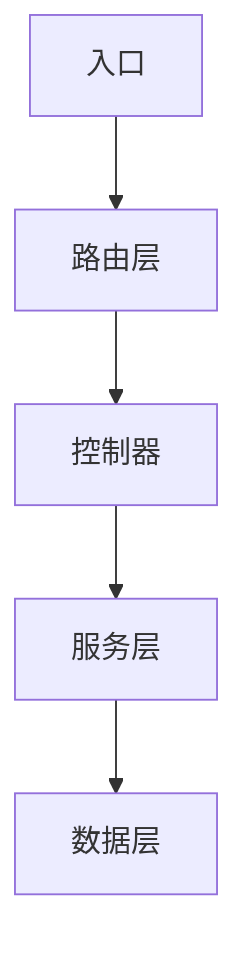

# 项目文档策略矩阵

本文档定义各项目类型的文档编写策略。策略 = 章节模板 + 内容深度要求 + 示例规则。

## 通用规则（所有类型适用）

### 概述章节的三要素

```
## 概述

{项目名} 是一个 {一句话定性}。

**解决的问题**：{用 2-3 句说明它解决什么痛点}

**与其他方案的区别**：
- 与 {方案A} 相比：{核心差异}
- 与 {方案B} 相比：{核心差异}
```

### 安装章节的三要素

```
## 安装

### 前置条件
- {运行时/框架版本要求，如 Node.js >= 18}
- {其他依赖，如需要安装 xxx}

### 安装命令
{完整的安装命令，含包管理器选择}

### 验证安装
{一条命令验证安装成功 + 预期输出}
```

### 示例的黄金模板

每个接口示例必须包含：

````markdown
#### `functionName(param1, param2)`

{一句话说明这个函数做什么}

**参数**：
| 参数名 | 类型 | 必填 | 说明 |
|--------|------|------|------|
| param1 | string | 是 | {说明} |
| param2 | object | 否 | {说明} |

**返回值**：`{类型}` — {说明}

**示例**：
```js
const result = functionName("hello", { option: true })
console.log(result)
// → {预期输出}
```

**注意事项**：{边界情况、特殊行为}
````

---

## 策略 1：库 / SDK

### README 结构

| 序号 | 章节 | 必填 | 内容要求 |
|------|------|------|----------|
| 1 | 标题 + 徽章 | 是 | 项目名 + 一行描述 |
| 2 | 概述 | 是 | 三要素格式 |
| 3 | 快速开始 | 是 | 安装 + 最简 API 调用示例（1 个），30 秒可读完 |
| 4 | 核心 API 速览 | 是 | 精选 3-5 个最常用 API，每个附一行示例代码 + 输出 |
| 5 | 子文档导航 | 条件 | 若有子文档则必填 |
| 6 | License | 是 | 从 LICENSE 文件提取或标注 |

**核心 API 速览格式**：

````markdown
## 核心 API 速览

### `fetch(url)`
```js
const data = await client.fetch("/users")
// → { id: 1, name: "Alice" }
```
详见 [API 参考](./api-reference.md)

### `create(item)`
```js
const user = await client.create({ name: "Bob" })
// → { id: 2, name: "Bob", createdAt: "2025-01-01" }
```
详见 [API 参考](./api-reference.md)
````

### 子文档模板

#### `api-reference.md`

```
# API 参考

## 概述
{库名} 对外暴露的完整 API 列表。每个 API 包含完整的参数、返回值、示例和注意事项。

## 核心 API
{按重要度排序，每个 API 用黄金模板格式}

## 工具 API
{辅助性的 API，格式同上但可稍简略}

## 类型定义（若为 TypeScript）
{导出类型的一览和说明}

## 相关文档
- [README](./README.md) — 项目概述与快速开始
- [配置指南](./configuration.md) — 所有配置项
- [高级用法](./advanced-usage.md) — 中间件、插件、生命周期
```

#### `configuration.md`

```
# 配置指南

## 概述
{项目名} 的所有配置项，含类型、默认值、使用场景。

## 配置方式
{通过构造函数/配置文件/环境变量等方式}

## 配置项列表
| 配置项 | 类型 | 默认值 | 说明 |
|--------|------|--------|------|

## 配置示例
{1-2 个典型场景的完整配置示例，含代码 + 效果说明}

## 相关文档
- [README](./README.md) — 项目概述与快速开始
- [API 参考](./api-reference.md) — 完整 API
```

#### `advanced-usage.md`

```
# 高级用法

## 概述
{中间件/插件/钩子/生命周期等高级特性}

## {特性 1}
{使用场景 + 完整示例}

## {特性 2}
{使用场景 + 完整示例}

## 相关文档
- [README](./README.md) — 项目概述与快速开始
- [API 参考](./api-reference.md) — 完整 API
```

#### 拆分示例

| 场景 | API 数量 | 配置项 | 文档集 |
|------|---------|--------|--------|
| 微型库（如 lodash 按需函数） | 1-5 | 0-5 | 仅 README（所有内容内联） |
| 中型库（如 axios） | 6-20 | 6-15 | README + API Reference |
| 大型库（如 ORM） | 20+ | 15+ | README + API Reference + Configuration + Advanced Usage |

---

## 策略 2：CLI 工具

### README 结构

| 序号 | 章节 | 必填 | 内容要求 |
|------|------|------|----------|
| 1 | 标题 + 徽章 | 是 | 项目名 + 一行描述 |
| 2 | 概述 | 是 | 三要素格式，特别强调它替代了什么手动流程 |
| 3 | 安装 | 是 | 三条命令：全局安装 + 本地安装 + 验证 |
| 4 | 快速开始 | 是 | 最常用的命令，运行后展示终端输出 |
| 5 | 核心命令速览 | 是 | 精选 3-5 个命令，每个附终端输出片段 |
| 6 | 子文档导航 | 条件 | 若有子文档则必填 |
| 7 | License | 是 | |

**核心命令速览格式**：

````markdown
## 核心命令速览

### `mycli init`
```bash
$ mycli init my-project
✔ Project created at ./my-project
✔ Configuration file written
✔ Dependencies installed
```
详见 [命令参考](./command-reference.md)
````

### 子文档模板

#### `command-reference.md`

```
# 命令参考

## 概述
{CLI 名称} 的所有命令及其参数和输出示例。

## 全局选项
| 选项 | 类型 | 默认值 | 说明 |
|------|------|--------|------|

## 命令列表

### `{command} {subcommand}`
{命令用途}

```bash
$ {完整命令示例}
{预期终端输出}

$ {带选项的命令示例}
{预期终端输出}
```

**选项**：
| 选项 | 类型 | 默认值 | 说明 |
|------|------|--------|------|

## 相关文档
- [README](./README.md) — 项目概述与快速开始
- [配置指南](./configuration.md) — 配置文件详解
```

#### `configuration.md`

```
# 配置指南

## 概述
CLI 工具的配置方式（配置文件/环境变量/命令行参数优先级）。

## 配置文件
{配置文件格式：JSON/YAML/TOML，文件路径和命名规则}

```json
// .myclirc.json
{
  "option1": "value",
  "option2": true
}
```

## 配置项列表
| 配置项 | 类型 | 默认值 | 环境变量 | 说明 |
|--------|------|--------|----------|------|

## 相关文档
- [README](./README.md) — 项目概述与快速开始
- [命令参考](./command-reference.md) — 所有命令
```

#### `integration.md`

```
# 集成指南

## 概述
如何在 CI/CD 流水线、脚本或其他工具中集成调用 {CLI 名称}。

## CI/CD 集成
### GitHub Actions
```yaml
{完整的 workflow 配置片段}
```

### 脚本调用
```bash
{在 shell 脚本中调用的示例}
```

## 相关文档
- [README](./README.md) — 项目概述与快速开始
- [命令参考](./command-reference.md) — 所有命令
```

---

## 策略 3：Web 应用/服务

### README 结构

| 序号 | 章节 | 必填 | 内容要求 |
|------|------|------|----------|
| 1 | 标题 + 徽章 | 是 | 项目名 + 一行描述 |
| 2 | 概述 | 是 | 三要素格式，说明这是后端/前端/全栈哪个角色 |
| 3 | 快速启动 | 是 | 本地启动的完整步骤（clone 到访问 localhost） |
| 4 | 架构速览 | 是 | 文字拓扑图，说明模块/服务的组织关系 |
| 5 | 子文档导航 | 条件 | 若有子文档则必填 |
| 6 | License | 是 | |

**架构速览格式**：

```markdown
## 架构速览

```
{项目名}
├── {模块 1} — {职责简述}
│   ├── {子模块 1-1} — {职责}
│   └── {子模块 1-2} — {职责}
├── {模块 2} — {职责简述}
└── {模块 3} — {职责简述}
```

**数据流**：{请求→路由→控制器→服务→数据层，说明流向}

详见 [架构文档](./architecture.md)
```

### 子文档模板

#### `architecture.md`

```
# 架构文档

## 概述
{项目名} 的模块组织、技术选型和设计决策。

## 模块总览


## 模块详解
### {模块名}
- **职责**：{一句话}
- **关键文件**：{路径}
- **依赖**：{依赖的模块}
- **对外接口**：{提供的接口}

## 技术选型
| 层面 | 选择 | 原因 |
|------|------|------|
| 运行时 | Node.js 20 | {原因} |
| 框架 | Express 4.x | {原因} |

## 设计决策
### {决策 1}
- **问题**：{面临的选择}
- **选择**：{做了什么决定}
- **理由**：{为什么}

## 相关文档
- [README](./README.md) — 项目概述与快速开始
- [部署指南](./deployment.md) — 部署步骤
```

#### `deployment.md`

```
# 部署指南

## 概述
如何将 {项目名} 部署到生产环境。

## 前置准备
- {环境要求}
- {需要的服务/依赖}

## 部署步骤
### 1.{步骤名称}
{操作} → {预期结果}

### 2.{步骤名称}
{操作} → {预期结果}

## 环境变量
| 变量名 | 必填 | 说明 | 示例值 |
|--------|------|------|--------|

## 健康检查
{如何验证部署成功}

## 相关文档
- [README](./README.md) — 项目概述与快速开始
- [架构文档](./architecture.md) — 技术架构
- [开发指南](./development.md) — 本地开发
```

#### `development.md`

```
# 开发指南

## 概述
本地开发环境配置和开发流程。

## 环境搭建
1. {步骤 1}
2. {步骤 2}

## 目录约定
| 目录 | 用途 |
|------|------|
| src/ | 源代码 |
| tests/ | 测试 |

## 常用命令
| 命令 | 用途 |
|------|------|
| npm run dev | 启动开发服务器 |
| npm test | 运行测试 |

## 相关文档
- [README](./README.md) — 项目概述与快速开始
- [架构文档](./architecture.md) — 技术架构
```

---

## 策略 4：插件/扩展

### README 结构

| 序号 | 章节 | 必填 | 内容要求 |
|------|------|------|----------|
| 1 | 标题 + 徽章 | 是 | 项目名 + 一行描述 + 宿主平台徽章 |
| 2 | 概述 | 是 | 做什么 + 解决什么问题 |
| 3 | 安装 | 是 | 从平台商店安装或手动安装 |
| 4 | 最简配置 | 是 | 最小化配置即可让插件工作的完整示例 |
| 5 | 子文档导航 | 条件 | 若有子文档则必填 |
| 6 | License | 是 | |

### 子文档模板

#### `configuration.md`

```
# 配置指南

## 概述
{插件名} 的所有配置项及使用场景。

## 配置方式
{在宿主项目中的配置方式，如 webpack.config.js / .eslintrc / vscode settings.json}

## 完整配置示例
```json
{包含所有常用配置项的完整配置}
```

## 配置项详解
| 配置项 | 类型 | 默认值 | 说明 |
|--------|------|--------|------|
```

#### `api-reference.md`

```
# API & Hooks 参考

## 概述
插件对外暴露的编程接口和钩子函数。

## Hooks
### `hookName(params)`
{用途 + 参数 + 返回值 + 示例}

## API
### `api.method(params)`
{用途 + 参数 + 返回值 + 示例}
```

#### `examples.md`

```
# 使用示例

## 示例 1：{场景名}
{场景描述}

```json
{配置}
```

**效果**：{描述使用效果}

## 示例 2：{场景名}
...
```

---

## 策略 5：混合型

项目同时满足多种类型特征时，合并对应策略。

**合并规则**：

| 维度 | 合并方式 |
|------|----------|
| README 章节 | 取各类型章节的并集，去除重复章节 |
| 子文档列表 | 取各类型子文档的并集，同名文档只保留一份 |
| 拆分阈值 | 各类型独立计算，任意类型触发即生成对应子文档 |
| 示例策略 | 按主类型选取，辅类型只补充差异点 |

**主类型判定**：当多种类型并存时，按以下优先级确定主类型：
1. 用户明确指定的类型
2. 入口文件所在的类型（CLI 入口 → 主类型为 CLI）
3. 对外暴露 API 最多的类型（API 数量 > CLI 命令数 → 主类型为库）

**常见混合场景**：

| 混合类型 | 典型例子 | README 特点 |
|----------|----------|-------------|
| 库 + CLI | axios 附带 `axios-cli` | 库的章节为主，额外加「CLI 使用」章节 |
| 库 + 插件 | ESLint 自定义规则 + ESLint 插件 | 插件的章节为主，额外加「作为库使用」章节 |
| CLI + Web | CLI 工具附带管理面板 | CLI 章节为主，额外加「管理面板」章节 |

**输出判定时说明合并了哪几种类型以及主类型**。

---

## 验证方法速查

每个策略产出的文档，用以下方法快速验证：

| 类型 | 快速验证 |
|------|----------|
| 库/SDK | 打开 API Reference → 随机挑一个 API → 复制示例代码 → 预期能跑通 |
| CLI 工具 | 打开 Command Reference → 随机挑一个命令 → 复制到终端 → 预期输出与文档一致 |
| Web 应用 | 按 README 快速启动步骤操作 → 应能访问到本地服务 |
| 插件 | 按 README 最简配置操作 → 插件应在宿主中正常激活 |
