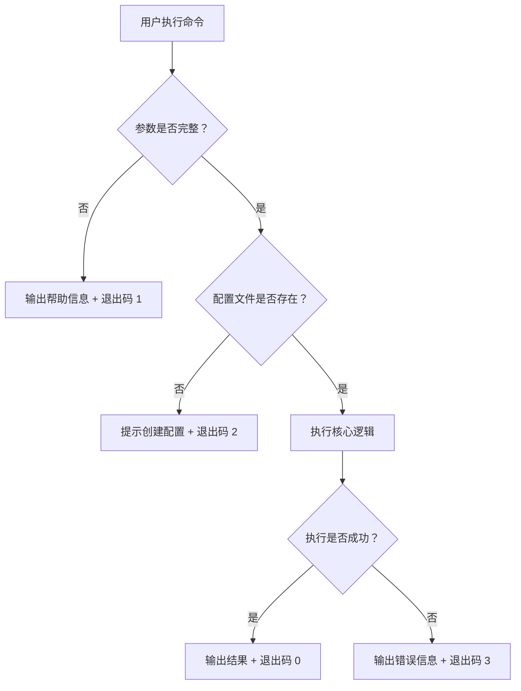

# Interaction Design（交互设计）

在技术设计之前，先把"人怎么跟系统打交道"这件事想清楚。

## 定位

```
requirement-mining → interaction-design（本 skill）→ design-craft
     理解需求            设计交互层                   技术实现
```

- **输入**：需求描述或需求挖掘报告
- **输出**：交互设计文档（结构化 Markdown）
- **边界**：只管交互逻辑，不管 UI 视觉，不管技术架构

## 核心原则

1. **用户视角优先**：所有描述从用户出发（"用户执行…"），不从系统出发（"系统调用…"）
2. **反馈无死角**：每个操作必须定义用户感知——成功、失败、等待、空状态
3. **为失败而设计**：不只画 happy path，异常路径同等重要
4. **场景自适应**：根据场景类型（脚本/Web/API/SDK）自动调整术语和输出格式
5. **可验证**：每个交互点必须有明确的完成标志，能判断"用户是否达成了目标"

## 工作流总览

```
阶段 1：角色与场景类型     → 识别用户角色、核心目标、场景类型
阶段 2：交互场景梳理       → 拆出关键场景，标注优先级
阶段 3：交互流程设计       → 每个场景的完整交互路径（含分支）
阶段 4：反馈与状态         → 每个节点的用户感知
阶段 5：异常与边界         → 错误路径、恢复机制、边界情况
阶段 6：交互约束           → 不可逆操作、确认点、前置条件
阶段 7：落盘输出           → 生成交互设计文档
```

**未得到用户对当前阶段的确认前，不进入下一阶段。**

---

## 阶段 1：角色与场景类型

### 1.1 场景类型识别

首先识别交互场景属于哪种类型：

| 场景类型 | 特征 | "交互"的含义 |
|----------|------|-------------|
| **脚本/CLI** | 命令行工具、自动化脚本 | 命令格式、参数、输出、退出码 |
| **Web 系统** | 浏览器端应用 | 页面流、表单、导航、反馈状态 |
| **API 服务** | 供其他系统调用的接口 | 请求格式、响应结构、错误码 |
| **工具/SDK** | 编程库、开发工具 | 函数调用、参数、返回值、异常 |
| **其他** | 不属于以上类型 | 由用户描述，协商确定 |

一个需求可能涉及多种类型（如"一个 CLI 工具 + 配套 API"），按主类型选择，次要类型在场景中标注。

### 1.2 角色定义

| 角色 | 核心目标 | 技术熟悉度 | 交互频率 |
|------|----------|-----------|----------|
| [角色名] | [一句话目标] | 高/中/低 | 高/中/低 |

- 技术熟悉度影响交互复杂度（CLI 可以更紧凑，Web 需要更引导）
- 交互频率影响优化重点（高频场景重效率，低频场景重可发现性）

### 输出格式

```text
👤 角色与场景类型
━━━━━━━━━━━━━━━━

【场景类型】[脚本/CLI / Web 系统 / API 服务 / 工具/SDK / 其他]

【角色清单】
| 角色 | 核心目标 | 技术熟悉度 | 交互频率 |
|------|----------|-----------|----------|
| ... | ... | ... | ... |

请确认场景类型和角色是否准确。
```

---

## 阶段 2：交互场景梳理

基于确认的角色和目标，拆出关键交互场景。

### 输出格式

```text
📋 交互场景清单
━━━━━━━━━━━━━━━━

| 场景编号 | 场景名称 | 触发条件 | 目标角色 | 优先级 | 成功标志 |
|----------|----------|----------|----------|--------|----------|
| S-01 | ... | ... | ... | P0/P1/P2 | ... |

【场景关联性】
- S-01 与 S-02：并行（独立使用）
- S-03 依赖 S-01（需要先完成 X）

请确认场景划分和优先级。
```

### 优先级定义

- **P0（核心）**：缺此场景，系统无存在意义
- **P1（增强）**：显著提升体验或效率
- **P2（锦上添花）**：有更好，没有也能用

---

## 阶段 3：交互流程设计

对每个场景，设计完整的交互路径。使用 mermaid flowchart，节点描述用户的操作或感知。

### 场景类型适配

**脚本/CLI**：
- 节点 = 用户执行的命令、系统输出的内容
- 分支 = 参数组合、条件判断
- 重点：命令格式、参数关系、输出结构

**Web 系统**：
- 节点 = 用户操作（点击、输入）、页面状态
- 分支 = 表单校验、权限判断
- 重点：页面流、操作路径、导航

**API 服务**：
- 节点 = 调用方发起的请求、收到的响应
- 分支 = 认证方式、版本选择
- 重点：请求/响应格式、状态码含义

**工具/SDK**：
- 节点 = 开发者调用的方法、获得的结果
- 分支 = 参数组合、初始化方式
- 重点：调用链、参数依赖、返回结构

### 流程图示例（脚本/CLI 类型）



### 约束

- 每个节点标注"用户看到什么"或"用户做什么"
- 分支必须覆盖所有可能性，不能有死路
- 不涉及技术实现细节
- 每个场景单独一张流程图

### 输出格式

```text
🔄 交互流程
━━━━━━━━━━━━━━━━

【S-01：{场景名称}】
（mermaid 流程图）

关键节点说明：
| 节点 | 用户感知 | 备注 |
|------|----------|------|
| ... | ... | ... |

请确认流程是否完整、分支是否覆盖。
```

---

## 阶段 4：反馈与状态

对阶段 3 的每个关键节点，定义用户在不同状态下的感知。

### 场景类型适配

**脚本/CLI**：

| 节点 | 成功输出 | 失败输出 | 等待状态 | 空结果 |
|------|----------|----------|----------|--------|
| 执行命令 | 标准输出 + 退出码 0 | 标准错误 + 退出码 >0 | 进度条/日志 | "无匹配结果" |

**Web 系统**：

| 节点 | 成功反馈 | 失败反馈 | 等待状态 | 空状态 |
|------|----------|----------|----------|--------|
| 提交表单 | 成功提示 + 跳转 | 字段级错误提示 | 按钮禁用 + 加载指示 | — |

**API 服务**：

| 端点 | 成功响应 | 失败响应 | 限流响应 | 空结果 |
|------|----------|----------|----------|--------|
| GET /resource | 200 + 数据 | 4xx/5xx + 错误码 | 429 + 重试时间 | 200 + 空数组 |

**工具/SDK**：

| 方法 | 成功返回 | 失败行为 | 超时行为 | 空结果 |
|------|----------|----------|----------|--------|
| getData() | 数据对象 | 抛异常/返回错误码 | 抛超时异常 | null/空集合 |

### 输出格式

```text
💬 反馈与状态
━━━━━━━━━━━━━━━━

【S-01：{场景名称}】
| 节点 | 成功 | 失败 | 等待 | 空结果 |
|------|------|------|------|--------|
| ... | ... | ... | ... | ... |

请确认反馈是否充分、状态是否覆盖完整。
```

---

## 阶段 5：异常与边界

### 异常分类

| 异常类别 | 脚本/CLI 示例 | Web 示例 | API 示例 | SDK 示例 |
|----------|--------------|----------|----------|----------|
| 输入异常 | 参数格式错误 | 表单校验失败 | 请求体格式错误 | 参数类型不匹配 |
| 环境异常 | 依赖工具缺失 | 网络中断 | 上游服务不可用 | 初始化失败 |
| 权限异常 | 文件无权限 | 未登录/无权限 | Token 过期 | 密钥无效 |
| 数据异常 | 配置文件损坏 | 数据已被删除 | 资源不存在 | 返回数据异常 |
| 并发异常 | 锁文件冲突 | 多人同时编辑 | 版本冲突 | 竞态条件 |

### 输出格式

```text
⚠️ 异常与边界
━━━━━━━━━━━━━━━━

| 异常场景 | 触发条件 | 用户感知 | 恢复路径 | 是否阻断主流程 |
|----------|----------|----------|----------|----------------|
| ... | ... | ... | ... | 是/否 |

【边界情况】
| 场景 | 条件 | 预期行为 |
|------|------|----------|
| ... | ... | ... |

请确认异常覆盖是否完整。
```

---

## 阶段 6：交互约束

### 约束类型

| 约束类型 | 说明 | 脚本/CLI 示例 | Web 示例 | API 示例 |
|----------|------|--------------|----------|----------|
| 不可逆操作 | 执行后无法撤回 | 删除文件、覆盖配置 | 删除账号、提交审核 | DELETE 资源 |
| 前置条件 | 必须先满足才能执行 | 需要配置文件 | 需要登录 | 需要认证 |
| 确认点 | 需要用户二次确认 | `--force` 参数 | 弹窗确认 | 幂等设计 |
| 频率限制 | 控制操作频率 | 冷却时间 | 按钮防抖 | 限流策略 |
| 依赖关系 | 必须按顺序执行 | 先初始化再使用 | 先保存再提交 | 先认证再操作 |

### 输出格式

```text
🔒 交互约束
━━━━━━━━━━━━━━━━

| 约束类型 | 涉及操作 | 约束内容 | 用户感知 |
|----------|----------|----------|----------|
| ... | ... | ... | ... |

请确认约束是否完整、是否有遗漏。
```

---

## 阶段 7：落盘输出

将确认后的所有内容合并为交互设计文档。

### 文档结构

```markdown
# 交互设计：{功能名称}

> 场景类型：[脚本/CLI / Web 系统 / API 服务 / 工具/SDK / 其他]
> 状态：草案

## 1. 角色与意图
（阶段 1 确认内容）

## 2. 交互场景清单
（阶段 2 确认内容）

## 3. 交互流程
### 3.1 场景 S-01：{名称}
（流程图 + 关键节点说明）
### 3.2 场景 S-02：{名称}
...

## 4. 反馈与状态矩阵
（阶段 4 确认内容）

## 5. 异常与边界处理
（阶段 5 确认内容）

## 6. 交互约束
（阶段 6 确认内容）

## 7. 待确认事项
| 编号 | 事项 | 影响范围 | 状态 |
|------|------|----------|------|
| ... | ... | ... | 待确认 |
```

### 质量自检

```text
✅ 交互设计文档已生成

📄 <路径>

🔍 质量自检清单
━━━━━━━━━━━━━━━━

☐ 每个角色都有明确的核心目标
☐ 每个场景都有成功标志
☐ 每个场景都有完整的交互流程图
☐ 流程图覆盖所有分支，无死路
☐ 每个关键节点都有四种状态（成功/失败/等待/空）
☐ 异常场景覆盖主要失败路径
☐ 不可逆操作都有确认机制
☐ 术语与场景类型匹配（CLI 用命令/API 用端点/...）

下一步建议：
- 是否需要将交互设计文档传递给 design-craft 进行技术设计？
- 是否需要将关键交互决策存入共享记忆？
```

---

## 与 design-craft 的衔接

交互设计文档产出后，design-craft 可以：

- **阶段 2.3（交互对象总览）**：参考交互流程确定系统需要哪些模块参与
- **阶段 4（章节填充）**：
  - 异常处理章直接引用交互设计的异常场景
  - 接口设计章参考交互约束（确认点、前置条件）
  - 数据模型章参考反馈状态所需的数据结构

## 反模式

- ❌ 把交互设计写成 UI 设计稿（本 skill 不涉及视觉元素）
- ❌ 只画 happy path，忽略异常路径
- ❌ 反馈描述模糊（"显示错误" → 应写"显示具体错误原因 + 恢复建议"）
- ❌ 混淆场景类型术语（CLI 场景用"按钮"、API 场景用"页面"）
- ❌ 跳过确认直接进入下一阶段
- ❌ 异常处理只写"报错"不写用户感知和恢复路径
