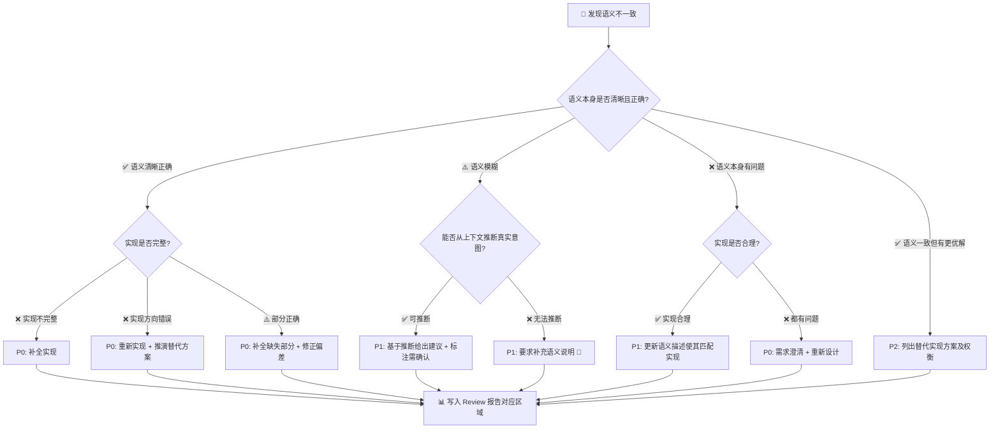

# Code Review 详细检查清单与模板参考

> 本文件是 [SKILL.md](SKILL.md) 的配套参考。主 agent 在波次2 执行维度 0/4 时、子 agent 在波次1 执行维度 1/2/3/5/6 时，按对应章节提取完整检查清单。

## 一、维度 0：语义一致性详细检查项

### 0.1 提交意图 vs 实际实现

- commit message 说的"修复X"，代码实际是否修复了X？
- 是否只修了表面症状而未解决根因？
- 是否混入了与意图无关的变更？（scope creep）
- 修复是否完整？是否遗漏了同类问题的其他位置？
- **局部改动虽然自洽，但是否改变了整体功能对外承诺？**

### 0.2 注释描述 vs 代码行为

- 注释说"做A"，代码实际是否做A？
- 注释是否过时？是否描述的是旧版本的行为？
- 注释是否有误导性？（不完全准确、遗漏关键条件）
- "TODO"/"FIXME"/"HACK" 注释是否被正确处理？

**新增注释专项检查**（本次提交新增/修改的注释，可信度默认低）：

1. **一致性**：注释说"验证X/处理Y"，代码是否真的做了？
2. **完整性**：代码是否做了注释没提到的事情？
3. **准确性**：是否过度承诺（注释说的比代码做的多）或不足承诺？

严重性：严重不一致 → P0；部分不一致 → P1；描述不完整 → P2。不一致时以代码行为为准，并在报告中显式提示用户核实。

### 0.3 docstring vs 函数实际行为

- docstring 描述的参数/返回值与实际是否一致？
- docstring 声明的异常与实际抛出的异常是否一致？
- docstring 描述的副作用与实际副作用是否一致？

### 0.4 命名语义 vs 实际职责

- 函数名说"get_xxx"，实际是否只做读取？还是也有修改？
- 函数名说"validate_xxx"，实际是只验证还是也做了转换？
- 变量名暗示的数据类型/结构是否与实际使用一致？
- 类名暗示的抽象层次是否与实际实现匹配？
- 方法 / 类 / 模块的命名所表达的**整体职责**，是否仍与改动后的实际行为一致？

### 0.5 调用关系的语义传递性（避免"借错工具"）

当函数通过调用下游对象（handler / model / service / API / 第三方库 / 工具函数）实现自身语义时，必须验证调用关系是否构成**语义可传递链**——不能默认"被调对象的语义就是调用方需要的语义"。

**核心追问（按层递进）：**

1. **被调对象的语义是什么？**——不看名字，看其实际承诺（文档 / 字段定义 / 源码行为）
2. **调用方的语义是什么？**——来自已建档的语义声明
3. **两者是否可传递？**——输入语义、输出语义及下表各类隐式语义维度，是否都能支撑上层诉求？
4. **不可传递时，问题在哪一层？**
    - 仅是参数没传对 → 在原调用上修参数（改动最小）
    - 被调对象在概念维度上就不匹配（如用"实体生命周期查询"实现"事件统计"）→ 必须**更换被调对象**或**新建合适抽象**，禁止在错误对象上叠参数
    - 项目里本就缺乏合适的抽象 → 建议先补抽象再实现

**隐式语义维度清单（最易被忽略）：**

| 维度          | 不匹配示例                                                       |
| ------------- | ---------------------------------------------------------------- |
| 时间语义      | `create_time` / `update_time` / `event_time` / 业务有效期 互相代用 |
| 集合语义      | "实体集合" vs "事件流" vs "状态快照" 互相代用                     |
| 一致性语义    | 强一致 / 最终一致 / 缓存读 互相代用                              |
| 边界语义      | 闭区间 / 半开区间 / 含/不含未结束记录                            |
| 单位/精度     | 秒/毫秒、分页/全量、聚合粒度                                     |
| 权限/可见性   | 已过滤 vs 未过滤、当前用户 vs 全局                               |
| 排序/截取     | 隐含排序方向、是否已 limit                                       |

**审查动作：**

- 在项目内检索是否已存在更贴近上层语义的对象/接口（grep 类名、文档名、相关字段）
- 若存在 → 优先建议"换数据源 / 换抽象"；若不存在 → 建议先补充合适抽象再迁移实现
- **禁止在概念错配的对象上"打补丁"**（加参数、加 if、加注释解释）来掩盖语义错配

### 0.6 局部改动 vs 整体功能语义（纵向）

即使某一小段变更本身逻辑正确，也必须验证它是否破坏了所在方法、类、模块或业务流程的整体语义。

**重点检查：**

- **方法整体语义**：局部修改是否改变了方法原本的输入约束、返回契约、异常语义、副作用或幂等性？
- **类 / 模块整体语义**：某个方法局部修复是否打破了类的职责边界、状态一致性、封装假设或模块对外契约？
- **业务流程整体语义**：局部逻辑正确，但是否导致上游/下游流程的业务含义发生偏移？
- **跨分支一致性**：某个分支被修正后，其他分支是否仍与整体语义保持一致？
- **局部优化副作用**：为了性能、容错、兼容性做的局部改动，是否牺牲了整体正确性或可观察性？

**审查动作：**

- 读取变更所在函数 / 方法的完整实现，而非只看变更行
- 必要时回溯其调用方、实现方、重写关系、接口定义或测试用例
- 用一句话显式概括该方法 / 类 / 模块的**整体语义**，再判断改动后是否仍成立
- 若局部正确但全局失真，按 **P0 语义破坏** 处理

**典型风险：**

- 只修正某个 `if` 分支，但破坏了整个方法"返回统一数据结构"的语义
- 只优化局部异常处理，却让调用方无法再区分真实失败与空结果
- 只增强某个参数分支，却让类从"只读查询"悄悄变成"查询 + 写入"

### 0.7 条件路径语义一致性检查（横向）

**核心问题**：函数参数不同，执行路径不同，路径语义也不同。修改后，各条路径的语义是否仍然一致？

**0.7.1 参数空间枚举**——对被修改函数，显式枚举参数驱动的主要路径分支：

| 参数组合 | 执行路径 | 路径语义 | 修改后是否受影响 |
|----------|----------|----------|------------------|
| `<param_值域A>` | `<路径描述>` | `<该路径的语义承诺>` | ✅ / ⚠️ / ❌ |
| `<边界/空值/异常值>` | `<路径描述>` | `<该路径的语义承诺>` | ✅ / ⚠️ / ❌ |

**0.7.2 隐式条件空间**——除显式参数外，检查影响执行路径的隐式条件：

| 隐式条件 | 影响路径 | 修改后是否受影响 |
|----------|----------|------------------|
| 对象/实例状态（如 `self.xxx` 是否已初始化） | `<走状态A vs 走状态B>` | ✅ / ⚠️ / ❌ |
| 全局/模块状态（如配置开关、feature flag） | `<新逻辑 vs 旧逻辑>` | ✅ / ⚠️ / ❌ |
| 外部依赖返回值（如查询结果有无、API 是否超时） | `<正常路径 vs 降级路径>` | ✅ / ⚠️ / ❌ |
| 并发状态（如缓存是否命中、锁是否持有） | `<独占执行 vs 排队等待>` | ✅ / ⚠️ / ❌ |

**0.7.3 路径间语义一致性**——不同路径之间语义是否互相矛盾：

- 参数A走路径1返回"成功"，参数B走路径2返回"成功"——两种"成功"的含义是否一样？
- 修改后某条路径的返回语义发生偏移，但调用方可能只测了另一条路径
- 某条路径的异常类型/错误码被修改，但调用方按原类型做了分支处理

**0.7.4 修改影响的路径定位**：

- 修改的代码行，在哪些参数/条件下会被执行到？
- 完全不受影响的路径 → ✅；受影响但语义一致 → ⚠️ 可接受；受影响且语义变化 → ❌ 必须修复

**审查动作：**

1. 识别被修改函数的所有主要分支（if/elif/else、switch/match、try/except、early return、guard clause 等）
2. 对每个分支，明确其**触发条件**和**路径语义**（该路径承诺了什么输入→输出→副作用）
3. 判断修改行落在哪些分支内，哪些分支不受影响
4. 对受影响的分支，验证修改后路径语义是否仍与整体语义一致
5. 特别关注**低频路径**（异常分支、降级分支、边界条件分支）——平时很少触发，最易被修改破坏却难以在测试中发现

**典型风险：**

- ❌ 只修了正常路径的 Bug，但忽略了异常路径下同类问题
- ❌ 参数 A 下的修改正确，但参数 B 下修改反而引入了新问题
- ❌ 修改改变了空值/None/默认值参数下的行为，但调用方依赖了原来的行为
- ❌ 修改影响了某条并发路径的语义（如锁的获取/释放时机），但串行测试无法覆盖
- ❌ 修改让某条路径的副作用从"无"变成"有"（或反过来），但调用方按原语义做假设

### 0.8 执行场景语义一致性检查（场景维度，补充 0.7）

适用于两类 0.7 覆盖不到的情况：**无参数函数**（如 `init()`、`cleanup()`）和**非参数驱动的分支**（全局状态、外部依赖、并发条件、调用时机）。核心思路：**基于函数的功能意义识别执行场景，而非依赖参数值域**。

**0.8.1 使用场景识别**（AI 自主判断）：

| 场景维度 | 识别依据 | 示例场景 |
|----------|----------|----------|
| 调用时机 | 函数在业务流程中的位置 | 初始化阶段、运行时、关闭清理、定时任务触发 |
| 调用频率 | 预期的调用模式 | 单次调用、批量调用、首次调用 vs 重复调用 |
| 外部状态 | 依赖的外部资源状态 | DB 可用/不可用、缓存命中/未命中、网络正常/超时 |
| 业务上下文 | 调用时的业务状态 | 新用户/老用户、正常流程/补偿流程 |
| 异常场景 | 可能的异常情况 | 超时、并发冲突、资源不足、部分失败 |
| 并发条件 | 多线程/协程环境 | 串行执行、并发调用、锁竞争、竞态条件 |

**0.8.2 修改代码的场景覆盖分析**：

1. 定位被修改的代码行（通过 diff 或 PR）
2. 对每个识别出的执行场景，判断修改代码是否会被执行
3. 如果会执行，验证该场景下修改后的语义是否正确
4. 如果不确定是否会执行，标注为 ⚠️ 需确认

**审查动作**：

1. 理解函数的功能意义（读 docstring、注释、调用方）
2. 识别 3-5 个主要执行场景（不需要穷举，覆盖关键场景即可）
3. 对每个场景，判断修改代码是否被执行；对受影响的场景验证语义一致性
4. 特别关注**异常场景**和**低频场景**

**典型风险**：

- ❌ 修改在正常流程下正确，但在异常恢复场景下行为错误
- ❌ 修改在单次调用下正确，但在批量调用下引入性能问题或副作用
- ❌ 修改在初始化阶段正确，但在运行时重复调用下产生状态污染
- ❌ 修改在外部依赖正常时正确，但在降级/超时场景下语义破坏
- ❌ 修改在串行执行下正确，但在并发调用下产生竞态条件

### 不一致分类与处理策略

| 不一致类型                 | 严重级别 | 处理策略                    |
| -------------------------- | -------- | --------------------------- |
| 🏚️ 语义正确，实现方向错误   | 🔴 P0     | 给出正确实现方案 + 推演思路 |
| 🎭 语义正确，实现不完整     | 🔴 P0     | 标注遗漏部分 + 补全方案     |
| 📝 实现正确，语义描述有误   | 🟡 P1     | 指出描述应如何修正          |
| 🤷 语义模糊，难以判定一致性 | 🟡 P1     | 要求补充语义说明            |
| 🚀 语义一致，但有更优实现   | 🟢 P2     | 给出优化建议及理由          |
| ⚖️ 语义与实现部分重叠       | 🟡 P1     | 澄清意图后判断              |
| 🔄 注释/文档过时            | 🟡 P1     | 标注需更新的文档            |
| 🧭 调用关系语义不可传递 | 🔴 P0 | 指出错配维度（时间/集合/一致性/...）→ 检索更合适的抽象 → 给出迁移方向；禁止在原对象上打补丁 |
| 🛤️ 条件路径语义不一致 | 🔴 P0 | 枚举受影响路径 → 逐条验证路径语义与整体语义的一致性 → 标注哪些路径语义被破坏 |

### 语义不一致分析模板（含精确/鲁棒双方案）

发现语义不一致时，执行深度推演并输出：

```
语义不一致分析 #M1
  语义来源: #S1 (commit message: "修复用户登录时的空指针异常")
  🤖 AI 对该语义的理解: "作者希望解决 login() 在 user 不存在时抛 NoneType 异常的问题"
  实际实现: 新增了 try/except 捕获 None 并返回空对象
  不一致类型: 修复策略偏差

  🔍 推演分析:
  - 语义要求的意图: 修复空指针的根因（为什么 user 会是 None？）
  - 实际实现做了什么: 绕过了空指针，但未解决根因
  - 根因判断:
    □ 实现正确但语义描述不精确？→ 建议更新提交说明
    ☑ 语义正确但实现有偏差？→ 建议重新实现
    □ 两者都不够清晰？→ 需进一步讨论

  💡 建议方向:
  1. 追溯 user 为 None 的来源，在上游修复
  2. 如果 None 是合法状态，应在类型系统中显式表达（Optional[User]）
  3. 当前"静默吞掉 None"的方案可能掩盖更深层问题

  🔄 解决方案对比（精确 vs 鲁棒）:

  ─── 方案 A：精确方案 ───
  目标: 在当前上下文中完全精确地区分"用户不存在"与"系统异常"
  适用: 内部私有方法、调用方可控、上下文稳定的场景

  def login(user_id: str) -> LoginResult:
      """登录验证，区分用户不存在与系统异常两种失败原因。"""
      try:
          user = user_repo.get(user_id)
      except RepoError as e:
          return LoginResult.system_error(reason=str(e))
      if user is None:
          return LoginResult.user_not_found(user_id)
      return LoginResult.ok(user)

  优点: 调用方能精确区分失败类型，无信息丢失
  代价: 引入 LoginResult 抽象，调用方需配合改造；若 user_repo 行为变动则可能失配

  ─── 方案 B：鲁棒方案 ───
  目标: 不追求极致精确，但在关联代码变动时仍可控
  适用: 公共接口、跨模块调用点、关联代码可能变动的场景

  def login(user_id: str) -> Optional[User]:
      """登录验证，未找到用户或异常时统一返回 None 并记录日志。"""
      try:
          user = user_repo.get(user_id)
      except RepoError:
          logger.exception("login repo error: user_id=%s", user_id)
          return None
      if user is None:
          logger.warning("login user not found: user_id=%s", user_id)
          return None
      return user

  优点: 接口签名简单稳定，调用方仅需判 None；user_repo 行为微调不会牵动调用方
  代价: 调用方无法区分"用户不存在"与"系统异常"；需依赖日志做问题定位

  📊 权衡建议:
  - 被修改函数的可见性: <内部方法 / 模块内 / 公共接口>
  - 关联代码变动风险: <低 / 中 / 高>
  - 调用方对精确性的需求: <低 / 中 / 高>
  - 推荐方案: <A / B / 视调用场景而定>
  - 推荐理由: <基于可见性与变动风险给出选择依据>
```

> ⚠️ 当且仅当存在"更简单但鲁棒性更好"的替代方案时，才需要呈现双方案对比；若问题本身只有唯一合理修复路径，可只输出方案 A。

### 语义一致性检查决策树



## 二、维度 1：安全性检查清单（波次1 · 子 agent-A）

**🔴 高危项（可能直接导致安全事故）：**

- **SQL 注入**：是否使用参数化查询？是否有 f-string / `.format()` / `%` 拼接 SQL？
- **命令注入**：是否有 `os.system()` / `subprocess` 使用未转义的外部输入？`shell=True` 是否必要？
- **eval / exec / compile**：是否对不可信数据执行动态代码？`eval()` 永远不应该接受用户输入
- **SSTI 模板注入**：是否对用户输入调用 `jinja2.Template().render()` 或 `Template()` 直接渲染用户内容？
- **反序列化**：是否使用 `pickle.loads()` / `yaml.load()` 处理不可信数据？

**🟡 中危项（可能导致数据泄露或服务异常）：**

- **SSRF**：`requests.get()` / `urllib.request.urlopen()` 的 URL 是否来自用户输入且无域名/IP 白名单？
- **XXE 外部实体注入**：XML 解析是否禁用了外部实体？（应使用 `defusedxml` 或设置 `resolve_entities=False`）
- **路径遍历**：文件路径拼接是否校验了 `..` 等目录穿越字符？
- **文件上传安全**：文件名是否校验？MIME 类型是否服务端检测？存储路径是否可被外部直接访问？

**🟢 低危项（长期隐患）：**

- **敏感信息泄露**：是否硬编码密钥/密码/Token/AKID？若必须写在代码中是否标记了 `# nosec`？
- **日志注入**：用户输入写入 `logger.info()` 等日志前是否做了换行符清理？
- **ReDoS 正则拒绝服务**：正则表达式是否存在灾难性回溯？（嵌套量词：`(a+)+b`、`(a|aa)*`）
- **YAML 安全**：是否使用 `yaml.safe_load()` 而非 `yaml.load()`？
- **HMAC / 密码学**：是否自行实现了加密算法而非使用 `hmac.compare_digest()` 等标准库？

## 三、维度 2：Bug 与逻辑风险清单（波次1 · 子 agent-B）

**🔴 高频语言陷阱（按当前语言切换）：**

- **Python**：可变默认参数、`is` vs `==`、闭包延迟绑定、空异常捕获、`None` 类型混淆
- **JavaScript / TypeScript**：隐式类型转换、`this` 绑定丢失、异步竞态、`any` 扩散、未处理 Promise rejection
- **Java**：空指针、可变对象逃逸、`equals`/`hashCode` 不一致、并发容器误用、资源关闭遗漏
- **Go**：`nil` 接口陷阱、`defer` 时机误判、error 丢失、goroutine 泄漏、循环变量引用问题
- **Rust**：所有权 / 生命周期误判、错误传播缺失、`unsafe` 使用边界、阻塞与异步混用不当

**🟡 常见逻辑风险：**

- **浮点数比较**：`0.1 + 0.2 == 0.3` 为 False → 应用 `math.isclose()` 或 `Decimal`
- **上下文管理器泄露**：文件/连接/socket 未使用 `with` 语句 → 资源未释放
- **bytes/str 混淆**：文件读写、网络传输、加密操作中编码未明确指定
- **可变对象的共享引用**：类属性与实例属性混用可变默认值、全局可变状态的副作用
- **`__del__` 不可靠性**：循环引用导致 `__del__` 不被调用 → 关键清理应用 `with` / `atexit.register()`
- **深拷贝滥用**：`copy.deepcopy()` 对大型复杂对象 → 性能灾难 + 循环引用风险

**🔗 语义相关逻辑风险：**

- 实现与语义不一致导致的隐含 Bug（基于共享语义声明表初步判断，标注为跨维度线索，交由维度 0 在波次2确认）
- 函数"悄悄吞掉"异常但调用方不知情 → 下游错误积累
- **专家已知坑交叉对比**（当命中专家时）：逐一核对 C0 中的已知坑清单，检查本次修改是否重蹈历史问题模式。若命中已知坑，标注 P0 并引用专家 CHANGELOG

## 四、维度 3：代码规范 & 语言惯用法清单（波次1 · 子 agent-A）

- 命名规范：遵循当前语言及项目约定（如 PEP 8、Effective Java、Go Code Review Comments、Rust API Guidelines、TypeScript ESLint 约定等）
- 类型系统：是否合理使用 type hints / generics / interfaces / traits / annotations 等能力？
- 文档契约：公开函数、类、接口是否有必要的 docstring / 注释 / API 说明？
- 简洁性：是否符合当前语言的惯用写法，而不是机械照搬其他语言风格？
- **命名与语义**：命名是否准确反映实际职责？（基于共享语义声明表初步判断，标注为跨维度线索，交由维度 0 在波次2确认）

## 五、维度 4：架构与设计清单（波次2 · 主 agent）

- 单一职责：函数/类是否职责清晰？
- 依赖方向：是否产生循环依赖？
- 抽象层次：是否正确使用 ABC / Protocol / Mixin？
- 接口设计：参数数量是否合理？
- **职责漂移**：实际实现是否偏离了该模块应有的职责边界？
- **专家架构对齐**（当命中专家且深度模式时）：以 implementation/01-架构 描述的模块分层、依赖图、子模块边界为基准，检查修改是否违反架构约束（如将底层实现细节泄露到上层、绕过既定的分层调用路径等）

## 六、维度 5：性能隐患清单（波次1 · 子 agent-B）

- 循环内的 I/O 或重复计算
- 字符串拼接使用 `+` 而非 `.join()` / f-string
- 大列表使用 `list.index()` 而非 set/dict 查找
- 不必要的列表创建（可用生成器替代）
- **语义不必要**：实现中是否做了语义并未要求的重量级操作？

## 七、维度 6：测试覆盖清单（波次1 · 子 agent-C）

**📋 测试存在性检查：**

- 新增/修改的公开函数、类是否在对应测试文件中新增或更新了测试？
- 修改已有功能时是否补充了回归测试？
- 修复 Bug 的提交是否包含了复现该 Bug 的回归用例？

**🎯 测试质量检查：**

- **测试是否验证了语义**：测试用例是否覆盖了语义声明的意图，而不仅仅是代码路径？
    - 例：语义说"修复空查询引起的 500"，测试应验证空查询场景，而不只是正常路径
- **测试层级选择**：纯逻辑变更 → 单元测试优先；跨模块交互变更 → 集成测试；用户可见行为变更 → 端到端测试
- **参数化覆盖**：边界值、等价类是否用了参数化测试（如 `@pytest.mark.parametrize`）？应覆盖：正常值 / 空值 / 边界值 / 异常值 / 极大值
- **Mock 使用合理性**：不应 Mock 被测对象本身；外部 I/O（网络、数据库、文件）→ 应 Mock；纯函数 → 不应 Mock

**🧪 测试基础设施检查：**

- **测试隔离性**：测试是否依赖全局状态或执行顺序？是否每个测试独立可运行？
- **fixture / factory 使用**：是否有重复的测试数据构造逻辑应提取为 fixture？
- **测试命名**：测试函数名是否描述了"做什么 → 期望什么"？（如 `test_login_with_expired_token_returns_401`）

## 八、语义声明表完整格式与示例

语义声明分两类：**权威语义**（来自功能意图推理阶段，标记 `[权威]`）与**辅助语义**（来自语义提取阶段，标记 `[辅助]`）。

```
语义声明 #S1 [权威: 阶段 3 功能意图]
  🤖 AI 推测: "login() 的功能意图是验证用户身份并返回用户对象，验证失败时返回 None"
  用户确认: ✅ 已确认 / ⚠️ 已修正为："<用户修正的内容>" / ⏩ 快速模式未确认（置信度 🟢）
  涉及: auth.py:login()

语义声明 #S2 [辅助: commit message]
  原文: "fix: 修复用户登录空指针"
  🤖 AI 理解: "作者希望解决 login() 在 user 不存在时抛出 NoneType 异常的问题"
  置信度: 高 / 中 / 低
  与权威语义关系: ✅ 一致 / ⚠️ 补充 / ❌ 冲突
  涉及: auth.py:login()

语义声明 #S3 [辅助: docstring]
  原文: "Calculate order total with discount and tax."
  🤖 AI 理解: "该函数承诺：输入订单 → 输出包含折扣与税费在内的最终可结算金额"
  置信度: 高
  与权威语义关系: ✅ 一致 / ⚠️ 补充 / ❌ 冲突
  涉及: order.py:calculate_total()

语义声明 #S4 [辅助: 注释]
  原文: "# 此处需要处理并发情况"
  🤖 AI 理解: "此处存在多协程/多线程同时进入的可能，原作者认为需要加锁"
  置信度: 中（注释过于笼统）
  与权威语义关系: ✅ 一致 / ⚠️ 补充 / ❌ 冲突
  涉及: cache.py:42
```

## 九、专家资产在各阶段的用途映射

| 专家资产 | 辅助的审查阶段 | 具体用途 |
|----------|--------------|----------|
| C0 能力清单 + 边界 | 功能意图推理 | 了解模块原本的能力范围和边界，辅助判断被改代码的功能意图是否合理 |
| C0 已知坑 | 维度 2（Bug 风险） | 检查本次修改是否重蹈模块历史上已知的问题模式 |
| C1 能力契约 | 维度 0（语义一致性） | 以公开方法的参数/返回/异常/约束契约为基准，逐项检查修改是否破坏既有契约 |
| implementation/01-架构 | 维度 4（架构设计） | 以模块架构为参考基线，检查本次修改是否符合架构约束和设计意图 |
| implementation/02-实现 | 维度 2（Bug 风险） | 理解核心实现模式和关键路径，判断修改是否与既有实现风格一致 |
| implementation/03-数据流转 | 维度 0.6（整体语义） | 理解数据在模块内外的流动路径，检查修改是否影响数据一致性或跨模块行为 |
