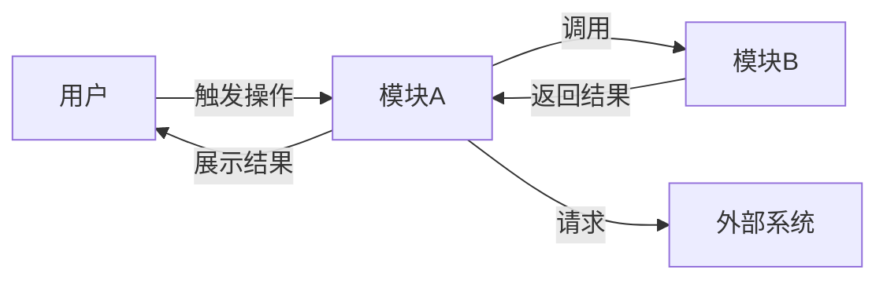
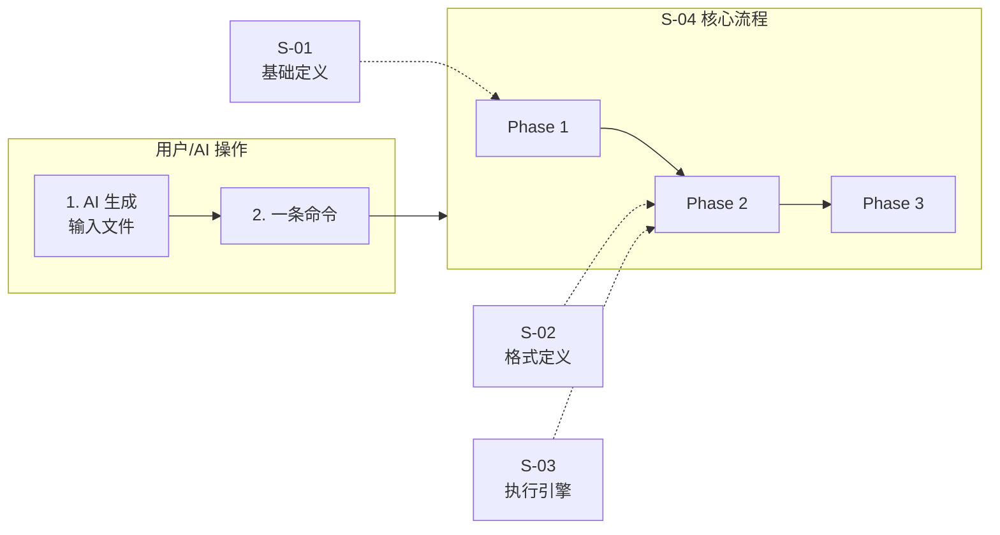

# 设计文档生成器

## 何时使用

仅在以下情况使用本 skill：

- 用户已经能给出**一段较完整的需求描述**（不是一句话标题）
- 用户的目标是产出一份**给小团队评审用的轻量级设计文档**
- 用户希望**结构完整但不啰嗦**

若只是粗略想法、一句话标题、或仅需问答澄清需求，**不要使用本 skill**，先帮用户把需求说清楚。

### 单文档快速通道

当需求**同时满足以下全部条件**时，可合并为单文档设计：

- 无流程变化（纯增一个字段/一个接口/一种行为）
- 涉及文件 ≤ 3 个，或变更行数 ≤ 100 行
- 无跨模块交互
- 用户明确选择"不需要拆分"

快速通道跳过阶段 2.5（拆分）和阶段 3（多文档大纲），直接用精简 14 章模板输出。阶段 2.3（交互对象总览）仍然执行。

### 单文档 14 章骨架（快速通道参照）

| 章号 | 章节名 | 可省略条件 |
|:---:|--------|-----------|
| 1 | 需求背景 & 目标 | — |
| 2 | 术语表 | — |
| 3 | 现状分析（AS-IS） | 纯新增（无现状可对比）→ 写"无现有实现" |
| 4 | 方案设计（TO-BE） | — |
| 5 | 关键决策点 | 无备选方案 → 写"无重大决策点" |
| 6 | 架构图 / 流程图 | — |
| 7 | 模块/类设计 | 无类/模块变更 → 写"不涉及" |
| 8 | 接口设计 | 无接口变更 → 写"不涉及" |
| 9 | 数据模型 | 无数据持久化 → 写"不涉及" |
| 10 | 关键流程时序图 | 简单同步流程 → 写"无需时序图" |
| 11 | 异常处理 & 边界情况 | 无异常路径 → 写"无特殊异常路径" |
| 12 | 性能 & 安全考虑 | 无明显压力 → 写"无特殊考虑" |
| 13 | 测试方案 | 纯类型定义变更且无逻辑改动 → 写"依赖编译检查" |
| 14 | 风险 & 待定问题 | — |

> 章节可省略但必须保留占位，不得跳号。省略时写明原因，不写空话。

## 核心原则

1. **默认多文档**：除非同时满足全部简单条件，否则强制拆分为父文档+子需求文档。单文档可能掩藏复杂度
2. **子需求为轴**：术语、决策、接口均归属到对应子需求，不设全局汇总章混淆归属
3. **前置成熟度判定**：上下文已有充分讨论时，跳过阶段 1/2，减少已有内容的复述
4. **交互先于设计**：在拆分需求和设计之前，必须先明确对象/模块/用户间的调用关系（阶段 2.3），建立协作地图作为后续设计的输入约束
5. **一览图必须**：拆分后必须输出关键环节一览图，将子需求作为节点展示全局流程
6. **分阶段确认**：每个关键阶段必须等用户确认才能继续
7. **不脑补需求**：发现需求模糊或场景不成立时，停下来，而非自行补全

## 工作流总览

```
阶段 0：需求成熟度判定       → 判定上下文是否存在充分讨论
阶段 1：需求摘要确认         → 输出"我理解的需求"，等用户确认
阶段 2：语义分析与场景对齐   → 拆解语义、匹配场景、判定价值
阶段 2.3：交互对象总览       → 明确对象/模块/用户间的调用关系，建立协作地图
阶段 2.5：需求拆分（默认触发）→ 拆分子需求 + 依赖 DAG + 关键环节一览图
阶段 3：大纲与边界输出       → 父文档 4 全局章 + 子需求按需章
阶段 4：分章节填充           → 按依赖拓扑序填充各文档
阶段 5：落盘归档             → 写入 + 质量自检 + 一致性校验
```

**未得到用户对当前阶段的确认前，不进入下一阶段。**

### 回退与迭代机制

**全量回退**：用户可在任意阶段要求回退到之前的阶段。回退时丢弃回退点之后的所有产出，从该阶段重新开始。

**交互对象回退**（阶段 2.3 专属）：用户在阶段 2.5 或之后发现交互关系有误时，可回退到阶段 2.3 重新确认调用关系。回退后丢弃阶段 2.3 之后的所有产出，从阶段 2.3 重新开始。

**部分回退**（仅阶段 2.5 之后可用）：保留其他子需求的确认结果，仅重新处理指定子需求。

- 适用场景：用户只想调整某个子需求的粒度、依赖关系或拆分边界
- 约束：部分回退后需重新执行依赖 DAG 校验，确认无断裂
- 输出：仅展示变更的子需求及相关依赖调整

**增量变更**（仅阶段 2.5 之后可用）：保留已确认的所有子需求和已完成填充的文档，仅对新增或变更的子需求重新走阶段 2.5 → 3 → 4。

- 适用场景：阶段 4 填充到一半时用户要求"加一个子需求"或"某个子需求范围变了"
- 约束：
  - 新增/变更的子需求从阶段 2.5 重新走
  - 完成后重新校验依赖 DAG 和一览图（可能影响其他子需求的依赖）
  - 已完成填充且未受影响的子文档保留不动
- 输出：仅展示新增/变更的子需求、调整后的 DAG 和一览图

---

## 阶段 0：需求成熟度判定

在阶段 1 之前，先判定上下文中是否已存在对需求的充分讨论。

**判定条件**（满足 1 项即为成熟度高）：

- 用户已给出多轮（3+ 条消息）分析讨论，含具体技术方案比较
- 用户已明确关键决策点或给出 AS-IS / TO-BE 对比
- 上下文已包含需求挖掘（requirement-mining）的完整输出

**判定结果**：

| 成熟度 | 处理方式 |
|--------|---------|
| 高 | 输出「已有理解摘要」一次性确认，跳过阶段 1 和阶段 2，直接进入阶段 2.3 |
| 中 | 走阶段 1 → 2 但精简输出（省略价值判定等已讨论内容） |
| 低 | 走完整标准流程 |

**成熟度高时的输出格式**：

```text
⚡ 已有理解摘要（基于上下文讨论）
━━━━━━━━━━━━━━━━
核心诉求：<基于已有讨论提炼>
关键决策点：<已确认的技术决策>
涉及模块：<涉及的文件/模块>

以上理解均来自上下文讨论，确认后直接进入交互对象总览（阶段 2.3）。
如有偏差请纠正，我将回退到阶段 1 重新对齐。
```

---

## 阶段 1：需求摘要确认

将用户需求复述为结构化摘要，逼出隐含假设。

输出格式：

```text
📌 需求摘要
━━━━━━━━━━━━━━━━
原始描述：<原文回放>
核心诉求：<本质诉求，一句话>
变更类型：新增 / 修改 / 重构 / 删除
触发主体：<谁会用 / 谁会触发>
预期产物：<最终产物形态>

请确认以上理解是否正确。
```

---

## 阶段 2：语义分析与场景对齐

**这是本 skill 最重要的步骤，不可跳过、不可合并到其他阶段。**

### 核心问题

> 同一句需求描述，不同人理解不同 → 设计方向跑偏 → 文档作废。

### 三个动作

**① 语义拆解**：把需求逐条提取，用更明确的术语替换歧义词。

常见歧义词：幂等（接口/任务/消息）、缓存（进程内/分布式/CDN）、异步（线程/协程/消息队列）、限流（单机/全局/用户/接口）、通知（推送/邮件/站内信/Webhook）

**② 场景匹配**：每条款项明确触发场景、使用主体、解决痛点。

**③ 价值判定**：每条三选一：

| 标记 | 含义 | 处理 |
| --- | --- | --- |
| ✅ 匹配 | 场景真实、价值成立 | 进入设计 |
| ⚠️ 存疑 | 场景模糊或价值不明 | 提出具体反问 |
| ❌ 不匹配 | 场景不成立 | 劝退或推荐替代方案 |

**④ 非功能性需求确认**：每条需求额外确认以下维度（若用户未主动提及，按默认假设处理并注明）：

| 维度 | 默认假设 | 需追问的信号 |
|------|---------|-------------|
| 数据量级 | 单机低量级 | 涉及批量/流式/大文件 |
| QPS/并发 | 单用户低频 | 涉及多用户/高并发场景 |
| 可用性 | 允许单点故障 | 涉及线上服务/关键路径 |
| 一致性 | 最终一致 | 涉及资金/状态关键操作 |
| 延迟容忍 | 秒级 | 涉及实时/交互式场景 |
| 兼容性 | 不需要向后兼容 | 涉及旧接口/旧数据迁移 |
| 可观测性 | 不需要额外埋点 | 涉及线上监控/告警/链路追踪 |

> 默认假设必须在方案章显式标注，如"本方案默认单机低量级，若需扩展请在阶段 3 前确认"。

### 关键约束

- **必须停下来等用户确认**
- 出现 ❌ 时不能硬写设计
- 出现 ⚠️ 时反问必须具体到二选一
- 多维度歧义时逐维度追问，不一次性列出所有组合
- 详见 [reference.md](reference.md) 中的语义分析示例

---

## 阶段 2.3：交互对象总览

### 目的

在拆分需求和设计之前，先明确参与交互的**核心对象/模块及其调用关系**，建立全局"协作地图"。让用户对"谁跟谁交互"有一个地图级认知，作为后续需求拆分和设计的输入约束。

### 触发条件

阶段 2 确认后**自动触发，不可跳过**。

### 输入

阶段 2 确认的场景、角色、功能本质。

### 输出

#### 1. 交互对象清单

列出所有参与交互的核心对象/模块，含用户角色。每个对象标注职责（一句话）。

| 对象/模块 | 类型 | 职责 |
|-----------|------|------|
| [用户角色名] | 用户 | [一句话职责] |
| [模块名] | 内部模块 | [一句话职责] |
| [外部系统名] | 外部系统 | [一句话职责] |

**类型说明**：
- **用户**：参与交互的人类角色（如 普通用户、管理员、运营人员）
- **内部模块**：系统内部的功能模块（如 用户模块、订单模块、支付模块）
- **外部系统**：第三方服务、外部 API、消息队列、数据源等

#### 2. 调用关系图（mermaid）



**制图规则**：
- 节点 = 对象/模块/用户/外部系统
- 连线 = 调用方向 + 触发条件（箭头旁标注）
- 不确定的调用关系标注 `[待确认]`，连线用虚线样式
- 外部系统用不同颜色或边框区分（如虚线边框）

#### 3. 关键交互说明

每条调用关系补充：

| 调用方 | 被调用方 | 触发条件 | 数据/控制流向 | 备注 |
|--------|----------|----------|---------------|------|
| 用户 | 模块A | 用户执行 [操作] | 控制流：触发 [行为] | — |
| 模块A | 模块B | 模块A 需要 [数据/能力] | 数据流：[什么数据] | — |
| 模块A | 外部系统 | 需要 [外部能力] | 数据流：[请求/响应] | [待确认] |

### 约束

- **粒度**：模块/对象级，不深入到具体类/函数/方法
- **外部系统**：第三方 API、消息队列、数据库中间件等均作为独立节点纳入
- **不确定关系**：标注 `[待确认]`，直接询问用户，不自行假设
- **不替代后续设计**：此图是"协作拓扑"，不是详细时序图或流程图
- **必须停下来等用户确认**，确认后才进入阶段 2.5

### 输出格式

```text
🗺️ 交互对象总览
━━━━━━━━━━━━━━━━

【交互对象清单】
| 对象/模块 | 类型 | 职责 |
|-----------|------|------|
| ... | ... | ... |

【调用关系图】
（mermaid 图）

【关键交互说明】
| 调用方 | 被调用方 | 触发条件 | 数据/控制流向 | 备注 |
|--------|----------|----------|---------------|------|
| ... | ... | ... | ... | ... |

请确认：
1. 对象/模块是否完整（有无遗漏）
2. 调用关系是否准确（方向、条件）
3. 标注 [待确认] 的关系是否可以明确
```

---

## 阶段 2.5：需求拆分

### 触发条件（默认触发）

**默认拆分。仅当同时满足以下全部条件时，才合并为单文档：**

1. 无流程变化（纯增字段/接口/行为，不改动现有流程）
2. 涉及文件 ≤ 3 个，或变更行数 ≤ 100 行
3. 无跨模块交互
4. 用户确认"不需要拆分"

### 拆分动作

1. **识别子需求**：将需求拆为 N 个边界清晰的子需求，每个子需求需满足：
   - 有独立的触发场景和使用主体
   - 可独立定义接口契约
   - 可独立验证

2. **构建依赖 DAG**：识别子需求间的依赖关系

3. **输出关键环节一览图**：用 mermaid 将子需求作为节点，展示在全局流程中的位置

4. **分期推荐**：子需求 ≥ 4 个或存在依赖层级时推荐分期

### 输出格式

```text
🔀 需求拆分
━━━━━━━━━━━━━━━━

【复杂度判定】
- 结论：默认拆分 → 生成 N 个子需求

【子需求清单】
| 编号 | 子需求 | 触发场景 | 独立验证方式 |
| ---- | ------ | -------- | ------------ |
| S-01 | ... | ... | ... |

【关键环节一览图】


> 一览图必须标注每个子需求在全局流程中的位置（用户视角的步骤对应哪些内部子需求）。

【依赖关系】
```
flowchart LR
    S-01 --> S-03
    S-02 --> S-03
    S-01 --> S-04
```
依赖说明：S-03 依赖 S-01/S-02（因为...）

【分期推荐】（子需求 ≥ 4 个或存在明显依赖层级时输出）
- 第一期：S-01, S-02（无依赖，可并行设计）
- 第二期：S-03（依赖第一期设计结论）

【文档规划】
- 父文档：<feature>_DESIGN.md（全局架构 + 一览图 + 全局风险）
- 子文档：S-01 → <feature>_S01_<名称>_DESIGN.md
         S-02 → <feature>_S02_<名称>_DESIGN.md

请确认：
1. 子需求划分是否合理（粒度 / 依赖关系）
2. 一览图是否准确反映了全局流程
3. 分期方案是否合理
```

### 关键约束

- **必须停下来等用户确认**
- 拆分后必须输出关键环节一览图
- 一览图中的节点是子需求编号+名称，连线是数据/控制依赖
- 用户可调整子需求粒度、依赖关系、分期方案

---

## 阶段 3：大纲与边界输出

### 多文档结构（默认）

**父文档**仅含 4 个全局章节：

1. 需求背景 & 目标 — 全局背景 + 整体目标 + 不在范围内
2. 关键环节一览图 — 阶段 2.5 确认后的一览图（可微调）
3. 总体方案设计 — 以子需求节点图替代文字描述，标注跨子需求共享术语
4. 全局风险 & 跨子需求依赖 — 跨子需求风险 + 接口契约变化风险 + 共享术语速查

**共享术语**不单独成章。每个子需求定义自己的术语，跨子需求共享术语在父文档第 4 章"共享术语速查"中携带引用（不重复定义）。

**子需求文档**各自按需取用章节，最少 4 章：

| 子需求特征 | 必含章节 | 可追加章节 |
|-----------|---------|-----------|
| 纯数据模型变更 | 术语、现状(AS-IS)、方案(TO-BE)、数据模型 | — |
| 纯函数/接口新增 | 术语、现状(AS-IS)、方案(TO-BE)、接口设计 | — |
| 含复杂时序流程 | +时序图 | — |
| 含性能敏感路径 | +性能安全 | — |
| 含异常路径 | +异常处理 | — |
| 含重构场景 | +迁移策略 | — |
| 涉及 ≥2 个文件改动 | +影响范围 | — |
| 存在未决事项 | +待定问题（自动追踪） | — |

章节模板详见 [SUB_TEMPLATE.md](SUB_TEMPLATE.md)。

> **重构场景增强**：当子需求含"重构/合并/统一/简化/替换"等关键词时，现状章和方案章自动包含 AS-IS 流程图 + TO-BE 流程图 + 迁移策略小节。

输出格式：

```text
📋 设计文档大纲

【父文档】<feature>_DESIGN.md（4 章）
1. 需求背景 & 目标
2. 关键环节一览图
3. 总体方案设计（子需求节点图 + 共享术语速查）
4. 全局风险 & 跨子需求依赖

⛔ 不在范围内：<...>

【子文档 S-01】<feature>_S01_<名称>_DESIGN.md
- 必含：术语 / 现状(AS-IS) / 方案(TO-BE) / 数据模型
- 追加：时序图（含关键时序）

⛔ 本子需求不在范围内：<...>

【子文档 S-02】<feature>_S02_<名称>_DESIGN.md
- 必含：术语 / 现状(AS-IS) / 方案(TO-BE) / 接口设计
（无追加章节）

⛔ 本子需求不在范围内：<...>

请确认大纲与边界。
```

### 单文档（快速通道）

按 14 章骨架列出大纲。章节可省略规则：

- 无数据持久化 → 第 9 章写"不涉及"
- 简单同步流程 → 第 10 章写"无需时序图"
- 无明显性能/安全压力 → 第 12 章写"无特殊考虑"

---

## 阶段 4：分章节填充

### 多文档填充

**第一轮：填充父文档。** 父文档 4 章，每章 ≤ 200 字。第 3 章总体方案设计以 mermaid 子需求节点图为主。

**第二轮：按依赖拓扑序填充子文档。** 子文档按 SUB_TEMPLATE.md 模板填充，字数不限但要精炼。有依赖的子需求必须等待所依赖的子文档完成后再填充。

风格约束：
- 不写"众所周知"、"显而易见"等空话
- 列表项 ≤ 5 条
- 每章可有 0~1 张 mermaid 图
- 子文档引用的接口签名、术语必须与父文档第 4 章一致

### 章节内容质量标准

每个章节必须满足最低信息密度要求，不满足的章节视为不合格，需补充后才能进入阶段 5：

| 章节 | 最低信息密度要求 | 不合格示例 |
|------|-----------------|-----------|
| 现状(AS-IS) | 必须给出具体文件路径或代码行号 | "当前代码结构不够清晰" |
| 方案(TO-BE) | 每个变更点必须说明改什么、改成什么、为什么 | "采用更合理的设计" |
| 关键决策点 | 每个决策点至少 1 个被否决方案 + 否决理由 | 只列一个方案无对比 |
| 接口设计 | 必须给出完整签名（含参数类型、返回值、异常） | 只写函数名无签名 |
| 数据模型 | 必须给出完整字段定义 + 含义注释 | 只写"增加若干字段" |
| 异常处理 | 每行必须包含：场景→行为→是否对外暴露 | "出错时抛异常" |
| 时序图 | 必须标注消息名称和方向，不能只有箭头无文字 | 只有参与者无消息 |

### 单文档填充

按 14 章顺序，每章 ≤ 200 字正文。填充顺序：1 → 2 → 4 → 5 → 6 → 7 → 8 → 9 → 3 → 10 → 11 → 12 → 13 → 14（现状章后置，避免过早聚焦细节）

---

## 阶段 5：落盘归档

### 存储位置

检查项目中是否已配置存储位置（`.requirements/config`）：

- **已配置**：读取 `storage_path`，设计文档存放在 `{storage_path}/{YYYY-MM-DD}-{功能名称}/design/`
- **未配置**：询问用户，给出默认建议 `.requirements/`

配置后自动创建目录结构，后续设计文档统一存放。

**存储规范**：加载 `requirement-doc-store` skill 获取完整目录结构和文件命名规范。

### 多文档场景

先落盘父文档，再按依赖拓扑序依次落盘子文档。父文档存入 `design/DESIGN.md`，子文档存入 `design/` 目录。

```text
✅ 设计文档已生成

父文档：<路径>（4 章）
子文档：
  - <路径>（N 章）
  ...

🔍 质量自检清单
━━━━━━━━━━━━━━━━

【可自动校验】
☐ 父文档第 2 章包含 mermaid 代码块（一览图）
☐ 每个子文档文件名匹配 S-XX 编号
☐ 子文档中引用的接口签名在父文档第 4 章存在
☐ 父文档第 4 章声明的接口均有子文档正确引用
☐ 一览图中的每个子需求节点都有对应的子文档文件
☐ 子文档间的交叉引用在文档内有对应链接
☐ 共享术语在父文档第 4 章有速查条目
☐ 无"众所周知"/"显而易见"/"业界通用做法"等空话
☐ 每个决策点至少 1 个被否决方案
☐ 章节内容质量标准全部达标（见阶段 4）

【需人工判断】
☐ 一览图准确反映全局流程（子需求编号 + 位置正确）
☐ 子文档"不在范围内"未超出父文档边界
☐ 异常处理表覆盖主要失败路径
☐ 非功能性需求假设已显式标注
☐ 待定问题表覆盖所有未决事项

下一步建议：
- 是否需要同步生成实施计划（IMPL_PLAN）？
- 是否需要将关键决策存入共享记忆？
```

### 单文档场景

落盘单文件，执行 14 章质量自检清单。

---

## 阶段 6（可选）：实施计划

若用户需要，生成独立的 `<feature>_IMPL_PLAN.md`，包含批次划分总览表、每批次五元组（范围/产出物/依赖/风险/验收标准）、跨批次约定。

阶段 2.5 的分期推荐自动作为阶段 6 的批次划分输入。

仅在用户明确要求时生成。

---

## 文档生命周期

设计文档的状态流转：

```
草案 → 评审中 → 评审通过 → 实施中 → 已完成
```

**状态标记**：文档头部 metadata 区域标注状态，如 `> 状态：草案`。

**状态变更规则**：
- 草案 → 评审中：用户发起评审时更新
- 评审中 → 评审通过：评审通过后更新，同时冻结文档主体（后续变更走增量变更机制）
- 评审通过 → 实施中：开始编码时更新
- 实施中 → 已完成：所有子需求验收通过后更新

**版本策略**：直接覆盖，不保留历史版本（依赖 git 历史追溯）。重大方向变更时在文档末尾追加"变更记录"小节：

```markdown
## 变更记录
| 日期 | 变更内容 | 原因 |
|------|---------|------|
| YYYY-MM-DD | ... | ... |
```

---

## 反模式（不要做）

### 结构层面
- ❌ 需求含流程变化时用单文档承载：复杂度在章节间被稀释，审查时难以发现
- ❌ 拆分后不提供一览图：子文档碎片化，用户无法建立全局感
- ❌ 术语表跨子需求混排：术语失去归属，读者无法判断"这个词属于哪个子需求"
- ❌ 子文档引用父文档不存在的接口定义：必须先写入父文档再引用

### 流程层面
- ❌ 跳过阶段 0 复述已有讨论：浪费 token
- ❌ 跳过阶段 2 直接出大纲：会导致设计跑偏
- ❌ 用户没确认就连续输出多个阶段产物：无法纠偏
- ❌ 发现 ❌ 子需求时仍硬写设计：违反劝退义务
- ❌ 回退时保留旧产出：必须丢弃回退点之后的所有产出

### 内容层面
- ❌ 章节内容堆砌（"为了让本章节看起来饱满"）
- ❌ 把"不在范围内"写成空话（"不涉及不相关的事情"）
- ❌ 子文档间重复写共享术语和背景
- ❌ 子文档接口签名与父文档不一致
- ❌ 决策点无被否决方案或否决理由写"不合适"
- ❌ 非功能性需求未显式标注默认假设
- ❌ 待定问题写"无"但方案中存在未决依赖

## 附加资源

- 子需求章节模板：[SUB_TEMPLATE.md](SUB_TEMPLATE.md)
- 语义分析示例 / 拆分示例 / mermaid 速查 / 反模式清单：[reference.md](reference.md)
