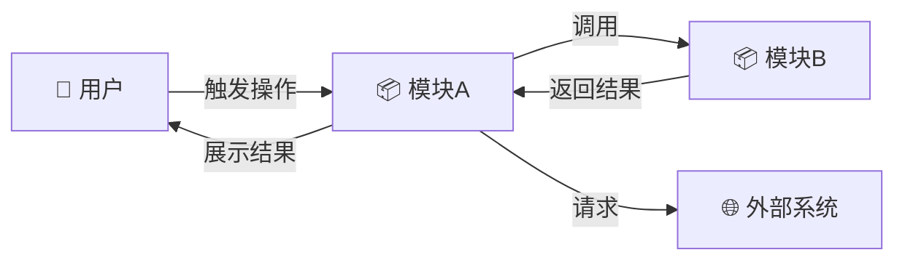

# 设计文档生成器

## 概述

将一段较完整的需求描述转化为面向技术评审的设计文档。默认拆分为父文档+子需求文档的多文档结构（子需求为组织主轴），简单需求可走单文档快速通道。覆盖需求确认→语义分析→交互建模→拆分→大纲→填充→归档的完整流程，每个关键阶段需用户确认。

## 何时使用

仅在以下情况使用本 skill：

- 用户已经能给出**一段较完整的需求描述**（不是一句话标题）
- 用户的目标是产出一份**给小团队评审用的轻量级设计文档**
- 用户希望**结构完整但不啰嗦**

若只是粗略想法、一句话标题、或仅需问答澄清需求，**不要使用本 skill**，先帮用户把需求说清楚。

### 单文档快速通道

若需求简单判定可走单文档模式，加载 [SINGLE_DOC.md](SINGLE_DOC.md) 获取完整规范。核心规则：同时满足 4 项条件 → 跳过阶段 2.5/3 → 14 章骨架填充。

## 核心原则

1. **默认多文档**：除非同时满足全部简单条件，否则强制拆分为父文档+子需求文档。单文档可能掩藏复杂度
2. **子需求为轴**：术语、决策、接口均归属到对应子需求，不设全局汇总章混淆归属
3. **前置成熟度判定**：上下文已有充分讨论时，跳过阶段 1/2，减少已有内容的复述
4. **交互先于设计**：在拆分需求和设计之前，必须先明确对象/模块/用户间的调用关系（阶段 2.3），建立协作地图作为后续设计的输入约束
5. **一览图必须**：拆分后必须输出关键环节一览图，将子需求作为节点展示全局流程
6. **分阶段确认**：每个关键阶段必须等用户确认才能继续
7. **不脑补需求**：发现需求模糊或场景不成立时，停下来，而非自行补全
8. **专家资产优先**：设计前主动查询专家团，复用架构设计、已知坑、接口契约等资产，避免重复设计已解决的问题

## 工作流总览

```
前置：信息收集             → req 查需求文档 + 检查依赖文档 + 专家团查询 + 代码现状调研
阶段 0：需求成熟度判定       → 判定上下文是否存在充分讨论
阶段 1：需求摘要确认         → 输出"我理解的需求"，等用户确认
阶段 2：语义分析与场景对齐   → 拆解语义、匹配场景、判定价值
阶段 2.3：交互对象总览       → 明确对象/模块/用户间的调用关系，建立协作地图
阶段 2.5：需求拆分（默认触发）→ 拆分子需求 + 依赖 DAG + 关键环节一览图
阶段 3：大纲与边界输出       → 父文档 4 全局章 + 子需求按需章
阶段 4：分章节填充           → 按依赖拓扑序填充各文档
阶段 5：落盘归档             → 写入 + 质量自检 + 一致性校验
```

**未得到用户对当前阶段的确认前，不进入下一阶段。**

### 前置信息收集（阶段 0 之前执行）

在进行设计之前，先收集已有的输入信息，避免凭空设计。

#### 1. 检查需求管理配置

检查项目根目录是否存在 `.requirements/config`：

- **已配置**：存在合法的 `storage_path`，可读取已有需求文档
- **未配置**：跳过需求文档读取，后续阶段 1 基于用户口头描述进行

#### 2. 读取需求文档

若已配置需求管理，使用 `req` 命令获取需求信息：

```bash
# 查看当前所有需求
req list

# 若用户提供了 REQ-ID，读取具体需求
req list --id {REQ-NNN}
```

读取需求目录下的 `requirement.md`，提取作为设计输入：
- 功能描述与目标
- 验收标准
- 非功能性约束
- 涉及的用户角色

> **重要**：需求文档内容必须在阶段 1（需求摘要确认）中引用确认，不能跳过需求确认阶段。

#### 3. 检查第三方依赖文档

检查需求目录下是否存在 `dependencies/` 目录：

- **存在**：列出所有依赖文档，读取并作为设计输入
- **不存在**：在阶段 2.3（交互对象总览）时识别到外部系统后，建议用户使用 `dependency-docs` skill 整理

> 依赖文档存放位置：`dependencies/` 目录（单文件或多文件模式）

#### 4. 专家团查询

调用 use_skill("expert-solution-workflow") 查询当前需求涉及的模块的相关经验、解决方案或记忆（如该模块的业务专家资产包；查询失败或不可用，忽略此步骤继续正常流程）：

- **找到专家**：加载专家资产（架构设计、实现导航、接口契约、已知坑等），作为设计输入的重要参考。专家的架构设计可直接用于阶段 2.3 的协作地图构建，已知坑可帮助设计时规避历史问题
- **未找到专家**：继续正常流程

#### 5. 代码现状调研

根据当前需求，有选择地调研代码库中相关信息，确保设计与现有代码风格、架构保持一致。详细规范加载 `code-survey` skill。

核心规则：
- **按需调研**：只调研与当前需求相关的维度，不相关的跳过
- **信息复用优先**：记忆系统/知识库 → 已有文档 → 代码库搜索
- **可跳过**：满足快速跳过条件时（成熟度高、用户已熟悉、知识库充分）可极简化或跳过

#### 6. 汇总输入信息

收集完成后，向用户摘要已有的输入信息（需求文档、依赖文档、专家资产、代码调研），确认后进入阶段 0。

---

## 阶段 0：需求成熟度判定

在阶段 1 之前，先判定上下文中是否已存在对需求的充分讨论。

**判定条件**（满足 1 项即为成熟度高）：

- 用户已给出多轮（3+ 条消息）分析讨论，含具体技术方案比较
- 用户已明确关键决策点或给出 AS-IS / TO-BE 对比
- 上下文已包含需求挖掘（requirement-mining）的完整输出

**判定结果**：

| 成熟度 | 处理方式 |
|--------|---------|
| 高 | 输出「已有理解摘要」一次性确认，跳过阶段 1 和阶段 2，直接进入阶段 2.3 |
| 中 | 走阶段 1 → 2 但精简输出（省略价值判定等已讨论内容） |
| 低 | 走完整标准流程 |

**成熟度高时的输出格式**：

```text
⚡ 已有理解摘要（基于上下文讨论）
━━━━━━━━━━━━━━━━
核心诉求：<基于已有讨论提炼>
关键决策点：<已确认的技术决策>
涉及模块：<涉及的文件/模块>

以上理解均来自上下文讨论，确认后直接进入交互对象总览（阶段 2.3）。
如有偏差请纠正，我将回退到阶段 1 重新对齐。
```

---

## 阶段 1：需求摘要确认

将用户需求复述为结构化摘要，逼出隐含假设。

输出格式：

```text
📌 需求摘要
━━━━━━━━━━━━━━━━
原始描述：<原文回放>
核心诉求：<本质诉求，一句话>
变更类型：新增 / 修改 / 重构 / 删除
触发主体：<谁会用 / 谁会触发>
预期产物：<最终产物形态>

请确认以上理解是否正确。
```

---

## 阶段 2：语义分析与场景对齐

**这是本 skill 最重要的步骤，不可跳过、不可合并到其他阶段。**

### 核心问题

> 同一句需求描述，不同人理解不同 → 设计方向跑偏 → 文档作废。

### 三个动作

**① 语义拆解**：把需求逐条提取，用更明确的术语替换歧义词。

常见歧义词：幂等（接口/任务/消息）、缓存（进程内/分布式/CDN）、异步（线程/协程/消息队列）、限流（单机/全局/用户/接口）、通知（推送/邮件/站内信/Webhook）

**② 场景匹配**：每条款项明确触发场景、使用主体、解决痛点。

**③ 价值判定**：每条三选一：

| 标记 | 含义 | 处理 |
| --- | --- | --- |
| ✅ 匹配 | 场景真实、价值成立 | 进入设计 |
| ⚠️ 存疑 | 场景模糊或价值不明 | 提出具体反问 |
| ❌ 不匹配 | 场景不成立 | 劝退或推荐替代方案 |

**④ 非功能性需求确认**：每条需求额外确认以下关键维度（若用户未主动提及，按默认假设处理并注明）：

| 维度 | 默认假设 | 需追问的信号 |
|------|---------|-------------|
| 数据量级/并发 | 单机低量级、单用户低频 | 涉及批量/流式/大文件、多用户/高并发 |
| 可用性/一致性 | 允许单点故障、最终一致 | 涉及线上服务/关键路径、资金/状态关键操作 |
| 延迟容忍 | 秒级 | 涉及实时/交互式场景 |

> 默认假设必须在方案章显式标注，如"本方案默认单机低量级，若需扩展请在阶段 3 前确认"。

### 关键约束

- 出现 ❌ 时不能硬写设计
- 出现 ⚠️ 时反问必须具体到二选一
- 多维度歧义时逐维度追问，不一次性列出所有组合
- 详见 [reference.md](reference.md) 中的语义分析示例

---

## 阶段 2.3：交互对象总览

### 目的

在拆分需求和设计之前，先明确参与交互的**核心对象/模块及其调用关系**，建立全局"协作地图"。让用户对"谁跟谁交互"有一个地图级认知，作为后续需求拆分和设计的输入约束。

### 触发条件

阶段 2 确认后**自动触发，不可跳过**。

### 输入

阶段 2 确认的场景、角色、功能本质。

### 输出

#### 1. 交互对象清单

列出所有参与交互的核心对象/模块，含用户角色。每个对象标注职责（一句话）。

| 对象/模块 | 类型 | 职责 |
|-----------|------|------|
| [用户角色名] | 用户 | [一句话职责] |
| [模块名] | 内部模块 | [一句话职责] |
| [外部系统名] | 外部系统 | [一句话职责] |

**协作地图辅助——强关联关系查询**：建立交互对象清单时，可调用 `use_skill("ki-memory-lookup")` 检索涉及模块的强关联关系（跨模块契约/业务耦合），作为协作地图中"模块间牵动关系"的补充依据，避免设计时遗漏已有代码的强耦合（查询失败或无可用记录，忽略继续）。

**方案前置核对——决策记忆查询**：进入具体方案设计前，可调用 `use_skill("ki-memory-lookup")` 的决策记忆策略，检索该模块是否已有历史决策记录——若命中的「被否决方案」正是当前要论证的方案，先核对原否决理由是否仍成立再继续，避免重复论证同一个已否决方案（查询失败或无可用记录，忽略继续）。

**类型说明**：
- **用户**：参与交互的人类角色（如 普通用户、管理员、运营人员）
- **内部模块**：系统内部的功能模块（如 用户模块、订单模块、支付模块）
- **外部系统**：第三方服务、外部 API、消息队列、数据源等

#### 2. 调用关系图（mermaid）


```mermaid
flowchart LR
    User["👤 用户"]
    ModuleA["📦 模块A"]
    ModuleB["📦 模块B"]
    ExtSys["🌐 外部系统"]

    User -->|"触发操作"| ModuleA
    ModuleA -->|"调用"| ModuleB
    ModuleA -->|"请求"| ExtSys
    ModuleB -->|"返回结果"| ModuleA
    ModuleA -->|"展示结果"| User
```

**制图规则**：
- 节点 = 对象/模块/用户/外部系统
- 连线 = 调用方向 + 触发条件（箭头旁标注）
- 不确定的调用关系标注 `[待确认]`，连线用虚线样式
- 外部系统用不同颜色或边框区分（如虚线边框）

#### 3. 关键交互说明

每条调用关系补充：

| 调用方 | 被调用方 | 触发条件 | 数据/控制流向 | 备注 |
|--------|----------|----------|---------------|------|
| 用户 | 模块A | 用户执行 [操作] | 控制流：触发 [行为] | — |
| 模块A | 模块B | 模块A 需要 [数据/能力] | 数据流：[什么数据] | — |
| 模块A | 外部系统 | 需要 [外部能力] | 数据流：[请求/响应] | [待确认] |

### 约束

- **粒度**：模块/对象级，不深入到具体类/函数/方法
- **外部系统**：第三方 API、消息队列、数据库中间件等均作为独立节点纳入
- **不确定关系**：标注 `[待确认]`，直接询问用户，不自行假设
- **不替代后续设计**：此图是"协作拓扑"，不是详细时序图或流程图

### 输出格式

```text
🗺️ 交互对象总览
━━━━━━━━━━━━━━━━

【交互对象清单】（表格：对象/模块、类型、职责）

【调用关系图】（mermaid 图）

【关键交互说明】（表格：调用方、被调用方、触发条件、数据/控制流向、备注）

请确认对象完整性、调用关系准确性、待确认关系。
```

---

## 阶段 2.5：需求拆分

### 触发条件（默认触发）

**默认拆分。仅当同时满足以下全部条件时，才合并为单文档：**

1. 简单需求：无流程变化、涉及文件 ≤ 3 个或变更行数 ≤ 100 行、无跨模块交互
2. 用户确认"不需要拆分"

**上游已拆分则复用不重拆**：若需求目录下存在 `sub-requirements/` 子目录（requirement-mining「子需求拆分」的产物），则跳过本阶段的拆分动作，**直接复用上游的子需求划分**，将需求子项转译为设计子需求（补接口契约 / 数据模型 / 时序）。上游子需求边界标 ⚠️ 存疑的，在阶段 2.3 交互对象总览时重点核对边界。

### 拆分动作

1. **识别子需求**：将需求拆为 N 个边界清晰的子需求，每个子需求需满足：
   - 有独立的触发场景和使用主体
   - 可独立定义接口契约
   - 可独立验证

2. **构建依赖 DAG**：识别子需求间的依赖关系

3. **输出关键环节一览图**：用 mermaid 将子需求作为节点，展示在全局流程中的位置

4. **分期推荐**：子需求 ≥ 4 个或存在依赖层级时推荐分期

### 输出格式

```text
🔀 需求拆分
━━━━━━━━━━━━━━━━

【复杂度判定】
- 结论：默认拆分 → 生成 N 个子需求

【子需求清单】（表格：编号、子需求、触发场景、独立验证方式）

【关键环节一览图】（mermaid 图，标注每个子需求在全局流程中的位置）

【依赖关系】（mermaid 图 + 依赖说明）

【分期推荐】（子需求 ≥ 4 个或存在明显依赖层级时输出）

【文档规划】
- 父文档：<feature>_DESIGN.md（全局架构 + 一览图 + 全局风险）
- 子文档：S-01 → <feature>_S01_<名称>_DESIGN.md

请确认子需求划分、一览图准确性、分期方案合理性。
```

### 关键约束

- 拆分后必须输出关键环节一览图
- 一览图中的节点是子需求编号+名称，连线是数据/控制依赖
- 用户可调整子需求粒度、依赖关系、分期方案

---

## 阶段 3：大纲与边界输出

### 多文档结构（默认）

**父文档**仅含 4 个全局章节：

1. 需求背景 & 目标 — 全局背景 + 整体目标 + 不在范围内
2. 关键环节一览图 — 阶段 2.5 确认后的一览图（可微调）
3. 总体方案设计 — 以子需求节点图替代文字描述，标注跨子需求共享术语
4. 全局风险 & 跨子需求依赖 — 跨子需求风险 + 接口契约变化风险 + 共享术语速查

**共享术语**不单独成章。每个子需求定义自己的术语，跨子需求共享术语在父文档第 4 章"共享术语速查"中携带引用（不重复定义）。

**子需求文档**各自按需取用章节，最少 4 章：

| 子需求特征 | 必含章节 | 可追加章节 |
|-----------|---------|-----------|
| 纯数据模型变更 | 术语、现状(AS-IS)、方案(TO-BE)、数据模型 | — |
| 纯函数/接口新增 | 术语、现状(AS-IS)、方案(TO-BE)、接口设计 | — |
| 含复杂时序流程 | +时序图 | — |
| 含性能敏感路径 | +性能安全 | — |
| 含异常路径 | +异常处理 | — |
| 含重构场景 | +迁移策略 | — |
| 涉及 ≥2 个文件改动 | +影响范围 | — |
| 存在未决事项 | +待定问题（自动追踪） | — |

章节模板详见 [SUB_TEMPLATE.md](SUB_TEMPLATE.md)。

> **重构场景增强**：当子需求含"重构/合并/统一/简化/替换"等关键词时，现状章和方案章自动包含 AS-IS 流程图 + TO-BE 流程图 + 迁移策略小节。

输出格式：

```text
📋 设计文档大纲

【父文档】<feature>_DESIGN.md（4 章）
1. 需求背景 & 目标
2. 关键环节一览图
3. 总体方案设计（子需求节点图 + 共享术语速查）
4. 全局风险 & 跨子需求依赖

⛔ 不在范围内：<...>

【子文档 S-01】<feature>_S01_<名称>_DESIGN.md
- 必含：术语 / 现状(AS-IS) / 方案(TO-BE) / 数据模型
- 追加：时序图（含关键时序）

⛔ 本子需求不在范围内：<...>

【子文档 S-02】<feature>_S02_<名称>_DESIGN.md
- 必含：术语 / 现状(AS-IS) / 方案(TO-BE) / 接口设计
（无追加章节）

⛔ 本子需求不在范围内：<...>

请确认大纲与边界。
```

### 单文档（快速通道）

走快速通道时，按 SINGLE_DOC.md 的 14 章骨架列出大纲，章节可省略规则见该文档。

---

## 阶段 4：分章节填充

### 填充策略：逐子文档确认

为避免全部确认后上下文爆炸，采用**先总体确认大纲，再逐个子文档确认填充**的策略：

1. **第一轮：填充父文档** → 确认父文档 → 进入第二轮
2. **第二轮：逐子文档填充** → 按依赖拓扑序，每完成一个子文档即让用户确认，确认后继续下一个
3. 有依赖的子需求必须等待所依赖的子文档完成并确认后再填充

### 代码路径与目录结构要求

设计涉及的每个文件/模块，必须明确写出**文件路径**。如果是新增文件，必须给出**完整的目录结构**，标明新文件位置：

```
project/
├── src/
│   ├── api/
│   │   ├── user.py          # [修改] 新增 /users/verify 端点
│   │   └── middleware.py     # [修改] 添加认证中间件
│   ├── models/
│   │   └── user.py          # [修改] 新增 verified 字段
│   └── services/
│       └── auth_service.py  # [新增] JWT 认证服务
```

### API 接口设计规则

涉及**新增或修改 API 接口**时，必须遵循以下顺序：

1. **先确定接口契约**：完整签名（方法、路径、参数类型、返回值、异常）
2. **再编写具体实现**：基于已确认的契约编写代码设计
3. **必须附带 Demo 返回示例**：JSON 格式的响应示例，非最终数据格式，仅用于直观理解接口行为

```json
// Demo 返回示例（仅示意格式，非最终数据）
{
  "code": 200,
  "data": {
    "id": "usr_abc123",
    "name": "张三",
    "verified": true
  },
  "message": "success"
}
```

### 多文档填充

**第一轮：填充父文档。** 父文档 4 章，每章 ≤ 200 字。第 3 章总体方案设计以 mermaid 子需求节点图为主。填充完后等用户确认。

**第二轮：按依赖拓扑序逐个填充子文档。** 子文档按 SUB_TEMPLATE.md 模板填充，字数不限但要精炼。每完成一个子文档，**停下来让用户确认**，确认通过后再继续下一个。

风格约束：
- 不写"众所周知"、"显而易见"等空话
- 列表项 ≤ 5 条
- 每章可有 0~1 张 mermaid 图
- 子文档引用的接口签名、术语必须与父文档第 4 章一致
- 每个涉及的文件必须写明路径，新增文件必须给出目录结构

### 章节内容质量标准

每个章节必须满足最低信息密度要求，不满足的章节视为不合格，需补充后才能进入阶段 5：

| 章节 | 最低信息密度要求 | 不合格示例 |
|------|-----------------|-----------|
| 现状(AS-IS) | 必须给出具体文件路径或代码行号 | "当前代码结构不够清晰" |
| 方案(TO-BE) | 每个变更点必须说明改什么、改成什么、为什么，注明文件路径 | "采用更合理的设计" |
| 关键决策点 | 每个决策点至少 1 个被否决方案 + 否决理由；"重新评估触发条件"必须是可观测判据（阈值/依赖变化/技术栈支持），否则填"无"；本表不写 ki（设计阶段决策易变，仅作为决策记忆数据源，落地后由 expert-team 收割） | 只列一个方案无对比；"触发条件"写"性能不足时"这类不可判定的空话 |
| 接口设计 | 必须给出完整签名（方法、路径、参数类型、返回值、异常）+ Demo 返回示例 | 只写函数名无签名 |
| 数据模型 | 必须给出完整字段定义 + 含义注释 | 只写"增加若干字段" |
| 异常处理 | 每行必须包含：场景→行为→是否对外暴露 | "出错时抛异常" |
| 时序图 | 必须标注消息名称和方向，不能只有箭头无文字 | 只有参与者无消息 |

### 单文档填充

按 SINGLE_DOC.md 的填充策略执行：14 章填充顺序（现状后置）、每章 ≤ 200 字、代码路径与 API 接口设计规则、风格约束。

---

## 阶段 5：落盘归档 + 自动评审

### 存储位置

检查项目中是否已配置存储位置（`.requirements/config`）：

- **已配置**：读取 `storage_path`，设计文档存放在 `{storage_path}/{YYYY-MM-DD}-{功能名称}/design/`
- **未配置**：询问用户，给出默认建议 `.requirements/`

配置后自动创建目录结构，后续设计文档统一存放。

**存储规范**：加载 `requirement-doc-store` skill 获取完整目录结构和文件命名规范。

### 多文档场景

先落盘父文档，再按依赖拓扑序依次落盘子文档。父文档存入 `design/DESIGN.md`，子文档存入 `design/` 目录。

```text
✅ 设计文档已生成

父文档：<路径>（4 章）
子文档：
  - <路径>（N 章）
  ...

🔍 质量自检清单
━━━━━━━━━━━━━━━━

【可自动校验】
☐ 父文档第 2 章包含 mermaid 代码块（一览图）
☐ 每个子文档文件名匹配 S-XX 编号
☐ 子文档中引用的接口签名在父文档第 4 章存在
☐ 父文档第 4 章声明的接口均有子文档正确引用
☐ 一览图中的每个子需求节点都有对应的子文档文件
☐ 子文档间的交叉引用在文档内有对应链接
☐ 共享术语在父文档第 4 章有速查条目
☐ 无"众所周知"/"显而易见"/"业界通用做法"等空话
☐ 每个决策点至少 1 个被否决方案
☐ 章节内容质量标准全部达标（见阶段 4）

【需人工判断】
☐ 一览图准确反映全局流程（子需求编号 + 位置正确）
☐ 子文档"不在范围内"未超出父文档边界
☐ 异常处理表覆盖主要失败路径
☐ 非功能性需求假设已显式标注
☐ 待定问题表覆盖所有未决事项
```

### 自动评审循环

设计文档落盘后，**自动调用 `design-review` skill 进行评审**，进入评审-修复循环：

```
落盘完成 → 调用 design-review → 有阻断/警告？
    ├── 无问题 → ✅ 评审通过，输出评审报告
    └── 有问题 → 自动修改文档 → 再次调用 design-review
                    ↑                           │
                    └── 最多重复 3 次 ──────────┘
                    超过 3 次 → 输出剩余问题，交由人工处理
```

### challenger 二次质疑（design-review 通过后执行）

design-review 评审通过后，**自动调用 `challenger` skill 进行深度二次审查**。详细流程见 [CHALLENGER_REPORT.md](CHALLENGER_REPORT.md)。

核心规则：
- 根据需求类型自动匹配质疑策略（feature / bug-fix / optimization）
- 质疑报告输出后**不自动修复**，向用户提供 3 个选项：🔧 自动修复 / 📁 报告落盘 / ⏭️ 跳过
- 选修复：按行动建议修改 → design-review 验证 1 轮 → 仍有问题人工判断
- 选落盘：写入 `review/challenge-report.md` + `req update` 注册关联
- 选跳过：不修改不落盘，直接交付
- **设计文档不是代码**：challenger 的编码常识类质疑（空值校验、日志、资源释放等）记录到报告即可，不修改设计文档。判断标准见 CHALLENGER_REPORT.md 的「质疑过滤」部分。

**自动修改规则**：
- 🔴 阻断项：自动按照评审报告中的修改建议修改文档
- 🟡 警告项：自动按照评审报告中的修改建议修改文档
- 🟢 建议项：记录但不强制修改

**循环终止条件**：
- 无 🔴 阻断且无 🟡 警告 → 评审通过
- 已重复 3 次仍有问题 → 停止自动修改，将剩余问题告知用户

**输出格式**：

```text
🔄 自动评审结果
━━━━━━━━━━━━━━━━
第 N 次评审：
- 🔴 阻断：X 个（已自动修复）
- 🟡 警告：Y 个（已自动修复）
- 🟢 建议：Z 个（记录供参考）

✅ 评审通过 / ⚠️ 需要人工处理

[如有剩余问题，列出需人工处理的问题表格]
```

**challenger 二次质疑输出**：见 [CHALLENGER_REPORT.md](CHALLENGER_REPORT.md) 决策分支部分。

### 场景推演（challenger 通过后执行）

challenger 二次质疑通过后，**自动调用 `scenario-rehearsal` skill 进行场景推演**。

核心规则：
- 以执行者（用户角色/自动化程序）为入口，走完整流程
- 双重验证：数据走向 + 关键设计点实现
- 推演报告输出后**不自动修改**，向用户提供 3 个选项：🔧 修改设计 / 📁 报告落盘 / ⏭️ 跳过
- 选修改：按推演发现的问题修改设计文档 → design-review 验证 1 轮
- 选落盘：写入 `design/scenario-rehearsal.md` + `req update` 注册关联
- 选跳过：不修改不落盘，直接交付

**推演发现的问题分类处理**：
- 遗漏场景/流程缺陷：修改设计文档
- 数据问题：修改数据流图或设计文档
- 设计冲突：统一设计方案

**输出格式**：

```text
🎬 场景推演结果
━━━━━━━━━━━━━━━━

推演覆盖：X 个角色 / Y 个场景
问题发现：🔴 阻断 X 个 / 🟡 警告 Y 个 / 🟢 建议 Z 个

评审结论：❌ 不通过 / ⚠️ 有条件通过 / ✅ 通过

请选择后续行动：
1. 🔧 修改设计
2. 📁 报告落盘
3. ⏭️ 跳过
```

**场景推演详细流程**：见 `scenario-rehearsal` skill。

---

## 阶段 5.5：并行交付判定 · 模块划分与骨架设计

设计通过评审后，**先判定这个需求要不要走"多窗口并行"路线**——要，则设计阶段不能止于文档，必须再交付**模块划分 + 一副骨架**；不要，则按原有路径（阶段 6 实施计划 → `design-to-code` → `code-implement`）单窗口串行实施。

### 触发判定

**走并行链**（同时满足）：

- 预估可并行砖头 ≥ 3 片
- **骨架 + 预演 + 公共前置不占主导**——⚠️ **本阶段拿不到"总工作量"，不要硬凑百分比**。改用**可回答的代理指标**（命中任一即倾向串行）：

  | 代理指标 | 倾向串行的阈值 | 为什么是它 |
  |---------|--------------|-----------|
  | 砖头数 | < 3 | 并行收益撑不起协调成本 |
  | 跨砖头接口数 | > 砖头数 × 3 | 骨架与预演成本随接口数超线性增长 |
  | **改造现有逻辑**的砖头占比 | > 1/2 | 改造比新增贵得多，且契约更难冻结 |
  | 共享面处数（需定稿的清单 / 模型 / 公共代码） | > 3 处 | 共享面越多，骨架前置量越大 |
  | 量级估不出 | — | **按保守判定（倾向串行）** |
- 需求契约已稳定（业务不再探索），且**风险点已验证**（`demo-verify` 或等价手段）
- 主干可编译、**能为每个窗口提供独立工作副本**（git worktree / 独立克隆 / 独立目录）
- 用户明确要"分对话窗 / 分 IDE 并行做"

**任一条不满足** → 不走并行链，按常规单窗口路径实施。**需求本身不适合并行时不要硬凑**——并行收益吃不过"骨架 + 集成"成本。

**估不准时按保守判定**：骨架成本开工前本就难估，拿不准就倾向串行（并行做错的代价是全链返工，远高于少并行的代价）。

> 完整判据与成本口径的 SSOT 在 `delivery-slicing`（含快速通道五条与成本测算）；本阶段只做**初判**，最终在切片的阶段 0 复核。

### 判定为并行时：两步产出，顺序不可颠倒

```text
5.5.1 模块划分  →  砖头清单 + 目录归属 + 依赖 DAG
        ↓  （骨架的落点依据）
5.5.2 骨架设计  →  11 项骨架交付清单
```

**为什么划分必须在骨架之前**：骨架要有落点——桩放哪个文件、挂载点开在哪个现有文件、`ownership` 独占哪个目录，全是划分的结果。**先写骨架再划分，等于桩的位置靠拍脑袋**，后面必然与目录互斥冲突。

---

#### 5.5.1 第一步：模块划分

**核心动作：落地映射**（用户视角的子需求 → 代码视角的砖头，**非 1:1**）

| 情况 | 处理 |
|------|------|
| 两个子需求都要改同一批文件 | **合并成一个砖头**（用户看着独立，代码层耦合） |
| 一个子需求横跨多个互斥目录且体量过大 | **拆成多个砖头**（否则单片仍然庞大） |
| 一个子需求正好对应一组互斥文件 | **1:1 直接映射** |
| 某个子需求落在共享面上（改公共代码 / 数据模型 / 全局清单） | **上提为骨架**，不作为砖头 |

**砖头内部分类**：

| 类型 | 特征 | 说明 |
|------|------|------|
| **新增型** | 新增目录 / 新增文件 | 最安全，**优先设计成这一型** |
| **挂载型** | 新增独立文件 + 在原文件填一个挂载位 | 挂载位由骨架预留，本型只填 |
| **修改型** | 必须改现有文件的某段逻辑 | 最危险，独占写须细到函数 / 行区间 |

**独占写粒度要求**：

| 写法 | 允许 | 说明 |
|------|------|------|
| `src/order/export/**` | ✅ | 新增整目录，最干净 |
| `src/order/service.py :: exportOrders()` | ✅ | 修改现有文件**必须细到函数**——越界检查才能精确定位，且声明"该文件其余部分对我只读"防顺手重构 |
| `src/order/service.py` | ❌ | 整文件独占：既无法定位越界，也把文件内无关函数一并锁死 |

**铁律：同一文件被两个及以上砖头碰 → 一律不同批**（不论碰的是不是同一个函数）。函数级声明的真实作用是「精确越界检测 + 防顺手重构」，**不是**"让同一文件能并行"。

**目录归属怎么来**（按优先级）：

1. 本设计文档的文件路径（阶段 4 要求每个涉及文件写明路径）
2. `code-survey` 调研结果的模块 / 文件清单
3. 现场 grep：从接口名 / 表名 / 枚举 / 事件名反查调用点与实现位置
4. 都没有 → **先补调研再划分**（归属猜错 = 后续全错，退回补输入比返工便宜）

**只读 / 禁碰怎么定**（别拍脑袋）：

| 列 | 判定依据 |
|---|---------|
| **独占写** | 上面四条来源得出的"本砖头真正要动的文件/目录" |
| **只读** | ① 其他砖头的独占写（跨砖头接口桩也在内）② `contract/` 契约快照 ③ 骨架声明的共享面（全局清单 / 数据模型 / 公共代码） |
| **禁碰** | ① 与本砖头无关的模块目录 ② 共享资源文件（`migrations/` / 依赖清单 / 配置 schema）③ 其他砖头的 `out-of-scope` 范围 |

> 三列合起来才是完整的边界：**只写"独占写"不等于划好了边界**——没有"只读/禁碰"，窗口遇到顺手可改的东西时会默认"没禁止就是可以"。

**输出**：砖头清单（编号 / 名称 / 类型 / **承接的验收项** / 独占写 / 只读 / 禁碰 / 依赖）+ 依赖 DAG。

**「承接的验收项」怎么来**（★ 这一列是片级验收的起点，别省）：

| 来源 | 说明 |
|------|------|
| 需求侧验收标准 | `requirement-mining` / 子需求文档里的验收标准（**用户语言**，如"能导出 CSV 且金额准确"） |
| 映射到砖头 | 每条验收标准落到哪个砖头；落不到任何砖头 = **漏了砖头**；落到多个 = 需确认是否重叠 |
| 粒度 | 一个砖头可承接多条；同一验收标准一般只归一个砖头（跨砖头的验收属于**拼接级**，不在此列） |

> **为什么必须由这里出题**：窗口在实现期才知道自己的代码长什么样，**让它自己写验收断言，等于自己出题自己答**（不是恶意，是自然倾向——它会照着自己实现的样子写宽松断言）。此列由上游给出，窗口只负责让这些验收项变绿（可执行化在 5.5.2 完成）。

> **划分标准只在此处定义**——`delivery-slicing` 阶段 1 只做**复核**（确认映射无误），不重定义划分规则（避免双源漂移）。

**与阶段 2.5 的关系**（别混）：阶段 2.5 拆的是**设计组织轴**（子文档，技术视角），本步骤拆的是**交付边界**（砖头，代码视角）。**以 2.5 的子需求为起点，再落到代码边界**——多数情况是 N:1 或 1:N 的重映射（合并 / 拆分 / 上提骨架），不是照搬。

**覆盖反向检查（★ 强制，不得跳到下一阶段）**：从需求侧**验收标准**逐条反向走——每一项落到哪个砖头 / 哪个契约？

| 结果 | 含义 | 处理 |
|------|------|------|
| 找不到归属 | **漏了砖头** | 补砖头后重走本步骤 |
| 两个砖头都声称负责 | **重叠**（并行时必然冲突） | 重划边界 |
| 落到共享面上 | 该上提为骨架 | 补进 5.5.2 清单 |

> **必须在划分完成时做，不能留到骨架之后**：这个检查**不需要骨架**、成本为零；放到骨架生成后再做，一旦发现孤儿/重叠，代价是"划分 + 骨架 + 全部生成物作废重做"。

**自查与质疑**：再做一次三问自查——① 每个子需求都有砖头承接吗？② 每个砖头的独占写能覆盖"真正要改的文件"吗？③ 有没有砖头落到共享面上（应上提为骨架）？**产出较复杂时建议过一轮 `challenger` 对骨架清单做对抗式质疑**（它不在阶段 5 的设计评审覆盖范围内——骨架清单是本阶段评审**之后**才产出的）。

---

#### 5.5.2 第二步：骨架设计

设计文档只是"说清怎么做"，骨架是"把共享面从并行期清空"。**设计阶段必须再输出一份骨架交付清单**，交给 `design-to-code` 生成：

| # | 骨架项 | 设计阶段要产出的内容 | 落点依据 |
|---|--------|---------------------|---------|
| 1 | 接口桩 | 每个砖头的跨边界接口清单（签名 / 类型 / DTO / 错误码），标注"需生成桩代码，抛 NotImplemented" | 依赖 DAG |
| 2 | 语义契约 | 逐接口填 10 项：前置 / 后置 / 空值 / 错误 / 单位精度 / 时间 / 幂等 / 并发 / 事务 / 副作用（模板见 `delivery-slicing` reference.md） | 接口清单 |
| 3 | 挂载点协议 | 哪些现有大文件需要开挂载点、预留几个位、**挂载顺序** | 修改型砖头的独占写 |
| 4 | 全局清单 | 依赖 / 配置 / 错误码 / 枚举 —— 汇总定稿，标注"之后只读" | 共享面清单 |
| 5 | 数据模型 | schema / migration / 实体 —— 定稿，标注"之后增不改" | 共享面清单 |
| 6 | 公共代码 | `utils` / `common` / `shared` —— 声明冻结范围（只增不改） | 共享面清单 |
| 7 | mock 套件 | **两类**：① **跨砖头依赖 mock**（哪些接口需要、由谁提供、**必须支持哪些异常路径**）② **桩的 mock 版**（同签名、返回契约声明的形状数据——供数据走向预演填满全链路） | 实现级依赖 |
| 8 | **数据走向预演** | 按业务数据流列出**链路场景**（入口 → 各跳 → 终点）+ 每跳的数据形态；**覆盖判据**见下 | 依赖 DAG + 接口清单 |
| 9 | **片级验收清单** | 把 5.5.1 的「承接的验收项」**可执行化**：每项 → 测试名 / 命令 + 期望输出。交给 design-to-code 生成**验收测试骨架（红）** | 5.5.1 承接列 + 需求验收标准 |
| 10 | **横切约定 + 非功能预算** | **项目级一次性定死、之后只读**：日志格式 / **trace 与请求 ID 传播** / 时区基准 / 金额与小数精度基准 / ID 格式 / 分页约定 / **错误码分段（按砖头分配号段，防撞码）**；**非功能预算**：需求若有性能 / 容量 / 超时指标，**分配到各砖头**（每片分到多少 ms / QPS / 行数），避免"各片达标、整体不达标" | 共享面清单 + 需求非功能指标 |
| 11 | **权限模型** | 谁能读 / 写哪个资源与字段、鉴权在**哪一层**做（网关 / 服务 / 数据）、越权的错误语义。**必须定稿**：两片对同一资源鉴权判断不一致 = 安全漏洞，且不产生文件冲突、编译能过、单测能绿。**每条权限规则必须配一条越权负向用例**（进第 9 项片级验收清单）——否则权限只写在文档里，拼接期无人验 | 共享面清单 + 需求验收标准 |

**第 8 项的链路覆盖判据**（不满足 = 漏检查，且漏掉的正是预演要抓的）：

```text
☐ 覆盖全部【跨砖头】的数据链路（起于某砖头、止于另一砖头的每一段）
☐ 覆盖本次需求的【主路径】（用户主要用它来干什么）
☐ 反向核对：接口清单里【每个跨砖头接口】至少出现在一条链路里
   （出现不了的接口 = 没有调用场景 → 要么是死接口，要么是漏了链路）
```

> **第 8 项是"契约够不够用"的探针**：写不出某跳的断言、或写出来发现缺字段/单位不一致 → 契约有缺口 → **此时改零成本**（还没开工）。这是拼接期"数据守恒 / 贯通"检查的**前置版**（详见 `delivery-slicing` 的阶段 0.5 骨架预演）。
> **第 7 项的两类 mock 缺一不可**：只有跨砖头 mock 时，预演测试跑到**本砖头自己的桩**就会断（桩抛 `NotImplemented`），后面的贯通断言根本执行不到。

**第 10 项（横切约定）与第 11 项（权限模型）与第 4/5/6 项同类，都是"共享面"**——定稿后声明只读。它们被单列在末尾，是因为最容易被漏：**这三类问题的共同特征是"不产生文件冲突、编译能过、单测能绿、只在拼接或线上暴露"**。

```text
漏 第 10 项 → 各片各写日志格式/各用本地时区/各创分页参数
             → 拼接期排障时日志无法并排看、trace 断链、前端要写三套适配、错误码撞码
漏 第 11 项 → 两片对同一资源鉴权判断不一致 → 越权（安全问题，非功能问题）
漏 非功能预算 → 各片各自达标，叠加不达标 → 拼接期才发现 → 返工（架构级改动）
```

> **第 10 项里的"错误码分段"必须按砖头分配号段**（如 SR-01 用 1000–1999），否则各片自选号段必然撞码——撞码不报错，只会让调用方按错误码分支的逻辑走错路。
>
> ★ **横切约定定稿后，必须【回灌已有文档】—— 这是最容易被跳过的一步**
>
> 横切约定常常是**后补**的（设计后期才想到权限 / 日志 / 时区），而**此前的 API 文档里已经写了实现示例**。
> 两者一旦冲突，**实现者按哪份都可能错**：
>
> ```text
> 实例：横切约定要求「越权返回 403」（404 是枚举探测路径）
>       而早期 API 文档的参考实现写「只在授权范围内查找」→ 查不到自然 404
>       → 实现者照【文档示例】写 → 写出了信息泄露漏洞
>       → 幸而被【明确的验收判据】抓住（判据要求 403）
> ```
>
> **要求**：横切约定定稿后，**扫一遍已有文档中与之冲突的示例**并回灌（改示例，或标注"已过时" + 指明权威）。
>
> **附带（值得单独记）**：**文档层面的矛盾不会自动报警** ——
> 契约对齐测试只能比**代码副本**，比不出**文档**。所以文档矛盾只能靠两条：
> ① **显式优先级声明**（"形状的唯一权威是 X 文件，本文档为历史版"）；
> ② 定稿后**主动回灌**。
> **非功能预算只写"总指标"不算分配**：需求说"导出 100 万行 < 30 秒"，必须落到"SR-01 查数 ≤ 12s / SR-02 生成 ≤ 15s / 汇总 ≥ 3s 余量"，否则拼接期无人对账。

### ★ 骨架交付前的「可用性自检」（**必须在交出骨架之前做**）

**骨架齐备 ≠ 可用。** 实战教训：某次骨架"清单齐备、编译退出码 0、测试按预期红/绿"，
但实现窗口一开工就连撞 3 处「**骨架看起来对、实际不可用**」：

| 自检项 | 怎么查 | 不查的后果 |
|--------|--------|-----------|
| **测试能否执行** | 把骨架期应为【红】的测试**真跑一遍** | 断言写了但**前置缺失**（如对从未落盘的对象做写操作）→ **任何正确实现都必然失败**，窗口只能报阻塞 |
| **命令是否覆盖目标文件** | `tsc -p X --noEmit --listFiles \| grep -c {新代码目录}` 应 **> 0** | 用错 tsconfig → **退出码 0 但零覆盖**，验收项形同虚设 |
| **契约是否与项目既有机制一致** | 逐条对照：契约写的路径 / 配置 / 生命周期基准，与项目既有实现是否**同源** | 契约写"应继承 X"，实现却是"独立硬编码 Y" → 窗口按契约写就错，**且测试无法隔离** |

> **判据**：**骨架的第一位使用者是窗口** —— 它会在**零上下文**的情况下**真的去跑**这些命令。
> 骨架期多花 10 分钟自检，省的是窗口的**往返**（每次往返 = 阻塞 → 上报 → 裁定 → 重做）。

### ★ 跨事件累积状态：**生命周期边界必须写进契约**

有一类契约缺口**不体现在任何单一事件的形状里**，因此**契约对齐测试与形状断言都结构性覆盖不到**：

> **实例**：某事件的数据要"挂到本轮消息上"，但契约**没定义"消息何时进入主状态"** ——
> 两句话组合起来就是"**挂到一个还不存在的对象上**" → 收尾时数据**静默丢失**。
> 而**消息本身正确、事件顺序正确、事件载荷正确** → **任何断言都看不出来**。

**要求**：凡涉及**跨多个事件累积**的状态，契约必须写清 4 件事：

```text
1. 何时【开始】累积（哪个事件是第一块）
2. 累积期间它存在哪（独立缓冲区？主状态？）
3. 何时【并入】主状态（哪个事件触发）
4. 中途终止（abort / error）时缓冲如何处理
```

**清单落地顺序**：

```text
模块划分 + 骨架交付清单（5.5.1 + 5.5.2 产出）
        ↓
design-to-code（生成桩 + 契约注释 + mock + 数据走向预演测试，合入主干，确保编译通过）
        ↓
delivery-slicing（阶段 0 完备性核验 → 阶段 0.5 骨架预演 → 阶段 1 划分复核 → 打包 → 定批次）
        ↓
多窗口并行实现（code-implement，各窗口只填实现体）
        ↓
integration-merge（统一拼接，复用骨架期的走向测试）
```

> **骨架核验与预演细则的 SSOT 在 `delivery-slicing`**——本阶段只负责**产出划分与清单**，不重复定义核验 / 预演标准（避免双源漂移）。

### 输出格式

```text
🧭 并行交付判定
━━━━━━━━━━━━━━━━

【判定】
可并行砖头：N 片 ｜ 骨架成本+公共前置占比：X% ｜ 契约稳定性：{稳定/探索中}
主干可编译：✅ / ❌ ｜ 独立工作副本可得：✅ / ❌
结论：✅ 走并行链 / ❌ 走单窗口串行（理由：{...}）

【5.5.1 模块划分】
| 砖头 | 类型 | 来源子需求 | 映射 | 承接的验收项 | 独占写 | 只读 / 禁碰 | 依赖 |
|------|------|-----------|------|-------------|--------|------------|------|
| SR-01 | 新增型 | 子需求 A | 1:1 | "能导出 CSV 且金额准确" | src/order/export/** | models.py / contract/** | — |
| SR-02 | 挂载型 | 子需求 B + C | 合并 | "导出文件格式正确" | service.py::exportOrders() | — | — |
| SR-03 | 新增型 | 子需求 D | 拆分 | "导出记录可查询" | src/order/record/** | — | SR-01 |

依赖 DAG：SR-01 → SR-03（接口级）｜ SR-01 ∥ SR-02

覆盖反向检查：验收项 N 条 → 全部有归属 ✅ / 孤儿 M 条 / 重叠 K 处 ← 此处必须清零

【5.5.2 骨架交付清单】
| # | 骨架项 | 内容摘要 | 交给谁 |
|---|--------|---------|--------|
| 1 | 接口桩 | N 个跨边界接口 | design-to-code |
| 2 | 语义契约 | N 个接口 × 10 项 | design-to-code（写进契约注释） |
| 3 | 挂载点 | M 个现有文件需开挂载点，顺序 {...} | design-to-code |
| 4 | 全局清单 | {...} | 设计阶段定稿，之后只读 |
| 5 | 数据模型 | {...} | 设计阶段定稿，之后增不改 |
| 6 | 公共代码 | {...} | 声明冻结 |
| 7 | mock 套件 | K 个接口需 mock，异常路径 {...} | design-to-code |
| 8 | 数据走向预演 | L 条链路场景（{场景名}） | design-to-code 写成逐跳断言测试 |
| 9 | 片级验收清单 | N 个验收项 → 可执行形式（测试名 + 期望输出） | design-to-code 生成验收测试骨架（红） |
| 10 | 横切约定 + 非功能预算 | 日志 / trace / 时区 / 精度 / ID / 分页 / 错误码分段；非功能预算分配表 | 设计阶段定稿，之后只读 |
| 11 | 权限模型 | 资源 × 操作 × 角色；鉴权层；越权错误语义 | 设计阶段定稿，之后只读 |

【验收效力边界】（必须一并声明）
本链路的验收效力 = 「**在已确认的验收项范围内**达成」。验收项的来源是需求侧（requirement-mining）
与 5.5.1 的承接映射；**若上游漏了一条需求点或理解偏了，全链（含验收测试）都不会报警**。
→ 因此冻结点那一次用户确认，重点不是技术方案，而是：
   「这份验收项清单，是否覆盖了你真正想要的东西？」

下一步：design-to-code 生成桩 + 预演测试 + 验收测试骨架 → delivery-slicing 核验 + 预演 → 打包
```

### 反模式

- ❌ **设计止于文档就开始多窗口实现** → 共享面留给并行期，冲突必然发生
- ❌ **需求不适合并行却硬走** → 公共前置吃掉并行收益；应直接走单窗口路径
- ❌ **在本阶段重复定义骨架核验标准** → 与 `delivery-slicing` 双源漂移，核验以 `delivery-slicing` 为准
- ❌ **语义契约留"待定"** → 10 项中任一未填即为骨架缺口，切片阶段会被闸门退回
- ❌ **先写骨架、后划分模块** → 桩与挂载点的落点靠拍脑袋，后面必然与目录互斥冲突。**划分（5.5.1）必须在骨架（5.5.2）之前**
- ❌ **把阶段 2.5 的设计子文档直接当砖头** → 2.5 是设计组织轴（技术视角），砖头是交付边界（代码视角）；不做落地映射就照搬，两个"独立子文档"改同一文件是常态
- ❌ **横切约定（日志 / trace / 时区 / 精度 / ID / 分页 / 错误码分段）留给实现窗口** → 这类问题**不产生文件冲突、编译能过、单测能绿**，只在拼接期与线上暴露；骨架期一次性定死成本极低
- ❌ **非功能指标只写总量、不分配到砖头** → "各片各自达标、整体不达标"是拼接期最贵的返工类型；预算必须落到每片的具体数值
- ❌ **权限模型不进骨架** → 两片对同一资源鉴权判断不一致 = 越权漏洞，且不冲突 / 能编译 / 能绿；它是骨架的必填项而非"实现细节"
- ❌ **把"验收全绿"当成"需求全部达成"** → 验收效力 = 已确认验收项的范围内；上游漏项全链无人报警。此边界必须在输出中显式声明，让用户在冻结点聚焦"验收项覆盖"而非技术方案
- ❌ **骨架清单跳过自查/质疑直接交给切片** → 它不在阶段 5 设计评审的覆盖范围内（评审在它之前发生），产出复杂时须自行过一轮 `challenger`

---

### 单文档场景

落盘单文件，按 SINGLE_DOC.md 的 14 章质量自检清单执行，同样进入自动评审循环。

### 后续行动选择

设计文档评审通过后，向用户提供后续行动选择：

```text
🚀 后续行动选择
━━━━━━━━━━━━━━━━

设计文档已完成并通过评审。请选择后续行动：

1. 📡 补充 API 设计
   使用 api-design 技能将设计文档中的 demo 接口升级为详细的 API 设计文档（推荐，当设计涉及 API 接口时）

2. 📋 生成测试计划
   使用 test-planner 技能基于设计文档生成测试计划

3. 📝 生成实施计划
   使用阶段 6 生成独立的实施计划文档

4. 🧱 走多窗口并行交付
   先按阶段 5.5 输出【模块划分 + 骨架交付清单】→ design-to-code 生成桩与数据走向预演测试
   → delivery-slicing 核验 + 骨架预演 + 打包
   （仅当阶段 5.5 判定为"走并行链"时才出现此项）

5. ⏭️ 跳过
   不进行后续操作，结束设计流程

请选择 [1/2/3/4/5]：
```

**触发条件**：仅当设计文档中包含 API 接口设计章节时，才推荐选项 1；选项 4 仅当阶段 5.5 判定为"走并行链"时出现。

---

## 需求管理集成

当项目配置了 `.requirements/config` 时，design-craft 在落盘归档（阶段 5）后自动执行以下集成操作：

### 自动触发条件

项目中存在 `.requirements/config` 且 `storage_path` 指向有效目录。

### 集成步骤

1. **写入设计文档**到需求目录后，调用 `req update` 注册文档关联并更新状态：

```bash
# 单文档场景
req update {REQ-NNN} \
  --docs add design/DESIGN.md,design --status 设计中 --changelog "完成技术设计"

# 多文档场景：父文档 + 子文档分别注册
req update {REQ-NNN} \
  --docs add design/DESIGN.md,design \
  --docs add design/S01_子需求名称_DESIGN.md,design \
  --status 设计中 --changelog "完成技术设计（N 个子需求）"
```

2. **获取需求上下文**（阶段 0 需求成熟度判定时）：如果用户提供了 REQ-ID，先读取需求信息作为设计输入：

```bash
req list --id {REQ-NNN} --deps
```

3. **错误处理**：
   - 需求 ID 不存在 → 提示用户先创建需求，跳过集成
   - 文件锁超时 → 自动重试 1 次，仍失败则告知用户
   - 状态校验失败 → 提示具体错误，不自动修复

### 存储路径映射

| 产出物 | 存储路径 | docs 类型 |
|--------|----------|-----------|
| 父文档 | `design/DESIGN.md` | `design` |
| 子文档 | `design/S{NN}_{名称}_DESIGN.md` | `design` |
| 实施计划 | `design/IMPL_PLAN.md` | `design` |
| 代码调研 | `reference/code-survey.md` | `reference` |

---

## 反模式（不要做）

### 结构层面
- ❌ 复杂需求用单文档承载或拆分后不提供一览图：复杂度稀释，用户无法建立全局感
- ❌ 术语跨子需求混排或引用不存在的接口定义：破坏归属和一致性

### 流程层面
- ❌ 跳过阶段 0/2 直接出大纲：浪费 token 或导致设计跑偏
- ❌ 跳过代码现状调研直接设计：可能导致设计与现有代码风格、架构不一致
- ❌ 用户没确认就连续输出多个阶段产物或一次性填充所有子文档：无法纠偏或上下文爆炸
- ❌ 发现 ❌ 子需求时仍硬写设计或回退时保留旧产出：违反劝退义务，必须丢弃旧产出
- ❌ 自动评审循环超过 3 次或跳过 challenger 二次质疑：可能陷入死循环或遗漏深度审查
- ❌ challenger 发现问题后不询问用户直接修复或修复后再进入新的 challenger 循环：设计类问题需人工权衡，防止无限递归

### 内容层面
- ❌ 章节内容堆砌或把"不在范围内"写成空话：缺乏实质内容
- ❌ 子文档间重复写共享术语、背景或接口签名与父文档不一致：破坏一致性
- ❌ 决策点无被否决方案、非功能性需求未标注默认假设、待定问题写"无"但存在未决依赖：缺乏完整性
- ❌ 代码不写文件路径、API 接口无 Demo 返回示例、接口未确定就先写实现：缺乏可执行性

## 附加资源

- 单文档快速通道：[SINGLE_DOC.md](SINGLE_DOC.md)
- challenger 二次质疑：[CHALLENGER_REPORT.md](CHALLENGER_REPORT.md)
- 子需求章节模板：[SUB_TEMPLATE.md](SUB_TEMPLATE.md)
- 代码现状调研：`code-survey` skill
- API 详细设计：`api-design` skill（设计文档完成后推荐）
- 多窗口并行交付（骨架核验 + 切片 + 批次）：`delivery-slicing` skill（见阶段 5.5）
- 语义分析示例 / 拆分示例 / mermaid 速查 / 反模式清单：[reference.md](reference.md)
