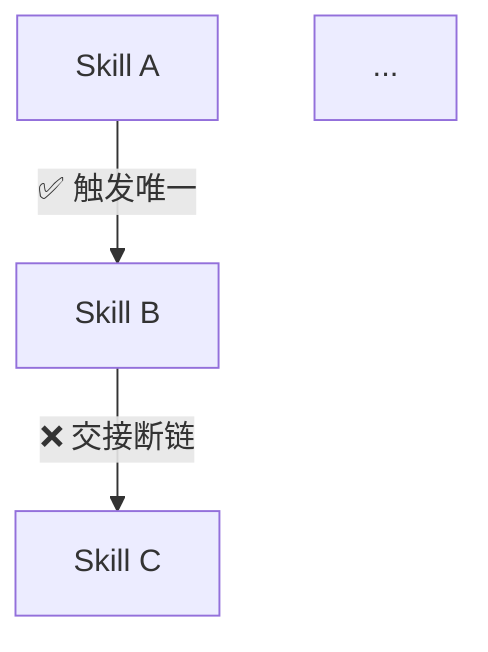

# 技能生态评审

## 概述

**目的**：回答"这套 skill + rule + memory 体系是否是一套能精密衔接、自洽运转的工作流"——不评审单个 skill 质量，评审整个**生态结构**的健康度：三层资产是否互相咬合、冗余是否有意且健康、每个资产定位是否清晰、触发链路是否闭环。

**功能**：五维度评估——四维静态（三层一致性/冗余健康度/资产定位/触发链闭环）+ 一维动态（工作流推演：模拟 agent 沿端到端链路走一遍，检查跨 skill 触发是否无歧义、交接是否顺畅、衔接是否准确）。每条结论标注证据状态（存在/被引用/命中/缺失/未观察），区分「为提高注意力的**有意冗余**」与「**有害重复/冲突**」，产出按优先级排序的改进建议。

**使用场景**：
- 用户说"评审技能生态"、"体检技能体系"、"ecosystem review"、"三层一致性检查"时
- 接手/重构本技能仓库，想先摸清三层资产的关系网时
- 新增/删除 skill、rule、memory 后，想确认是否破坏了体系闭环时

## 定位

```
评审请求 → ecosystem-review（本 skill）→ 五维评估（四维静态 + 工作流推演）→ 生态评审报告
                                            ↓
                    发现冗余健康问题 → 建议走 content-simplifier（单文件精简）
                    发现触发断裂  → 建议修 description（触发词）
                    发现职责重叠  → 建议合并/明确边界
                    发现沉淀冲突  → 建议走 loop-discovery 复核
                    推演发现断点   → 建议修相应 skill 触发/交接，或对单 skill 走 scenario-rehearsal
```

- **输入**：目标项目路径（默认当前工作区）
- **输出**：Markdown 生态评审报告（默认输出到对话；用户要求落盘时遵循 requirement-doc-store 规范）
- **边界**：不评审单个 skill 内部质量（scenario-rehearsal 的事）、不评审工作流机制是否被使用（harness-review 的事）、不精简单个文件（content-simplifier 的事）；评审对象是**三层资产的整体结构与相互关系**。2.5 工作流推演虽也用"推演"方法，但推演的是**跨 skill 协同交接**（A 的产出 B 能否消费），不是单 skill 内部指令是否完整

**与 harness-review 的关系**：harness-review 评审"AI 编码工作流机制是否存在、是否被用"（任务理解/受控执行/验证/交付/沉淀五维）；本 skill 评审"技能/规则/记忆体系本身是否自洽、无缝衔接"。前者看工作流**运转**，后者看资产**结构**。两者可接力：harness-review 发现"学习沉淀缺口"后用本 skill 审视沉淀资产（skill/rule/memory）是否健康。边界辨析：harness-review 的「受控执行」审"操作有无 skill 覆盖"（覆盖度），本 skill 的「触发链闭环」审"触发词能否命中真实 skill 并走完"（可达性）——一个问"有没有覆盖"，一个问"能不能接通"，不冲突。

**与 content-simplifier 的关系**：content-simplifier 精简**单个文件**的内容（删除文件内部冗余）；本 skill 评估**跨文件/跨层**的冗余是否健康、定位是否清晰。本 skill 发现的"某文件内部冗余过多"交给 content-simplifier 处理。

**与 scenario-rehearsal 的关系**：scenario-rehearsal（skill 模式）推演**单个** skill 的质量（触发准确性/指令完整性等 7 维）；本 skill 的 **2.5 工作流推演**复用其推演方法论（沿时间轴模拟、happy/异常/边界路径、全局回扣），但推演对象是**整套 skill 生态的协同工作流**（跨 skill 的触发、交接、衔接），而非单个 skill 内部。两者可接力：本 skill 推演发现"某交接点断链"，可建议对该 skill 单独走 scenario-rehearsal 深挖。

## 核心原则

1. **不是零冗余，是冗余健康**：冗余分两种——「为提高 AI 注意力的有意冗余」（如 memory 精炼复述 rule 要点，让触发时不漏）与「有害重复/冲突」（同一指令在多处矛盾、重复定义职责）。评审目标是甄别二者，不是消灭一切重复。
2. **配置/存在 ≠ 被引用 ≠ 有效**：每条结论必须标注证据状态。规则声明调用了某 skill，要核实该 skill 真实存在；memory 复述了某规则，要核实复述与原规则一致。
3. **未观察就说未观察**：拿不到引用证据的行为标 `未观察`，不脑补"体系是好的"或"体系是坏的"。
4. **发现必须可修复**：每条发现给出影响、最小修复动作（改哪个文件/加哪个引用/删哪段重复）和验证方式；纯粹的数量统计（"有 N 个 skill"）不构成发现。
5. **评审对象是关系，不是个体**：单个 skill 写得再好，若触发链断裂、与规则冲突、冗余有害，仍是体系问题。聚焦资产之间的连接质量。
6. **静态盘点 + 动态推演互补**：四维静态检查"资产是否到位、引用是否有效"，2.5 工作流推演检查"走一遍是否顺畅无歧义"。静态发现缺口，推演发现运转中的断点，两者缺一不可。
7. **推演是推理不是执行**：2.5 的推演结论一律表述为"推演通过（未实际执行）"，不得声称"已验证"；需要执行性证据时，提示走 e2e-testing / demo-verify 或实际跑一次任务。

## 证据状态阶梯

所有评审结论必须使用以下状态词标注：

| 状态 | 含义 | 能支撑的最强结论 |
|------|------|------------------|
| `存在` | 资产文件存在 | "有这个资产" |
| `被引用` | 有另一层资产（rule/memory/skill）明确指向它 | "它在体系中被接上" |
| `命中` | 规则/记忆的触发词能命中真实存在的 skill，且触发后能走完 | "它在体系中真正可达" |
| `缺失` | 检查过，确认需要的引用/资产不存在 | "这是断链" |
| `未观察` | 现有手段无法判断（如"AI 是否实际触发了某条 memory"） | 不下结论 |

**升级规则**：`存在`→`被引用` 需要找到真实引用路径；`被引用`→`命中` 需要触发词匹配到真实 skill 且能走通流程。

## 工作流

```
Step 0 环境检测 → Step 1 三层资产盘点 → Step 2 五维评估（2.1~2.4 静态 + 2.5 工作流推演）→ Step 3 生成报告
```

### Step 0：环境检测

- 确认目标目录结构（`skills/`、`rules/`、`memories/`、`agents/` 是否存在）。
- 若目标项目无 `memories/` 目录（该项目不用内置记忆），标注该层 `不适用`，其余层照常评估。
- ki-search 若是本项目的记忆检索工具，评估时把"ki 记忆"作为 `memories/` 之外的另一记忆源，考察两者与规则/技能的分工是否清晰（见 2.1「ki 记忆关系」）。

### Step 1：三层资产盘点

只做静态盘点，**不评估**，先建立资产清单：

| 资产层 | 盘点内容 |
|--------|----------|
| **skills/** | 目录清单 + 每个 skill 的 name + description（触发词） |
| **rules/** | 文件清单 + frontmatter（alwaysApply / description）+ 正文中引用的 skill/rule/memory 名 |
| **memories/** | 文件清单 + 内容提及的 rule/skill 名 + 语义复述了哪条规则的要点 |
| **agents/** | agent.md + agents/**/rules/*.md，与 memories/ 的对应关系 |

**关键**：盘点时**显式记录"有意冗余"模式**——哪些 memory 是某条 rule/skill 的精炼复述（如 `memories/writing-pipeline-rule.md` 复述 `rules/writing-pipeline.md`），哪些 memory 指向独立 skill（如 `memories/request-guard-trigger.md` 指向 `skills/request-guard`）。这是后续冗余健康度评估的基础。

### Step 2：五维评估

每个维度回答一个体系级问题，逐项给出证据状态 + 一句话结论。前四维（2.1~2.4）为**静态盘点**，第五维（2.5）为**动态推演**。

#### 2.1 三层一致性（skills ↔ rules ↔ memories ↔ agents）

**读者问题**：三层资产是否互相咬合、无断裂、无冲突？

| 检查项 | 检查内容 |
|--------|----------|
| 规则引用可达 | 每条规则（rules/）正文引用的 skill/rule/memory 是否真实存在？路径是否正确？ |
| 记忆指向有效 | 每条 memory 提及的 rule/skill 是否真实存在？语义复述是否与原文一致（未漂移、未曲解）？**注意**：与 2.2 的"有意冗余"判定对齐——精炼复述允许省略细节，但不允许歪曲或新增原文没有的约束。 |
| 记忆-规则对齐 | memory 复述 rule 时，是否保留了 rule 的核心约束？有无"memory 说 A、rule 说 B"的矛盾？ |
| ki 记忆关系 | 若用 ki-search：`memories/`（内置）与 ki 记忆（项目记忆检索）的分工是否清晰、无重复职责？（参考 `memories/memory-storage-strategy.md` 的分层约定） |
| 代理规则衔接 | agents/**/rules 与 memories/ 是否对齐（如 `task-delegation-trigger` memory ↔ `task-delegation` 规则）？ |

#### 2.2 冗余健康度（有意 vs 有害）

**读者问题**：冗余是"提高注意力"的有意设计，还是"有害重复/冲突"？

| 检查项 | 判定标准 |
|--------|----------|
| **有意冗余**（健康） | memory 对 rule/skill 做**精炼复述**（保留核心约束、去掉细节），目的是让触发时不漏读原规则 → ✅ 健康 |
| **漂移冗余**（有害） | memory 复述 rule 时**歪曲/遗漏/新增**了原文没有的约束 → 🔴 冲突，会误导执行 |
| **重复职责**（有害） | 两条 rule 或两个 skill 对同一场景给出**不一致**的指令 → 🔴 冲突，AI 无法判断听谁的 |
| **层级重复**（有害） | 同一内容在 memory + rule + skill 三处**等量重复**（非精炼，而是全量复制）→ 🟡 上下文浪费，宜收敛为 memory 精炼 + 原文单一来源。**若项目用 ki-search**，内置 memory + ki 记忆 + rule 三处等量重复同样有害（见 2.1「ki 记忆关系」） |
| **过时残留** | 资产引用已删除/改名/废弃的 skill/rule，或 memory 描述的机制已不存在 → 🔴 断链残留 |

**冗余健康判据**：精炼复述 + 单一事实来源 = 健康；全量复制 + 多处分歧 = 有害。评审应给出每条冗余的"健康度"判定，而非笼统说"有冗余"。**可操作判据**：判定"精炼复述"时，看两点——① 是否保留了原文核心约束（无歪曲/无新增）；② 篇幅是否明显短于原文（通常 < 50%）；两者都满足才判为"有意冗余（健康）"；只满足①但近乎全量复制，判"层级重复（有害）"。

#### 2.3 资产定位不重叠（职责边界）

**读者问题**：每个 skill/rule 的职责边界是否清晰，是否与已有资产重叠？

| 检查项 | 检查内容 |
|--------|----------|
| skill 边界 | 各 skill 的 description 职责是否互斥？有无"功能重叠但名字不同"的 skill 并存？ |
| description 精简度 | 各 skill 的 description 是否**保持精简**（点到为止、聚焦"做什么 + 何时触发"，不含冗余铺垫/与 AI 说明层重复的赘述）？过长的 description 会挤占上下文且稀释触发精准度。 |
| rule 边界 | 各规则适用范围是否清晰？有无两条规则对同一操作给出不同约定？ |
| 记忆定位 | 每条 memory 是否聚焦单一触发场景，而非把多个 rule 拼在一份里导致触发不精准？ |
| 与治理 skill 关系 | 本 skill 自身与 harness-review / content-simplifier / scenario-rehearsal / loop-discovery 的边界是否已声明、不冲突？ |

#### 2.4 触发链闭环（规则/记忆 → skill → 走完）

**读者问题**：每条规则/记忆的触发，能否命中真实 skill 并走完，而非停在半路？

| 检查项 | 检查内容 |
|--------|----------|
| 触发可达 | 规则的 description/触发词能否匹配到真实存在的 skill？skill 的 description 是否覆盖了规则期望触发的场景？ |
| 链路完整 | 规则触发后，是否给出了"走完"的路径（调哪个 skill、产出什么、交给谁）？有无"触发后无下文"的悬空？ |
| 接力明确 | 一个 skill 产出后，是否声明了下一个环节（谁消费它的输出）？整条链路（需求→设计→编码→审查→沉淀）是否闭合？ |
| 兜底完整 | 触发失败/未命中/环境缺失时，有无兜底路径（如"工具不可用则跳过"）？ |

#### 2.5 工作流推演（跨 skill 协同）

**读者问题**：模拟 agent 用这套 skill 跑一次端到端任务，流程是否**无歧义、顺畅、准确衔接**？

这是第五维**动态推演**：2.1~2.4 检查"资产是否到位、触发能否命中"（静态），本维模拟"真走一遍顺不顺"（动态）。静态可能全通过，但推演时发现 A 的输出 B 消费不了、触发词撞车、交接断链——这些只有沿时间轴走才知道。

**推演步骤**：

1. **选一条典型端到端链路**（基于该项目 skill 体系实际能覆盖的流程，如 需求挖掘→设计→编码→审查→沉淀；或从 README 设计流程图提取主链路）。
2. **声明全局判据**：这条链路整体成功 = 什么？哪些衔接点不可破坏？
3. **沿时间轴模拟**：在每个交接点检查——
   | 检查项 | 检查内容 |
   |--------|----------|
   | 触发无歧义 | 上一步产出/用户输入，能否**唯一命中**下一个 skill？有无多个 skill 抢同一触发、或都命不中导致停顿？ |
   | 交接可消费 | 上一步 skill 的产出（文档/结论/代码），下一步 skill 是否声明了会消费它？格式/内容能否对上？ |
   | 衔接闭环 | 每个交接点是否给出"下一步是谁"的指引？有无"产出后无人接"的断链？ |
   | 兜底可达 | 推演中触发失败/工具不可用/异常时，是否有兜底路径，流程不中断？ |
   | 全局回扣 | 局部每一步都顺，拼起来是否仍达成整体判据？有无局部对但整体断的隐患？ |
4. **路径可视化**：用 mermaid flowchart 标注每步 ✅/⚠️/❌，问题节点与问题汇总编号对应。

**推演方式**：happy path（正常走一遍）+ 异常路径（某步失败/触发撞车）+ 边界（某 skill 缺失/工具不可用）。**必须覆盖异常与边界**，只走 happy path 会漏掉"衔接断点"这一推演的核心价值。

**推演结论**：沿时间轴每步回扣全局判据；证据性质为"推演通过（未实际执行）"。

### Step 3：生成报告

```markdown
# 技能生态评审报告

> 项目：{路径} ｜ 评审时间：{日期} ｜ 模式：静态盘点 + 工作流推演（跨任务行为标注"未观察"）

## 五维总览

| 维度 | 最强证据状态 | 一句话结论 |
|------|-------------|-----------|
| 三层一致性 | .. | .. |
| 冗余健康度 | .. | .. |
| 资产定位不重叠 | .. | .. |
| 触发链闭环 | .. | .. |
| 工作流推演 | .. | .. |

## 检查项明细

### {维度名}
| 检查项 | 证据状态 | 证据 | 结论 |
|--------|----------|------|------|

## 冗余健康度清单

列出盘点到的冗余模式，逐条判定 有意/有害：

| 冗余点 | 类型 | 判定 | 说明 |
|--------|------|------|------|
| memories/writing-pipeline-rule ↔ rules/writing-pipeline | memory 复述 rule | ✅ 有意（精炼复述，提注意力） | 复述保留了"写完必须 auto-review"核心约束 |
| ... | ... | 🔴 有害 | 理由 |

## 工作流推演结果

> 推演结论均为"推演通过（未实际执行）"，非执行性证据。

推演链路：{如 需求挖掘 → 设计 → 编码 → 审查 → 沉淀}



| 交接点 | 触发无歧义 | 交接可消费 | 衔接闭环 | 兜底可达 | 结论 |
|--------|-----------|-----------|---------|---------|------|
| A → B | ✅ | ✅ | ✅ | ✅ | 通过 |
| B → C | ✅ | ❌ | 🟡 | ✅ | 断链：B 产出格式 C 未声明消费 |

## 发现与建议（按优先级）

### 🔴/🟡/🟢 F-{N}：{标题}
- **证据**：{检查到的具体事实，含文件路径}
- **影响**：{这个断链/冲突/重叠会导致什么}
- **修复**：{最小修复动作，指明归属（改哪个文件/加哪个引用/删哪段）}
- **验证**：{怎么确认修好了}

## 证据边界声明

以下内容本次无法观察，未纳入评估：{列出，如"AI 实际触发某条 memory 的频率"、跨会话效果}
```

**严重度**：🔴 体系核心路径断裂/冲突（误导执行）｜🟡 机制存在但冗余有害/定位模糊 ｜ 🟢 可选优化。

## 与相关 skill 的关系

| skill | 分工 |
|-------|------|
| harness-review | 评审工作流机制是否被用（本 skill 的前提是"资产已存在"）；本 skill 评审资产**结构是否自洽** |
| content-simplifier | 精简单文件内容；本 skill 发现"某文件内部冗余"后交给它，本 skill 聚焦跨文件/跨层冗余 |
| scenario-rehearsal（skill 模式） | 验证**单** skill 质量（7 维）；本 skill 的 2.5 工作流推演复用其方法论但验证**整套生态协同**（跨 skill 交接）。本 skill 推演发现"某交接点断链"后，可建议对该 skill 单独走 scenario-rehearsal 深挖 |
| loop-discovery | 沉淀入口守门；本 skill 发现"沉淀冲突/资产泛滥"后可建议复核 |
| expert-lookup / solution-lookup | 评审外部模块时按需查询；本 skill 评审的是本技能仓库自身，一般不涉及 |

## 反模式

- ❌ **把"有冗余"当问题**：未区分有意/有害就下"冗余过多"结论。必须先判定冗余类型（精炼复述=健康，全量复制/分歧=有害）。
- ❌ **把"存在"当"闭环"**："有 N 个 skill、M 条规则、K 条记忆"不是结论；"规则 X 引用了 skill Y，但 Y 已改名/删除"才是发现。
- ❌ **编造引用关系**：未实际 grep 就断言"这条 memory 复述了那条规则"必须标注证据，禁止凭印象。
- ❌ **发现不落地**：每条发现必须给出可执行的最小修复动作，不输出"建议加强体系一致性"式空话。
- ❌ **越界评审个体**：不评审单个 skill 写得好不好（那是 scenario-rehearsal），只评审资产之间的连接质量。
- ❌ **推演只走 happy path**：只模拟正常路径会漏掉"衔接断点"——推演的核心价值恰恰在异常路径（触发撞车、某步失败、工具不可用）下暴露的断链。
- ❌ **把推演当执行**：2.5 的结论是"推演通过（未实际执行）"，不得声称"已验证"；跨 skill 的真实触发行为标 `未观察`，需要执行性证据时提示走 e2e-testing 或实际跑一次。
- ❌ **推演与静态维度割裂**：2.5 必须建立在 2.1~2.4 的盘点结果之上（推演的链路从盘点出的真实 skill 构建，不凭空设想不存在的 skill）。
