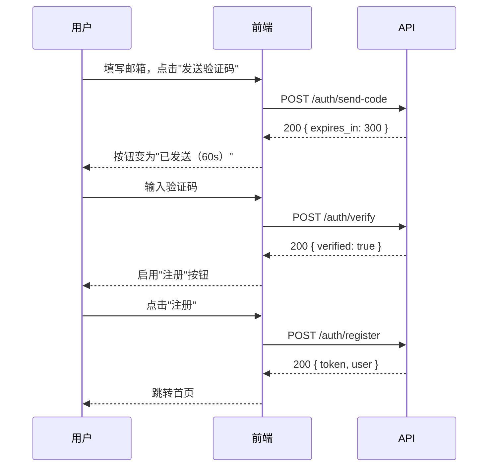

# 前端 API 集成指南参考文档

本文档提供完整的集成指南生成示例。

---

## 完整示例：用户注册功能

### 输入

**API 设计文档**（api-design 产出）：

| 接口 | 方法 | 路径 | 说明 |
|------|------|------|------|
| 用户注册 | POST | /auth/register | 创建新用户 |
| 发送验证码 | POST | /auth/send-code | 发送邮箱验证码 |
| 验证邮箱 | POST | /auth/verify | 验证邮箱验证码 |

**技术设计文档**（design-craft 产出）：
- 时序图：用户注册 → 发送验证码 → 验证邮箱 → 注册完成

### 阶段 1：输入解析

```text
📦 输入解析
━━━━━━━━━━━━━━━━

API 清单：
| # | 接口 | 方法 | 路径 |
|---|------|------|------|
| 1 | 发送验证码 | POST | /auth/send-code |
| 2 | 验证邮箱 | POST | /auth/verify |
| 3 | 用户注册 | POST | /auth/register |

业务场景：
- 用户注册流程（含邮箱验证）
```

### 阶段 2：场景提取

```text
📋 场景清单
━━━━━━━━━━━━━━━━

| # | 场景 | 角色 | 涉及 API 数 | 来源 |
|---|------|------|:---------:|------|
| 1 | 新用户注册 | 普通用户 | 3 | 时序图 §注册 |
| 2 | 重复注册 | 普通用户 | 2 | 设计 §异常处理 |
| 3 | 验证码过期重发 | 普通用户 | 2 | 设计 §异常处理 |

请确认场景是否完整。
```

### 阶段 3：调用序列

#### 场景 1：新用户注册

```text
🔄 调用序列：新用户注册
━━━━━━━━━━━━━━━━

【角色】普通用户
【触发条件】用户填写邮箱和密码，点击"注册"

【调用步骤】

步骤 1：用户填写邮箱，点击"发送验证码"
  → POST /auth/send-code
  → 触发时机：用户点击"发送验证码"按钮
  → 请求关键字段：{ email: string }
  → 响应关键字段：{ expires_in: 300 } → 倒计时 300 秒
  → 成功后：按钮变为"已发送（60s）"，开始倒计时
  → 失败时：
    - 429 TOO_MANY_REQUESTS → 提示"发送过于频繁，请稍后重试"
    - 409 DUPLICATE_EMAIL → 提示"该邮箱已注册，请直接登录"

步骤 2：用户输入验证码，前端验证
  → POST /auth/verify
  → 触发时机：用户输入 6 位验证码后自动提交
  → 请求关键字段：{ email: string, code: string }
  → 响应关键字段：{ verified: true } → 启用"注册"按钮
  → 成功后：启用注册按钮
  → 失败时：
    - 400 INVALID_CODE → 提示"验证码错误"，清空输入框
    - 410 CODE_EXPIRED → 提示"验证码已过期，请重新发送"

步骤 3：用户点击"注册"
  → POST /auth/register
  → 触发时机：用户点击"注册"按钮
  → 请求关键字段：{ email: string, password: string, name: string }
  → 响应关键字段：{ token: string, user: { id, name, email } }
  → 成功后：存储 token，跳转首页
  → 失败时：
    - 409 DUPLICATE_EMAIL → 提示"该邮箱已注册，请直接登录"
    - 400 WEAK_PASSWORD → 提示"密码需包含 8 位以上，含字母和数字"

【调用流程图】


```

#### 场景 2：重复注册

```text
🔄 调用序列：重复注册
━━━━━━━━━━━━━━━━

【角色】普通用户
【触发条件】用户使用已注册的邮箱尝试注册

【调用步骤】

步骤 1：用户填写已注册邮箱，点击"发送验证码"
  → POST /auth/send-code
  → 请求关键字段：{ email: "registered@example.com" }
  → 失败时：
    - 409 DUPLICATE_EMAIL → 提示"该邮箱已注册，请直接登录"
    - 提供"去登录"链接
```

### 阶段 4：UI 映射

```text
🎨 UI 映射：注册成功后首页
━━━━━━━━━━━━━━━━

【API】GET /user/profile

┌─────────────────────────────────────────┐
│  导航栏                                  │
│  ┌──────────────────────────────┐       │
│  │ Logo    [user.name]  [头像▼] │       │
│  │                  ↑       ↑   │       │
│  │         user.name  user.avatar│      │
│  └──────────────────────────────┘       │
│                                         │
│  欢迎回来，[user.name]！                  │
│  ↑                                      │
│  user.name（空状态："用户"）              │
│                                         │
│  ┌──────────────────────────────┐       │
│  │ 你的订单（0）                 │       │
│  │ [暂无订单，去逛逛 →]          │       │
│  └──────────────────────────────┘       │
└─────────────────────────────────────────┘
```

### 阶段 5：错误处理速查表

```text
⚠️ 错误处理速查表
━━━━━━━━━━━━━━━━

【通用错误处理】

| HTTP 状态码 | 前端行为 |
|:----------:|---------|
| 401 | 清除本地 token，跳转登录页 |
| 429 | 提示"操作过于频繁，请稍后重试" |
| 500 | 提示"服务器繁忙，请稍后重试" |

【业务错误处理】

| API | 业务错误码 | 前端行为 |
|-----|----------|---------|
| POST /auth/send-code | DUPLICATE_EMAIL | 提示"该邮箱已注册" + "去登录"链接 |
| POST /auth/send-code | TOO_MANY_REQUESTS | 按钮禁用 60 秒 + 提示"发送过于频繁" |
| POST /auth/verify | INVALID_CODE | 提示"验证码错误" + 清空输入框 |
| POST /auth/verify | CODE_EXPIRED | 提示"验证码已过期" + 显示"重新发送" |
| POST /auth/register | DUPLICATE_EMAIL | 提示"该邮箱已注册" + "去登录"链接 |
| POST /auth/register | WEAK_PASSWORD | 表单标红 + 提示密码要求 |
```

---

## UI 映射模式参考

### 模式 1：列表渲染

```text
| UI 区域 | 元素 | API 字段 | 数据处理 | 空状态 |
|---------|------|---------|---------|--------|
| 订单列表 | 订单号 | `data.orders[].order_no` | 直接显示 | "暂无订单" |
| 订单列表 | 金额 | `data.orders[].total_amount` | ¥{amount} | - |
| 订单列表 | 状态 | `data.orders[].status` | 枚举映射 | - |
```

### 模式 2：条件渲染

```text
| UI 条件 | 显示元素 | API 字段 |
|---------|---------|---------|
| `user.vip_level >= 2` | VIP 标识 | `user.vip_level` |
| `order.status === 'pending'` | "去支付"按钮 | `order.status` |
| `order.status === 'shipped'` | "确认收货"按钮 | `order.status` |
```

### 模式 3：表单回填

```text
| 表单字段 | API 字段 | 回填时机 | 可编辑 |
|---------|---------|---------|:------:|
| 邮箱 | `user.email` | 页面加载 | ❌ |
| 姓名 | `user.name` | 页面加载 | ✅ |
| 手机号 | `user.phone` | 页面加载 | ✅ |
```
