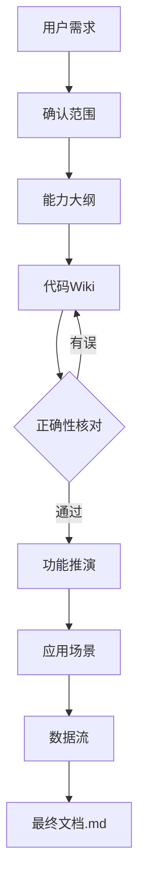

# Module Teach · 示例

> 仅展示格式与风格，内容为示意，不代表真实模块。假设目标模块为 `skills/module-teach`（即本技能自身）。

## 示例 1：Phase 2 代码 Wiki 片段

```markdown
# 代码 Wiki：module-teach

**本文引用的文件**
- [技能主文件](file://skills/module-teach/SKILL.md)
- [模板](file://skills/module-teach/reference.md)

## 目录
1. [项目结构](#项目结构)
2. [关键文件](#关键文件)
3. [依赖关系](#依赖关系)

## 项目结构
- `SKILL.md`：技能主指令（流程 + 落盘约定）
- `reference.md`：格式规范与 Mermaid / SVG 模板
- `examples.md`：阶段样例
章节来源：[目录](file://skills/module-teach)

## 关键文件
| 文件 | 职责 | 范围 |
| SKILL.md | 定义 8 阶段渐进流程 | [专用] |
| reference.md | code-to-wiki 格式 + 模板 | [通用] |
章节来源：[SKILL.md](file://skills/module-teach/SKILL.md#L1-L40)

## 依赖关系
- 依赖 create-skill 规范（产出格式）
- 无外部库依赖
章节来源：[SKILL.md](file://skills/module-teach/SKILL.md#L1-L5)
```

## 示例 2：Phase 3 正确性核对片段

```markdown
# 正确性核对：module-teach

## 核对清单

| 序号 | 前序结论 | 判定 | 代码来源 | 备注 |
|------|----------|------|----------|------|
| 1 | 产物落盘到 `.teach/{slug}/` | 已确认 | [SKILL.md](file://skills/module-teach/SKILL.md#L34-L44) | |
| 2 | 子模块产物直接写入 `.teach/{slug}/` 根目录 | 有误→已修正 | [SKILL.md](file://skills/module-teach/SKILL.md#L45-L48) | 实际在 `sub-modules/{sub-slug}/` 下 |
| 3 | 通用知识需引权威源 | 存疑 | — | 待用户确认是否强制外链 |

## 修正记录
- 结论"子模块产物直接写入根目录" → 修正为"写入 `sub-modules/{sub-slug}/`"，来源见上。
```

## 示例 3：最终 Markdown 文档片段（能力大纲 + 数据流）

````markdown
## 1. 能力大纲

本模块把"读懂陌生代码"结构化成一个渐进教学流程。**［专用］**

- 确认范围（通用 / 专用 / 两者）**［通用］** 概念讲解引用权威文档
- 8 阶段产出，末阶段汇总为 Markdown 最终文档

## 6. 数据流



图表来源：SKILL.md 工作流程章节
````

## 示例 4：Phase 8 知识点对齐完整交互

> 假设目标模块为 `order`，已有 `.teach/order/` 产物，用户说"考我一下"。

```markdown
# 知识点对齐（最新一轮）：order

> 轮次：round-02 ｜ 日期：2026-07-24 ｜ 正确率：3/4 = 75%

## Q1：订单从创建到完成经过的正确状态顺序是？ ［知识点：核心流程］

以下哪个状态流转顺序是正确的？

- A. 待支付 → 已支付 → 已发货 → 已完成（迷惑来源：混淆了"已支付"和"已发货"的先后，实际发货前需经过拣货）
- B. 待支付 → 已支付 → 拣货中 → 已发货 → 已完成
- C. 待支付 → 已发货 → 已支付 → 已完成（迷惑来源：把发货放在支付前，忽略了支付前置约束）
- D. 待支付 → 拣货中 → 已支付 → 已发货 → 已完成（迷惑来源：把拣货放在支付前，实际支付后才触发拣货）

**你的作答**：B ｜ ✅ 正确
**解析**：B 正确。支付成功后系统触发拣货流程，拣货完成后标记已发货。A 的迷惑点在于跳过了拣货环节；C 的迷惑点在于颠倒了支付与发货的依赖关系（[state.py](file://src/order/state.py#L10-L25)）；D 的迷惑点在于颠倒了支付与拣货的触发顺序。

## Q2：以下哪个不变量在任何情况下都必须成立？ ［知识点：不变量/业务规则］

- A. 订单金额可以为零（迷惑来源：部分促销场景金额为零，但这是折扣后金额，原价不为零）
- B. 已取消的订单可以被重新支付（迷惑来源：混淆了"取消"和"待支付"状态，取消后不可恢复）
- C. 库存扣减与订单状态变更必须在同一事务内完成
- D. 退款金额可以超过订单原价（迷惑来源：部分场景有补偿金，但系统层面不允许退款超额）

**你的作答**：A ｜ ❌ 错误（正确答案 C）
**解析**：C 正确。库存扣减与订单状态变更是强一致约束，必须同事务（[order_service.py](file://src/order/order_service.py#L45-L60)）。A 是常见混淆点——促销后金额为零是折扣结果，原价不变量仍成立；B 混淆了取消的不可逆性；D 混淆了业务补偿与系统约束。

## Q3（多选）：哪些操作会触发库存回补？ ［知识点：边界行为］

- A. 订单取消
- B. 退款完成
- C. 订单超时未支付自动关闭
- D. 订单状态从"已发货"改为"拣货中"（迷惑来源：状态回退在正常流程中不存在）

**你的作答**：A,C ｜ ❌ 错误（正确答案 A,B,C）
**解析**：A/B/C 均触发库存回补（[inventory.py](file://src/order/inventory.py#L20-L35)）。B 是易漏项——退款完成同样需要回补库存，不仅是取消。D 是干扰项，正常流程中状态不可回退。

## Q4：订单超时自动关闭的默认超时时间是多久？ ［知识点：配置约定］

- A. 15 分钟
- B. 30 分钟（迷惑来源：这是支付回调超时时间，不是订单关闭超时）
- C. 60 分钟
- D. 120 分钟（迷惑来源：这是大额订单的特殊超时，非默认值）

**你的作答**：C ｜ ✅ 正确
**解析**：C 正确。默认超时 60 分钟（[config.py](file://src/order/config.py#L8)）。B 的迷惑来源是支付回调超时配置（L12），D 的迷惑来源是大额订单特殊配置（L15）。

## 成绩单
- 正确率：3/4 = 75%
- 薄弱知识点：不变量/业务规则、边界行为
- 上一轮对比：round-01 正确率 50%（2/4）→ round-02 75%（3/4），正确率 +25%
- 错题收敛：round-01 错"核心流程""不变量"，本轮"不变量"仍错，"核心流程"已纠正
```

## 示例 5：评审模式附加内容（潜在问题清单片段）

```markdown
## 7. 潜在问题清单与改进建议

### 安全性

- 输入校验：订单创建接口未校验金额为负数的场景，可能导致异常数据入库 **［专用］**
- 权限检查：退款接口仅校验登录态，未校验操作者是否为订单归属人 **［专用］**
- 注入风险：搜索接口直接拼接 SQL，存在 SQL 注入风险 **［通用］**

### 性能

- 热点路径：订单列表查询未分页，全量加载可能导致 OOM
- N+1 查询：订单详情页逐条查询商品信息，应改为批量查询
- 内存泄漏风险：事件监听器未在订单关闭时移除，长期运行可能泄漏

### 可维护性

- 命名清晰度：`process_order` 函数名过于模糊，实际包含支付+发货+通知三个职责
- 单一职责：`OrderService` 类承担了 12 个职责，建议拆分
- 魔法数字：超时时间 `3600` 硬编码在业务逻辑中，应提取为常量

### 可测试性

- 是否可独立测试：`OrderService` 直接 `new` 了数据库连接，无法 mock
- 依赖是否可 mock：时间获取使用 `datetime.now()` 而非注入时钟，难以测试时间相关逻辑
- 边界条件覆盖：缺少库存为零、并发下单等边界场景的测试用例
```

## 示例 6：改造模式附加内容（改造风险点片段）

```markdown
## 7. 改造风险点与建议切入点

### 高风险区

- 订单状态机（`state.py` L10-L40）：状态流转逻辑被 3 个模块引用，改动需同步修改所有调用方
- 事务边界（`order_service.py` L45-L60）：库存扣减+状态变更在同一事务，拆分可能导致数据不一致

### 中风险区

- 通知模块（`notify.py`）：改通知渠道不影响核心流程，但需确保接口契约不变
- 日志格式化（`logger.py`）：可安全调整格式，但不应改变日志级别语义

### 安全重构区

- 工具函数（`utils.py`）：纯函数无副作用，可自由重构
- 常量定义（`constants.py`）：重命名、提取不影响逻辑
- DTO 转换（`mapper.py`）：仅做数据映射，可优化但不影响业务

### 建议切入点

1. 先从安全重构区入手（utils → constants → mapper），建立测试基线
2. 再处理中风险区（notify → logger），确保接口契约不变
3. 最后才动高风险区（state → transaction），需完整的回归测试覆盖
```
