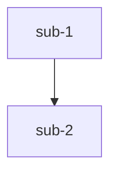
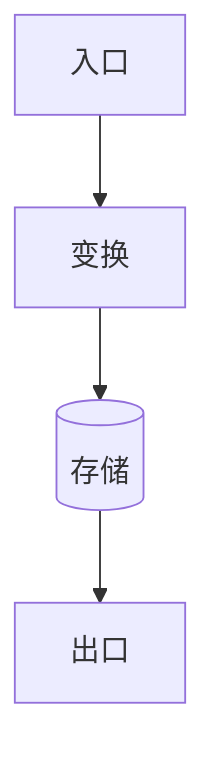

# Module Teach · 参考规范与模板

> 本文件供 `module-teach` 技能在产出各阶段文档时查阅。主流程见 `SKILL.md`。

## 1. 通用格式规范（对齐 code-to-wiki）

所有 `.md` 阶段产物**必须**遵守：

- 顶部 `**本文引用的文件**` cite 块，列出本篇真正用到的源文件，`[名称](file://相对仓库根目录的路径)`，**无需行号**
- `## 目录` 条目与 `##` 章节一一对应，锚点用中文（如 `[核心组件](#核心组件)`）
- 每个 `##`/`###` 小节末尾有 `章节来源`：`[名称](file://相对路径#Lx-Ly)`，**必须带 `file://` 与行号区间**（纯概念节可豁免）
- 任何 Mermaid 图后紧跟 `图表来源`（同章节来源格式）
- 所有引用路径均 `file://` 前缀
- 来源行号区间须覆盖被论述代码实际跨度，`Lx-Lx` 单点不合规
- 不逐行转储代码，提炼模式与要点
- 无内容的章节标注「该模块无此项」，不留空、不编造
- 每个讲解点按 Phase 0 范围标注 `[通用]` 或 `[专用]`

## 2. 知识范围标注约定

| 标签 | 含义 | 讲解重点 |
|------|------|----------|
| `[通用]` | 跨项目通用的知识（语言特性、框架、算法、设计模式、协议等） | 简明讲清概念，引用权威外部文档（官方文档 / 经典书籍章节） |
| `[专用]` | 仅在本项目 / 本模块成立的知识（业务规则、状态机、约定、模块耦合） | 说明它在本项目为何这样设计、与其它模块的关系 |

通用知识引用示例（放章节内或章节来源处）：
> 本节涉及 `[通用]` 知识：Python 描述符协议，详见 [官方文档 descriptor howto](https://docs.python.org/3/howto/descriptor.html)。

## 3. 各阶段文档骨架

### 00-能力大纲.md
```markdown
# 能力大纲：{模块名}

**本文引用的文件**
- [模块根](file://{root})
- [入口](file://{root}/main.py)

## 范围确认
- 目标模块：{root}
- 知识范围：通用 / 专用 / 两者都含（默认：两者都含）
- 学习目标：读懂（默认） / 改造 / 评审
- 输出格式：HTML（默认） / Markdown

## 目录
1. [职责边界](#职责边界)
2. [公开能力清单](#公开能力清单)
3. [关键抽象](#关键抽象)
4. [子模块划分](#子模块划分)

## 职责边界
{做什么、不做什么}
章节来源：[README](file://{root}/README.md#L1-L20)

## 公开能力清单
| 能力 | 入口 | 一句话职责 | 范围 |
| 创建X | [x.py](file://{root}/x.py#L10-L40) | {...} | [专用] |
章节来源：[x.py](file://{root}/x.py#L10-L40)

## 关键抽象
{核心类 / 函数 / 类型及其角色}
章节来源：[core.py](file://{root}/core.py#L1-L60)

## 子模块划分
{目录树 + 各子模块职责，标注路径}
章节来源：[目录](file://{root})
```

### 01-代码wiki.md
```markdown
# 代码 Wiki：{模块名}

**本文引用的文件**
- [核心实现](file://{root}/core.py)
- [依赖声明](file://{root}/pyproject.toml)

## 目录
1. [项目结构](#项目结构)
2. [关键类与函数](#关键类与函数)
3. [依赖关系](#依赖关系)
4. [设计模式与不变量](#设计模式与不变量)

## 项目结构
{目录树 + 各子模块职责}
章节来源：[目录](file://{root})

## 关键类与函数
| 名称 | 路径 | 职责 | 范围 |
章节来源：[core.py](file://{root}/core.py#L5-L90)

## 依赖关系
{内部 / 外部依赖 + 被依赖方，标注文件}
章节来源：[pyproject.toml](file://{root}/pyproject.toml#L1-L20)

## 设计模式与不变量
{所用模式 / 关键约束}
章节来源：[core.py](file://{root}/core.py#L1-L60)
```

### 02-正确性核对.md（质量闸门）
```markdown
# 正确性核对：{模块名}

> 本阶段回读代码，校验 Phase 1–2 结论。存在「有误」须先修正前序文件再继续。

## 核对清单

| 序号 | 前序结论 | 判定 | 代码来源 | 备注 |
|------|----------|------|----------|------|
| 1 | {...} | 已确认 | [x.py](file://{root}/x.py#L10-L40) | |
| 2 | {...} | 有误→已修正 | [y.py](file://{root}/y.py#L20-L55) | 原结论 A，修正为 B |
| 3 | {...} | 存疑 | — | 待用户确认 |

## 修正记录
- 结论 X（来自 00-能力大纲.md）→ 修正为 Y，来源 [y.py](file://{root}/y.py#L20-L55)

## 级联检查记录
- [ ] 检查 01-代码wiki.md 是否引用了被修正的结论 → {结果}
- [ ] 检查后续文件是否引用了被修正的结论 → {结果}
```

### Phase 0.5 分批拆分方案（大模块时插入 00-能力大纲.md 顶部）

```markdown
## 分批拆分方案

> 模块文件数：{N}（> 20），采用分批讲解。

| 子模块 | 包含文件 | 一句话职责 |
|--------|---------|-----------|
| {sub-1} | {file_a.py, file_b.py} | {...} |
| {sub-2} | {file_c.py, file_d.py} | {...} |

**子模块间依赖关系**：

图表来源：[目录](file://{root})
```

### Phase 8 理解检查（07-理解检查.md）

```markdown
# 理解检查：{模块名}

> 学习目标：{读懂/改造/评审}

## Q1：{核心流程题}
{题目描述，如"请画出数据从入口到出口的主要路径"}

**你的回答**：
> 请在此作答

<details>
<summary>参考答案</summary>
{正确答案}
</details>

## Q2：{关键约束题}
{题目描述，如"指出该模块的 2–3 个不变量或业务规则"}

**你的回答**：
> 请在此作答

<details>
<summary>参考答案</summary>
{正确答案}
</details>

## Q3：{目标追加题}
{根据学习目标生成，如改造目标→"指出改动风险最高的部分"，评审目标→"指出潜在 bug"}

**你的回答**：
> 请在此作答

<details>
<summary>参考答案</summary>
{正确答案}
</details>
```

### 03-功能推演.md
```markdown
# 功能推演：{模块名}

**本文引用的文件**
- [核心流程](file://{root}/core.py)

## 目录
1. [正常路径](#正常路径)
2. [边界与异常](#边界与异常)
3. [设计意图](#设计意图)

## 正常路径

图表来源：[core.py](file://{root}/core.py#L30-L90)

## 边界与异常
{异常路径 / 隐式行为 / 副作用}
章节来源：[core.py](file://{root}/core.py#L90-L140)

## 设计意图
{为什么这样写}
章节来源：[core.py](file://{root}/core.py#L1-L30)
```

### 04-应用场景.md
```markdown
# 应用场景与待解决问题：{模块名}

## 适用场景
- 场景 A：{...}
- 场景 B：{...}

## 不适用场景
- {何时不该用它}

## 解决的核心问题
{它解决什么痛点}

## 待解决问题 / 风险
- {已知局限 / 技术债 / 潜在 bug / 扩展点}
章节来源：[legacy.py](file://{root}/legacy.py#L1-L20)
```

### 05-数据流.md
```markdown
# 数据流分析：{模块名}

**本文引用的文件**
- [入口](file://{root}/controller.py)
- [消费](file://{root}/consumer.py)

## 目录
1. [数据生命周期](#数据生命周期)
2. [状态流转](#状态流转)
3. [异步流](#异步流)

## 数据生命周期

图表来源：[controller.py](file://{root}/controller.py#L20-L70)

## 状态流转
```mermaid
stateDiagram-v2
  [*] --> 待处理
  待处理 --> 处理中 --> 完成
```
图表来源：[state.py](file://{root}/state.py#L1-L40)

## 异步流
{队列 / 定时 / 回调 + 文件}
章节来源：[consumer.py](file://{root}/consumer.py#L1-L50)
```

## 4. 最终 HTML 文档模板（06-最终文档.html）

复制此骨架，把各阶段内容填入对应 section，保留 Mermaid 渲染所需脚本。

```html
<!DOCTYPE html>
<html lang="zh-CN">
<head>
<meta charset="utf-8">
<title>{模块名} · 模块讲解</title>
<script src="https://cdn.jsdelivr.net/npm/mermaid@10/dist/mermaid.min.js"></script>
<script>mermaid.initialize({ startOnLoad: true, theme: "default" });</script>
<style>
  :root { --fg:#1a1a1a; --muted:#666; --accent:#2563eb; --bg:#fff; --code:#f6f8fa; }
  body { font:16px/1.7 -apple-system,"Segoe UI",Roboto,"PingFang SC","Microsoft YaHei",sans-serif;
         color:var(--fg); max-width:860px; margin:auto; padding:48px 24px; background:var(--bg); }
  h1 { font-size:30px; border-bottom:3px solid var(--accent); padding-bottom:8px; }
  h2 { font-size:22px; margin-top:40px; color:var(--accent); }
  h3 { font-size:18px; }
  a { color:var(--accent); text-decoration:none; }
  code { background:var(--code); padding:2px 6px; border-radius:4px; font-size:14px; }
  pre { background:var(--code); padding:16px; border-radius:8px; overflow:auto; }
  .tag { display:inline-block; font-size:12px; padding:1px 8px; border-radius:10px; margin-left:6px; }
  .tag.general { background:#e0f2fe; color:#0369a1; }
  .tag.specific { background:#fef3c7; color:#92400e; }
  .callout { border-left:4px solid var(--accent); background:#f0f7ff; padding:12px 16px; margin:16px 0; border-radius:0 8px 8px 0; }
  details { border:1px solid #e5e7eb; border-radius:8px; padding:8px 16px; margin:16px 0; }
  summary { cursor:pointer; font-weight:600; }
  nav.toc { background:#f8fafc; border:1px solid #e5e7eb; border-radius:8px; padding:16px 24px; }
  nav.toc a { display:block; margin:4px 0; }
</style>
</head>
<body>

<h1>{模块名} · 模块讲解</h1>

<nav class="toc">
  <strong>目录</strong>
  <a href="#outline">1. 能力大纲</a>
  <a href="#wiki">2. 代码 Wiki</a>
  <a href="#verify">3. 正确性核对</a>
  <a href="#function">4. 功能推演</a>
  <a href="#scenario">5. 应用场景</a>
  <a href="#dataflow">6. 数据流</a>
  <!-- 仅改造或评审模式显示 -->
  <a href="#rework" style="display:none">7. 改造风险点</a>  <!-- 改造模式 -->
  <a href="#review" style="display:none">7. 潜在问题清单</a>  <!-- 评审模式 -->
  <a href="#check" style="display:none">8. 理解检查</a>  <!-- 可选 -->
</nav>

<h2 id="outline">1. 能力大纲</h2>
<!-- 来自 00-能力大纲.md，提炼要点 -->

<h2 id="wiki">2. 代码 Wiki</h2>
<!-- 来自 01-代码wiki.md -->
<div class="callout">提示：本模块对外职责是 <code>...</code>。</div>

<h2 id="verify">3. 正确性核对</h2>
<!-- 来自 02-正确性核对.md，列核对结论；如有修正务必写明 -->

<h2 id="function">4. 功能推演</h2>
<!-- 来自 03-功能推演.md -->
<pre class="mermaid">
flowchart LR
  R[请求] --> V[校验] --> B[业务] --> S[落库]
</pre>

<h2 id="scenario">5. 应用场景</h2>
<!-- 来自 04-应用场景.md -->
<details>
  <summary>何时不该使用本模块？</summary>
  <p>...</p>
</details>

<h2 id="dataflow">6. 数据流</h2>
<!-- 来自 05-数据流.md -->
<pre class="mermaid">
flowchart TD
  In[入口] --> T1[变换] --> Store[(存储)] --> Out[出口]
</pre>

<!-- ===== 以下为可选区段，按学习目标显示 ===== -->

<!-- 改造模式：追加本节 -->
<h2 id="rework">7. 改造风险点与建议切入点</h2>
<!-- 来自 Phase 7 改造附加内容 -->
<h3>高风险区</h3>
<ul><li>...</li></ul>
<h3>中风险区</h3>
<ul><li>...</li></ul>
<h3>安全重构区</h3>
<ul><li>...</li></ul>
<h3>建议切入点</h3>
<ol><li>...</li></ol>

<!-- 评审模式：追加本节 -->
<h2 id="review">7. 潜在问题清单与改进建议</h2>
<!-- 来自 Phase 7 评审附加内容 -->
<h3>安全性</h3>
<ul><li>...</li></ul>
<h3>性能</h3>
<ul><li>...</li></ul>
<h3>可维护性</h3>
<ul><li>...</li></ul>
<h3>可测试性</h3>
<ul><li>...</li></ul>

</body>
</html>
```

> Mermaid 走 CDN，本地用浏览器打开即可渲染；若离线环境，将 `mermaid.min.js` 下载到 `.teach/{module-slug}/assets/` 并改 `<script src>` 为本地路径。

## 5. 常用 Mermaid 图类型速查

| 类型 | 关键字 | 用途 |
|------|--------|------|
| 流程图 | `flowchart TD/LR` | 流程、数据生命周期 |
| 时序图 | `sequenceDiagram` | 模块间调用顺序 |
| 状态图 | `stateDiagram-v2` | 状态机 / 状态流转 |
| 类图 | `classDiagram` | 类关系 |
| 架构图 | `graph TD` | 组件依赖 |

每图后必须紧跟 `图表来源：[文件](file://相对路径#Lx-Ly)`（写在 HTML 中可用注释 `<!-- 图表来源：... -->` 或文字说明）。
