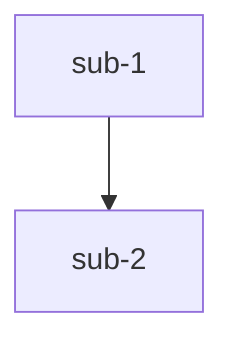
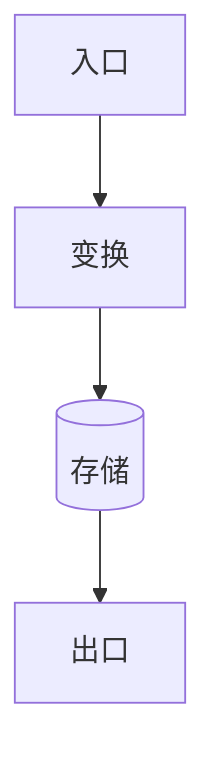

# Module Teach · 参考规范与模板

> 本文件供 `module-teach` 技能在产出各阶段文档时查阅。主流程见 `SKILL.md`。

## 1. 通用格式规范（对齐 code-to-wiki）

所有 `.md` 阶段产物**必须**遵守：

- 顶部 `**本文引用的文件**` cite 块，列出本篇真正用到的源文件，`[名称](file://相对仓库根目录的路径)`，**无需行号**
- `## 目录` 条目与 `##` 章节一一对应，锚点用中文（如 `[核心组件](#核心组件)`）
- 每个 `##`/`###` 小节末尾有 `章节来源`：`[名称](file://相对路径#Lx-Ly)`，**必须带 `file://` 与行号区间**（纯概念节可豁免）
- 任何 Mermaid 图后紧跟 `图表来源`（同章节来源格式）
- 所有引用路径均 `file://` 前缀
- 来源行号区间须覆盖被论述代码实际跨度，`Lx-Lx` 单点不合规
- 不逐行转储代码，提炼模式与要点
- 无内容的章节标注「该模块无此项」，不留空、不编造
- 每个讲解点按 Phase 0 范围标注 `[通用]` 或 `[专用]`
- **图表配色**：Mermaid / SVG 图表背景禁用黑色或过深颜色，一律浅色背景（含白色）+ 深色文字；深色仅用于元素强调（其上文字用浅色）。Mermaid 保持默认浅色主题（`theme: "default"`）

## 2. 知识范围标注约定

| 标签 | 含义 | 讲解重点 |
|------|------|----------|
| `[通用]` | 跨项目通用的知识（语言特性、框架、算法、设计模式、协议等） | 简明讲清概念，引用权威外部文档（官方文档 / 经典书籍章节） |
| `[专用]` | 仅在本项目 / 本模块成立的知识（业务规则、状态机、约定、模块耦合） | 说明它在本项目为何这样设计、与其它模块的关系 |

通用知识引用示例（放章节内或章节来源处）：
> 本节涉及 `[通用]` 知识：Python 描述符协议，详见 [官方文档 descriptor howto](https://docs.python.org/3/howto/descriptor.html)。

## 3. 各阶段文档骨架

### 00-能力大纲.md
```markdown
# 能力大纲：{模块名}

**本文引用的文件**
- [模块根](file://{root})
- [入口](file://{root}/main.py)

## 范围确认
- 目标模块：{root}
- 知识范围：通用 / 专用 / 两者都含（默认：两者都含）
- 学习目标：读懂（默认） / 改造 / 评审

## 目录
1. [职责边界](#职责边界)
2. [公开能力清单](#公开能力清单)
3. [关键抽象](#关键抽象)
4. [子模块划分](#子模块划分)

## 职责边界
{做什么、不做什么}
章节来源：[README](file://{root}/README.md#L1-L20)

## 公开能力清单
| 能力 | 入口 | 一句话职责 | 范围 |
| 创建X | [x.py](file://{root}/x.py#L10-L40) | {...} | [专用] |
章节来源：[x.py](file://{root}/x.py#L10-L40)

## 关键抽象
{核心类 / 函数 / 类型及其角色}
章节来源：[core.py](file://{root}/core.py#L1-L60)

## 子模块划分
{目录树 + 各子模块职责，标注路径}
章节来源：[目录](file://{root})
```

### 01-代码wiki.md
```markdown
# 代码 Wiki：{模块名}

**本文引用的文件**
- [核心实现](file://{root}/core.py)
- [依赖声明](file://{root}/pyproject.toml)

## 目录
1. [项目结构](#项目结构)
2. [关键类与函数](#关键类与函数)
3. [依赖关系](#依赖关系)
4. [设计模式与不变量](#设计模式与不变量)

## 项目结构
{目录树 + 各子模块职责}
章节来源：[目录](file://{root})

## 关键类与函数
| 名称 | 路径 | 职责 | 范围 |
章节来源：[core.py](file://{root}/core.py#L5-L90)

## 依赖关系
{内部 / 外部依赖 + 被依赖方，标注文件}
章节来源：[pyproject.toml](file://{root}/pyproject.toml#L1-L20)

## 设计模式与不变量
{所用模式 / 关键约束}
章节来源：[core.py](file://{root}/core.py#L1-L60)
```

### 02-正确性核对.md（质量闸门）
```markdown
# 正确性核对：{模块名}

> 本阶段回读代码，校验 Phase 1–2 结论。存在「有误」须先修正前序文件再继续。

## 核对清单

| 序号 | 前序结论 | 判定 | 代码来源 | 备注 |
|------|----------|------|----------|------|
| 1 | {...} | 已确认 | [x.py](file://{root}/x.py#L10-L40) | |
| 2 | {...} | 有误→已修正 | [y.py](file://{root}/y.py#L20-L55) | 原结论 A，修正为 B |
| 3 | {...} | 存疑 | — | 待用户确认 |

## 修正记录
- 结论 X（来自 00-能力大纲.md）→ 修正为 Y，来源 [y.py](file://{root}/y.py#L20-L55)

## 级联检查记录
- [ ] 检查 01-代码wiki.md 是否引用了被修正的结论 → {结果}
- [ ] 检查后续文件是否引用了被修正的结论 → {结果}
```

### Phase 0.5 分批拆分方案（大模块时插入 00-能力大纲.md 顶部）

```markdown
## 分批拆分方案

> 模块文件数：{N}（> 20），采用分批讲解。

| 子模块 | 包含文件 | 一句话职责 |
|--------|---------|-----------|
| {sub-1} | {file_a.py, file_b.py} | {...} |
| {sub-2} | {file_c.py, file_d.py} | {...} |

**子模块间依赖关系**：

图表来源：[目录](file://{root})
```

### Phase 8 知识点对齐 · 选择题（07-知识点对齐.md + quiz-history/）

```markdown
# 知识点对齐（最新一轮）：{模块名}

> 轮次：round-NN ｜ 日期：{YYYY-MM-DD} ｜ 正确率：{x/y = z%}

## Q1：{核心流程题} ［知识点：核心流程］
{题干，如"数据 X 从入口到出口经过的正确顺序是？"}

- A. {干扰项，迷惑来源：与 Y 路径仅差一步}
- B. {正确答案}
- C. {干扰项，迷惑来源：混淆了同步/异步入口}
- D. {干扰项，迷惑来源：把缓存读当成了主流程}

**你的作答**：B ｜ ✅ 正确
**解析**：{为什么 B 对、A/C/D 为何是常见混淆点；引用 file://路径#Lx-Ly}

## Q2：{关键约束题} ［知识点：不变量/业务规则］
{题干，如"以下哪个不变量在任何情况下都必须成立？"}

- A. {干扰项，迷惑来源：近似但会在边界失效的规则}
- B. {干扰项}
- C. {正确答案}
- D. {干扰项}

**你的作答**：A ｜ ❌ 错误（正确答案 C）
**解析**：{讲清易混点为何容易错}

## 成绩单
- 正确率：1/2 = 50%
- 薄弱知识点：关键约束（不变量/业务规则）
- 上一轮对比：首轮（无历史）
```

`quiz-history/INDEX.md` 轮次索引（追加）：

```markdown
| 轮次 | 日期 | 正确率 | 错题知识点 |
|------|------|--------|------------|
| round-01 | 2026-07-22 | 50% | 关键约束 |
| round-02 | 2026-07-25 | 100% | — |
```

`quiz-history/round-NN.md` 保留完整题目 + 用户作答 + 知识点标签，供下一轮「先巩固错题、再补新题」使用。

### 03-功能推演.md
```markdown
# 功能推演：{模块名}

**本文引用的文件**
- [核心流程](file://{root}/core.py)

## 目录
1. [正常路径](#正常路径)
2. [边界与异常](#边界与异常)
3. [设计意图](#设计意图)

## 正常路径

图表来源：[core.py](file://{root}/core.py#L30-L90)

## 边界与异常
{异常路径 / 隐式行为 / 副作用}
章节来源：[core.py](file://{root}/core.py#L90-L140)

## 设计意图
{为什么这样写}
章节来源：[core.py](file://{root}/core.py#L1-L30)
```

### 04-应用场景.md
```markdown
# 应用场景与待解决问题：{模块名}

## 适用场景
- 场景 A：{...}
- 场景 B：{...}

## 不适用场景
- {何时不该用它}

## 解决的核心问题
{它解决什么痛点}

## 待解决问题 / 风险
- {已知局限 / 技术债 / 潜在 bug / 扩展点}
章节来源：[legacy.py](file://{root}/legacy.py#L1-L20)
```

### 05-数据流.md
```markdown
# 数据流分析：{模块名}

**本文引用的文件**
- [入口](file://{root}/controller.py)
- [消费](file://{root}/consumer.py)

## 目录
1. [数据生命周期](#数据生命周期)
2. [状态流转](#状态流转)
3. [异步流](#异步流)

## 数据生命周期

图表来源：[controller.py](file://{root}/controller.py#L20-L70)

## 状态流转
```mermaid
stateDiagram-v2
  [*] --> 待处理
  待处理 --> 处理中 --> 完成
```
图表来源：[state.py](file://{root}/state.py#L1-L40)

## 异步流
{队列 / 定时 / 回调 + 文件}
章节来源：[consumer.py](file://{root}/consumer.py#L1-L50)
```

## 4. 最终文档 Markdown 模板（06-最终文档.md）

复制此骨架，把各阶段内容填入对应章节，Mermaid 以代码块内嵌、复杂图以 SVG 文件引用。

````markdown
# {模块名} · 模块讲解

## 目录
1. [能力大纲](#能力大纲)
2. [代码 Wiki](#代码-wiki)
3. [正确性核对](#正确性核对)
4. [功能推演](#功能推演)
5. [应用场景](#应用场景)
6. [数据流](#数据流)
<!-- 仅改造或评审模式追加：7. 改造风险点 / 7. 潜在问题清单 -->

## 1. 能力大纲
<!-- 来自 00-能力大纲.md，提炼要点 -->
> 提示：本模块对外职责是 `...`。

## 2. 代码 Wiki
<!-- 来自 01-代码wiki.md -->

## 3. 正确性核对
<!-- 来自 02-正确性核对.md，列核对结论；如有修正务必写明 -->

## 4. 功能推演
<!-- 来自 03-功能推演.md -->

图表来源：[core.py](file://{root}/core.py#L30-L90)

## 5. 应用场景
<!-- 来自 04-应用场景.md -->

## 6. 数据流
<!-- 来自 05-数据流.md -->

图表来源：[controller.py](file://{root}/controller.py#L20-L70)

<!-- ===== 以下为可选区段，按学习目标追加 ===== -->

## 7. 改造风险点与建议切入点   <!-- 改造模式 -->
## 7. 潜在问题清单与改进建议   <!-- 评审模式 -->
````

> Mermaid 以代码块嵌入，GitHub 或支持 Mermaid 的 Markdown 阅读器可直接渲染；复杂图（结构 / 过程 / 对比类）用独立 SVG 文件，入 `.teach/{module-slug}/assets/` 并以 `` 引用，选型规则见下节 SVG 图表规范。

## 5. 常用 Mermaid 图类型速查

| 类型 | 关键字 | 用途 |
|------|--------|------|
| 流程图 | `flowchart TD/LR` | 流程、数据生命周期 |
| 时序图 | `sequenceDiagram` | 模块间调用顺序 |
| 状态图 | `stateDiagram-v2` | 状态机 / 状态流转 |
| 类图 | `classDiagram` | 类关系 |
| 架构图 | `graph TD` | 组件依赖 |

每图后必须紧跟 `图表来源：[文件](file://相对路径#Lx-Ly)`。

## 6. SVG 图表规范（复杂图双引擎）

> **SSOT 声明**：完整规范（选型决策因子、B 类信号细则、配色、命名、动画、AI 能力边界）以 [topic-teach reference.md「SVG 图表规范」](../topic-teach/reference.md) 为准，此处仅列模块讲解场景的执行要点；两处不一致时以 topic-teach 为准。

**选型**：默认 Mermaid；仅当出现以下任一触发信号才改用 SVG，不得因"更精美"随意替换简单图：

- **A 类：图形复杂度信号**——分支/回环密集、交叉连线多、需泳道/分区语义、扇入/扇出大、需精确位置/方向控制
- **B 类：教学认知难度信号**（"文字讲不清、学习者脑补累"的场景，不以复杂度为门槛）——数据结构内部结构（内存布局 / 节点关系）、算法执行过程（分步状态变化 / 递归栈展开）、抽象概念映射与分层架构（如中间件链 / 协议栈）、多概念对比分类、复杂度 / 趋势曲线等轻量数据可视化

**模块讲解高频 SVG 场景**：

| 场景 | SVG 表达形式 |
|------|--------------|
| 数据结构内部构造（如哈希表索引→桶→链表） | 具象化内部构造图（格子 / 框 / 箭头精确对齐） |
| 递归 / 算法执行过程 | 分步纵向状态快照，关键变化高亮 |
| 分层架构 / 复杂依赖拓扑 | 层级图 / 泳道拓扑 |
| 性能复杂度对比（O(n) vs O(n²)） | 轻量曲线图（坐标轴 + 曲线 + 关键点标注，单图数据点 ≤ 10、无交互） |

**产出形式**：独立 SVG 文件，写入 `.teach/{module-slug}/assets/`（子模块产物放 `.teach/{module-slug}/sub-modules/{sub-slug}/assets/`），文档以 `` 引用；不使用内联 `<svg>`（GitHub 会剥离）。
**命名**：kebab-case，`{图作用}-{图主题}.svg`（如 `order-state-flow.svg`）；禁用中文、空格、大写、无意义命名。
**配色**：与 Mermaid 通用——浅色背景 + 深色文字，深色仅用于元素强调（其上文字用浅色）。
