# 性能分析 · 参考细则

本文件是 `SKILL.md` 的渐进式展开层，承载九块内容：

1. [八层详细检查清单](#一八层详细检查清单)
2. [技术栈速查](#二技术栈速查)
3. [收益估算方法与示例](#三收益估算方法与示例)
4. [证据采集命令速查](#四证据采集命令速查)
5. [报告模板（三档位）](#五报告模板三档位)
6. [负载场景定义模板](#六负载场景定义模板)
7. [双样本差分分析](#七双样本差分分析)
8. [优化建议双路径（A 功能等价 / B 功能换性能）](#八优化建议双路径a-功能等价--b-功能换性能)
9. [报告图表规范（mermaid）](#九报告图表规范mermaid)

---

## 一、八层详细检查清单

每层给出：查什么 → 典型证据 → 常见根因 → 该层特有验证方法。扫描时逐层过，**只记录命中项**。

### 第 1 层：请求链路与调用拓扑

| 检查项 | 典型证据 | 常见根因 |
|--------|----------|----------|
| 串行调用能否并行 | trace 中多个无依赖的 span 首尾相接 | 编排层顺序写法，未用并发原语 |
| 同一数据重复调用 | 链路中同一接口 / 同一查询出现多次 | 缺上下文传递，各层各自取数 |
| 循环内远程调用 | 代码循环体内出现 DB / RPC / HTTP 调用 | 缺批量接口，按 id 逐个取 |
| 超时与重试放大 | 单次耗时 = 下游耗时 × 重试次数 | 重试无退避、超时长于上游容忍 |
| 同步阻塞长任务 | 请求线程内执行批量 / 导出 / 对账 | 长任务未异步化 |
| 冗余跳数 | 网关 → BFF → 服务 A → 服务 B 多次转发 | 历史演进遗留的中转层 |

**验证方法**：APM trace 分段耗时对比；本地对可疑段做串行/并行 A-B 计时。

### 第 2 层：数据访问

| 检查项 | 典型证据 | 常见根因 |
|--------|----------|----------|
| 慢 SQL | 慢查询日志、`EXPLAIN` 显示全表扫描 | 缺索引 / 索引失效（函数包裹、隐式转换、前导模糊） |
| N+1 查询 | 一次请求内同构 SQL 执行 N 次 | ORM 懒加载、循环内查询 |
| 大结果集传输 | 单次查询返回行数/字节远超所需 | `SELECT *`、无分页、宽表 |
| 深分页 | `OFFSET` 很大 | 深翻页未用游标/延迟关联 |
| 连接池耗尽 | 等待连接耗时高、连接数打满 | 池大小不足或慢 SQL 占位 |
| 单条循环写入 | 循环内逐条 insert/update | 缺批量写入 |
| 事务范围过大 | 事务内含远程调用 / 大循环 | 锁持有时间长 |

**验证方法**：`EXPLAIN ANALYZE` 前后对比；统计单请求 SQL 条数与总耗时；连接池活跃数监控。

### 第 3 层：缓存

| 检查项 | 典型证据 | 常见根因 |
|--------|----------|----------|
| 命中率低 | 命中率指标 < 预期 | key 设计含高基数字段、TTL 过短 |
| 缓存了不该缓存的 | 命中率正常但耗时未降 | 缓存的是廉价计算，真正的热点没缓存 |
| 重复加载 / 击穿 | 同一 key 并发回源 | 无 singleflight / 空值缓存 |
| 雪崩 | 同时点大量 key 失效 | TTL 集中在同一时刻 |
| 大 key / 热 key | 单 key 过大或单分片打满 | 缓存粒度错、无分片 |

**验证方法**：命中率与回源次数对比；缓存前后 P95 对比（注意区分命中/未命中路径）。

### 第 4 层：外部依赖

| 检查项 | 典型证据 | 常见根因 |
|--------|----------|----------|
| 第三方 API 慢 | trace 中外部 span 占比高 | 供应商 RT 高、跨地域调用 |
| 无超时 / 无熔断 | 下游故障时本接口 RT 随之上天 | 缺超时与降级 |
| MQ 积压 | 生产/消费 lag 增长 | 消费者吞吐不足、批量过小 |
| DNS / 网络 / 磁盘 | 连接建立耗时长、IO wait 高 | 短连接未复用、磁盘瓶颈 |

**验证方法**：curl/wrk 直连下游测基线；对比"走依赖"与"mock 依赖"的接口耗时差。

### 第 5 层：并发与异步

| 检查项 | 典型证据 | 常见根因 |
|--------|----------|----------|
| 线程池 / 连接池配置不当 | 队列积压、拒绝、CPU 空闲但吞吐上不去 | 核心线程数过小 / 队列过大 |
| 锁竞争 | 线程 dump 大量 BLOCKED | 同步块范围过大、热点锁 |
| 阻塞调用混入异步 | 异步框架中调用同步阻塞 API | 阻塞操作占满事件循环 |
| 协程 / 线程泄漏 | 数量随时间单调增长 | 未关闭、未设超时 |
| 批量缺失 | 大量小任务逐条处理 | 未攒批 |

**验证方法**：线程 dump / goroutine dump 快照对比；逐步调并发测吞吐拐点。

### 第 6 层：CPU 与算法

| 检查项 | 典型证据 | 常见根因 |
|--------|----------|----------|
| 热点函数 | 火焰图顶部宽块 | 复杂度退化（嵌套循环、重复遍历） |
| 重复计算 | 同一函数在同一请求中被反复调用 | 缺记忆化 / 上下文复用 |
| 序列化开销 | 火焰图中 JSON/Protobuf 占比高 | 大对象反复序列化、滥用反射 |
| 正则回溯 | CPU 飙高且输入相关 | 灾难性正则 |
| 日志开销 | 日志格式化占比高 | 热路径打 DEBUG、字符串拼接 |

**验证方法**：profiling 前后对比；构造最坏输入测耗时曲线（判断是否复杂度问题）。

### 第 7 层：内存与 GC

| 检查项 | 典型证据 | 常见根因 |
|--------|----------|----------|
| 分配率过高 | GC 频率高、年轻代回收频繁 | 循环内建对象、装箱、临时集合 |
| 内存泄漏 | 堆占用单调增长不回落 | 静态集合、未注销监听、连接未释放 |
| 大对象 | 单次分配几十 MB 以上 | 全量加载后处理、大数组拷贝 |
| 堆外内存 | RSS 远大于堆 | 直接缓冲区、原生库 |
| Full GC 抖动 | 周期性 RT 尖刺 | 晋升失败、内存碎片 |

**验证方法**：GC 日志对比（次数/停顿）；堆转储前后对象直方图对比。

### 第 8 层：数据规模与容量

| 检查项 | 典型证据 | 常见根因 |
|--------|----------|----------|
| 数据量增长 | 慢查询随数据量线性恶化 | 未随规模调整索引/分页/归档 |
| 全量加载 | 启动时或每请求加载全量 | 缺增量与懒加载 |
| 峰值容量缺口 | 峰值时段 RT 陡增、错误率上升 | 无扩容/限流/削峰 |
| 批量大小不当 | 批量过大 OOM，过小往返多 | 未压测确定合适批量 |
| 热点数据倾斜 | 单分片/单实例压力高 | 分片键选择不当 |

**验证方法**：不同数据量梯度的耗时曲线；压测找吞吐拐点与饱和点。

### 第 9 层：前端页面性能（按需启用）

| 检查项 | 典型证据 | 常见根因 |
|--------|----------|----------|
| 首屏时间 | LCP / FCP 指标 | 关键资源阻塞、渲染路径长 |
| 包体积 | bundle 分析 | 未分包、依赖过大、未 tree-shake |
| 请求瀑布 | 串行请求链、请求数过多 | 资源未合并/预加载、接口瀑布依赖 |
| 渲染卡顿 | 长任务、重排重绘 | 大列表未虚拟滚动、频繁布局读写 |

**验证方法**：Lighthouse / Performance 面板前后对比；请求瀑布图分段计时。

---

## 二、技术栈速查

| 技术栈 | 高频瓶颈 | 首选证据工具 |
|--------|----------|--------------|
| Python | GIL 争用、ORM 懒加载 N+1、同步阻塞混入 async、pandas 全量加载 | `py-spy`、cProfile、`asyncio` debug |
| Java | 线程池配置、Full GC、MyBatis N+1、锁竞争、连接池 | `async-profiler`、JFR、jstack、Arthas |
| Go | goroutine 泄漏、channel 阻塞、内存分配率、defer 在热路径 | pprof（cpu/heap/goroutine）、trace |
| Node.js | 事件循环阻塞、同步 FS、Promise 串行化、内存泄漏 | `--cpu-prof`、clinic.js、heap snapshot |
| 数据库（MySQL/PG） | 索引失效、深分页、锁等待、连接池 | 慢查询日志、`EXPLAIN ANALYZE`、`pg_stat_statements` |
| Redis | 大 key、热 key、命中率、管道缺失 | `SLOWLOG`、`INFO stats`、命中率监控 |
| 网关 / Nginx | 连接数、TLS 握手、超时配置、缓冲 | access log 耗时字段、连接数监控 |

---

## 三、收益估算方法与示例

### 3.1 公式

- 占比 \(p\) = 该段耗时 / 端到端总耗时（必须来自实测；无实测给区间并标 🔴）
- 局部加速比 \(s\) = 优化前该段耗时 / 优化后该段耗时（取保守值）
- 整体加速上限 \(S = 1 / ((1-p) + p/s)\)
- 乐观上界（该段耗时趋零）：\(S_{max} = 1 / (1-p)\)，等价于端到端最多降低 \(p\)

> **硬约束**：任何优化项的端到端收益**不得超过 \(p\)**（该段占比）。这是防"吹牛"闸门。

### 3.2 示例

> 接口 P95 = 2000ms。APM 显示 DB 段 1400ms（\(p = 0.7\)），其中一条慢 SQL 占 1200ms。优化该 SQL 预计耗时降至 200ms，即 DB 段降至 400ms，\(s = 1400/400 = 3.5\)。
> \(S = 1 / ((1-0.7) + 0.7/3.5) = 1 / (0.3 + 0.2) = 2.0\) → P95 预期 2000 → 1000ms，**端到端降低 50%**；乐观上界 \(1/(1-0.7)=3.33\)（即最多降 70%）。
> 表述："该 SQL 优化预期将 P95 从 2000ms 降至约 1000ms（端到端收益上限 70%），实际以复测为准。"

### 3.3 无数据时的表述

- 给区间："DB 段占比**估计** 40%~70%（🔴 未实测），若按 50% 计，该优化端到端收益上限约 50%"
- 必须附"如何拿到 \(p\)"：采集方法 + 命令（见第四节）

---

## 四、证据采集命令速查

> 用途：S2 模式下为「待验证清单」配套给出可执行的采集方法。**本 skill 不执行压测**，下列命令供用户在合适环境执行。

| 目标 | 命令 / 方式 |
|------|-------------|
| Python CPU 火焰图 | `py-spy record -o flame.svg --pid <pid> --duration 30`；`py-spy top --pid <pid>` |
| Java CPU 火焰图 | `async-profiler`: `./profiler.sh -d 30 -f flame.html <pid>`；`jcmd <pid> JFR.start` |
| Go pprof | `go tool pprof http://host/debug/pprof/profile?seconds=30`；`go tool pprof -http=:0 cpu.pprof` |
| Node CPU profile | `node --cpu-prof app.js` → 用 Chrome DevTools 打开 `.cpuprofile` |
| Java 线程/锁 | `jstack <pid> > dump.txt`（间隔 5s 取 3 次对比 BLOCKED） |
| Go 协程 | `curl http://host/debug/pprof/goroutine?debug=2` |
| MySQL 慢查询 | 开启 slow log：`SET GLOBAL slow_query_log=ON; SET GLOBAL long_query_time=1;`；分析：`mysqldumpslow -s t -t 10` |
| SQL 执行计划 | `EXPLAIN ANALYZE <sql>`（PG/MySQL 8.0.18+） |
| PG 统计 | `SELECT * FROM pg_stat_statements ORDER BY total_exec_time DESC LIMIT 10;` |
| Redis 慢命令 | `SLOWLOG GET 20`；`INFO stats`（查 keyspace_hits/misses 算命中率） |
| 基线压测 | `wrk -t4 -c100 -d30s --latency <url>`；`k6 run script.js` |
| 系统资源 | `vmstat 1`、`iostat -x 1`、`pidstat -u -r -p <pid> 1` |

**采集三要素（写进验证计划）**：同负载、同数据量、同观测窗口。三者不齐的对比不成立。

---

## 五、报告模板（三档位）

### 5.1 👥 双读者档（默认）

```markdown
# 性能分析报告 — {接口/链路名}

> **读者档位**：👥 双读者档　**模式**：S1 证据驱动　**分析窗口**：{时间段 / 版本}　**负载场景**：{并发 / 数据量}

## 一、执行摘要

**现状**：{接口名} 在 {负载场景} 下 P95 = {X}ms，超出目标 {Y}ms {Z}%。

**主瓶颈**（按影响排序）：
1. {瓶颈 1，业务语言} —— 端到端影响约 {p1}%
2. {瓶颈 2} —— 约 {p2}%

**预期收益**：完成 P0 项后，预计 P95 降至约 {X'}ms（端到端上限 -{Zmax}%），{业务影响：如"高峰期超时率从 3% 降至 <0.5%"}。

**建议投入**：P0 {n} 项（约 {工作量}），P1 {n} 项。
**不做的后果**：{容量/体验/成本后果}。

## 二、性能画像

| 指标 | 现状 | 目标 / SLO | 基线 | 状态 |
|------|------|-----------|------|------|
| P50 / P95 / P99 |  |  |  |  |
| QPS / 并发 |  |  |  |  |
| CPU / 内存 / GC |  |  |  |  |
| 错误率 / 超时率 |  |  |  |  |

## 三、耗时构成

| 链路段 | 耗时 | 占比 | 数据来源 | 证据级 |
|--------|------|------|----------|--------|
|  |  |  |  | 🟢/🟡/🔴 |

## 四、主瓶颈与归因

### B-1 {瓶颈名}

- 📍 位置：`{文件:行号}` / `{接口}` / `{SQL}`
- 🔍 证据：{数据或代码事实}
- 🏷️ 证据级：🟢 实测 / 🟡 静态可证
- 🔗 根因：{为什么会出现}
- 📊 影响占比：p = {x}%
- 💡 方向：{改法概述}

## 五、优化建议（双路径）

### 五·A、功能等价的技术优化（不改产品行为）

| 优先级 | 优化项 | 对应瓶颈 | 改法（文件/参数/改成什么） | 预期收益（含上限） | 功能等价性说明 | 副作用与风险 | 落地成本 |
|--------|--------|----------|---------------------------|-------------------|----------------|--------------|----------|
| P0 |  | B-1 |  |  |  |  | 低/中/高 |

### 五·B、功能换性能（需产品决策）

| 退让点（用户可见能力） | 占端到端 p | 技术退让方式 | 预期收益（含上限） | PM 分析（价值/Kano/影响面/底线） | 决策状态 | 决策人 |
|----------------------|-----------|--------------|-------------------|--------------------------------|----------|--------|
|  |  |  |  |  | ✅/⚠️/❌ 或 ⚠️待产品确认 | 产品 |

> B 路径项的决策状态由 `product-manager` 给出；未做产品分析时一律标「⚠️ 待产品确认」，并在表下注明"本表未经产品分析，不作为决策依据"。B 项在拍板前不进 P0 落地计划。

## 六、待验证清单（🔴 假设）

| # | 假设 | 为什么这么猜 | 验证方法 | 验证后影响 |
|---|------|--------------|----------|------------|
| H-1 |  |  |  |  |

## 七、验证计划

| 验证项 | 方式 | 判据 | 前置条件 |
|--------|------|------|----------|
|  | 压测 / APM 对比 / EXPLAIN 对比 | P95 从 X 降至 ≤Y（同负载同数据量） |  |

## 附录

- 证据来源：{文件 / 命令 / 报告链接}
- 待补数据：{需要什么数据、怎么拿}
- 次要发现：{一行一项}
```

### 5.2 🧑‍💻 开发档

在双读者档基础上：

- 执行摘要**压缩为 3-5 行**（只保留现状 + 主瓶颈 + 收益）
- 第三、四、五章**全展开**：带代码位置、SQL 原文、配置值、前后对比代码
- 优化建议增加「改法」列：具体到改哪个文件、哪个参数、改成什么
- 五·B 只列退让点 + 技术收益 + PM 决策状态，产品论证压成一句（详细取舍留给 PM 报告）
- 验证计划保留完整命令与判据

### 5.3 📊 产品档

在双读者档基础上：

- **保留并强化**执行摘要：现状（业务语言）、主瓶颈（每条后附一句业务解释）、预期收益（用户体验/成本/容量）、投入与优先级、不做会怎样
- 第三、四章**移入附录「技术依据」**，正文只留"瓶颈是什么、影响多少"
- 五·A 只保留"做什么 + 收益 + 成本 + 风险"，不给代码级改法
- **五·B 是产品档的正文重点**：每个退让点写清"要让出什么用户价值、影响多少用户、PM 建议与否、底线在哪"，技术收益压成一行
- 验证计划只保留"验收判据"（如"高峰期 P95 ≤ 800ms"），不列命令

---

## 六、负载场景定义模板

分析开始前必须明确"在什么负载下慢"，否则结论不可复现。缺失时按"日常 + 峰值"两档默认：

| 场景 | 并发 | 数据量 | 时段 | 典型参数 | 观测指标 |
|------|------|--------|------|----------|----------|
| 日常 |  |  |  |  |  |
| 峰值 |  |  |  |  |  |
| 批量窗口 |  |  |  |  |  |

> 若三个场景的资源特征不同（如峰值是 DB 瓶颈、批量窗口是 CPU 瓶颈），报告中须**分场景**给结论，禁止混为一谈。

---

## 七、双样本差分分析

> 输入为"一快一慢"两份数据时使用。三步走：**变量对齐 → Δ 分解 → 排除 + 定位**。
> 对照样本的价值不止于"多一组数据"，而在于**它能证明哪些东西没罪**——这是单样本分析永远给不出的结论。

### 7.1 五种对照类型与取证路径

| 对照类型 | 理想情况下的唯一差异 | 差异命中后去哪取证 | 典型混淆变量 |
|----------|----------------------|--------------------|--------------|
| 环境对比（预发快 / 生产慢） | 环境 | 环境参数 diff（连接池、JVM/GC 参数、机器规格）、网络链路、生产数据量、限流配置 | 生产数据量通常也更大 → 变双变量 |
| 版本对比（v1.2 快 / v1.3 慢） | 代码版本 | 两版本 diff / PR；火焰图按函数对比 | 发布同期流量或数据量变化 |
| 时间对比（昨天快 / 今天慢） | 时间 | 数据量增长曲线、缓存命中率趋势、外部依赖耗时趋势、容量饱和指标 | 时段负载不同（白天 vs 凌晨） |
| 租户 / 参数对比（小客户快 / 大客户慢） | 数据规模 | 调用次数是否与数据量同阶放大（N+1）、深分页、全量加载、大结果集 | 大客户可能命中不同分支 / 不同套餐逻辑 |
| 请求对比（同接口不同入参） | 入参 | 索引命中与否、代码分支差异、结果集大小 | 不同入参走的是不同链路（本质是两套流程） |

> **归因确定性分级**（决定报告能写多硬）：版本对比 / 租户参数对比 = **高**（diff 可穷举、单变量可控）→ 允许强归因；请求对比 / 环境对比 = **中**（须先确认非两条链路 / 逐个核对配置）；时间对比 = **低**（只有相关性）→ **只能写"近期相关变化"，禁止写因果**。同是双样本，允许的结论强度不同，勿一刀切。

### 7.2 变量对齐模板（差分第一道闸门）

| 变量 | 慢样本 | 快样本 | 核对结果 | 核对方式 |
|------|--------|--------|----------|----------|
| 代码版本 | v1.3.0 | v1.3.0 | ✅ 已核对一致 | 发布记录比对 |
| 负载（并发 / QPS） | 100 并发 | 100 并发 | ✅ 已核对一致 | 压测脚本参数一致 |
| 数据量 / 租户规模 | 80w 行 | 80w 行 | ✅ 已核对一致 | `count(*)` 实测 |
| 环境配置 | 生产 4C8G | 预发 4C8G | ❌ 不一致 | 配置中心 diff（差异项：规格、连接池上限） |
| 观测窗口 | 10:00-11:00 高峰 | 02:00-03:00 低峰 | ❌ 不一致 | 监控时段对齐失败 |
| JIT / 连接池热态、后台任务 | ? | ? | ⚪ 未核对 | 无手段核对 → **必须列入未核对清单** |

> **⚪ 未核对 ≠ 一致**。填表时但凡"不知道"，一律记 ⚪，并在报告中列出未核对清单——否则所谓"单变量对照"是假的。

**样本代表性三问**（填完变量表先答这个，答不出就降级）：样本量同量级？同为 P95 口径（而非最好那次 vs 最差那次）？慢样本是随机取还是挑的最差案例？

**判定与处置**：

| 核对结果 | 结论 | 报告怎么写 |
|----------|------|------------|
| 仅 1 个 ❌，其余 ✅ | ✅ 差分**强可用** | "两组唯一差异为 `X`，故 Δ 集中段 `Y` 可归因于 `X`" |
| 仅 1 个 ❌，但存在 ⚪ | 🟡 差分**有条件可用** | "**在已核对变量范围内**唯一差异为 `X`；未核对项：`...`" |
| ≥2 个 ❌ | ⚠️ 多变量混淆，**不可归因** | "两组存在 N 个差异变量，**不可据此归因**"，给补齐单变量对照的做法；结论降级进「待验证清单」 |
| 代表性三问答不出 | ⚠️ 降级为**参考** | "样本不可比，Δ 仅作方向参考，**不作为收益计算依据**" |

> 多变量混淆时的**降级而非放弃**：仍可给出"嫌疑方向"（哪些层被数据支持、哪些被排除），但措辞必须是"若 X 成立则…"，不得写断定句。

### 7.3 Δ 分解：不止能比耗时

除分段耗时外，下列指标的差分往往更灵敏，能直接锁根因：

| 指标 | Δ 揭示什么 | 典型根因方向 |
|------|-----------|--------------|
| 调用次数（SQL / RPC / 缓存） | 调用是否放大 | 定位 N+1、重复调用、重试风暴 |
| SQL 扫描行数 / 返回行数 | 扫描是否放大 | 定位索引失效、全表扫描、缺失分页 |
| 分配率 / GC 次数 | 内存侧放大 | 定位循环内分配、大对象 |
| 火焰图函数占比 | 哪个函数变宽了 | 函数级差分（须同工具、同采样时长） |
| 缓存命中率 | 命中是否退化 | 定位 key 设计 / TTL 变更 |

**核心算式**（差分最有说服力的一步）：

\[
\Delta_{段} \approx \underbrace{\Delta N \times t}_{\text{调用次数变多}} + \underbrace{N \times \Delta t}_{\text{单次变慢}}
\]

用它区分两大根因族：

- **调用放大**（ΔN 主导）→ N+1、循环内远程调用、重复调用、重试放大
- **单次退化**（Δt 主导）→ 下游变慢、索引失效、数据量增长导致单次扫描变多、冷热数据差异

> 能把这个算式写进报告，开发对结论的信任度会有质的差别——它把"这里慢"变成了"慢是因为调用从 20 次变成 400 次"。

### 7.4 混淆陷阱清单

| 陷阱 | 现象 | 规避 |
|------|------|------|
| 多变量混淆 | 版本 + 数据量同时不同 | 见 7.2，先补单变量对照 |
| 平均值陷阱 | 均值相同但 P99 差 3 倍 | 一律用分位数（P95/P99）对比 |
| 样本量陷阱 | 快样本 3 次请求 vs 慢样本 3000 次 | 要求样本量同量级，否则 Δ 无统计意义 |
| 时段陷阱 | 一份取自高峰、一份取自低峰 | 对齐时段，或明确"负载不可比" |
| 冷启动陷阱 | 慢样本恰是发布后缓存未预热期 | 排除冷启动窗口，取稳定态数据 |
| 采样口径不同 | 火焰图采样时长 / 频率不同 | 占比不可直接比，须同口径重采 |

### 7.5 对比分析章节模板

```markdown
## 三·B、对比分析

**样本定义**
- 慢样本：`{接口 / 环境 / 租户}` @ `{负载与时窗}`
- 快样本：`{对照组}` @ `{负载与时窗}`
- 差异类型：环境 / 版本 / 时间 / 租户参数 / 入参

**变量对齐**

| 变量 | 慢样本 | 快样本 | 一致？ |
|------|--------|--------|--------|
| 代码版本 |  |  |  |
| 负载 |  |  |  |
| 数据量 |  |  |  |
| 环境配置 |  |  |  |
| 观测窗口 |  |  |  |

→ **结论**：✅ 单变量差异（`{变量}`），差分可用于归因 ／ ⚠️ 多变量混淆，差分不可用于归因

**Δ 分解**

| 链路段 | 快 | 慢 | Δ | Δ 占 Δ总 | 判定 |
|--------|----|----|----|----------|------|
|  |  |  |  |  | 主嫌疑 / 次要 / 已排除 |

**Δ 归因**：Δ 集中在 `{段}`，其中 `{ΔN × t / N × Δt}` 主导 → 指向 **{调用放大 / 单次退化}**，对应 `{具体根因}`。

**已排除**：`{段}` 两组相近（Δ 占比 <5%），经对照排除为本次变慢的原因。

**混淆警告**（≥2 个差异变量时必写）：两组同时存在 `{变量A}`、`{变量B}` 差异，本报告不将其作为单一归因依据；建议补齐单变量对照：`{具体做法}`。

**未核对项**：`{JIT 预热 / 连接池热态 / 后台任务等}`，本报告未核对，结论在已核对范围内成立。

**存量性能债**（两组都慢但 Δ 小的段，必写）：`{段}` 两组耗时分别为 `X`/`Y`，Δ 小故非本次差异来源，但绝对值偏高，属独立优化项。
```

---

## 八、优化建议双路径（A 功能等价 / B 功能换性能）

单路径建议有两种典型失败形态：只给技术优化 → 团队做完发现还差 40%，而"能不能砍功能"这个产品决策从来没人做；只说"可以砍功能" → 工程师替产品拍了板。所以**两条路都要摆出来，各自由正确的角色拍板**：A 由开发推进，B 由产品决策。

### 8.1 A 路径：功能等价性怎么证明

| 改法 | 等价性论证要点 | 容易偷偷改了产品行为的陷阱 |
|------|----------------|---------------------------|
| 批量替代循环单查 | 返回集合、顺序、去重语义一致 | 分页边界、重复 id 的处理变化 |
| 加索引 / 改 SQL | 结果集完全一致（用 `EXPLAIN` + 结果比对佐证） | 排序不稳定导致顺序变化 |
| 加缓存 | 命中与未命中返回内容一致 | **TTL 引入的数据新鲜度变化**——若产品承诺实时，此项转 B |
| 串行改并行 | 结果与聚合顺序一致 | 超时 / 部分失败的降级语义变化 |
| 消除重复调用 | 各次取值一致，去掉的是冗余 | 被去掉的那次其实带了副作用（如计数） |
| 连接池 / 线程池 / 超时调参 | 行为不变，只改资源上限 | 并发升高把压力转嫁到下游 |
| 预计算 / 物化 | 计算结果一致 | 新鲜度变化 → 若影响实时性承诺则转 B |

> 判据一句话：**用户在使用上能感知到的任何差异（看到什么、多快看到、看不看得全）都不是"功能等价"**。

### 8.2 B 路径：九种退让形态（技术侧弹药）

| 形态 | 技术做法 | 让出的是哪种产品属性 | 收益量级 | 必须交 PM 回答的问题 |
|------|----------|---------------------|----------|---------------------|
| 异步化 | 请求内执行 → 后台任务 / MQ | 即时性 | 高 | 用户能否接受"提交后稍后可见" |
| 降实时性 | 实时计算 → 准实时 / T+1 预计算 | 数据新鲜度 | 高 | 新鲜度底线是几分钟？哪些场景必须实时 |
| 降精度 | 精确计数 / 全量统计 → 近似（HLL、采样） | 数值精确性 | 中-高 | 哪些场景允许近似，误差上限多少 |
| 减少返回量 | 全量返回 → 分页 / 字段裁剪 | 一次看全的能力 | 中 | 用户是否真需要一次全量；导出场景怎么办 |
| 按需触发 | 默认加载 → 点击才加载 | 默认可得性 | 中 | 默认视图必须包含哪些信息 |
| 默认值关闭 | 高开销能力默认开 → 默认关 | 开箱即用 | 中-高 | 该能力是卖点还是负担 |
| 弱一致 | 强一致 → 最终一致（去同步校验 / 锁） | 一致性承诺 | 中 | 不一致窗口容忍多久；是否涉及资金 / 库存 |
| 结果复用 | 每次算 → 缓存 / 预计算复用 | 实时性 | 高 | 同"降实时性" |
| 依赖降级 | 强依赖第三方 → 熔断 / 默认值 | 功能完整性 | 中 | 降级时用户看到什么 |

> 退让点必须**对应到已定位的高占比瓶颈**（拿占比 3% 的段去砍功能，收益为零，纯亏产品价值）。

### 8.3 收益叠加口径（A/B 合并时必守）

**收益不能跨项相加**。多个优化项作用于**同一段**时，后一项的收益必须按前一项落地后的**新基线**重算：

```text
count 段原始 900ms
  A-3 消除重复 count（3 次 → 1 次）  900 → 300ms   -600ms
  C-1 精确计数 → 近似计数             300 →  20ms   -280ms  ← 不是 -900ms
段内合计 -880ms（而非 -600 + -900 = -1500ms）
```

规则：

1. **按段归组**：先把所有优化项映射到耗时构成的段上，同段项按序串行计算，跨段项才可相加
2. **同一段内多项**：后者基线 = 前者优化后的耗时；若两项作用于同一子步骤（如都改 count），只取**效果更好的那项**进总收益，另一项列为备选（否则收益重复计入）
3. **A、B 互斥检查**：若 A 路径已把某段压到很低（如加缓存后实时计算不再耗时），B 路径中"降实时性"的收益随之缩水甚至归零——**先算 A，再算 B**，不要先加一遍 B 的原始收益
4. **总收益表述**：写"按 {组合} 逐段重算后，P95 由 X → Y"，**不写"各项收益之和"**

### 8.4 交 product-manager 的输入包模板

```text
【任务】性能取舍分析（B 路径）——只做产品价值与取舍判断，技术可行性已由性能侧论证

【背景】{接口/链路} 在 {负载场景} 下 P95 = {X}ms，目标 {Y}ms。
技术侧 A 路径（不改产品功能）全部落地后预计降至 {Z}ms，仍缺 {gap}ms，缺口只能靠产品形态退让。

【候选退让点】（技术侧产出：让出什么 / 占端到端 p / 怎么让 / 收益上限）
1. {用户可见能力} — p={n}% — 技术退让方式：{异步化/降实时性/…} — 收益上限 {m}%
2. …
3. …

【请逐条回答】用户价值与关键路径位置 ｜ Kano 分类 ｜ 受影响用户面 ｜ 可接受的退让形式与底线 ｜ 替代方案 ｜ 是否建议采纳
【另请给出】若只选一个先做，排哪个；以及哪些退让点不可接受（一票否决）

【任务说明】这是「功能退让取舍分析」，不是通用体验走查——不需要输出体验优化点清单，
只需对上面每个候选退让点给出"能让 / 不能让 / 让到什么程度"的结论。
【证据约束】若产品形态不可知（无前端、无产品文档），影响面请标"无法判断"，不要给覆盖度数字。
```

### 8.5 PM 回执字段与决策状态

| 字段 | 填什么 | 谁填 |
|------|--------|------|
| 退让点 / 占端到端 \(p\) / 技术退让方式 / 收益上限 | 用户可见能力与收益 | 性能侧 |
| 用户价值（一句话） | 这条能力对用户意味着什么 | PM |
| Kano 分类 | 必备 / 期望 / 兴奋 / 无差异 | PM |
| 受影响用户面 | 用户占比 + 是否关键路径 | PM |
| 可接受退让形式 + 底线 | 能让到哪一步，超过则不可接受 | PM |
| 替代方案 | 有没有两全的第三种做法 | PM |
| 建议 | ✅ 采纳 / ⚠️ 有条件采纳 / ❌ 不建议 | PM |
| 决策状态 | 上表结论合并进报告后的状态；未做分析时 = ⚠️ 待产品确认 | 合并时填 |

### 8.6 B 路径常见坑

| 坑 | 表现 | 规避 |
|----|------|------|
| 技术侧替 PM 拍板 | 没做产品分析就写"建议改为 T+1" | 未调 PM 时只写"候选 + 待产品确认"，并声明不作决策依据 |
| PM 被路由成通用体验走查 | 交回一份"体验优化点清单"，没有取舍结论 | 输入包显式声明任务为「功能退让取舍分析」，逐点要结论 |
| 收益重复计入 | 同段多项收益直接相加，得出"超额达标"的假象 | 见 8.3，按段重算，同子步骤只取最优项 |
| 影响面数字未证实 | 无产品形态可查却写"影响 100% 用户" | 影响面按 🔴 标"待确认"，只给定性描述 |
| 目标缺失就不给建议 | 用户没给 SLO，AI 判定"无法判断是否不佳"而跳过第五章 | 按 SKILL.md 阶段 5.5 的兜底判据（\(p \ge 30\%\) 或 🟡 级反模式）触发，并标注"目标待确认" |

---

## 九、报告图表规范（mermaid）

图的作用不是美化，而是表达**表格表达不了的关系**：链路结构、并行与串行、决策分支、前后变化。凡是表格已经说清的，不再画图。

### 9.1 最小图集（按档位取用，宁少勿多）

> **图的使命只有两个**：① **卡在哪**——时间卡在链路的哪个节点、哪个调用、等了多久；② **为什么有效**——优化项改变了什么形态、省掉的是哪部分耗时。除此之外（决策流程、项目排期、审批路径）一律不画图，用表或文字。

| 图 | 回答什么 | 必带条件 |
|---|---------|---------|
| 📊 分段耗时图 | **卡在哪一段**（时间花在哪） | 全档位（⚡ 档可省） |
| 🔗 链路拓扑图 | **卡在哪个节点**，以及为什么卡（N+1 / 全表扫描 / 连接池等待） | 开发 / 双读者档 |
| 🕐 卡点时序图 | **卡在哪个调用、等了多久**（阻塞 / 串行 / 并行结构） | 调用形态是主因时必带 |
| 🔍 归因链图 | **为什么会卡**（现象 → 证据 → 根因 → 影响） | 开发 / 双读者档 |
| 📊 双样本对比图 | 慢样本与快样本**差在哪一段** | 命中双样本 |
| ⚙️ 优化机理图 | **优化为什么会有效**（改前形态 → 改后形态，省在哪） | 触发第五章，**按机理类型归并**（同一机理的多项合一张，不是每项一张） |
| 📈 优化前后对比图 | **效果有多少**（现状 / A 后 / A+B 后） | 触发第五章 |
| 🔄 验证闭环图 | 改完怎么证明有效 | 可选 |
| 🛠 A/B 取舍流程说明图 | 缺口怎么闭合、PM 否决后怎么办 | **可选**——仅在需向决策者说明取舍流程时使用，不作常规图 |

> **张数上限与图集不是一回事**：上表是"哪些图该画"的条件，实际张数仍受 SKILL.md 6.2 的档位上限（⚡ 0-1 / 📊 2 / 🧑‍💻 3-4）约束；超出上限时按优先级保留——**分段耗时 > 卡点时序 / 拓扑 > 机理图 > 前后对比**，其余降级为表格一句话。

### 9.2 语法安全规则（渲染失败多半栽在这）

| 规则 | 说明 |
|------|------|
| 节点文本一律加引号 | `A["数据库 1400ms"]`——裸文本里的 `()`、`[]`、`,`、`%`、`:` 会破坏解析 |
| 换行用 `<br/>` | mermaid 不认真实换行 |
| 用 `flowchart` 不用 `graph` | 后者是旧关键字，部分渲染器告警 |
| 高亮用 `classDef` + `class` | 比逐节点 `style` 更稳、可复用 |
| 单位写进标题 | "（单位：ms）"——图里没有单位栏，漏了就没人看得懂 |
| 注释用 `%%` | 与代码块内说明文字区分 |
| 宽度控制 | `LR` 横向节点 >6 个就改 `TD`，否则图被压扁 |
| 兼容性 | `xychart-beta` 需 mermaid ≥10.3（GitHub 支持）；旧渲染器不支持时降级为 gantt 或数据表 |

### 9.3 图模板

**① 分段耗时图**

````markdown
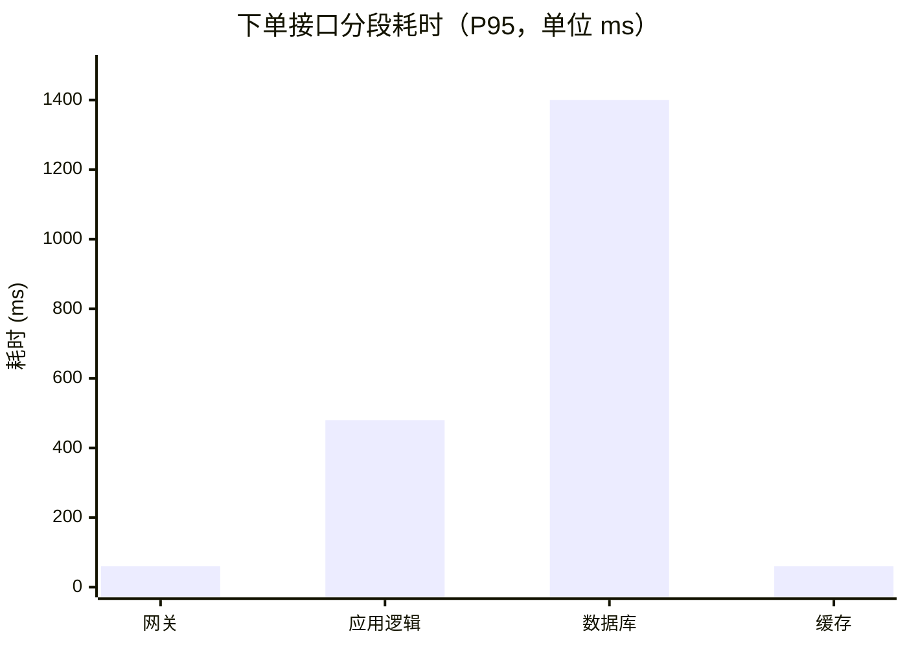
````

**② 卡点时序图**（回答"卡在哪个调用、等了多久"，两种画法按成因选）

**A. 阻塞 / 等待是主因 → 时序图**（最直观：一眼看到在哪一步干等）

````markdown
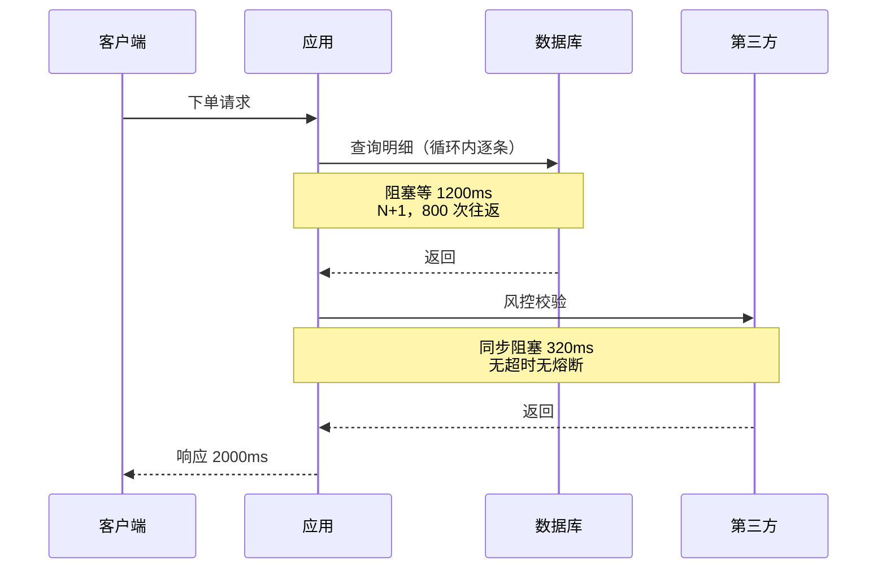
````

**B. 并行 / 串行结构是主因 → 关键路径图**（柱状图表达不了"并行取 max"）

````markdown
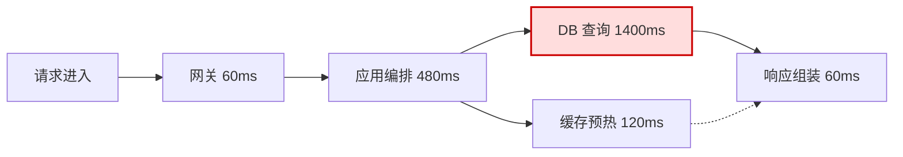
````

> 图下必须配一行口径说明：**端到端 = 关键路径累加（60+480+1400+60 = 2000ms），并行分支取最大值（1400 vs 120）而非相加**。
> **不要用 gantt 表达毫秒级耗时**：gantt 的 `dateFormat X` 把数值解释为 unix 秒，轴标签（1400 → 23:20）会让读者误读单位；只在耗时为**秒级及以上**时才用 gantt。

**③ 链路拓扑图**（瓶颈高亮；🔴 未实测项用虚线）

````markdown
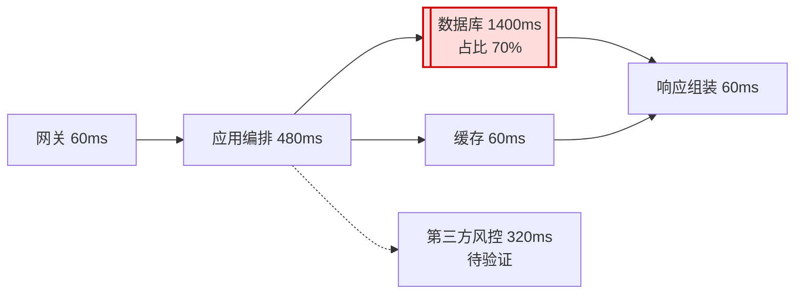
````

**④ 归因链图**（现象 → 证据 → 根因 → 影响）

````markdown
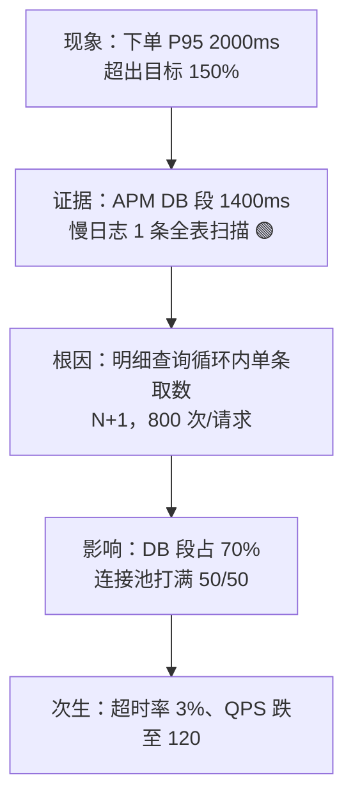
````

**⑤ 双样本对比图**（柱 = 慢样本，线 = 快样本；两组同口径）

````markdown
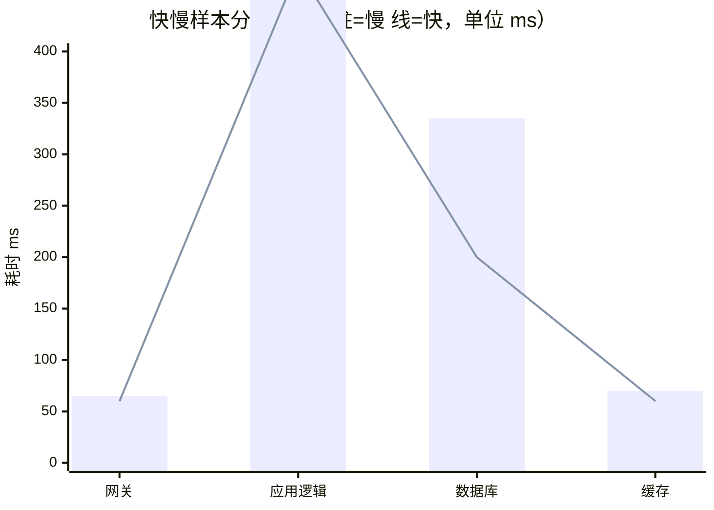
````

**⑥ 优化机理图**（回答"**为什么有效**"：画出**改前形态 → 改后形态**，标出省掉的是什么——这是第五章最有价值的一张图）

**A. 调用放大类**（N+1 / 重复调用 / 重试放大）→ 画"调用次数"的消减

````markdown
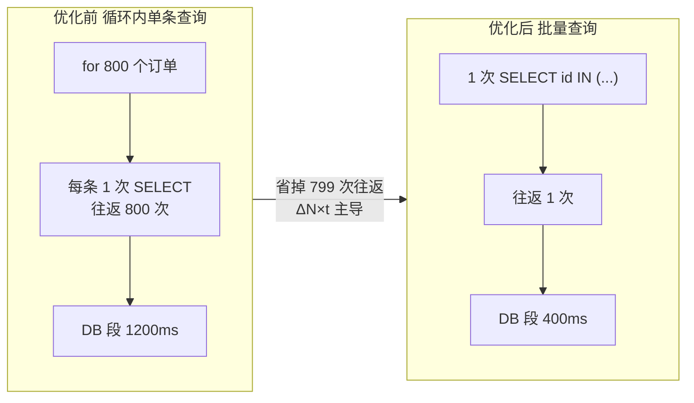
````

**B. 串行等待类**（串行改并行 / 去同步阻塞）→ 画"时间轴重叠"

````markdown
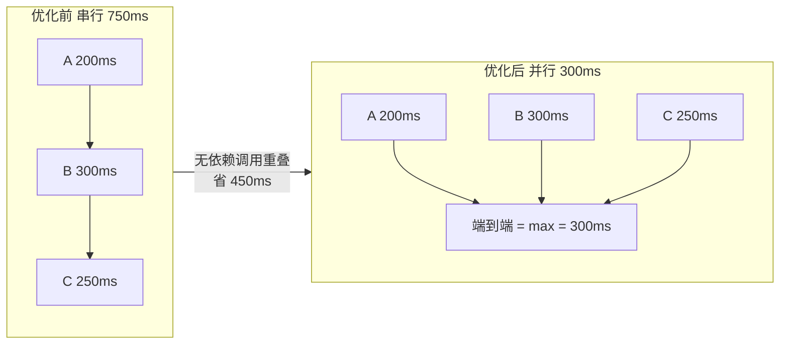
````

**C. 重复计算类**（缓存 / 预计算）→ 画"首次算、后续命中"

````markdown
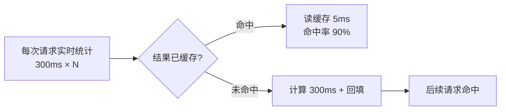
````

> 机理图必须配一句"**省掉的是什么**"（往返次数 / 等待时长 / 重复计算量），并与阶段 5 的收益口径对上（`ΔN×t` 或 `N×Δt`）。**说不出"省掉什么"的优化项 = 没有论证为什么有效**，不得写进结论区。

**⑦ 优化前后对比图**（线 = 目标线）

````markdown
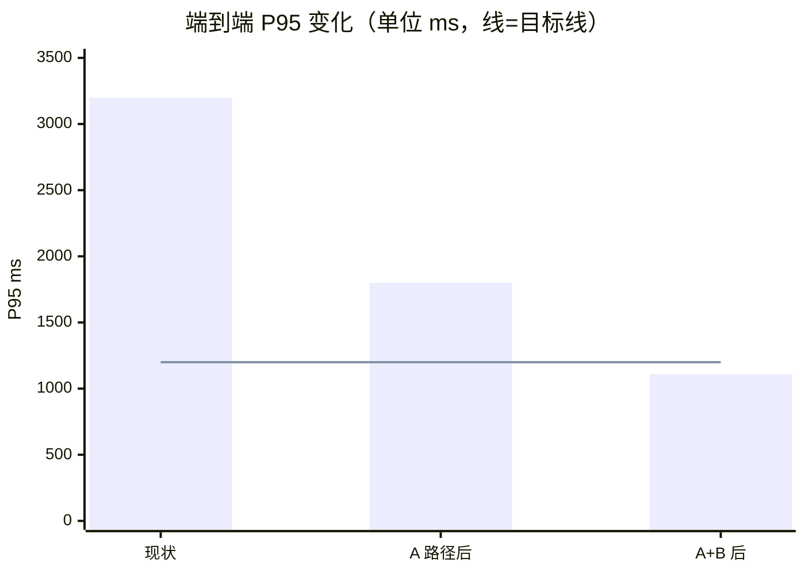
````

**⑧ 验证闭环图**（可选，替代第七章的纯文字说明）

````markdown
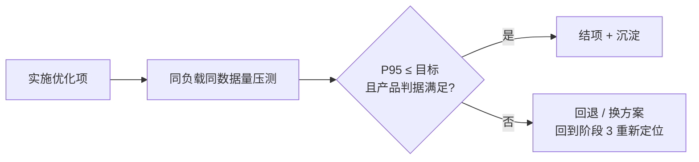
````

### 9.4 图表坑

| 坑 | 表现 | 规避 |
|----|------|------|
| 图替代表 | 只有图没有数据表，评审无法核对 | 每图配一张表，图中数字与表逐项一致 |
| 改表忘改图 | 表更新后图还是旧数字 | 落盘前逐图核对一遍数字 |
| 🔴 假设画成实心 | 虚线画成实线，视觉上把猜测坐实 | 🔴 项用 `-.->` 虚线 + 文本标"待验证" |
| 图太宽 / 太密 | LR 布局下节点挤成一团 | 节点 >6 个改 TD，或按段拆成两张图 |
| 单位缺失 | "1400" 不知是 ms 还是 QPS | 标题写单位，y-axis 也带单位 |
| 渲染器不兼容 | `xychart-beta` 在旧渲染器里报错 | 降级为 gantt 或数据表，不要留一张渲染失败的图 |
| 堆图凑篇幅 | 每张图说的都是表里已有的内容 | 按 9.1 最小图集取用，宁少勿多 |
| 画成决策流程图 | 通篇是"是否达标 → 是否立项 → 谁审批"的分支图，读者看完仍不知道卡在哪、为什么有效 | 图只服务"卡在哪"与"为什么有效"；流程用表格或文字 |
| 机理图没说省掉什么 | 画了 before/after 两个框加一个箭头，看不出省的是往返次数还是等待时长 | 箭头标签必须写明"省掉 X 次往返 / 省掉 Y ms 等待 / 省掉 Z 次重复计算" |
| 只给一个退让点 | 产品没有选择空间，取舍变成通知 | 至少给 2-3 个候选（含不同退让形态） |
| 退让点与瓶颈不对应 | 砍了只占 3% 的功能，收益为零 | 退让点必须来自高占比段（\(p\) 明确） |
| B 项标进 P0 落地计划 | 用性能报告的权威性替产品做决定 | 未拍板前写"待产品确认"，不进 P0 |
| 改写 PM 结论 | 把"⚠️ 有条件采纳"写成"建议采纳" | 原样引用，技术侧只补收益与验证方法 |
