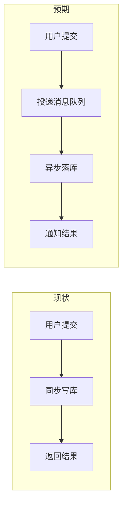
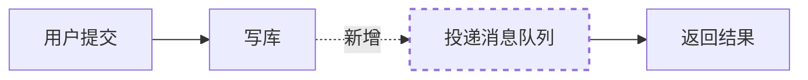

# 需求图示规范（现状 → 预期）

本文件是 [SKILL.md](../SKILL.md) 的展开参考，规定需求挖掘阶段**如何把"变化"画出来**。

> **本规范的唯一目的**：让用户在**需求确认阶段**（而非设计完成后）就一眼看到"现在是什么样、做完会变成什么样"，从而最快发现理解偏差。
> 图只回答 **"变什么"**，不回答 "怎么实现"。

---

## 1. 三引擎选型

| 载体 | 适用 | 为什么 |
|------|------|--------|
| **Mermaid**（内嵌代码块） | 执行流程、业务数据流、状态流转、需求依赖图 | 对话 / VS Code / GitHub 均可直接渲染；无文件依赖；改起来最快 |
| **ASCII**（内嵌代码块） | UI 界面变化、终端输出形态、前后状态快照 | 任何环境 100% 可读、可进 git diff；**UI 布局 mermaid 表达不了** |
| **SVG**（独立文件） | 仅当**已落盘**且 mermaid 确实讲不清（需精确分区 / 泳道 / 多源汇聚） | 依赖 `assets/` 目录与相对路径；对话输出场景下用户看不到图，**故不默认使用** |

> **判断口诀**：能画成流程的用 Mermaid；画的是屏幕 / 布局用 ASCII；落盘且前两者都讲不清才用 SVG。
> **反向约束**：默认 Mermaid，**不得因"SVG 更精美"替换简单图**（引自 `topic-teach` 的反向约束原则）。

---

## 2. 变更面识别（画图的总开关）

Step 1 推理时判定本次需求触及哪类变化：

| 变更面 | 典型信号 | 是否出图 | 推荐画法 |
|--------|----------|:--------:|----------|
| **执行流程** | 步骤增删、顺序调整、分支/异常路径变化、同步改异步 | ✅ 出图 | Mermaid 双图并排 或 单图差分 |
| **数据流** | 数据的产生位置、流向、存储位置、消费方发生变化 | ✅ 出图 | Mermaid 双图并排 |
| **UI** | 界面布局、元素、状态、入口位置变化 | ✅ 出图 | ASCII 双屏 + 差异表 |
| **状态流转** | 对象/任务/订单的状态机变化（新增状态、迁移条件变化） | ✅ 出图 | Mermaid stateDiagram 双图 |
| **无明显形状变化** | 纯性能优化、兼容性、文案、权限、安全加固 | ❌ 不出图 | 文字描述即可，画图是噪音 |

**多变更面**：命中多类时优先画**最主要的一类**，其余若有独立价值各出 1 组，**图总数不超过 3 组**；未画图的变更面在变更点表里用文字说明。

**变更面不明**（探索性需求尚未聚焦、用户没说要改什么）：标 `待定`，本轮不出图。**不得直接归为"无明显形状变化"**——"不知道改什么"和"改了但形状不变"是两回事，前者聚焦后很可能要补图。

---

## 3. 三种差分表达法

### 法 1：双图并排 + 差异表（变化大、前后形态差异明显时用）

````markdown


| 变更点 | 现状 | 预期 | 类型 | 关联假设 |
|--------|------|------|------|----------|
| 写库方式 | 同步写库，请求线程阻塞 | 投递队列后异步落库 | 修改 | H-01 |
| 结果通知 | 请求内同步返回 | 完成后主动通知 | 新增 | H-02 |
````

### 法 2：单图差分标注（小改动，想突出"只动了一小块"时用）

在**现状图**上直接标新增 / 修改 / 删除，其余部分保持不变并声明：

````markdown


图例：`虚线 + 粗描边 = 新增`；`橙色 = 修改`；`灰色虚线 + 删除线 = 移除`
**除标注部分外，其余流程与现状一致。**
````

> Mermaid 差分技巧：节点用 `classDef` + `class` 施加样式；连线用 `linkStyle <序号> stroke:...`；分区用 `subgraph`。**必须配图例**，否则读者分不清颜色含义。

### 法 3：ASCII 双屏对照（UI 变化专用）

```
【现状】                            【预期】
┌────────────────────┐            ┌────────────────────┐
│ 订单列表             │            │ 订单列表  [批量导出]①│
│ [搜索__________]    │            │ [搜索______] [筛选▾]│
├────────────────────┤            ├────────────────────┤
│ (●) 订单1           │            │ ☐ 订单1    ¥100    ②│
│ (●) 订单2           │            │ ☐ 订单2    ¥200     │
└────────────────────┘            └────────────────────┘

① 新增批量导出入口（点击后进入导出流程）
② 新增复选框，勾选后启用批量操作
```

**ASCII 绘制约束**（精简自 `ui-to-ascii`，完整规范见其 reference.md）：

- 字符集：`┌ ┐ └ ┘ ├ ┤ ┬ ┴ ┼ ─ │`；组件占位：输入框 `[____]`、按钮 `[ 登录 ]`、复选 `[x]`/`[ ]`、图标 `[img]`/`(●)`
- 宽度：**并排双屏时每屏 ≤ 38 字符**（合计 ≤ 80）；单屏 ≤ 80
- 中文按**视觉宽度**对齐（1 汉字 ≈ 2 西文字符），右框线对不齐时在文字右侧补空格
- 变更元素旁挂编号锚点 `①②③`，图下方用编号列表说明（不再重复建表）
- 只画**能确认存在的元素**；拿不准的位置写 `[待确认]`

> 用户若**粘贴了 UI 设计稿要求存档**（而非仅口头描述），转 `ui-to-ascii` skill 处理，不在本 skill 内联处理。

---

## 4. 诚实闸门（现状图的幻觉防线）

需求阶段 AI 往往并不知道系统当前真实长什么样。**现状图是最大的幻觉来源**，出图前必须逐条核对：

**来源三态标注**（图下方必写一行）：

```
现状来源：用户提供 / 读代码确认 / ⚠️ AI 推断（对应假设 H-01、H-03，请重点确认）
```

| 来源 | 判定 | 标注 |
|------|------|------|
| 用户在描述中明确说了现状 | 可直接画 | `用户提供` |
| 读了代码 / 配置 / 文档确认 | 可直接画，注明出处 | `读代码确认（{文件}）` |
| 靠常识与业务经验推断 | **必须挂到关键假设 ID** 并在确认时请用户核对 | `⚠️ AI 推断（H-xx）` |

> **何时去读代码确认现状**：仅当相关文件在当前上下文**已可低成本定位**时才读；否则**优先请用户用一两句话描述现状**（更快也更准）。需求阶段不为了画一张现状图去做代码考古——那是 `code-survey` 的范畴，本 skill 不越界。

**核对清单**（出图后自检，任一不通过则修正）：

- [ ] 图中的每个"现状"元素，都有明确来源（用户说 / 代码看到 / 已标为推断）
- [ ] 推断的部分已挂到某个假设 ID，且**假设表中确实存在该条目**（无对应条目时已新增，而非挂一个不存在的 H-xx）
- [ ] 拿不准的结构画成了骨架 + `[待确认]`，没有臆造细节
- [ ] 预期图表达的是**效果**（用户看到/得到什么），未出现技术实现细节
- [ ] 图下方有变更点表或编号说明，读者知道"具体动了哪一块"

### 图的时效性（重绘时机）

图一旦与当前认知不符就必须重绘，**不得让旧图继续充当确认依据**：

| 触发 | 处理 |
|------|------|
| Step 4B 用户纠正涉及现状 / 预期 / 变更点 | 立即重绘受影响部分 |
| Step 5 判定情况 B/C 且用户改选替代方向 | **Step 6 转译前重绘预期图**（现状图不变） |
| Step 6 细化时发现新变更点 | 补进变更点表并同步更新图 |
| 现状来源由"AI 推断"转为"用户确认" | 去掉 ⚠️ 标记、更新来源标注 |

> 重绘后**旧图作废、不并存**——报告里出现两版图必然被取错。只保留最终版。

---

## 5. 边界闸门（不越界到设计阶段）

| ✅ 需求阶段该画的 | ❌ 不该画的（留给下游 skill） |
|---|---|
| 用户操作步骤的前后变化 | 技术架构图、部署拓扑（`design-craft`） |
| 业务数据"从哪来到哪去"的方向变化 | ER 图、表结构、字段类型（`data-flow-model`） |
| 界面布局与元素变化（ASCII） | 接口时序、SDK 调用链（`design-craft` / `frontend-api-guide`） |
| 业务对象状态流转变化（如订单状态） | 完整交互状态矩阵、异常矩阵（`interaction-design`） |
| 终端/命令行输出形态变化 | 代码实现结构、类图（`design-to-code`） |

> **判定口诀**：图上出现"Redis 集群""分库分表""接口 A 调用接口 B 的时序"即越界。
> 本 skill 的图是**需求侧预期草图**，供确认理解用；正式设计图由下游 skill 产出，二者不互相替代。

---

## 6. 成本闸门

| 约束 | 值 |
|------|-----|
| 图总数 | ≤ 3 组（"现状 + 预期"并排算 1 组） |
| UI ASCII | ≤ 2 屏（现状 / 预期各 1 屏） |
| 不出图场景 | 未命中第 2 节任何变更面（纯性能、兼容性、文案、权限类） |
| 现状不可知时 | 允许只画**预期图**并注明"现状待确认"，不强凑双图 |

> 画图是为了减少确认轮次。**图比重超过文字、或读者需要看注解才能看懂图，即为失败**——退回文字描述。

---

## 7. 通用样式约束

- **配色**：一律**浅底深字**；深色仅用于强调元素（新增/变更节点），不作大面积背景；Mermaid **不启用深色主题**（`%%{init:{"theme":"dark"}}%%`）（引自 `topic-teach` 配色约束）
- **落盘 SVG**（仅在使用 SVG 时）：写入需求目录 `assets/`，kebab-case 命名 `{图作用}-{图主题}.svg`（如 `export-flow-now-vs-new.svg`）；md 用 `` 引用；`assets/` 需同步进 `index.md` 索引
- **对齐**：ASCII 图放无语言标记的代码块内，保证等宽不被 Markdown 破坏
- **一图一事**：每张图只回答一个"变什么"，多主题拆多图

---

## 8. 反模式

| ❌ 反模式 | 问题 | ✅ 正确做法 |
|---|---|---|
| 只画预期图，不画现状 | 用户不知道"相对什么变了"，失去对比价值 | 双图并排；现状实在不可知才只画预期并注明 |
| 现状图凭常识补全 | 幻觉源头，用户基于错误基线确认需求 | 标 `⚠️ AI 推断（H-xx）` 并请用户核对 |
| 画技术实现细节 | 越界到设计阶段，且需求阶段细节必然不准 | 只画效果层，实现留给下游 skill |
| 每张图都没有变更点表 | 读者知道"变了"，但不知道"具体哪块变了" | 图后必附变更点表或编号锚点说明 |
| 所有需求都画图 | 性能/文案类需求画图是噪音，拖慢流程 | 命中变更面才画，见第 2 节 |
| 给出 2-3 种解读时每种都配图 | 图数量翻倍突破成本闸门，且多种解读的图差异往往只是一个分支，用户更迷茫 | 只为**最可能的一种解读**画图，其余用文字说明 |
| 图上画了变更点，但需求清单里没有对应需求 | 变更无归属，实现时必然漏做 | 出图后做**反向校验**：每个变更点至少对应一条需求 |
| 用颜色区分但不给图例 | 读者看不懂颜色语义 | 图例必写 |
