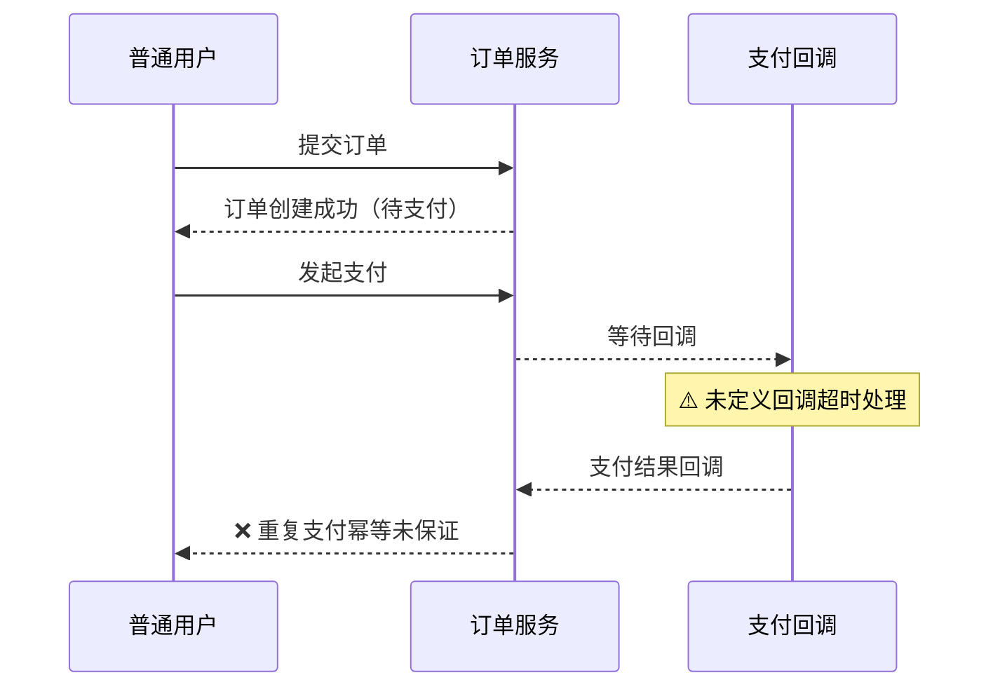
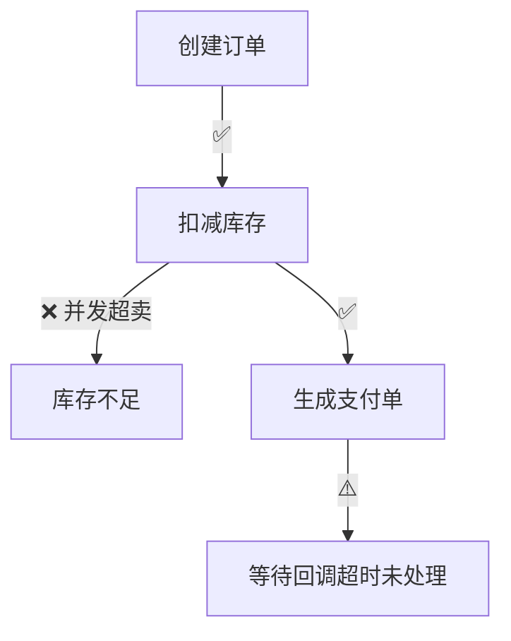

# 场景推演器

## 概述

**目的**：在技术设计完成后、开发之前，或 Skill 编写后、发布前，通过模拟真实使用场景验证设计/Skill 的可行性

**核心价值**：提前发现设计/Skill 中的盲点和潜在问题，避免开发后返工或 Skill 发布后效果不佳

**与数据流图的本质区别**：

| 维度 | 数据流图 | 场景推演 |
|------|---------|---------|
| 关注点 | 数据走向（从哪来、到哪去） | 数据走向 + 关键设计点实现 |
| 内部实现 | 不关心 | 关注设计文档中的关键设计点 |
| 验证目标 | 数据结构和流向是否正确 | 关键设计在真实场景中是否可行 |
| 分析粒度 | 组件级 | 角色 + 场景 + 设计点 |

**输入**：
- 设计文档模式：技术设计文档（DESIGN.md）+ 需求文档（requirement.md）+（可选）数据流图（data-flow.md）
- 需求文档模式：仅需求文档（requirement.md），设计尚未开始，无 DESIGN.md
- Skill 模式：Agent Skill 文件（SKILL.md）+（可选）关联资源文件（reference.md、strategies/ 等）

**输出**：
- 直接展示推演结果
- 项目配置了 `.requirements/config` 且关联了 REQ 时，同时落盘 `review/scenario-rehearsal.md` 并注册文档关联（见阶段 5.2）

## 何时使用

仅在以下情况使用本 skill：

**设计文档模式**（默认）：
- 技术设计文档已完成（design-craft 阶段 5 落盘后）
- design-review 评审已通过（建议）
- 用户希望在开发前验证设计可行性

**需求文档模式**：
- 仅有需求文档（requirement.md），设计尚未开始
- 用户希望在动手写设计前，先验证需求是否自洽、无缺口、验收可达
- 典型时机：requirement-mining 产出需求后、design-craft 之前

**Skill 模式**：
- Skill 编写或修改完成后，希望验证其质量
- 用户希望验证 Skill 的触发准确性、指令完整性、示例质量
- 典型时机：create-skill 完成后、skill 更新后、skill 评审时

**触发短语**：
- 设计模式："推演一下这个设计"、"验证设计方案"、"模拟用户使用流程"、"scenario rehearsal"、"walkthrough"
- 需求模式："推演一下这个需求"、"验证需求场景"、"需求走查"、"requirement rehearsal"
- Skill 模式："推演一下这个 skill"、"验证 skill 质量"、"模拟 skill 使用"、"skill rehearsal"

**前置依赖**：
- 设计文档模式：已完成 design-craft（有技术设计文档）；data-flow-model 可选
- 需求文档模式：已完成 requirement-mining（有需求文档）
- Skill 模式：已完成 create-skill 或 skill 手动编写（有 SKILL.md 文件）

## 核心原则

1. **角色驱动**：以执行者为入口，每个角色独立推演
2. **双重验证**：既要验证数据走向，也要验证关键设计点实现（设计模式）；验证 Skill 质量（Skill 模式）
3. **场景覆盖**：正常路径 + 异常路径 + 边界场景
4. **问题导向**：只记录问题，不修改设计文档/Skill
5. **置信度标注**：技术挑战标注置信度，低置信度降级为"建议"
6. **策略驱动**：按设计特征自动多选启用推演策略 profile，验证维度精选+加压，避免一刀切
7. **可视化输出**：展示用 mermaid 图呈现协作时序与推演路径，问题分布一目了然
8. **证据性质诚实**：推演是推理不是执行——结论一律表述为"推演通过（未实际执行）"，不得表述为"验证通过/已验证"；需要执行性证据时，在下一步建议中提示走 demo-verify / e2e-testing
9. **全局视角先行**：推演前先建立全局图景（功能的业务目标、在系统中的位置、上下游依赖、整体成功判据），每个局部场景的推演结论必须回扣全局目标——局部通过但破坏整体目标/其他场景前提的，按 🔴 记录，不得因局部正确而放行

## 工作流总览

```
阶段 0：对象类型识别 + 全局理解 → 判定推演对象：设计文档 / 需求文档 / Skill；先立全局图景再拆场景
阶段 1：角色识别         → 按对象类型从设计文档/需求文档/Skill 提取所有执行者角色
阶段 2：场景提取 + 策略识别 → 按对象类型提取场景；设计模式多选启用 profile，需求模式用需求质量维度，Skill 模式用 Skill 质量维度
阶段 3：推演执行         → 按角色走完整流程，按对象类型验证设计点/需求质量/Skill 质量，双重验证；每场景结论回扣全局目标
阶段 4：问题汇总         → 按严重度分级，按类型分类
阶段 5：结果展示         → 直接展示推演结果（含 mermaid 图），与需求管理集成
```

**各阶段顺序执行，阶段 3 的验证结果在阶段 4 统一输出。**

**确认交互为非阻塞**：阶段 1/2 输出中的"请确认…"提示不中断推演——展示后即可继续下一阶段，用户可随时纠正并触发局部重推；仅当关键信息缺失且直接影响推演结论时才中断等待。自动触发链路（如 design-craft 完成后）不产生确认中断。

---

## 阶段 0：对象类型识别 + 全局理解

推演开始前先判定对象类型，决定后续所有阶段走哪条分支。

| 对象类型 | 判定依据 | 后续分支 |
|----------|---------|---------|
| **设计文档** | 输入含技术设计文档（DESIGN.md） | 走设计文档模式：阶段 1~3 验证设计点，阶段 2.4 启用设计 profile |
| **需求文档** | 输入仅有需求文档（requirement.md），无 DESIGN.md | 走需求文档模式：阶段 1~3 验证需求质量，使用 [strategies/requirement.md](strategies/requirement.md) 维度 |
| **Skill** | 输入含 SKILL.md 文件，用户明确要求推演 skill | 走 Skill 模式：阶段 1~3 验证 Skill 质量，使用 [strategies/skill.md](strategies/skill.md) 维度 |

**三种模式的本质区别**：

| 维度 | 设计文档模式 | 需求文档模式 | Skill 模式 |
|------|------------|------------|-----------|
| 验证目标 | 设计点在真实场景中是否可行 | 需求是否自洽、无缺口、验收可达 | Skill 触发准确性、指令完整性、示例质量、工作流合理性 |
| 数据走向 | 验证数据从创建到消费的链路 | 仅当需求描述了数据流时验证；否则跳过 | 不验证数据走向；验证 Skill 引用的资源完整性 |
| 验证维度 | 设计点维度（3.2）+ 设计 profile 加压 | 需求质量维度（见 strategies/requirement.md） | Skill 质量维度（见 strategies/skill.md） |
| 触发时机 | design-craft 之后 | requirement-mining 之后、design-craft 之前 | create-skill 之后、skill 更新后 |
| 执行者 | 用户角色 + 自动化程序 | 用户角色 | AI 系统 |

> 若用户同时给了需求文档和设计文档，默认走**设计文档模式**（设计已存在，需求推演价值已部分被设计吸收）；如用户明确要"先推演需求"，则切需求模式。
> 若用户明确要求推演 Skill（输入含 SKILL.md），则走 Skill 模式，无论是否还有其他文档。

**输出**：

```text
🎯 推演对象识别
━━━━━━━━━━━━━━
- 对象类型：需求文档模式（输入仅 requirement.md，设计未开始）
- 后续分支：阶段 1~3 验证需求质量，不验证设计点
```

> **Skill 模式示例**：
> ```text
> 🎯 推演对象识别
> ━━━━━━━━━━━━━━
> - 对象类型：Skill 模式（输入含 SKILL.md，用户要求推演 skill）
> - 后续分支：阶段 1~3 验证 Skill 质量，使用 strategies/skill.md 维度
> ```

### 0.1 全局理解（拆场景之前必做）

拿到文档后**不要直接开始拆角色/拆场景**，先通读文档建立宏观图景——否则各场景各推各的，容易陷入"每个局部都对、拼起来却是致命错误"。输出一份简短的全局理解声明：

| 理解项 | 回答的问题 | 各模式含义 |
|--------|-----------|-----------|
| **业务目标** | 这个功能/需求/Skill 整体要达成什么？用一句话说清 | 设计：方案服务的业务目的；需求：用户真实诉求；Skill：该 skill 在技能体系中的职责 |
| **系统位置** | 它在更大的系统/流程中处于什么位置？上游谁产生输入、下游谁消费输出？ | 设计：模块上下游依赖；需求：与其他需求/存量功能的关系；Skill：与其他 skill 的调用/接力关系 |
| **整体成功判据** | 什么情况下算"整体成功"？哪些全局约束不可破坏（如数据一致、权限不旁路、性能底线）？ | 后续所有局部场景结论的回扣基准 |

```text
🌍 全局理解声明
━━━━━━━━━━━━━━
- 业务目标：{一句话}
- 系统位置：上游 {X} → 本功能 → 下游 {Y}
- 整体成功判据：{全局约束清单，后续场景逐个回扣}
```

> 文档信息不足以回答三项时，标注 `[全局信息缺失]` 并在推演结论中声明"全局回扣受限"；这本身就是一个 🟡 问题（文档未交代全局图景）。

---

## 阶段 1：角色识别

从设计文档/需求文档/Skill 中提取所有参与交互的执行者角色。

### 角色分类

| 类型 | 识别方式 | 示例 |
|------|---------|------|
| **用户角色** | 设计文档中的"用户"、"普通用户"、"管理员"、"运营" | 普通用户、管理员、游客 |
| **自动化程序** | 数据流图中的外部系统、定时任务、消息消费者 | 定时同步任务、Webhook 回调、消息队列消费者 |
| **AI 系统**（Skill 模式） | Skill 的 description 和指令中隐含的 AI 系统行为 | AI 判断是否触发、AI 执行工作流步骤、AI 生成输出 |

**权限层级**：用户角色需进一步区分权限层级，不同层级的推演路径不同：

| 层级 | 典型角色 | 推演重点 |
|------|---------|---------|
| 未登录 | 游客、匿名用户 | 访问控制、登录引导 |
| 已登录 | 普通用户 | 核心功能流程 |
| 认证后 | 实名用户、绑定手机用户 | 权限提升后的功能差异 |
| 数据归属人 | 订单创建者、内容作者 | 对自己数据的操作权限 |
| 非归属人 | 同组用户、无关用户 | 对他人数据的操作限制 |
| 管理员 | 系统管理员、运营人员 | 管理功能、超权操作 |

> 按设计文档中实际定义的角色提取，未定义的角色层级标注"未提及"，不脑补。

### 识别规则

**设计文档模式**：
1. **从设计文档提取**：检查"术语"、"方案(TO-BE)"、"接口设计"章节中的角色描述
2. **从需求文档提取**：检查"用户角色"、"使用场景"中的角色定义
3. **从数据流图提取**：检查数据流的起点（触发者），识别自动化程序角色

**需求文档模式**：
1. **从需求文档提取**：检查"用户角色"、"使用场景"、"功能需求"中的角色定义（主要来源）
2. 设计文档/数据流图不存在，不提取；自动化程序角色仅当需求中明确提及时纳入

**Skill 模式**：
1. **AI 系统是核心执行者**：Skill 的工作流步骤由 AI 系统执行
2. **用户（触发者）**：用户的输入触发 Skill 的判断与应用，推演需覆盖"用户输入 → AI 判断是否触发 → AI 执行工作流 → 生成输出"完整链路
3. **从 Skill 文件提取**：检查 SKILL.md 的 description、指令、工作流，提取 AI 需要扮演的角色/行为以及用户可能的触发输入模式

### 输出格式

```text
👥 角色清单
━━━━━━━━━━━━━━━━

| # | 角色 | 类型 | 权限层级 | 职责 | 来源 |
|---|------|------|---------|------|------|
| 1 | 普通用户 | 用户 | 已登录 | 注册、登录、使用核心功能 | 设计文档 §术语 |
| 2 | 管理员 | 用户 | 管理员 | 后台管理、审核、配置 | 设计文档 §方案 |
| 3 | 定时任务 | 程序 | — | 每日数据同步 | 数据流图 |
| 4 | 支付回调 | 程序 | — | 接收第三方支付结果 | 设计文档 §接口 |

请确认角色是否完整，权限层级划分是否准确，有无遗漏。
```

---

## 阶段 2：场景提取

从需求文档和设计文档中提取核心使用场景，并识别关键设计点。

### 2.1 场景提取

**提取来源**：
- 设计文档模式：需求文档"使用场景/验收标准" + 设计文档"方案(TO-BE)/时序图"
- 需求文档模式：需求文档"使用场景"、"验收标准"、"功能需求"（设计文档不存在，跳过）
- Skill 模式：SKILL.md 的 description（触发场景）、指令步骤（工作流场景）、示例（示例场景）

**场景分类**：
- **核心业务场景**：需求的主要功能流程
- **协作场景**：需要多个角色协同完成的完整业务流程
- **异常场景**：错误处理、边界情况
- **并发场景**：多用户/多任务同时操作

### 2.2 关键设计点/Skill 质量点识别

从设计文档中提取需要验证的关键设计点（设计模式），或从 Skill 中提取需要验证的质量点（Skill 模式）：

**设计文档模式 — 设计点提取**：

| 设计点类型 | 提取位置 | 验证重点 |
|-----------|---------|---------|
| 关键决策点 | "关键决策点"章节 | 决策在场景中是否合理 |
| 接口契约 | "接口设计"章节 | 接口参数、返回值、异常是否满足调用需求 |
| 异常处理 | "异常处理"章节 | 异常场景下处理策略是否有效 |
| 并发策略 | "性能 & 安全"章节 | 并发场景下策略是否正确 |
| 数据约束 | "数据模型"章节 | 数据约束在业务场景中是否合理 |

**Skill 模式 — 质量点提取**：从 SKILL.md 的 description、指令/工作流章节、示例、资源引用、YAML 元数据中提取七个质量点（触发准确性 / 指令完整性 / 示例质量 / 工作流合理性 / 资源完整性 / AI 说明层 / 结构规范性），各质量点的验证问题与加压点见 [strategies/skill.md](strategies/skill.md)。

### 2.3 构建推演矩阵

#### 2.3.1 设计点覆盖矩阵

为确保每个关键设计点都在相关场景中得到推演验证，构建「设计点 × 场景」覆盖矩阵：

```text
📋 设计点覆盖矩阵
━━━━━━━━━━━━━━━━

| 设计点 \ 场景 | 正常注册 | 重复注册 | 并发注册 |
|--------------|---------|---------|---------|
| 邮箱唯一约束 | ✅ | ✅ | ✅ |
| 验证码过期策略 | ✅ | - | - |
| 并发注册控制 | - | - | ✅ |

请确认设计点覆盖是否完整，有无遗漏的设计点。
```

> 设计点取自阶段 2.2 的关键设计点清单，每个设计点至少应有 1 个关联场景。标记为 `-` 的设计点可能意味着该场景不需要验证，需用户确认。

#### 2.3.2 角色场景推演矩阵

将角色和场景组合，构建推演矩阵：

```text
📋 推演矩阵
━━━━━━━━━━━━━━━━

| 场景 \ 角色 | 普通用户 | 管理员 | 定时任务 |
|-------------|---------|--------|----------|
| 用户注册 | ✅ | - | - |
| 订单创建 | ✅ | - | - |
| 订单审核 | - | ✅ | - |
| 数据同步 | - | - | ✅ |

请确认推演矩阵是否覆盖核心场景和协作场景。
```

### 2.4 推演策略 profile 识别

按设计特征**多选启用**推演策略 profile。一个设计常混合多类关注点（如订单系统 = CRUD + 事务 + 并发），因此 profile 可叠加，不互斥。

**候选 profile**：

| profile | 启用信号（命中即启用） | 策略文件 |
|---------|----------------------|----------|
| CRUD/接口类 | 接口以 CRUD 命名、RESTful 资源、列表/详情/表单 | [strategies/crud-api.md](strategies/crud-api.md) |
| 事务/状态机类 | 状态机/状态流转/订单/支付/审批/事务/补偿/对账 | [strategies/transaction-state-machine.md](strategies/transaction-state-machine.md) |
| 批处理/同步类 | 批处理/同步/ETL/定时任务/导出/数据迁移 | [strategies/batch-sync.md](strategies/batch-sync.md) |
| 实时/推送/消息类 | WebSocket/推送/通知/消息队列/订阅/实时 | [strategies/realtime-messaging.md](strategies/realtime-messaging.md) |
| 重构/迁移类 | 重构/迁移/灰度/兼容/双写/回滚/改造 | [strategies/refactor-migration.md](strategies/refactor-migration.md) |
| 并发/竞态敏感类 | 并发/竞态/锁/原子/缓存一致性/限流/秒杀 | [strategies/concurrency.md](strategies/concurrency.md) |
| Bug 修复类 | issue/bug/缺陷/故障/出错/崩溃/panic/异常/失败 | [strategies/bug-fix.md](strategies/bug-fix.md) |
| 新增功能类 | 新增功能/新特性/新增模块/新页面/新接口/新服务 | [strategies/feature.md](strategies/feature.md) |
| 代码优化类 | 优化/重构/性能/可读性/可维护性/简化/提取/合并/拆分/清理/精简/高效 | [strategies/optimization.md](strategies/optimization.md) |

**识别规则**：
- 扫描设计文档的方案/接口/数据模型/非功能章节关键词
- 命中任一启用信号即启用对应 profile（可多选）
- 未命中任何 profile → 使用通用验证维度（3.2 全集）
- 启用的 profile 决定阶段 3 的维度精选与加压点

> **需求文档模式不启用上述设计 profile**（无设计特征可扫描）。此时跳过本表扫描，统一使用 [strategies/requirement.md](strategies/requirement.md) 的**需求质量维度全集**（场景完整性 / 验收标准可达性 / 需求一致性 / 角色-需求对齐 / 边界异常覆盖 / 术语一致性），进入阶段 3 的需求质量验证。
>
> **Skill 模式不启用上述设计 profile**（无设计特征可扫描）。此时跳过本表扫描，统一使用 [strategies/skill.md](strategies/skill.md) 的**Skill 质量维度全集**（触发准确性 / 指令完整性 / 示例质量 / 工作流合理性 / 资源完整性 / AI 说明层），进入阶段 3 的 Skill 质量验证。

**输出**：

```text
🎯 启用策略 profile
━━━━━━━━━━━━━━━━
- ✅ 事务/状态机类（命中：订单状态流转、支付）
- ✅ 并发/竞态敏感类（命中：秒杀、库存扣减）
- ➖ 未启用：批处理/同步类（无相关信号）

请确认 profile 识别是否准确，有无遗漏。
```

---

## 阶段 3：推演执行

按角色走完整流程，同时验证数据走向和关键设计点。

### 3.1 数据走向验证

**设计文档模式**：验证数据从创建到消费的完整链路：

| 验证项 | 检查内容 |
|--------|---------|
| 数据创建 | 数据是否在正确的节点创建 |
| 数据流转 | 数据是否按设计流向正确组件 |
| 数据消费 | 数据是否被正确的组件消费 |
| 新增数据贯通 | 设计新引入的数据元素（接口字段/模型字段/事件字段）是否贯通——正向：从入口到最终落点（入库/发送/返回）每一跳是否都有设计交代；反向：是否有生产方与消费方（死字段/空壳字段标 🟡 请设计方确认是否为分阶段铺垫） |
| 异常路径归宿 | 各节点失败/异常时数据的归宿是否有设计交代（重试/死信/补偿/用户提示），有无静默丢弃 |
| CRUD 一致性 | 实际操作与数据流图标注是否一致 |

**需求文档模式**：若需求文档未描述数据流，跳过本节；若需求描述了关键数据流（如"订单数据同步至风控"），仅验证该描述的内部一致性，不深入设计实现。

**Skill 模式**：不验证数据走向；改为验证 Skill 引用的资源完整性：

| 验证项 | 检查内容 |
|--------|---------|
| 文件存在性 | SKILL.md 引用的 reference.md、strategies/、examples.md 等文件是否存在 |
| 路径正确性 | 引用的文件路径是否正确（相对路径/绝对路径） |
| 内容一致性 | 引用文件中的内容是否与 SKILL.md 中的描述一致 |

### 3.2 关键设计点验证

验证设计文档中的关键设计点在场景中的可行性：

**设计文档模式 — 验证维度**：

| 维度 | 验证问题 | 严重度 |
|------|---------|:------:|
| **决策可行性** | 被选择的方案在给定场景下是否真的可行？ | 🔴 |
| **接口满足度** | 接口参数、返回值是否满足实际调用需求？ | 🔴 |
| **异常覆盖度** | 异常场景是否都有对应的处理策略？ | 🔴 |
| **并发正确性** | 并发场景下锁策略、事务边界是否正确？ | 🔴 |
| **幂等性** | 重复操作是否具有幂等保证？重复提交、消息重投是否安全？ | 🔴 |
| **数据完整性** | 数据约束是否覆盖所有业务场景？ | 🟡 |
| **边界处理** | 空输入、极大值、并发冲突等边界是否处理？ | 🟡 |

> **策略 profile 精选/加压**：上表为通用维度全集。根据阶段 2.4 启用的 profile：
> - **精选**：优先验证 profile 关注的维度（非关注维度可降低优先级）
> - **加压**：对 profile 的"加压点"做额外深挖（见对应策略文件）
> - 未启用任何 profile 时，按全集逐项验证
>
> **代码修复方向策略**：当启用 Bug 修复类、新增功能类、代码优化类策略时，使用对应策略文件中的精选验证维度和加压点。这些策略特别关注：
> - **Bug 修复类**：问题定位准确性、修复效果验证、副作用评估、意外场景概率评估
> - **新增功能类**：需求覆盖度、接口设计完整性、数据模型扩展性、意外场景概率评估
> - **代码优化类**：行为等价性、性能提升验证、复杂度评估、意外场景概率评估

**需求文档模式 — 验证维度**（不验证设计点）：使用 [strategies/requirement.md](strategies/requirement.md) 的需求质量维度全集——场景完整性🔴 / 验收标准可达性🔴 / 需求一致性🔴 / 角色-需求对齐🟡 / 边界异常覆盖🟡 / 术语一致性🟡，各维度的验证问题与典型缺口见策略文件。

> 需求模式不跑 profile 加压（无设计特征），直接按上述全集逐项验证。

**Skill 模式 — 验证维度**（不验证设计点/需求质量）：使用 [strategies/skill.md](strategies/skill.md) 的 Skill 质量维度全集——触发准确性🔴 / 指令完整性🔴 / 示例质量🟡 / 工作流合理性🟡 / 资源完整性🟡 / AI 说明层🟡 / 结构规范性🟢，各维度的验证问题、加压点与输出格式调整见策略文件。

> Skill 模式不跑 profile 加压，直接按上述全集逐项验证。

### 3.3 推演方式

**Happy Path（正常路径）**：
- 按设计预期的正常流程走完全程
- 验证核心功能是否可实现

**Collaboration Path（协作路径）**：
- 多个角色按时间顺序完成一个完整业务流程
- 验证角色间的衔接是否流畅、数据传递是否正确
- 典型场景：用户提交订单 → 管理员审核 → 用户收到通知

**Exception Path（异常路径）**：
- 模拟各种异常场景（网络超时、权限不足、数据冲突等）
- 验证异常处理策略是否有效

**Edge Case（边界场景）**：
- 空输入、极大值、并发冲突
- 验证边界处理是否合理

**意外场景推演（Unexpected Scenario）**：
- 推演真实场景中可能出现但有一定概率的意外情况
- 重点关注代码修复、新增功能、代码优化可能引发的连锁反应
- 评估意外场景的发生概率和影响程度
- 验证系统对意外场景的容错能力

### 3.4 单场景推演输出

```text
🎬 场景推演：[场景名称]
━━━━━━━━━━━━━━━━

【执行者】[角色名称]
【场景描述】[一句话描述]

【数据走向验证】
| 步骤 | 操作 | 数据流向 | 验证结果 | 问题 |
|------|------|----------|---------|------|
| 1 | C: 创建用户 | 用户 → 用户表 | ✅ 通过 | - |
| 2 | C: 发送验证邮件 | 用户 → 邮件队列 | ⚠️ 存疑 | 未定义失败重试 |

> **数据守恒检查（三问+异常归宿）**（每条数据流逐跳检查）：①流向——数据去向/消费方与设计一致吗？②数量——到达消费方时有无静默增减（如过滤/异常丢弃/重复消费）？③内容——字段/精度/格式到达消费方时还是原样吗？④异常归宿——节点失败/异常时这条数据的归宿设计交代了吗（重试/死信/补偿/用户提示）？"异常则跳过"看似没毛病，静默丢弃（无记录无补偿无感知）按守恒破坏处理：最低 ⚠️（设计须补交代归宿或论证该数据可丢弃），消费端效果重大记 ❌。任一问命中变化 → 逐消费方做**效果等价性判定**：消费方拿这份数据做什么？用变化后的数据产生的效果与原来一致吗？🟰 效果一致 → ✅；🟡 影响可忽略（推演者推断，标注待确认交用户判断）→ ⚠️；🔴 影响重大（报表失真/告警漏报误报/资金偏差/不可逆丢失）→ 记 ❌ 并归入问题汇总的「数据问题」，不可逆的一律从重。

【关键设计点验证】
| # | 设计点 | 验证问题 | 验证结果 | 问题 | 置信度 |
|---|--------|---------|---------|------|--------|
| 1 | 邮箱唯一约束 | 重复注册时如何处理？ | ❌ 失败 | 设计未说明冲突提示 | 🔴 高 |
| 2 | 验证码过期策略 | 过期后能否重发？ | ✅ 通过 | 5分钟过期，支持重发 | - |

> **需求文档模式**：本节改为「需求质量验证」，列改用 strategies/requirement.md 的维度（场景完整性/验收可达性/需求一致性/角色对齐/边界覆盖/术语一致），不验证设计点。
>
> **Skill 模式**：本节改为「Skill 质量验证」，列改用 strategies/skill.md 的维度（触发准确性/指令完整性/示例质量/工作流合理性/资源完整性/AI 说明层），不验证设计点。

【意外场景推演】
| # | 意外场景 | 发生概率 | 影响程度 | 容错措施 | 推演结果 |
|---|---------|---------|---------|---------|---------|
| 1 | 修复导致其他模块异常 | 中 | 高 | 回归测试覆盖 | ⚠️ 存疑 |
| 2 | 新功能在并发场景下失效 | 低 | 高 | 并发测试 | ✅ 通过 |
| 3 | 优化导致性能退化 | 低 | 中 | 性能监控 | ✅ 通过 |

【推演结论】
- 数据走向：X 项通过 / Y 项存疑 / Z 项失败
- 关键设计/Skill 质量：X 项通过 / Y 项存疑 / Z 项失败
- 意外场景：X 项通过 / Y 项存疑 / Z 项失败
- 全局回扣：本场景结论放到全局目标（见 0.1 声明）下是否仍成立？是否破坏整体成功判据或其他场景的前提？✅ 成立 / 🔴 局部通过但破坏全局（说明破坏了哪条约束）
- 证据性质：推演结论（基于文档推理，未实际执行）
```

---

## 阶段 4：问题汇总

将阶段 3 的所有发现汇总，按严重度和类型分类。

### 4.1 问题分类

| 分类 | 说明 | 处理建议 |
|------|------|---------|
| **遗漏场景** | 设计/需求未覆盖的使用场景 | 补充设计文档 / 需求文档 |
| **流程缺陷** | 设计流程中存在逻辑漏洞 | 修改设计方案 |
| **设计冲突** | 设计点之间存在矛盾 | 统一设计方案 |
| **数据问题** | 数据流转或约束存在问题（含守恒破坏：流向改变/数量静默增减/内容变形/异常路径静默丢弃；含贯通断链：新增数据元素某一跳缺失设计、死字段/空壳字段；严重度按消费端效果等价性定，不可逆丢失从重） | 修改数据流图或设计 |
| **全局破坏** | 局部场景推演通过，但破坏全局目标/整体成功判据/其他场景前提 | 回到全局视角重新设计，不得局部修补 |
| **需求缺口**（需求模式） | 需求未定义的行为/异常/边界 | 补充需求文档 |
| **需求冲突**（需求模式） | 需求条目之间相互矛盾 | 统一需求描述 |
| **触发问题**（Skill 模式） | skill 的 description 无法准确触发 | 修改 description，增加触发术语 |
| **指令问题**（Skill 模式） | skill 的指令不完整或模糊 | 补充指令步骤，明确边界条件 |
| **示例问题**（Skill 模式） | skill 的示例不具体或不完整 | 补充具体示例，覆盖主要场景 |
| **工作流问题**（Skill 模式） | skill 的工作流不合理或缺失 | 重新设计工作流，补充必要步骤 |
| **资源问题**（Skill 模式） | skill 引用的资源不存在或路径错误 | 修正路径或创建缺失的资源文件 |
| **结构问题**（Skill 模式） | skill 不符合标准结构 | 调整结构，符合规范 |
| **意外场景风险**（代码修复方向） | 代码修复可能引发的意外场景风险 | 评估风险概率，制定应对策略 |
| **连锁反应风险**（代码修复方向） | 修复可能引发的连锁反应 | 进行回归测试，评估影响范围 |
| **性能退化风险**（代码优化方向） | 优化可能导致性能退化 | 进行性能测试，监控关键指标 |
| **并发场景风险**（新增功能方向） | 新功能在并发场景下可能出现问题 | 进行并发测试，验证竞态条件 |

### 4.2 严重度定义

| 严重度 | 含义 | 处理要求 |
|--------|------|---------|
| 🔴 阻断 | 设计存在重大缺陷，不修复将导致功能不可用 | 必须修复后才能进入开发 |
| 🟡 警告 | 设计存在潜在风险，可能导致问题 | 强烈建议修复 |
| 🟢 建议 | 设计可优化点，不影响功能 | 可选修复 |

### 4.3 输出格式

> 严重度必须由"功能影响"列支撑：🔴 要能从该列读出"哪个功能怎么不可用"，🟡 要能读出"可能导致什么问题"，不得仅凭问题描述定级。

```text
📊 问题汇总
━━━━━━━━━━━━━━━━

| # | 类型 | 角色 | 场景 | 问题描述 | 功能影响（预期 → 实际） | 建议 | 严重度 |
|---|------|------|------|---------|------------------------|------|:------:|
| 1 | 遗漏场景 | 普通用户 | 注册 | 未考虑邮箱重复注册的用户提示 | 预期：重复注册时提示"邮箱已注册" → 实际：无任何提示，用户不知注册为何失败 | 补充冲突提示逻辑 | 🔴 |
| 2 | 流程缺陷 | 管理员 | 审核 | 审核拒绝后无通知机制 | 预期：被拒后用户收到原因通知 → 实际：用户无感知，一直等待审核结果 | 补充消息通知设计 | 🟡 |
| 3 | 数据问题 | 定时任务 | 同步 | 同步失败无重试策略 | 预期：失败自动重试保证最终一致 → 实际：失败数据永久缺失，下游报表少数据 | 补充重试机制 | 🟡 |

统计：
- 🔴 阻断：X 个
- 🟡 警告：Y 个
- 🟢 建议：Z 个
```

---

## 阶段 5：结果展示

直接展示推演结果；当项目配置了 `.requirements/config` 且关联了 REQ 时，同时将推演结果写入 `review/scenario-rehearsal.md`（见 5.2）。

### 5.1 展示格式

```markdown
# 场景推演结果展示：{功能名称}

> 推演时间：YYYY-MM-DD
> 推演对象：{设计文档模式 / 需求文档模式 / Skill 模式}
> 输入文档：{设计文档 / 需求文档 / SKILL.md 路径}

## 1. 全局理解声明 + 角色清单
（阶段 0.1 与阶段 1 输出）

## 2. 推演矩阵 + 启用策略 profile
（阶段 2 输出，含 2.4 profile 识别结果）

## 3. 场景推演详情
（阶段 3 输出，按场景分节；协作场景含 mermaid 时序图，核心场景含 mermaid 推演路径图，见 5.3）

## 4. 问题汇总
（阶段 4 输出）

## 5. 推演结论（含 mermaid 问题分布饼图，见 5.3）

### 整体评估
- 推演覆盖：X 个角色 / Y 个场景
- 问题发现：🔴 X 个 / 🟡 Y 个 / 🟢 Z 个

### 评审结论
| 条件 | 结论 |
|------|------|
| 存在 ≥1 个 🔴阻断 | ❌ 不通过 |
| 无 🔴阻断，但存在 ≥1 个 🟡警告 | ⚠️ 有条件通过 |
| 仅存在 🟢建议或无问题 | ✅ 通过 |

> 结论均为**推演通过（未实际执行）**：基于文档推理，非执行性证据。设计中存在高风险点（未验证过的技术/API、性能敏感路径）时，在下一步建议中提示用 demo-verify / e2e-testing 获取执行性证据。

### 下一步建议
- 修复所有 🔴 阻断项后可进入开发
- 修复后建议使用增量推演模式（仅重推上一轮 🔴/🟡 问题关联的场景与设计点，其余沿用上轮结论）
```

### 5.2 需求管理集成

当项目配置了 `.requirements/config` 且关联了 REQ 时，推演结果展示后自动执行集成操作：

1. **落盘推演结果**：将阶段 5.1 的完整展示内容写入需求目录下的 `review/scenario-rehearsal.md`
2. **注册文档关联**：

```bash
req update {REQ-NNN} \
  --docs add review/scenario-rehearsal.md,rehearsal --changelog "完成场景推演"
```

3. **错误处理**：需求 ID 不存在或未关联 REQ → 跳过落盘与注册，仅展示推演结果

**存储路径映射**：

| 产出物 | 存储路径 | docs 类型 |
|--------|----------|-----------|
| 场景推演结果 | `review/scenario-rehearsal.md` | `rehearsal` |

### 5.3 mermaid 图输出规范

为提升展示直观性，按场景类型输出 mermaid 图（不支持渲染的环境显示源码，不影响内容）：

| 图类型 | 适用场景 | 要求 |
|--------|---------|------|
| `sequenceDiagram` | 协作场景（多角色按时间序） | **必画**：参与者=角色，消息=步骤，标注关键设计点验证结果 |
| `flowchart TD` | 核心场景推演路径 | 每个核心场景一张：节点=步骤，用 ✅/⚠️/❌ 标注验证结果，问题节点高亮 |
| `pie` | 问题分布 | 展示结论处一张：🔴阻断/🟡警告/🟢建议占比 |
| `flowchart LR` | 有问题的数据走向分支 | 仅当数据走向验证发现问题时画，不画全量（避免与 data-flow-model 重复） |

**示例（协作场景时序图）**：



**示例（推演路径 flowchart）**：



**原则**：图用于"一眼可见问题"，细节仍在表格中；问题节点必须在图中标注，并与表格问题编号对应。

---

## 反模式

### 推演范围层面
- ❌ **只走 Happy Path**：忽略异常场景会导致设计缺陷遗漏
- ❌ **关注代码实现细节**：推演关注设计层面，不关注具体代码实现
- ❌ **超出设计范围**：不评审设计文档范围外的问题

### 推演流程层面
- ❌ **跳过角色识别**：不同角色的推演路径不同，必须按角色分别推演
- ❌ **忽略置信度**：技术挑战不标注置信度，导致低质量质疑浪费注意力
- ❌ **推演时修改设计**：推演只记录问题，修改应交给 design-craft

### 推演内容层面
- ❌ **模糊问题描述**："这里可能有问题"不是有效发现，必须说明什么条件下有问题
- ❌ **忽略数据走向**：只验证设计点不验证数据走向，会遗漏数据层面的问题（设计模式）
- ❌ **不标注来源**：每条问题必须标注来自哪个场景的推演
- ❌ **需求模式越界**：需求模式只验证需求本身（完整性/一致性/验收可达），不提前评审尚未存在的设计，也不替 design-craft 写设计
- ❌ **Skill 模式越界**：Skill 模式只验证 Skill 质量（触发/指令/示例/工作流/资源/说明层），不修改 Skill 内容，也不评判 Skill 的业务价值

## 附加资源

- 推演示例 / 关键设计点验证维度详解：[reference.md](reference.md)
- 推演策略 profile：[strategies/](strategies/)（设计模式按设计特征多选启用，每个 profile 含精选维度/加压点/典型异常/mermaid 提示；需求模式使用 [strategies/requirement.md](strategies/requirement.md) 的需求质量维度；Skill 模式使用 [strategies/skill.md](strategies/skill.md) 的 Skill 质量维度）
