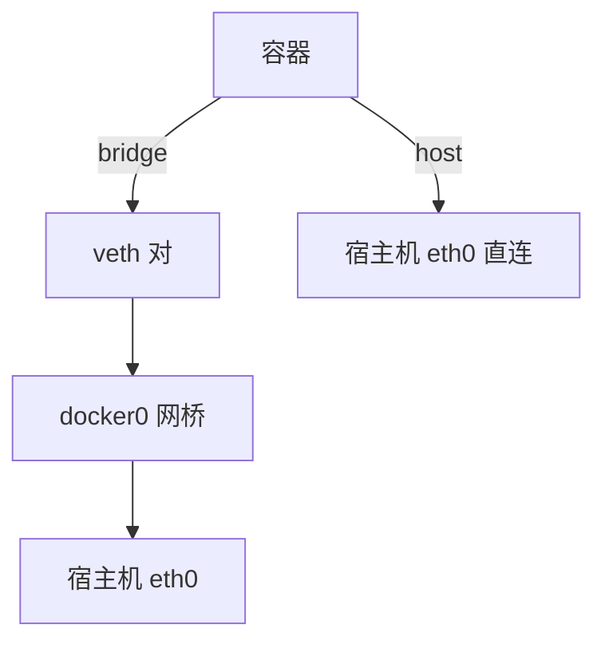
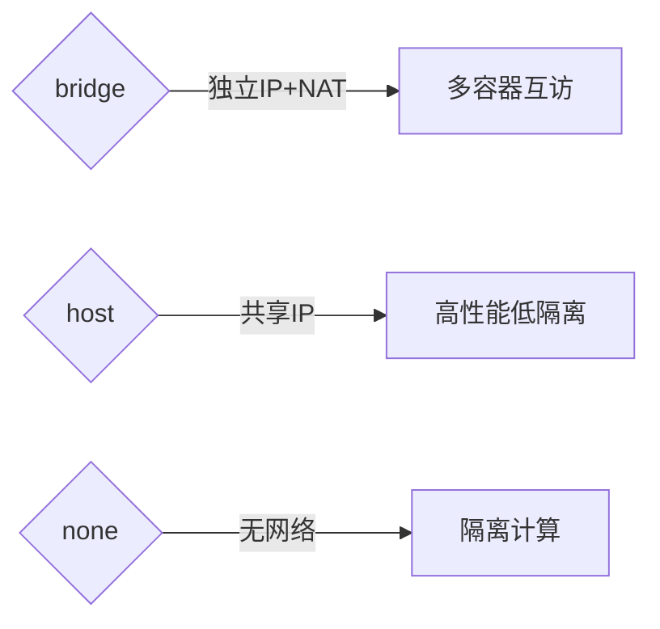
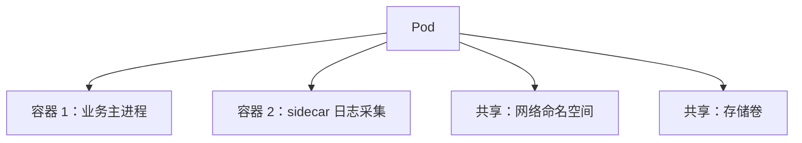

# Topic Teach 产物示例

> 供 AI 参考"产物长什么样"，锚定格式。示例基于虚构的 `docker 网络模式`（速览）与 `k8s 基础`（课程制第 2 课）两个主题，内容为示意，非完整教学正文。

## 目录

- [示例 1：速览模式 overview.md 成品](#示例-1速览模式-overviewmd-成品)
- [示例 2：课程制单课 lesson-02 成品](#示例-2课程制单课-lesson-02-成品)
- [示例 3：学习档案与动态大纲调整](#示例-3学习档案与动态大纲调整)
- [示例 4：HTML 内联片段用法](#示例-4html-内联片段用法)

---

## 示例 1：速览模式 overview.md 成品

> 场景：用户说"什么是 docker 网络模式"，走速览。文件为 `.teach-topics/docker-networking/overview.md`。

```markdown
# Docker 网络模式速览

> 水平：入门（按默认画像生成，可要求调整）｜ 日期：2026-08-03

## 速览大纲

本次讲清：Docker 的 5 种网络模式是什么、各自适合什么场景。
想深入？见文末"延伸学习提示词"，可升级为完整课程。

## 从一个类比说起

Docker 网络模式 ≈ 一间宿舍楼的几种联网方案：
- bridge = 每间房通过楼道交换机互相通信（默认）
- host = 房间直接钉在楼外墙上，不经过楼道
- none = 房间不接网线

## 核心原理

### 5 种模式一览

| 模式 | 一句话 | 类比 | 适用 |
|------|--------|------|------|
| bridge（默认） | 容器经虚拟网桥 NAT 访问外部 | 楼道交换机 | 单机多容器互访 |
| host | 容器直接共享宿主机网络栈 | 钉在楼外墙上 | 追求极低延迟 |
| none | 无网络 | 不接网线 | 离线计算任务 |
| container | 共享另一容器的网络栈 | 室友共用一根网线 | 网络代理/监控边车 |
| overlay | 跨多台宿主机组虚拟网络 | 楼与楼之间的隧道 | Swarm/集群服务 |



### 关键区分：bridge vs host

- **bridge**：容器有独立 IP（172.17.x.x），外部访问需端口映射（`-p`）。
- **host**：容器用宿主机 IP 与端口，无独立 IP，性能最好但隔离最弱。

> 类比的边界：宿舍楼方案里每间房是固定的；真实 Docker 中一个容器可随时换网络模式（创建时决定），且 bridge 不止一个网桥。

## 🐞 常见误区

1. **以为 host 模式更安全**：host 让容器直接暴露宿主机端口，隔离弱，默认不用。
2. **以为 bridge 下容器能 ping 通宿主机 IP 是必然**：能通，但走的是 NAT，不代表网络完全透明。

## 一图总结



## 🚀 想深入？复制发给 AI

```
我刚看了 .teach-topics/docker-networking/overview.md 关于 docker 网络模式的速览，
想进一步学习，请按我的情况（入门 / 目标 理解概念）把 "overlay 网络与跨主机通信" 展开成一个课程。
```
```

---

## 示例 2：课程制单课 lesson-02 成品

> 场景：课程制 `k8s 基础` 第 2 课，文件为 `.teach-topics/k8s-basics/lessons/lesson-02-pod.md`。展示单课结构 + 课后接力提示词。

```markdown
# 第 2 课：Pod——k8s 的最小调度单位

> 所属课程：k8s 基础 ｜ 水平：零基础 ｜ 上一课：[第 1 课](lesson-01-container.md)

## 🎯 本课目标

- 说清 Pod 与容器的关系
- 知道 Pod 里多个容器如何共享网络与存储
- 能写出一个最简单的 Pod YAML

## 从一个类比说起

Pod ≈ 合租房间：容器是室友，共享网络（一根网线）和存储（一套水电）。
k8s 不直接调度容器，而是调度"房间"（Pod）。

## 原理讲解

### Pod 与容器的关系



- Pod 是 k8s 的最小调度单位，一个 Pod 可含 1~N 个容器。
- 同 Pod 容器共享 localhost（同一网络命名空间），用 localhost 互访。

### 最简单的 Pod YAML

```yaml
apiVersion: v1
kind: Pod
metadata:
  name: nginx-demo
spec:
  containers:
    - name: nginx
      image: nginx:1.27
```

> 命令适用版本：k8s v1.20+（`kind: Pod` 长期稳定）。

## 动手环节

```bash
kubectl apply -f pod.yaml        # 创建
kubectl get pods                 # 查看
kubectl describe pod nginx-demo  # 看详情（含事件）
```

预期输出：`nginx-demo   1/1   Running`。

### 命令速查卡（技术域）

| 命令 | 作用 | 常用参数 |
|------|------|----------|
| kubectl apply -f | 声明式创建/更新 | `-f pod.yaml` |
| kubectl get pods | 列出 Pod | `-o wide` |

## 🐞 常见误区

1. **以为一个 Pod 只能一个容器**：可多容器，但多数场景一 Pod 一容器。
2. **以为 Pod 名可随意改**：Pod 名全局唯一，创建后不可改（只能删了重建）。

## 一图总结


## 课后小测

**Q1**：一个 Pod 里多个容器如何通信？
- A. 通过容器 IP 互访
- B. 通过 localhost 互访 ✅（同网络命名空间）
- C. 不能通信
- D. 通过宿主机端口

**Q2**：...

<details><summary>答案与解析</summary>

**Q1 答案：B**。同 Pod 容器共享网络命名空间，用 localhost 即可互访。

</details>

## 🚀 下一课接力提示词

> 学完本课后，**复制下面这段文字发给 AI**，即可无缝进入下一课（无需重新描述上下文）：

```
继续学 k8s 基础。我的学习档案在 .teach-topics/k8s-basics/00-学习档案.md，
刚学完第 2 课《Pod》，请按大纲继续讲解第 3 课《Deployment 与副本》。
```
```

---

## 示例 3：学习档案与动态大纲调整

> 场景：用户学到第 2 课后反馈"Deployment 偏难"，AI 调整大纲。文件为 `.teach-topics/k8s-basics/00-学习档案.md` 片段。

```markdown
# k8s 基础 学习档案

## 学习者画像

| 项目 | 值 | 来源 |
|------|-----|------|
| 主题 | k8s 基础 | 用户指定 |
| 当前水平 | 零基础 | 用户指定 |
| 学习目标 | 理解概念 | 默认值（用户未指定） |
| 输出格式 | Markdown（主载体，HTML 按需） | 默认值 |
| 模式 | 课程制 | 自动判定，用户已确认 |

## 课时进度表

| 课时 | 课名 | 状态 | 完成日期 | 小测成绩 |
|------|------|------|----------|----------|
| 01 | 容器基础 | ✅ 已完成 | 2026-08-02 | 2/2 |
| 02 | Pod | ✅ 已完成 | 2026-08-03 | 1/2 |
| 03 | Deployment 与副本 | 🔄 进行中 | - | - |
| 04 | Service 与网络 | ⬜ 未开始 | - | - |

## 大纲调整记录

> 大纲是活文档，每次调整在此追加一行（与 `01-知识地图.md` 同步更新）。

| 日期 | 调整内容 | 原因 |
|------|----------|------|
| 2026-08-03 | 第 3 课拆为 3a（Deployment 基础）与 3b（副本伸缩） | 第 2 课小测 1/2，用户反馈概念偏难，放慢节奏 |

**断点续学规则**：读此表找第一个非"已完成"课时继续（本档案 → 第 3a 课）。
```

---

## 示例 4：HTML 内联片段用法

> 场景：课程制汇总手册中，网络数据流用 Mermaid 表达不清，改用 HTML 内联片段增强。写入 `final-课程手册.md`。

```markdown
## 附录：容器网络数据流（HTML 内联）

<details>
<summary>💡 展开：容器网络数据流可视化</summary>
<style>
  .flow-box { border: 1px solid #ccc; border-radius: 6px; padding: .75rem; margin: .5rem 0; }
  .flow-arrow { color: #2e7d32; font-weight: 700; }
</style>
<div class="flow-box">
  Pod A（10.0.0.2）<span class="flow-arrow">→</span> eth0 <span class="flow-arrow">→</span> veth
  <span class="flow-arrow">→</span> cni0 网桥 <span class="flow-arrow">→</span> 路由表
  <span class="flow-arrow">→</span> 物理网卡
</div>
</details>

> 注：`<style>` 在 GitHub 查看时会被剥离，仅本地预览（VS Code/Typora）完整渲染；若用户主要在网页查看且强依赖样式，应改用独立 HTML 文件。
```
