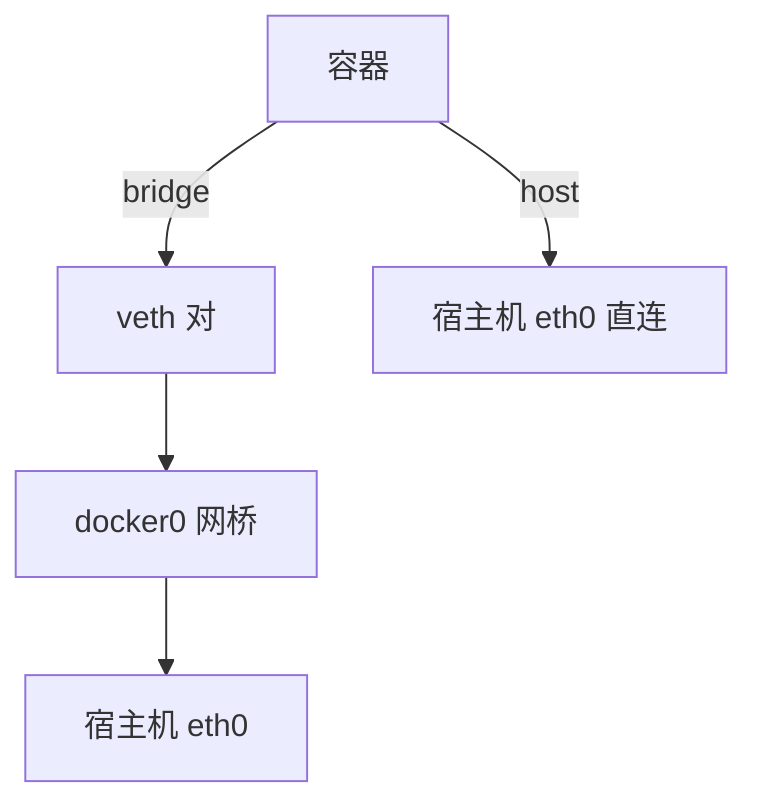
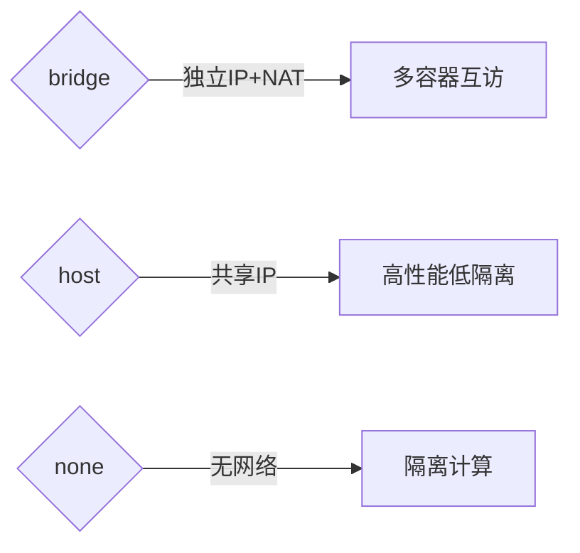
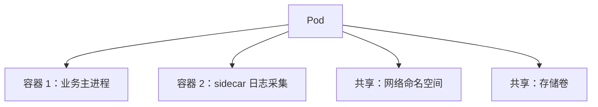
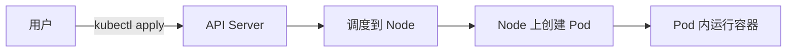

# Topic Teach 产物示例

> 供 AI 参考"产物长什么样"，锚定格式。示例基于虚构的 `docker 网络模式`（速览）、`k8s 基础`（课程制阶段 1 课 2 的一个批次）与学习档案，内容为示意，非完整教学正文。

## 目录

- [示例 1：速览模式 overview.md 成品](#示例-1速览模式-overviewmd-成品)
- [示例 2：课程制单课 lesson-02 成品（知识点粒度）](#示例-2课程制单课-lesson-02-成品知识点粒度)
- [示例 3：学习档案（知识点级进度 + 评审记录 + 大纲调整）](#示例-3学习档案知识点级进度--评审记录--大纲调整)
- [示例 4：学习路径总览与 SVG 用法](#示例-4学习路径总览与-svg-用法)
- [示例 5：B-1 数据结构内部结构 SVG（哈希表）](#示例-5b-1-数据结构内部结构-svg哈希表)
- [示例 6：B-2 算法执行过程 SVG（数组插入）](#示例-6b-2-算法执行过程-svg数组插入)
- [示例 7：B-3 层级结构 SVG（OSI 七层模型）](#示例-7b-3-层级结构-svgosi-七层模型)
- [示例 8：B-4 多概念对比分类 SVG（线性 vs 非线性数据结构）](#示例-8b-4-多概念对比分类-svg线性-vs-非线性数据结构)
- [示例 9：B-5 数据可视化 SVG（时间复杂度曲线）](#示例-9b-5-数据可视化-svg时间复杂度曲线)

---

## 示例 1：速览模式 overview.md 成品

> 场景：用户说"什么是 docker 网络模式"，走速览。文件为 `docker-networking/overview.md`。

```markdown
# Docker 网络模式速览

> 水平：入门（按默认画像生成，可要求调整）｜ 日期：2026-08-03

## 速览大纲

本次讲清：Docker 的 5 种网络模式是什么、各自适合什么场景。
想深入？见文末"延伸学习提示词"，可升级为完整课程。

## 从一个类比说起

Docker 网络模式 ≈ 一间宿舍楼的几种联网方案：
- bridge = 每间房通过楼道交换机互相通信（默认）
- host = 房间直接钉在楼外墙上，不经过楼道
- none = 房间不接网线

## 核心原理

### 5 种模式一览

| 模式 | 一句话 | 类比 | 适用 |
|------|--------|------|------|
| bridge（默认） | 容器经虚拟网桥 NAT 访问外部 | 楼道交换机 | 单机多容器互访 |
| host | 容器直接共享宿主机网络栈 | 钉在楼外墙上 | 追求极低延迟 |
| none | 无网络 | 不接网线 | 离线计算任务 |
| container | 共享另一容器的网络栈 | 室友共用一根网线 | 网络代理/监控边车 |
| overlay | 跨多台宿主机组虚拟网络 | 楼与楼之间的隧道 | Swarm/集群服务 |



### 关键区分：bridge vs host

- **bridge**：容器有独立 IP（172.17.x.x），外部访问需端口映射（`-p`）。
- **host**：容器用宿主机 IP 与端口，无独立 IP，性能最好但隔离最弱。

> 类比的边界：宿舍楼方案里每间房是固定的；真实 Docker 中一个容器可随时换网络模式（创建时决定），且 bridge 不止一个网桥。

## 🐞 常见误区

1. **以为 host 模式更安全**：host 让容器直接暴露宿主机端口，隔离弱，默认不用。
2. **以为 bridge 下容器能 ping 通宿主机 IP 是必然**：能通，但走的是 NAT，不代表网络完全透明。

## 一图总结



## 🚀 想深入？复制发给 AI

```
我刚看了 docker-networking/overview.md 关于 docker 网络模式的速览，
想进一步学习，请按我的情况（入门 / 目标 理解概念）把 "overlay 网络与跨主机通信" 展开成一个课程。
```
```

> 速览写完：过事实核查闸门 + course-reviewer 轻量评审（准确性 + 格式）后交付。

---

## 示例 2：课程制单课 lesson-02 成品（知识点粒度）

> 场景：课程制 `k8s 基础`，阶段 1（容器与 k8s 基础）课 2《Pod》，本批含 3 个知识点。文件为 `k8s-basics/stages/1-容器与k8s基础/lessons/lesson-02-pod.md`。

```markdown
# 第 2 课：Pod——k8s 的最小调度单位

> 所属阶段：阶段 1《容器与 k8s 基础》｜ 水平：零基础 ｜ 本课知识点：Pod 概念、Pod YAML、多容器共享

## 🎯 本课目标

- 说清 Pod 与容器的关系
- 知道 Pod 里多个容器如何共享网络与存储
- 能写出一个最简单的 Pod YAML

## 从一个类比说起

Pod ≈ 合租房间：容器是室友，共享网络（一根网线）和存储（一套水电）。
k8s 不直接调度容器，而是调度"房间"（Pod）。

---

### 知识点 1：Pod 概念

#### 是什么



- Pod 是 k8s 的最小调度单位，一个 Pod 可含 1~N 个容器。
- 同 Pod 容器共享 localhost（同一网络命名空间），用 localhost 互访。

#### 一句话记住

> Pod = 一组容器的"合租房间"，k8s 只调度房间不单挑室友。

### 知识点 2：Pod YAML

#### 是什么

```yaml
apiVersion: v1
kind: Pod
metadata:
  name: nginx-demo
spec:
  containers:
    - name: nginx
      image: nginx:1.27
```

> 命令适用版本：k8s v1.20+（`kind: Pod` 长期稳定）。

#### 怎么用

```bash
kubectl apply -f pod.yaml        # 创建
kubectl get pods                 # 查看
kubectl describe pod nginx-demo  # 看详情（含事件）
```

预期输出：`nginx-demo   1/1   Running`。

#### 一句话记住

> YAML 四要素：`apiVersion` / `kind` / `metadata` / `spec`，容器写在 `spec.containers`。

### 知识点 3：多容器共享

#### 是什么

同 Pod 多容器共享：网络命名空间（localhost 互通）、存储卷（共享磁盘）、IPC / PID（可选）。

#### 类比的边界

合租房间里室友各有手机号（独立进程），但共享宽带和水电（网络与存储）——真实 Pod 中容器各自独立运行，仅共享声明过的资源。

---

## 🐞 常见误区

1. **以为一个 Pod 只能一个容器**：可多容器，但多数场景一 Pod 一容器。
2. **以为 Pod 名可随意改**：Pod 名全局唯一，创建后不可改（只能删了重建）。

## 一图总结



## 课后小测

**Q1**：一个 Pod 里多个容器如何通信？
- A. 通过容器 IP 互访
- B. 通过 localhost 互访 ✅（同网络命名空间）
- C. 不能通信
- D. 通过宿主机端口

<details><summary>答案与解析</summary>

**Q1 答案：B**。同 Pod 容器共享网络命名空间，用 localhost 即可互访。

</details>

**Q2**：...

## 🚀 下一批接力提示词

> 学完本批后，**复制下面这段文字发给 AI**，即可无缝进入下一批（无需重新描述上下文）：

```
继续学 k8s 基础。我的学习档案在 k8s-basics/00-学习档案.md，
刚学完阶段 1《容器与 k8s 基础》的课《Pod》知识点 Pod 概念、Pod YAML、多容器共享，
请按大纲继续讲解下一批知识点。
```
```

> 若本课为阶段最后一批，接力提示词改为"🎉 本阶段完成"提示。

---

## 示例 3：学习档案（知识点级进度 + 评审记录 + 大纲调整）

> 场景：用户学到课 2 后反馈"Deployment 偏难"，AI 调整大纲。文件为 `k8s-basics/00-学习档案.md` 片段。

```markdown
# k8s 基础 学习档案

## 学习者画像

| 项目 | 值 | 来源 |
|------|-----|------|
| 主题 | k8s 基础 | 用户指定 |
| 当前水平 | 零基础 | 用户指定 |
| 学习目标 | 理解概念 | 默认值（用户未指定） |
| 输出格式 | Markdown（主载体，Mermaid + SVG 图表） | 默认值 |
| 模式 | 课程制 | 自动判定，用户已确认 |

## 知识点级进度表

| 阶段 | 课 | 知识点 | 状态 | 完成日期 | 小测成绩 |
|------|-----|--------|------|----------|----------|
| 1 | 课 1 | 容器基础 | ✅ 已完成 | 2026-08-02 | - |
| 1 | 课 2 | Pod 概念 | ✅ 已完成 | 2026-08-03 | 1/2 |
| 1 | 课 2 | Pod YAML | ✅ 已完成 | 2026-08-03 | - |
| 1 | 课 2 | 多容器共享 | 🔄 进行中 | - | - |
| 1 | 课 3 | Deployment 基础 | ⬜ 未开始 | - | - |
| 1 | 课 3 | 副本伸缩 | ⬜ 未开始 | - | - |

## 评审记录

| 日期 | 评审对象 | 评审方式 | 意见摘要 | 处置 |
|------|----------|----------|----------|------|
| 2026-08-02 | 多阶段大纲 | use_agent 委派 | P0×0 / P1×2（阶段 2 目标过宽、课 3 知识点过密） | 采纳：拆目标、课 3 拆为 2 课 |
| 2026-08-03 | 课 2 批次 | 主 agent 内联（子 agent 未创建） | P0×1（Pod YAML 命令版本标注缺失）→ 已修订 | 修订后复审通过 |

## 大纲调整记录

| 日期 | 调整内容 | 原因 |
|------|----------|------|
| 2026-08-03 | 课 3 拆为 3a（Deployment 基础）与 3b（副本伸缩） | 第 2 课小测 1/2，用户反馈概念偏难，放慢节奏 |

**断点续学规则**：读进度表找当前阶段第一个非"已完成"的知识点继续（本档案 → 课 2 知识点「多容器共享」）。
```

---

## 示例 4：学习路径总览与 SVG 用法

> 场景：课程制 `k8s 基础` 落盘后的 `01-学习路径总览.md` 片段，展示阶段依赖图 SVG 的用法（SVG 文件存 `k8s-basics/assets/`）。

```markdown
# k8s 基础 学习路径总览

## 学习路径图


> SVG 内容示意：三个阶段方框（基础 → 调度与工作负载 → 网络与存储），带依赖箭头。
> AI 生成结构化简单 SVG（方框 + 箭头 + 文本标签）；复杂视觉设计标注「需设计工具产出」。

## 阶段总览

### 阶段 1：容器与 k8s 基础

- **目标**：能看懂最简单的 Pod YAML
- **学习重点**：容器隔离原理、Pod 作为最小调度单位
- **必须掌握**：能写出并解释一个 Pod YAML；说清 Pod 与容器关系
- **对应课**：课 1 容器基础、课 2 Pod、课 3 Deployment

### 阶段 2：调度与工作负载

- **目标**：能部署并伸缩应用
- **学习重点**：Deployment 副本管理、滚动更新与回滚
- **必须掌握**：用 kubectl 完成一次滚动更新并回滚
- **对应课**：课 4 Service、课 5 Ingress
```

> SVG 命名规范：kebab-case + 语义化（`learning-path-overview.svg`），存 `assets/`，`` 引用。阶段概览 `overview.md` 中的"本阶段路径图"同样用 SVG。

> **不使用 HTML**：原有 HTML 内联片段（`<details>` + `<style>`）场景已由 Mermaid + SVG 覆盖，且 GitHub 对 SVG 文件兼容性更好。

---

## 示例 5：B-1 数据结构内部结构 SVG（哈希表）

> 场景：课程制讲解「哈希表」知识点时，文字描述"数组+链表"结构学习者难以脑补完整画面。触发 B-1 信号 → 产出 SVG 具象化内部构造图。
> 文件存 `data-structures/stages/1-数据结构基础/assets/hash-table-structure.svg`，在课文中以 `` 引用。

### 知识点正文中的引用方式

```markdown
### 哈希表的内部结构

文字讲不清？看图：


> 上图：hash 函数将 key 映射到数组索引（0~7），每个桶（bucket）存放一个链表头指针；
> 冲突的元素（如 "alice" 和 "bob" 都映射到索引 1）以链表形式挂在同一桶下。

**关键点**：
- 查找 = 先算 hash(key) 定位桶 → 再遍历链表比较 key
- 最坏情况（所有元素都冲突到同一桶）→ 退化为 O(n) 链表查找
```

### SVG 文件内容示意

```svg
<svg xmlns="http://www.w3.org/2000/svg" viewBox="0 0 600 320" width="600" height="320">
  <style>
    text { font-family: monospace; font-size: 13px; fill: #333; }
    .title { font-size: 16px; font-weight: bold; }
    .label { font-size: 11px; fill: #666; }
    .box { fill: #e8f4fd; stroke: #2196F3; stroke-width: 1.5; rx: 3; }
    .bucket { fill: #fff8e1; stroke: #FFC107; stroke-width: 1.5; }
    .node { fill: #e8f5e9; stroke: #4CAF50; stroke-width: 1.5; rx: 12; }
    .arrow { stroke: #666; stroke-width: 1.5; marker-end: url(#head); }
    .highlight { fill: #ffe0b2; stroke: #FF9800; stroke-width: 2; }
  </style>
  <defs><marker id="head" markerWidth="8" markerHeight="8" refX="6" refY="3" orient="auto"><path d="M0,0 L0,6 L6,3 z" fill="#666"/></marker></defs>

  <!-- 标题 -->
  <text x="300" y="25" class="title" text-anchor="middle">Hash Table：key → index → bucket → 链表</text>

  <!-- 左列：key-value 对 -->
  <text x="60" y="60" class="label" text-anchor="middle">键值对</text>
  <g transform="translate(20,75)">
    <rect class="node" x="0" y="0" width="80" height="28"/><text x="40" y="19" text-anchor="middle">"alice":25</text>
    <rect class="node" x="0" y="35" width="80" height="28"/><text x="40" y="54" text-anchor="middle">"bob":42</text>
    <rect class="node" x="0" y="70" width="80" height="28"/><text x="40" y="89" text-anchor="middle">"cat":10</text>
    <rect class="node" x="0" y="105" width="80" height="28"/><text x="40" y="124" text-anchor="middle">"dog":99</text>
    <rect class="node" x="0" y="140" width="80" height="28"/><text x="40" y="159" text-anchor="middle">"eve":7</text>
  </g>

  <!-- 中列：hash 函数 + 数组索引 -->
  <text x="200" y="60" class="label" text-anchor="middle">hash() → index</text>
  <g transform="translate(160,75)">
    <text x="40" y="19" text-anchor="middle">hash("alice") % 8 = <tspan class="highlight" fill="#d84315">1</tspan></text>
    <text x="40" y="54" text-anchor="middle">hash("bob") % 8 = <tspan class="highlight" fill="#d84315">1</tspan></text>
    <text x="40" y="89" text-anchor="middle">hash("cat") % 8 = 2</text>
    <text x="40" y="124" text-anchor="middle">hash("dog") % 8 = 3</text>
    <text x="40" y="159" text-anchor="middle">hash("eve") % 8 = 7</text>
  </g>

  <!-- 右列：数组桶 + 链表 -->
  <text x="420" y="60" class="label" text-anchor="middle">Bucket 数组 → 链表</text>
  <g transform="translate(340,75)">
    <!-- bucket 0 -->
    <rect class="bucket" x="0" y="0" width="36" height="28"/><text x="18" y="19" text-anchor="middle">[0]</text>
    <text x="45" y="19" class="label">null</text>
    <!-- bucket 1 (collision!) -->
    <rect class="highlight" x="0" y="35" width="36" height="28"/><text x="18" y="54" text-anchor="middle">[1]</text>
    <line x1="36" y1="49" x2="55" y2="49" class="arrow"/>
    <rect class="node" x="55" y="37" width="70" height="24"/><text x="90" y="54" text-anchor="middle">"alice":25</text>
    <line x1="125" y1="49" x2="140" y2="49" class="arrow"/>
    <rect class="node" x="140" y="37" width="65" height="24"/><text x="172" y="54" text-anchor="middle">"bob":42</text>
    <line x1="205" y1="49" x2="215" y2="49" class="arrow"/>
    <text x="220" y="54" class="label">∅</text>
    <!-- bucket 2 -->
    <rect class="bucket" x="0" y="70" width="36" height="28"/><text x="18" y="89" text-anchor="middle">[2]</text>
    <line x1="36" y1="84" x2="55" y2="84" class="arrow"/>
    <rect class="node" x="55" y="72" width="60" height="24"/><text x="85" y="89" text-anchor="middle">"cat":10</text>
    <line x1="115" y1="84" x2="125" y2="84" class="arrow"/>
    <text x="130" y="89" class="label">∅</text>
    <!-- bucket 3 -->
    <rect class="bucket" x="0" y="105" width="36" height="28"/><text x="18" y="124" text-anchor="middle">[3]</text>
    <line x1="36" y1="119" x2="55" y2="119" class="arrow"/>
    <rect class="node" x="55" y="107" width="58" height="24"/><text x="84" y="124" text-anchor="middle">"dog":99</text>
    <line x1="113" y1="119" x2="123" y2="119" class="arrow"/>
    <text x="128" y="124" class="label">∅</text>
    <!-- bucket 4-6 (省略) -->
    <rect class="bucket" x="0" y="140" width="36" height="28"/><text x="18" y="159" text-anchor="middle">[4]</text>
    <text x="45" y="159" class="label">...</text>
    <!-- bucket 7 -->
    <rect class="bucket" x="0" y="175" width="36" height="28"/><text x="18" y="194" text-anchor="middle">[7]</text>
    <line x1="36" y1="189" x2="55" y2="189" class="arrow"/>
    <rect class="node" x="55" y="177" width="56" height="24"/><text x="83" y="194" text-anchor="middle">"eve":7</text>
    <line x1="111" y1="189" x2="121" y2="189" class="arrow"/>
    <text x="126" y="194" class="label">∅</text>
  </g>

  <!-- 底部说明 -->
  <text x="300" y="305" class="label" text-anchor="middle">
    🟠 bucket [1] 发生碰撞："alice" 和 "bob" 的 hash 值 % 8 都等于 1 → 以链表解决冲突
  </text>
</svg>
```

> **设计要点**：
> - 三列布局：左=输入数据、中=hash 计算、右=存储结构——完整展示"数据怎么进去、存到哪里"
> - 冲突桶 `[1]` 用高亮色（橙色）标注，底部文字解释原因
> - 链表节点用圆角矩形 + `→ ∅` 表示链表结尾
> - 纯静态 SVG，无动画依赖；如需增强可加 CSS 渐入动画（按 P0 动画规范）

---

## 示例 6：B-2 算法执行过程 SVG（数组插入）

> 场景：课程制讲解「数组插入操作」时，需演示"在索引 2 处插入元素后，后续元素如何逐步右移"。触发 B-2 信号 → 产出分步纵向排列的状态快照图。
> 文件存 `data-structures/stages/1-数据结构基础/assets/array-insert-step.svg`，在课文中以 `` 引用。

### 知识点正文中的引用方式

```markdown
### 数组插入：在索引 2 处插入 42

**问题**：数组是连续内存，中间不能有空洞。在索引 2 插入新元素后，原来的元素怎么办？


> 如上图：
> - **初始状态**：`[10, 20, 30, 40, 50]`，length = 5
> - **Step 1**：先从末尾开始，把索引 4 的元素右移一位（腾出位置）
> - **Step 2**：依次把索引 3 → 4、索引 2 → 3...像多米诺骨牌一样从右往左移
> - **Step 3**：索引 2 空出来了！写入新值 42
> - **结果**：`[10, 20, 42, 30, 40, 50]`，length = 6
>
> **时间复杂度**：O(n) —— 最坏情况下要移动 n-1 个元素
```

### SVG 文件内容示意

```svg
<svg xmlns="http://www.w3.org/2000/svg" viewBox="0 0 500 400" width="500" height="400">
  <style>
    text { font-family: monospace; font-size: 13px; fill: #333; }
    .step-label { font-size: 14px; font-weight: bold; fill: #1565C0; }
    .index { font-size: 11px; fill: #888; }
    .cell { fill: #f5f5f5; stroke: #bbb; stroke-width: 1; rx: 3; }
    .cell-moving { fill: #fff3e0; stroke: #FF9800; stroke-width: 2; rx: 3; }
    .cell-new { fill: #e8f5e9; stroke: #4CAF50; stroke-width: 2; rx: 3; }
    .cell-empty { fill: #fce4ec; stroke: #e91e63; stroke-width: 1.5; stroke-dasharray: 4,2; rx: 3; }
    .arrow-right { stroke: #4CAF50; stroke-width: 2; marker-end: url(#green-head); }
    .arrow-move { stroke: #FF9800; stroke-width: 1.5; stroke-dasharray: 3,2; marker-end: url(#orange-head); }
    .annotation { font-size: 11px; fill: #666; font-style: italic; }
  </style>
  <defs>
    <marker id="green-head" markerWidth="8" markerHeight="8" refX="6" refY="3" orient="auto"><path d="M0,0 L0,6 L6,3 z" fill="#4CAF50"/></marker>
    <marker id="orange-head" markerWidth="8" markerHeight="8" refX="6" refY="3" orient="auto"><path d="M0,0 L0,6 L6,3 z" fill="#FF9800"/></marker>
  </defs>

  <!-- 标题 -->
  <text x="250" y="25" class="step-label" text-anchor="middle">数组插入：insert(arr, 2, 42) 分步演示</text>

  <!-- ===== 初始状态 ===== -->
  <text x="30" y="55" class="step-label">初始</text>
  <g transform="translate(80,40)">
    <!-- 索引行 -->
    <text x="15" y="12" class="index" text-anchor="middle">0</text>
    <text x="55" y="12" class="index" text-anchor="middle">1</text>
    <text x="95" y="12" class="index" text-anchor="middle">2</text>
    <text x="135" y="12" class="index" text-anchor="middle">3</text>
    <text x="175" y="12" class="index" text-anchor="middle">4</text>
    <!-- 数据行 -->
    <rect class="cell" x="0" y="18" width="38" height="26"/><text x="19" y="36" text-anchor="middle">10</text>
    <rect class="cell" x="40" y="18" width="38" height="26"/><text x="59" y="36" text-anchor="middle">20</text>
    <rect class="cell" x="80" y="18" width="38" height="26"/><text x="99" y="36" text-anchor="middle">30</text>
    <rect class="cell" x="120" y="18" width="38" height="26"/><text x="139" y="36" text-anchor="middle">40</text>
    <rect class="cell" x="160" y="18" width="38" height="26"/><text x="179" y="36" text-anchor="middle">50</text>
  </g>
  <text x="350" y="58" class="annotation">length=5，要在索引 2 插入 42</text>

  <!-- ↓ 箭头 -->
  <text x="250" y="90" text-anchor="middle" class="annotation">↓ 从末尾开始，逐个右移</text>

  <!-- ===== Step 1 ===== -->
  <text x="30" y="120" class="step-label">Step 1</text>
  <g transform="translate(80,105)">
    <text x="15" y="12" class="index" text-anchor="middle">0</text>
    <text x="55" y="12" class="index" text-anchor="middle">1</text>
    <text x="95" y="12" class="index" text-anchor="middle">2</text>
    <text x="135" y="12" class="index" text-anchor="middle">3</text>
    <text x="175" y="12" class="index" text-anchor="middle">4</text>
    <text x="215" y="12" class="index" text-anchor="middle">5</text>
    <rect class="cell" x="0" y="18" width="38" height="26"/><text x="19" y="36" text-anchor="middle">10</text>
    <rect class="cell" x="40" y="18" width="38" height="26"/><text x="59" y="36" text-anchor="middle">20</text>
    <rect class="cell" x="80" y="18" width="38" height="26"/><text x="99" y="36" text-anchor="middle">30</text>
    <rect class="cell" x="120" y="18" width="38" height="26"/><text x="139" y="36" text-anchor="middle">40</text>
    <rect class="cell-moving" x="160" y="18" width="38" height="26"/><text x="179" y="36" text-anchor="middle">50</text>
    <!-- 移动箭头 -->
    <line x1="203" y1="31" x2="225" y2="31" class="arrow-move"/>
    <rect class="cell-empty" x="228" y="18" width="38" height="26"/><text x="247" y="36" text-anchor="middle" fill="#e91e63">?</text>
  </g>
  <text x="350" y="123" class="annotation">arr[4] → arr[5]（50 右移）</text>

  <!-- ↓ -->
  <text x="250" y="155" text-anchor="middle" class="annotation">↓ 继续左移</text>

  <!-- ===== Step 2 ===== -->
  <text x="30" y="185" class="step-label">Step 2</text>
  <g transform="translate(80,170)">
    <text x="15" y="12" class="index" text-anchor="middle">0</text>
    <text x="55" y="12" class="index" text-anchor="middle">1</text>
    <text x="95" y="12" class="index" text-anchor="middle">2</text>
    <text x="135" y="12" class="index" text-anchor="middle">3</text>
    <text x="175" y="12" class="index" text-anchor="middle">4</text>
    <text x="215" y="12" class="index" text-anchor="middle">5</text>
    <rect class="cell" x="0" y="18" width="38" height="26"/><text x="19" y="36" text-anchor="middle">10</text>
    <rect class="cell" x="40" y="18" width="38" height="26"/><text x="59" y="36" text-anchor="middle">20</text>
    <rect class="cell" x="80" y="18" width="38" height="26"/><text x="99" y="36" text-anchor="middle">30</text>
    <rect class="cell-moving" x="120" y="18" width="38" height="26"/><text x="139" y="36" text-anchor="middle">40</text>
    <rect class="cell" x="160" y="18" width="38" height="26"/><text x="179" y="36" text-anchor="middle">50</text>
    <line x1="163" y1="31" x2="185" y2="31" class="arrow-move"/>
    <rect class="cell-empty" x="188" y="18" width="38" height="26"/><text x="207" y="36" text-anchor="middle" fill="#e91e63">?</text>
    <rect class="cell" x="228" y="18" width="38" height="26"/><text x="247" y="36" text-anchor="middle">50</text>
  </g>
  <text x="350" y="188" class="annotation">arr[3] → arr[4]（40 右移）</text>

  <!-- ↓ -->
  <text x="250" y="220" text-anchor="middle" class="annotation">↓ 目标位置空出！</text>

  <!-- ===== Step 3（最终） ===== -->
  <text x="30" y="250" class="step-label">Step 3</text>
  <g transform="translate(80,235)">
    <text x="15" y="12" class="index" text-anchor="middle">0</text>
    <text x="55" y="12" class="index" text-anchor="middle">1</text>
    <text x="95" y="12" class="index" text-anchor="middle">2</text>
    <text x="135" y="12" class="index" text-anchor="middle">3</text>
    <text x="175" y="12" class="index" text-anchor="middle">4</text>
    <text x="215" y="12" class="index" text-anchor="middle">5</text>
    <rect class="cell" x="0" y="18" width="38" height="26"/><text x="19" y="36" text-anchor="middle">10</text>
    <rect class="cell" x="40" y="18" width="38" height="26"/><text x="59" y="36" text-anchor="middle">20</text>
    <rect class="cell-new" x="80" y="18" width="38" height="26"/><text x="99" y="36" text-anchor="middle" fill="#2e7d32" font-weight="bold">42</text>
    <line x1="60" y1="-8" x2="95" y2="-8" class="arrow-right"/>
    <text x="77" y="-12" text-anchor="middle" font-size="11" fill="#4CAF50">写入!</text>
    <rect class="cell" x="120" y="18" width="38" height="26"/><text x="139" y="36" text-anchor="middle">30</text>
    <rect class="cell" x="160" y="18" width="38" height="26"/><text x="179" y="36" text-anchor="middle">40</text>
    <rect class="cell" x="228" y="18" width="38" height="26"/><text x="247" y="36" text-anchor="middle">50</text>
  </g>
  <text x="350" y="253" class="annotation">arr[2] = 42 ✅ 插入完成！</text>

  <!-- 结果总结框 -->
  <rect x="80" y="280" width="340" height="35" fill="#e3f2fd" stroke="#1565C0" stroke-width="1" rx="5"/>
  <text x="250" y="303" text-anchor="middle" font-weight="bold">结果：[10, 20, 42, 30, 40, 50] &nbsp;|&nbsp; length=6 &nbsp;|&nbsp; 移动了 3 个元素 → O(n)</text>

  <!-- 图例 -->
  <g transform="translate(80,330)">
    <rect class="cell" x="0" y="0" width="20" height="14"/><text x="28" y="12" class="annotation">未变动</text>
    <rect class="cell-moving" x="90" y="0" width="20" height="14"/><text x="118" y="12" class="annotation">正在移动</text>
    <rect class="cell-new" x="200" y="0" width="20" height="14"/><text x="228" y="12" class="annotation">新插入</text>
    <rect class="cell-empty" x="290" y="0" width="20" height="14"/><text x="318" y="12" class="annotation">待填充</text>
  </g>
</svg>
```

> **设计要点**：
> - 纵向时间线：初始 → Step 1 → Step 2 → Step 3，每步一个完整数组快照
> - 颜色编码：灰色=未变、橙色=移动中、绿色=新写入、红色虚线=待填充
> - 移动方向用虚线箭头 `⇢` 标注，写入用实线绿色箭头 `→` 强调
> - 底部总结框给出终态 + 复杂度结论
> - 图例帮助读者快速理解颜色含义

---

## 示例 7：B-3 层级结构 SVG（OSI 七层模型）

:> 场景：课程制讲解「网络基础」时，需展示 OSI 七层模型的层级关系与各层职责。触发 B-3 信号（层级结构）→ 产出横向分层 + 层间交互箭头 + 每层职责标注的层级图。
:> 文件存 `network-basics/stages/1-网络基础/assets/osi-seven-layers.svg`，在课文中以 `` 引用。

### 知识点正文中的引用方式

```markdown
### OSI 七层模型

网络通信不是"一步到位"的，而是像发快递一样要经过多层处理：


> 上图：数据从发送方**应用层**出发，逐层向下封装（每层加上自己的头部/尾部），
> 到达物理层变成比特流；接收方从物理层逐层向上解封装，最终到达应用层。
>
> **关键记忆口诀**："软传网数链物应"（从上往下）

**各层核心职责**：
| 层 | 名称 | 一句话 | 现实类比 |
|---|------|--------|----------|
| 7 | 应用层 | 为用户应用提供网络服务（HTTP/FTP/SMTP） | 你写的 App |
| 6 | 表示层 | 数据格式转换、加密解密 | 翻译官 |
| 5 | 会话层 | 建立/管理/终止会话 | 接线员 |
| 4 | 传输层 | 端到端可靠传输（TCP/UDP） | 快递公司 |
| 3 | 网络层 | 路由选择与 IP 寻址 | 邮局分拣 |
| 2 | 数据链路层 | 节点到节点的帧传输（MAC 地址） | 出租车 |
| 1 | 物理层 | 比特流在介质上的传输 | 公路
```

### SVG 文件内容示意

```svg
<svg xmlns="http://www.w3.org/2000/svg" viewBox="0 0 520 480" width="520" height="480">
  <style>
    text { font-family: -apple-system, "Segoe UI", sans-serif; }
    .title { font-size: 16px; font-weight: bold; fill: #1a237e; }
    .layer-num { font-size: 22px; font-weight: bold; fill: #fff; }
    .layer-name { font-size: 14px; font-weight: bold; fill: #fff; }
    .layer-desc { font-size: 11px; fill: #fff; }
    .proto { font-size: 10px; fill: #cfd8dc; }
    .arrow-label { font-size: 10px; fill: #666; font-style: italic; }
    .side-label { font-size: 11px; fill: #555; }
    .mnemonic { font-size: 13px; font-weight: bold; fill: #e65100; }
  </style>
  <defs>
    <marker id="down" markerWidth="8" markerHeight="8" refX="4" refY="0" orient="auto"><path d="M0,0 L4,8 L8,0 z" fill="#90a4ae"/></marker>
    <marker id="up" markerWidth="8" markerHeight="8" refX="4" refY="8" orient="auto"><path d="M0,8 L4,0 L8,8 z" fill="#90a4ae"/></marker>
  </defs>

  <!-- 标题 -->
  <text x="260" y="28" class="title" text-anchor="middle">OSI 七层模型 —— 数据封装与解封装</text>

  <!-- 左侧标签 -->
  <text x="25" y="70" class="side-label" text-anchor="middle">发</text>
  <text x="25" y="85" class="side-label" text-anchor="middle">送</text>
  <text x="25" y="250" class="side-label" text-anchor="middle">接</text>
  <text x="25" y="265" class="side-label" text-anchor="middle">收</text>

  <!-- 层 7：应用层 -->
  <rect x="60" y="50" width="400" height="46" rx="5" fill="#1565C0"/>
  <text x="80" y="78" class="layer-num">7</text>
  <text x="110" y="72" class="layer-name">应用层 Application</text>
  <text x="110" y="88" class="layer-desc">为用户应用提供网络服务接口</text>
  <text x="380" y="78" class="proto">HTTP / FTP / SMTP / DNS</text>

  <!-- 封装箭头 ↓ -->
  <line x1="260" y1="96" x2="260" y2="110" stroke="#90a4ae" stroke-width="1.5" marker-end="url(#down)"/>
  <text x="275" y="106" class="arrow-label">封装</text>

  <!-- 层 6：表示层 -->
  <rect x="60" y="112" width="400" height="42" rx="5" fill="#1976D2"/>
  <text x="80" y="138" class="layer-num">6</text>
  <text x="110" y="133" class="layer-name">表示层 Presentation</text>
  <text x="110" y="148" class="layer-desc">数据格式转换、加密/压缩</text>
  <text x="370" y="140" class="proto">SSL/TLS / JPEG / ASCII</text>

  <line x1="260" y1="154" x2="260" y2="168" stroke="#90a4ae" stroke-width="1.5" marker-end="url(#down)"/>

  <!-- 层 5：会话层 -->
  <rect x="60" y="170" width="400" height="38" rx="5" fill="#1E88E5"/>
  <text x="80" y="194" class="layer-num">5</text>
  <text x="110" y="192" class="layer-name">会话层 Session</text>
  <text x="280" y="194" class="layer-desc">建立/管理/终止通信会话</text>

  <line x1="260" y1="208" x2="260" y2="222" stroke="#90a4ae" stroke-width="1.5" marker-end="url(#down)"/>

  <!-- 层 4：传输层 -->
  <rect x="60" y="224" width="400" height="42" rx="5" fill="#2196F3"/>
  <text x="80" y="252" class="layer-num">4</text>
  <text x="110" y="245" class="layer-name">传输层 Transport</text>
  <text x="110" y="261" class="layer-desc">端到端可靠/不可靠传输、分段重组</text>
  <text x="365" y="253" class="proto">TCP / UDP</text>

  <line x1="260" y1="266" x2="260" y2="280" stroke="#90a4ae" stroke-width="1.5" marker-end="url(#down)"/>

  <!-- 层 3：网络层 -->
  <rect x="60" y="282" width="400" height="42" rx="5" fill="#42A5F5"/>
  <text x="80" y="310" class="layer-num">3</text>
  <text x="110" y="303" class="layer-name">网络层 Network</text>
  <text x="110" y="319" class="layer-desc">IP 寻址、路由选择、逻辑寻址</text>
  <text x="360" y="311" class="proto">IP / ICMP / OSPF</text>

  <line x1="260" y1="324" x2="260" y2="338" stroke="#90a4ae" stroke-width="1.5" marker-end="url(#down)"/>

  <!-- 层 2：数据链路层 -->
  <rect x="60" y="340" width="400" height="42" rx="5" fill="#64B5F6"/>
  <text x="80" y="368" class="layer-num">2</text>
  <text x="110" y="361" class="layer-name">数据链路层 Data Link</text>
  <text x="110" y="377" class="layer-desc">MAC 寻址、帧封装、差错检测</text>
  <text x="355" y="369" class="proto">Ethernet / PPP / MAC</text>

  <line x1="260" y1="382" x2="260" y2="396" stroke="#90a4ae" stroke-width="1.5" marker-end="url(#down)"/>

  <!-- 层 1：物理层 -->
  <rect x="60" y="398" width="400" height="40" rx="5" fill="#90CAF9"/>
  <text x="80" y="424" class="layer-num">1</text>
  <text x="110" y="418" class="layer-name">物理层 Physical</text>
  <text x="300" y="424" class="layer-desc">比特流传输、电气/机械接口</text>

  <!-- 传输介质 -->
  <rect x="180" y="445" width="160" height="24" rx="12" fill="#eceff1" stroke="#b0bec4" stroke-width="1"/>
  <text x="260" y="462" text-anchor="middle" font-size="11" fill="#546e7a">光纤 / 双绞线 / 电波</text>

  <!-- 解封装箭头（右侧） -->
  <line x1="480" y1="420" x2="480" y2="406" stroke="#90a4ae" stroke-width="1.5" marker-end="url(#up)" stroke-dasharray="4,2"/>
  <line x1="480" y1="362" x2="480" y2="348" stroke="#90a4ae" stroke-width="1.5" marker-end="url(#up)" stroke-dasharray="4,2"/>
  <line x1="480" y1="304" x2="480" y2="290" stroke="#90a4ae" stroke-width="1.5" marker-end="url(#up)" stroke-dasharray="4,2"/>
  <text x="492" y="360" class="arrow-label" transform="rotate(-90,492,360)">解封装</text>

  <!-- 口诀框 -->
  <rect x="60" y="474" width="400" height="1" fill="#e0e0e0"/>
</svg>
```

> **设计要点**：
> - **横向分层布局**：7 层自上而下排列，用渐变蓝色区分层级深度（上层深蓝=靠近用户，下层浅蓝=靠近硬件）
> - **双向箭头**：左侧实线箭头标注"封装"（发送方向），右侧虚线箭头标注"解封装"（接收方向）
> - **每层三要素**：层号（大字）+ 英文名 + 中文职责描述 + 右侧常见协议
> - **底部传输介质**：圆角矩形标注物理介质类型
> - **纯静态 SVG**，无动画依赖；如需增强可加 CSS 渐入动画（按动画规范）

---

## 示例 8：B-4 多概念对比分类 SVG（线性 vs 非线性数据结构）

:> 场景：课程制讲解「数据结构选型」时，需并排对比线性结构与非线性结构的特征差异、适用场景和时间复杂度。触发 B-4 信号 → 产出对比矩阵/分类卡片图。
:> 文件存 `data-structures/stages/2-数据结构进阶/assets/linear-vs-nonlinear.svg`，在课文中以 `` 引用。

### 知识点正文中的引用方式

```markdown
### 线性 vs 非线性：怎么选？

选数据结构不是"背下来就行"，而是要理解**为什么**有的快有的慢：


> 上图：左侧是**线性结构**（一对一关系，像排队），右侧是**非线性结构**（一对多/多对多，像树和网）。
>
> **选型口诀**：
> - 只需要"存了就取、按顺序遍历" → **数组 / 链表**
> - 需要"快速查找" → **哈希表 / 二叉搜索树**
> - 需要"层级关系 / 排序" → **树**
> - 需要"多对多关系" → **图**

**各操作时间复杂度速查**：
| 操作 | 数组 | 链表 | 哈希表 | BST | 图 |
|------|:----:|:----:|:------:|:---:|:--:|
| 查找 | O(n) | O(n) | O(1)* | O(log n) | O(V+E) |
| 插入 | O(n) | O(1) | O(1)* | O(log n) | O(1) |
| 删除 | O(n) | O(1) | O(1)* | O(log n) | O(V+E) |

* 最坏情况 O(n)
```

### SVG 文件内容示意

```svg
<svg xmlns="http://www.w3.org/2000/svg" viewBox="0 0 620 420" width="620" height="420">
  <style>
    text { font-family: -apple-system, "Segoe UI", sans-serif; }
    .title { font-size: 16px; font-weight: bold; fill: #1a237e; }
    .side-title { font-size: 15px; font-weight: bold; fill: #fff; }
    .card-title { font-size: 13px; font-weight: bold; fill: #333; }
    .card-desc { font-size: 11px; fill: #555; }
    .feature { font-size: 10px; fill: #666; }
    .complexity { font-size: 10px; fill: #fff; font-weight: bold; }
    .vs-label { font-size: 18px; font-weight: bold; fill: #e65100; }
    .note { font-size: 10px; fill: #888; font-style: italic; }
  </style>

  <!-- 标题 -->
  <text x="310" y="28" class="title" text-anchor="middle">线性 vs 非线性数据结构 —— 特征与选型</text>

  <!-- ===== 左侧：线性结构 ===== -->
  <rect x="20" y="50" width="280" height="340" rx="10" fill="#E3F2FD" stroke="#1565C0" stroke-width="2"/>
  <rect x="20" y="50" width="280" height="36" rx="10" fill="#1565C0"/>
  <rect x="20" y="76" width="280" height="10" fill="#1565C0"/>
  <text x="160" y="74" class="side-title" text-anchor="middle">📦 线性结构 Linear</text>
  <text x="160" y="100" text-anchor="middle" class="note">元素之间一对一关系，像排成一队</text>

  <!-- 卡片：数组 -->
  <rect x="35" y="115" width="125" height="120" rx="6" fill="#fff" stroke="#90CAF9" stroke-width="1"/>
  <text x="97" y="135" class="card-title" text-anchor="middle">数组 Array</text>
  <line x1="45" y1="143" x2="150" y2="143" stroke="#e0e0e0" stroke-width="1"/>
  <text x="97" y="160" class="card-desc" text-anchor="middle">连续内存存储</text>
  <text x="40" y="178" class="feature">• 固定大小（静态）/ 可扩容（动态）</text>
  <text x="40" y="192" class="feature">• 随机访问 O(1)</text>
  <text x="40" y="206" class="feature">• 插入/删除 O(n)</text>
  <text x="40" y="222" class="feature">• CPU 缓存友好</text>
  <rect x="42" y="228" width="76" height="16" rx="3" fill="#4CAF50"/>
  <text x="80" y="240" class="complexity" text-anchor="middle">读快写慢</text>

  <!-- 卡片：链表 -->
  <rect x="170" y="115" width="125" height="120" rx="6" fill="#fff" stroke="#90CAF9" stroke-width="1"/>
  <text x="232" y="135" class="card-title" text-anchor="middle">链表 Linked List</text>
  <line x1="180" y1="143" x2="285" y2="143" stroke="#e0e0e0" stroke-width="1"/>
  <text x="232" y="160" class="card-desc" text-anchor="middle">指针串联的节点</text>
  <text x="175" y="178" class="feature">• 动态大小，无需预分配</text>
  <text x="175" y="192" class="feature">• 随机访问 O(n)</text>
  <text x="175" y="206" class="feature">• 头部插入/删除 O(1)</text>
  <text x="175" y="220" class="feature">• 额外内存存指针</text>
  <rect x="177" y="228" width="76" height="16" rx="3" fill="#FF9800"/>
  <text x="215" y="240" class="complexity" text-anchor="middle">写快读慢</text>

  <!-- 线性结构示意 -->
  <g transform="translate(35,250)">
    <text x="130" y="12" class="card-title" text-anchor="middle">内存布局示意</text>
    <!-- 数组 -->
    <text x="0" y="32" class="feature">数组：</text>
    <rect x="38" y="22" width="26" height="18" rx="2" fill="#BBDEFB" stroke="#1976D2"/><text x="51" y="35" text-anchor="middle" font-size="9" fill="#333">0</text>
    <rect x="65" y="22" width="26" height="18" rx="2" fill="#BBDEFB" stroke="#1976D2"/><text x="78" y="35" text-anchor="middle" font-size="9" fill="#333">1</text>
    <rect x="92" y="22" width="26" height="18" rx="2" fill="#BBDEFB" stroke="#1976D2"/><text x="105" y="35" text-anchor="middle" font-size="9" fill="#333">2</text>
    <text x="122" y="34" class="feature">...</text>
    <rect x="140" y="22" width="26" height="18" rx="2" fill="#BBDEFB" stroke="#1976D2"/><text x="153" y="35" text-anchor="middle" font-size="9" fill="#333">n</text>
    <!-- 链表 -->
    <text x="0" y="60" class="feature">链表：</text>
    <rect x="38" y="50" width="26" height="18" rx="2" fill="#FFE0B2" stroke="#F57C00"/><text x="51" y="63" text-anchor="middle" font-size="9" fill="#333">A</text>
    <line x1="64" y1="59" x2="75" y2="59" stroke="#F57C00" stroke-width="1.5" marker-end="url(#arrow-right)"/>
    <rect x="78" y="50" width="26" height="18" rx="2" fill="#FFE0B2" stroke="#F57C00"/><text x="91" y="63" text-anchor="middle" font-size="9" fill="#333">B</text>
    <line x1="104" y1="59" x2="118" y2="59" stroke="#F57C00" stroke-width="1.5" marker-end="url(#arrow-right)"/>
    <rect x="121" y="50" width="26" height="18" rx="2" fill="#FFE0B2" stroke="#F57C00"/><text x="134" y="63" text-anchor="middle" font-size="9" fill="#333">C</text>
    <text x="152" y="62" class="feature">→ ∅</text>
  </g>

  <!-- 中间 VS 分隔符 -->
  <text x="310" y="210" class="vs-label" text-anchor="middle">VS</text>

  <!-- ===== 右侧：非线性结构 ===== -->
  <rect x="320" y="50" width="280" height="340" rx="10" fill="#FFF3E0" stroke="#E65100" stroke-width="2"/>
  <rect x="320" y="50" width="280" height="36" rx="10" fill="#E65100"/>
  <rect x="320" y="76" width="280" height="10" fill="#E65100"/>
  <text x="460" y="74" class="side-title" text-anchor="middle">🌳 非线性结构 Non-Linear</text>
  <text x="460" y="100" text-anchor="middle" class="note">元素之间一对多或多对多关系</text>

  <!-- 卡片：树 -->
  <rect x="335" y="115" width="125" height="120" rx="6" fill="#fff" stroke="#FFCC80" stroke-width="1"/>
  <text x="397" y="135" class="card-title" text-anchor="middle">树 Tree</text>
  <line x1="345" y1="143" x2="450" y2="143" stroke="#e0e0e0" stroke-width="1"/>
  <text x="397" y="160" class="card-desc" text-anchor="middle">层级嵌套结构</text>
  <text x="340" y="178" class="feature">• 一对多（根→子节点）</text>
  <text x="340" y="192" class="feature">• BST 查找 O(log n)</text>
  <text x="340" y="206" class="feature">• 层序/中序等遍历</text>
  <text x="340" y="220" class="feature">• 文件系统 / DOM</text>
  <rect x="342" y="228" width="76" height="16" rx="3" fill="#9C27B0"/>
  <text x="380" y="240" class="complexity" text-anchor="middle">查找优</text>

  <!-- 卡片：图 -->
  <rect x="470" y="115" width="125" height="120" rx="6" fill="#fff" stroke="#FFCC80" stroke-width="1"/>
  <text x="532" y="135" class="card-title" text-anchor="middle">图 Graph</text>
  <line x1="480" y1="143" x2="585" y2="143" stroke="#e0e0e0" stroke-width="1"/>
  <text x="532" y="160" class="card-desc" text-anchor="middle">节点+边的网络</text>
  <text x="475" y="178" class="feature">• 多对多任意连接</text>
  <text x="475" y="192" class="feature">• 有向/无向/加权</text>
  <text x="475" y="206" class="feature">• BFS/DFS/最短路径</text>
  <text x="475" y="220" class="feature">• 社交网络 / 地图</text>
  <rect x="477" y="228" width="76" height="16" rx="3" fill="#F44336"/>
  <text x="515" y="240" class="complexity" text-anchor="middle">最通用</text>

  <!-- 非线性结构示意 -->
  <g transform="translate(335,250)">
    <text x="130" y="12" class="card-title" text-anchor="middle">结构示意</text>
    <!-- 树形示意 -->
    <text x="0" y="32" class="feature">树：</text>
    <circle cx="52" cy="27" r="10" fill="#E1BEE7" stroke="#7B1FA2" stroke-width="1.5"/>
    <text x="52" y="31" text-anchor="middle" font-size="8" fill="#333">Root</text>
    <line x1="52" y1="37" x2="35" y2="48" stroke="#7B1FA2" stroke-width="1"/>
    <line x1="52" y1="37" x2="69" y2="48" stroke="#7B1FA2" stroke-width="1"/>
    <circle cx="30" cy="54" r="8" fill="#E1BEE7" stroke="#7B1FA2" stroke-width="1"/><text x="30" y="57" text-anchor="middle" font-size="7" fill="#333">L</text>
    <circle cx="52" cy="58" r="8" fill="#E1BEE7" stroke="#7B1FA2" stroke-width="1"/><text x="52" y="61" text-anchor="middle" font-size="7" fill="#333">M</text>
    <circle cx="74" cy="54" r="8" fill="#E1BEE7" stroke="#7B1FA2" stroke-width="1"/><text x="74" y="57" text-anchor="middle" font-size="7" fill="#333">R</text>
    <!-- 图形示意 -->
    <text x="95" y="32" class="feature">图：</text>
    <circle cx="150" cy="25" r="8" fill="#FFCDD2" stroke="#D32F2F" stroke-width="1.5"/><text x="150" y="28" text-anchor="middle" font-size="7" fill="#333">A</text>
    <circle cx="172" cy="40" r="8" fill="#FFCDD2" stroke="#D32F2F" stroke-width="1.5"/><text x="172" y="43" text-anchor="middle" font-size="7" fill="#333">B</text>
    <circle cx="145" cy="55" r="8" fill="#FFCDD2" stroke="#D32F2F" stroke-width="1.5"/><text x="145" y="58" text-anchor="middle" font-size="7" fill="#333">C</text>
    <circle cx="190" cy="55" r="8" fill="#FFCDD2" stroke="#D32F2F" stroke-width="1.5"/><text x="190" y="58" text-anchor="middle" font-size="7" fill="#333">D</text>
    <line x1="155" y1="29" x2="166" y2="37" stroke="#D32F2F" stroke-width="1"/>
    <line x1="168" y1="44" x2="151" y2="51" stroke="#D32F2F" stroke-width="1"/>
    <line x1="177" y1="43" x2="185" y2="51" stroke="#D32F2F" stroke-width="1"/>
    <line x1="153" y1="53" x2="182" y2="56" stroke="#D32F2F" stroke-width="1" stroke-dasharray="2,1"/>
  </g>

  <!-- 底部选型提示 -->
  <rect x="20" y="400" width="580" height="16" rx="3" fill="#ECEFF1"/>
  <text x="310" y="412" text-anchor="middle" font-size="10" fill="#546e7a">
    选型原则：优先考虑操作类型（读多？写多？需要排序？）→ 再权衡空间与实现复杂度
  </text>

  <defs><marker id="arrow-right" markerWidth="6" markerHeight="6" refX="5" refY="3" orient="auto"><path d="M0,0 L0,6 L6,3 z" fill="#F57C00"/></marker></defs>
</svg>
```

> **设计要点**：
> - **左右分栏对比**：蓝色系=线性结构，橙色系=非线性结构，视觉上立即区分两大阵营
> - **卡片式呈现**：每类下 2 个代表（数组/链表 vs 树/图），每个卡片含定义 + 4 条关键特征 + 标签
> - **底部结构示意**：用简化的图形展示内存布局差异（数组连续 vs 链表离散 vs 树层级 vs 图网状）
> - **标签色编码**：绿色=读快写慢、橙色=写快读慢、紫色=查找优、红色=最通用
> - **底部选型提示条**：一句话总结选型核心原则

---

## 示例 9：B-5 数据可视化 SVG（时间复杂度曲线）

:> 场景：课程制讲解「算法分析」时，需直观展示不同时间复杂度的增长趋势差异——O(1) 几乎平、O(log n) 缓慢爬升、O(n) 直线增长、O(n log n) 微曲上升、O(n²) 急剧飙升。触发 B-5 信号 → 产出坐标轴 + 曲线 + 关键点标注的数据图表。
:> 文件存 `algorithms/stages/1-算法分析基础/assets/time-complexity-curves.svg`，在课文中以 `` 引用。

### 知识点正文中的引用方式

```markdown
### 时间复杂度：算法快慢的"度量衡"

光说"这个算法快"不够专业，我们需要一个**与硬件无关**的度量标准——时间复杂度：


> 上图展示了常见时间复杂度随数据量 n 增长的趋势。
>
> **关键洞察**：
> - **O(1)**：无论数据多少，耗时不变（哈希表查找）
> - **O(log n)**：数据翻倍只多一步（二分查找）
> - **O(n)**：线性增长（简单遍历）
> - **O(n log n)**：高效排序的上界（归并排序）
> - **O(n²)**：数据量 ×10 → 耗时 ×100！（冒泡排序，嵌套循环）
>
> **实战法则**：n ≤ 5000 时 O(n²) 还能忍；n > 10⁵ 必须用 O(n log n) 或更好

**各复杂度典型算法**：
| 复杂度 | 名称 | 典型算法 |
|--------|------|----------|
| O(1) | 常数 | 数组随机访问、哈希表查找（平均） |
| O(log n) | 对数 | 二分查找、平衡 BST 查找 |
| O(n) | 线性 | 遍历、线性搜索 |
| O(n log n) | 线性对数 | 归并排序、快速排序（平均） |
| O(n²) | 平方 | 冒泡排序、选择排序、嵌套循环 |
```

### SVG 文件内容示意

```svg
<svg xmlns="http://www.w3.org/2000/svg" viewBox="0 0 600 420" width="600" height="420">
  <style>
    text { font-family: -apple-system, "Segoe UI", sans-serif; }
    .title { font-size: 16px; font-weight: bold; fill: #1a237e; }
    .axis-label { font-size: 12px; fill: #333; font-weight: bold; }
    .tick { font-size: 10px; fill: #666; }
    .legend-text { font-size: 11px; fill: #444; }
    .insight { font-size: 10px; fill: #d32f2f; }
    .annotation { font-size: 9px; fill: #666; }
  </style>

  <!-- 背景 -->
  <rect width="600" height="420" fill="#fafafa"/>

  <!-- 标题 -->
  <text x="300" y="28" class="title" text-anchor="middle">时间复杂度增长趋势对比 —— n 越大差距越明显</text>

  <!-- 坐标系 -->
  <g transform="translate(70,50)">
    <!-- 网格线 -->
    <g stroke="#e0e0e0" stroke-width="0.5">
      <line x1="0" y1="0" x2="480" y2="0"/>
      <line x1="0" y1="70" x2="480" y2="70"/>
      <line x1="0" y1="140" x2="480" y2="140"/>
      <line x1="0" y1="210" x2="480" y2="210"/>
      <line x1="0" y1="280" x2="480" y2="280"/>
      <line x1="96" y1="0" x2="96" y2="280"/>
      <line x1="192" y1="0" x2="192" y2="280"/>
      <line x1="288" y1="0" x2="288" y2="280"/>
      <line x1="384" y1="0" x2="384" y2="280"/>
      <line x1="480" y1="0" x2="480" y2="280"/>
    </g>

    <!-- Y 轴 -->
    <line x1="0" y1="0" x2="0" y2="280" stroke="#333" stroke-width="1.5"/>
    <text x="-15" y="5" class="tick" text-anchor="end">T(n)</text>
    <text x="-10" y="4" class="tick" text-anchor="end">↑</text>
    <text x="-10" y="284" class="tick" text-anchor="end">0</text>
    <!-- Y 轴刻度标签 -->
    <text x="-8" y="73" class="tick" text-anchor="end">2k</text>
    <text x="-8" y="143" class="tick" text-anchor="end">4k</text>
    <text x="-8" y="213" class="tick" text-anchor="end">6k</text>
    <text x="-8" y="283" class="tick" text-anchor="end">8k</text>

    <!-- X 轴 -->
    <line x1="0" y1="280" x2="490" y2="280" stroke="#333" stroke-width="1.5"/>
    <text x="485" y="295" class="tick">n →</text>
    <!-- X 轴刻度标签 -->
    <text x="0" y="295" class="tick" text-anchor="middle">0</text>
    <text x="96" y="295" class="tick" text-anchor="middle">20</text>
    <text x="192" y="295" class="tick" text-anchor="middle">40</text>
    <text x="288" y="295" class="tick" text-anchor="middle">60</text>
    <text x="384" y="295" class="tick" text-anchor="middle">80</text>
    <text x="480" y="295" class="tick" text-anchor="middle">100</text>

    <!-- ===== 曲线绘制 ===== -->

    <!-- O(1)：常数 —— 水平线 -->
    <line x1="0" y1="3" x2="480" y2="3" stroke="#4CAF50" stroke-width="2.5"/>
    <circle cx="480" cy="3" r="4" fill="#4CAF50"/>

    <!-- O(log n)：对数 —— 缓慢上升曲线 -->
    <path d="M0,280 L24,195 L48,165 L72,148 L96,136 L120,127 L144,120 L168,114 L192,109 L216,105 L240,101 L264,98 L288,95 L312,92 L336,89 L360,87 L384,85 L408,83 L432,81 L456,79 L480,78"
          fill="none" stroke="#2196F3" stroke-width="2.5" stroke-linecap="round"/>
    <circle cx="480" cy="78" r="4" fill="#2196F3"/>

    <!-- O(n)：线性 —— 直线 -->
    <line x1="0" y1="280" x2="480" y2="0" stroke="#FF9800" stroke-width="2.5"/>
    <circle cx="480" cy="0" r="4" fill="#FF9800"/>

    <!-- O(n log n)：线性对数 —— 微曲上升 -->
    <path d="M0,280 L24,265 L48,248 L72,232 L96,218 L120,205 L144,193 L168,182 L192,171 L216,161 L240,152 L264,143 L288,135 L312,127 L336,120 L360,113 L384,106 L408,100 L432,94 L480,83"
          fill="none" stroke="#9C27B0" stroke-width="2.5" stroke-linecap="round"/>
    <circle cx="480" cy="83" r="4" fill="#9C27B0"/>

    <!-- O(n²)：平方 —— 急剧上升抛物线 -->
    <path d="M0,280 L12,279.2 L24,277 L36,273.4 L48,268.5 L60,262.3 L72,254.8 L84,246 L96,236 L108,224.8 L120,212.3 L132,198.6 L144,183.7 L156,167.5 L168,150.2 L180,131.6 L192,111.8 L204,90.8 L216,68.6 L228,45.2"
          fill="none" stroke="#F44336" stroke-width="2.5" stroke-linecap="round"/>
    <circle cx="228" cy="45" r="4" fill="#F44336"/>
    <!-- O(2^n) 截断标注 -->
    <text x="235" y="40" class="insight">⚠️ O(n²) 已超出图表！</text>
    <text x="235" y="52" class="annotation">(n=47 时 T≈2209，已超坐标范围)</text>
  </g>

  <!-- 图例 -->
  <g transform="translate(70,365)">
    <rect x="-5" y="-12" width="495" height="45" rx="5" fill="#fff" stroke="#e0e0e0" stroke-width="1"/>
    <text x="245" y="2" class="axis-label" text-anchor="middle">图例 Legend</text>

    <line x1="5" y1="18" x2="30" y2="18" stroke="#4CAF50" stroke-width="2.5"/>
    <circle cx="30" cy="18" r="3" fill="#4CAF50"/>
    <text x="38" y="22" class="legend-text">O(1) 常数</text>

    <line x1="105" y1="18" x2="130" y2="18" stroke="#2196F3" stroke-width="2.5"/>
    <circle cx="130" cy="18" r="3" fill="#2196F3"/>
    <text x="138" y="22" class="legend-text">O(log n) 对数</text>

    <line x1="225" y1="18" x2="250" y2="18" stroke="#FF9800" stroke-width="2.5"/>
    <circle cx="250" cy="18" r="3" fill="#FF9800"/>
    <text x="258" y="22" class="legend-text">O(n) 线性</text>

    <line x1="330" y1="18" x2="355" y2="18" stroke="#9C27B0" stroke-width="2.5"/>
    <circle cx="355" cy="18" r="3" fill="#9C27B0"/>
    <text x="363" y="22" class="legend-text">O(n log n)</text>

    <line x1="435" y1="18" x2="460" y2="18" stroke="#F44336" stroke-width="2.5"/>
    <circle cx="460" cy="18" r="3" fill="#F44336"/>
    <text x="468" y="22" class="legend-text">O(n²)</text>
  </g>
</svg>
```

> **设计要点**：
> - **标准坐标系**：X 轴 = 数据量 n (0~100)，Y 轴 = 执行时间 T(n)，带网格线辅助读数
> - **5 条曲线颜色区分**：绿(O(1)) / 蓝(O(log n)) / 橙(O(n)) / 紫(O(n log n)) / 红(O(n²))
> - **O(n²) 截断处理**：n≈47 时已超出坐标范围，用 ⚠️ 标注 + 说明文字解释原因（这正是教学点：平方复杂度增长极快）
> - **底部完整图例**：5 种复杂度名称一一对应，便于学习者对照记忆
> - **符合 B-5 边界判定**：单图 5 个数据系列、≤10 个数据点/系列、静态展示、目的是"一眼看懂趋势"——属于轻量教学场景 ✅
