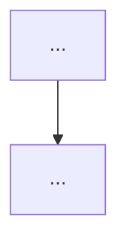
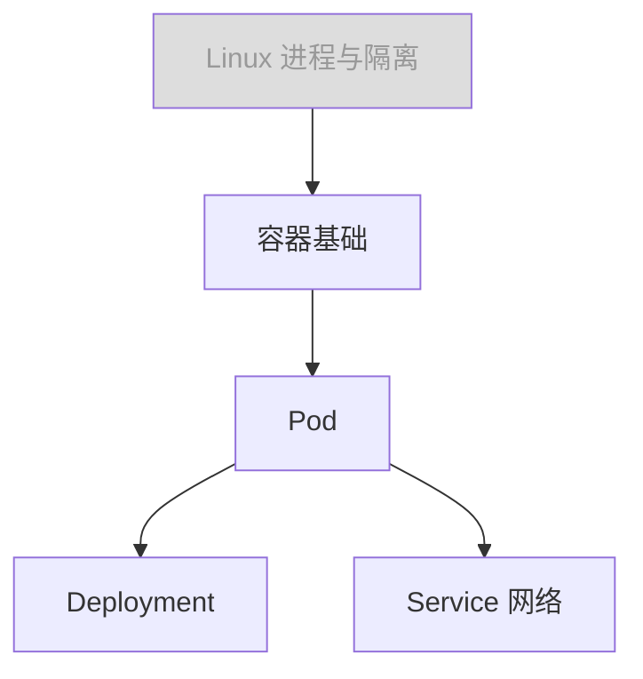

# Topic Teach 参考模板

供 [SKILL.md](SKILL.md) 各阶段引用的模板与格式规范。

## 目录

- [单课模板](#单课模板)
- [学习档案模板](#学习档案模板)
- [知识地图模板](#知识地图模板)
- [免责声明与风险提示模板](#免责声明与风险提示模板)
- [HTML 课程手册骨架](#html-课程手册骨架)
- [Quiz 文件格式](#quiz-文件格式)

---

## 单课模板

`lessons/lesson-NN-{slug}.md` 骨架（速览模式 `overview.md` 为其浓缩版，可省略课后小测）：

````markdown
# 第 N 课：{课名}

> 所属课程：{主题} ｜ 水平：{零基础/入门/进阶} ｜ 上一课：[第 N-1 课](lesson-NN.md)

## 🎯 本课目标

- 目标 1（学完能干什么，动词开头）
- 目标 2
- 目标 3（≤ 3 条）

## 从一个类比说起

{生活化类比，2-4 句。先讲类比故事，再点破"这就是 {核心概念}"}

## 原理讲解

### {小节 1}

{讲解正文。涉及流程/结构/交互/状态时配 Mermaid 图，图后一句话解读}



> 💡 **类比的边界**：{上面的类比在哪一点上不再成立，真实机制是什么}

### {小节 2}

...

## 动手环节

{技术域：可运行命令/代码 + 预期输出；非技术域：案例推演 + 计算表格}

### 命令速查卡（仅技术域）

| 命令 | 作用 | 常用参数 |
|------|------|----------|
| ... | ... | ... |

## 🐞 常见误区

1. **{误区 1}**：{为什么容易这么想错，正确理解是什么}
2. **{误区 2}**：...

## 一图总结

```mermaid
{本课知识浓缩图}
```

## 课后小测

**Q1**：{题干}
- A. ...
- B. ...
- C. ...
- D. ...

<details><summary>答案与解析</summary>

**答案：X**。{一句话解析，点明易混点}

</details>

**Q2**：...
````

---

## 学习档案模板

`00-学习档案.md`：

```markdown
# {主题} 学习档案

## 学习者画像

| 项目 | 值 | 来源 |
|------|-----|------|
| 主题 | k8s 基础 | 用户指定 |
| 当前水平 | 零基础 | 用户指定 |
| 学习目标 | 动手实操 | 默认值（用户未指定） |
| 输出格式 | HTML | 默认值 |
| 模式 | 课程制 | 自动判定，用户已确认 |

## 课时进度表

| 课时 | 课名 | 状态 | 完成日期 | 小测成绩 |
|------|------|------|----------|----------|
| 01 | 容器与 Pod | ✅ 已完成 | 2026-07-31 | 2/2 |
| 02 | Deployment 与副本 | 🔄 进行中 | - | - |
| 03 | Service 与网络 | ⬜ 未开始 | - | - |
```

**断点续学规则**：读此表找第一个非"已完成"课时继续；状态流转为 `⬜ 未开始 → 🔄 进行中 → ✅ 已完成`。

---

## 知识地图模板

`01-知识地图.md`：

````markdown
# {主题} 知识地图

## 前置依赖图



> 灰色节点为按你的画像判断已掌握的前置，课程中不再展开。

## 课程表

| 课号 | 课名 | 一句话目标 | 预计篇幅 |
|------|------|-----------|----------|
| 01 | ... | ... | 短/中/长 |
````

---

## 免责声明与风险提示模板

非技术域（投资/理财/医疗/法律）每篇产物**顶部**放：

```markdown
> ⚠️ **免责声明**：本材料仅用于知识学习，不构成投资/医疗/法律建议。文中数据标注了时点，
> 可能已过时；任何决策请咨询持牌专业人士并自行核实最新信息。
```

数字标注格式：`年化利率约 X%（数据时点：YYYY-MM，核查于 YYYY-MM）`。

**红线自查清单**（每篇非技术域产物发布前过一遍）：
- [ ] 未推荐任何具体标的 / 产品 / 药品 / 操作
- [ ] 所有数字有时点标注
- [ ] 顶部含免责声明
- [ ] 案例人物为虚构且已注明

---

## HTML 课程手册骨架

`final-课程手册.html` 单文件结构（静态富媒体，无 JS 交互逻辑，Mermaid 渲染除外）：

```html
<!DOCTYPE html>
<html lang="zh-CN">
<head>
<meta charset="UTF-8">
<meta name="viewport" content="width=device-width, initial-scale=1.0">
<title>{主题} 课程手册</title>
<script type="module">
  import mermaid from 'https://cdn.jsdelivr.net/npm/mermaid@11/dist/mermaid.esm.min.mjs';
  mermaid.initialize({ startOnLoad: true });
</script>
<style>
  /* Tufte 风格要点：大留白、衬线正文、窄栏 */
  body { max-width: 860px; margin: 0 auto; padding: 2rem 1.5rem;
         font-family: "Source Han Serif SC", "Noto Serif CJK SC", Georgia, serif;
         line-height: 1.75; color: #111; }
  h1, h2, h3 { font-family: "Source Han Sans SC", "Noto Sans CJK SC", sans-serif; }
  h2 { border-bottom: 1px solid #ddd; padding-bottom: .3rem; margin-top: 3rem; }
  code, pre { font-family: "JetBrains Mono", Consolas, monospace; background: #f6f6f6; }
  pre { padding: 1rem; overflow-x: auto; border-radius: 6px; }
  table { border-collapse: collapse; width: 100%; }
  th, td { border: 1px solid #ddd; padding: .5rem .75rem; text-align: left; }
  th { background: #f6f6f6; }
  /* callout 提示框 */
  .callout { border-left: 4px solid; padding: .75rem 1rem; margin: 1rem 0; border-radius: 0 6px 6px 0; }
  .callout.tip     { border-color: #2e7d32; background: #f0f7f0; }
  .callout.trap    { border-color: #c62828; background: #fdf0f0; }
  .callout.warn    { border-color: #ef6c00; background: #fdf6ec; }
  details { margin: 1rem 0; }
  details > summary { cursor: pointer; font-weight: 600; }
  nav.toc { background: #fafafa; padding: 1rem 1.5rem; border-radius: 8px; }
</style>
</head>
<body>

<h1>{主题} 课程手册</h1>
<p class="meta">水平：{画像} ｜ 生成日期：{日期} ｜ 共 {N} 课</p>

<!-- 非技术域必须：免责声明 -->
<div class="callout warn">⚠️ <strong>免责声明</strong>：...</div>

<nav class="toc">
  <strong>目录</strong>
  <ol>
    <li><a href="#map">知识地图</a></li>
    <li><a href="#lesson-1">第 1 课：{课名}</a></li>
    <!-- 每课一项 -->
  </ol>
</nav>

<h2 id="map">知识地图</h2>
<pre class="mermaid">graph TD
  A[...] --> B[...]</pre>

<h2 id="lesson-1">第 1 课：{课名}</h2>
<!-- 按单课结构转写：目标 → 类比 → 原理(含 mermaid) → 实操 → 误区 → 一图总结 -->
<div class="callout tip">💡 <strong>重点</strong>：...</div>
<div class="callout trap">🐞 <strong>常见误区</strong>：...</div>
<details><summary>展开：命令速查卡</summary>
  <table>...</table>
</details>

<!-- 学习目标附加章节（应试→考点速记 / 决策→决策清单）放最后 -->

</body>
</html>
```

要点：
- Mermaid 图写在 `<pre class="mermaid">` 中，由 CDN 脚本渲染
- callout 三类固定语义：`tip`（💡 重点）/ `trap`（🐞 误区）/ `warn`（⚠️ 风险）
- 长内容（速查卡、扩展阅读）一律用 `<details>` 折叠，保持主线清爽
- 无网络环境下 Mermaid 不渲染但原文可读，可接受

---

## Quiz 文件格式

与 module-teach 的 quiz-history 格式一致，便于用户跨技能形成统一习惯。

`quiz-history/round-NN.md`：

```markdown
# 第 NN 轮知识点对齐 · {主题}

- 日期：YYYY-MM-DD
- 正确率：X/Y（ZZ%）

## 题目明细

### Q1（知识点：{标签}）

题干：...
- A. ...（迷惑来源：{与正确项差在哪}）
- B. ...
- C. ...
- D. ...

正确答案：B ｜ 用户作答：A ｜ ❌
解析：...
```

`quiz-history/INDEX.md`：

```markdown
# 知识点对齐轮次索引 · {主题}

| 轮次 | 日期 | 正确率 | 错题知识点 |
|------|------|--------|-----------|
| 01 | 2026-07-31 | 3/5 (60%) | Service 类型区分、Pod 生命周期 |
```
