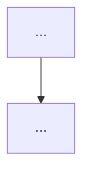

# Topic Teach 参考模板

供 [SKILL.md](SKILL.md) 各阶段引用的模板与格式规范。产物成品示例见 [examples.md](examples.md)。

## 目录

- [多阶段大纲模板](#多阶段大纲模板)
- [学习路径总览模板](#学习路径总览模板)
- [阶段概览模板](#阶段概览模板)
- [单课模板](#单课模板)
- [学习档案模板](#学习档案模板)
- [课程目录索引模板](#课程目录索引模板)
- [综合实战项目模板](#综合实战项目模板)
- [实战经验模板](#实战经验模板)
- [排障速查手册模板](#排障速查手册模板)
- [场景解法库模板](#场景解法库模板)
- [产物仓库 .gitignore 基线模板](#产物仓库-gitignore-基线模板)
- [接力提示词模板](#接力提示词模板)
- [SVG 图表规范](#svg-图表规范)
- [免责声明与风险提示模板](#免责声明与风险提示模板)
- [Quiz 文件格式](#quiz-文件格式)

---

## 多阶段大纲模板

**定位**：Phase 1 的中间产物，先经 course-reviewer 评审、再交用户确认，确认后才落盘为 `01-学习路径总览.md` + 各阶段 `overview.md`。大纲本身不落盘为独立文件，其内容承载于总览与阶段概览。

````markdown
# {主题} 多阶段大纲

> 供 course-reviewer 评审使用。评审通过后一次性落盘为学习路径总览 + 各阶段概览。

## 故事主线

- **主角**：{核心对象，如"Pod 生命周期"}
- **冲突**：{主角要解决的核心问题，如"单机扛不住流量"}
- **收束**：{学完整个主题后能回答的大问题，如"如何声明式管理万台集群"}

> 故事主线贯穿全程，每个阶段是故事的一个"章节"，每课是章节中的一个"情节"。

## 阶段划分与前置依赖

```mermaid
graph LR
    S1[阶段1：{名称}] --> S2[阶段2：{名称}]
    S2 --> S3[阶段3：{名称}]
```

## 阶段明细

### 阶段 1：{名称}（故事章节：{章节名，如"单机时代的终结"}）
- **目标**：{学完本阶段能干什么}
- **课**：
  - 课 1：{课名}
    - 知识点 1：{知识点名}（关键点：{关键点1} / {关键点2} / {关键点3}）
    - 知识点 2：{知识点名}（关键点：{关键点1} / {关键点2}）
  - 课 2：{课名}
    - 知识点 1：{知识点名}（关键点：{...}）

### 阶段 2：{名称}（故事章节：{章节名}）
- **目标**：{...}
- **课**：{...}
````

> 阶段数 2–4 个；每阶段 2–4 课；每课 2–5 个知识点；每个知识点 2–4 个关键点。**关键点是最小教学单元**，命名须具体（如"镜像分层"而非"镜像"），避免知识点笼统。知识点正文按「知识点六要素」展开（一句话定义 → 直觉建立 → 核心原理 → 示例演示 → 常见误区 → 一句话记住），不得只写一段话。

---

## 学习路径总览模板

**定位**：`01-学习路径总览.md`。记录**学习目标** + 告诉学习者**每个阶段的重点内容**，一屏看懂全程。随大纲 / 学习目标调整同步更新。

````markdown
# {主题} 学习路径总览

> 本文件是活文档，随学习进度动态调整。阶段依赖图统一用 SVG（见「SVG 图表规范」）。

## 🎯 学习目标

- **目标类型**：{理解概念 / 动手实操 / 应试认证 / 决策参考}
- **目标说明**：{一句话，学完想达到什么，如"能独立部署并管理 k8s 集群" / "通过 CKA 认证" / "能判断该不该用 k8s"}

> 学习目标是全局基准，决定各阶段/课的取舍与实操比重。目标变更时更新此处，并同步调整相关课（见 SKILL.md「大纲是活文档」）。

## 故事主线

- **主角**：{核心对象}
- **冲突**：{核心问题}
- **收束**：{学完能回答的大问题}

> 整个课程是这条故事线的展开，每个阶段是故事的一个"章节"。

## 学习路径图


> SVG 展示：阶段数、各阶段主题、阶段间前置依赖箭头。节点 ≥ 10 或拓扑复杂时仍用 SVG（学习路径图统一用 SVG，不因简单而退回 mermaid）。

## 阶段总览

### 阶段 1：{名称}（{预计 1–2 周}）

- **目标**：{一句话}
- **学习重点**：{3–5 条重点}
- **必须掌握**：{知识要点名，学完应能说清/做到什么}
- **对应课**：{课 1}、{课 2}

### 阶段 2：{名称}

- **目标**：{一句话}
- **学习重点**：{...}
- **必须掌握**：{...}
- **对应课**：{...}

## 当前进度

- [ ] 阶段 1：{名称}（{进行中 / 未开始 / 已完成}）
- [ ] 阶段 2：{名称}（...）
````

---

## 阶段概览模板

**定位**：`stages/{N}-{阶段名}/overview.md`（阶段目录名 = `{阶段序号}-{阶段名称}`，如 `1-基础知识学习`）。**每个阶段一个概览文件**，说明本阶段的目标、学习重点、必须掌握的知识点，是本阶段教学的"契约"（Phase 2 评审完整性时对照此文件）。

````markdown
# 阶段 {N}：{阶段名}

> 所属课程：{主题} ｜ 故事章节：{本阶段在故事主线中的章节名，如"单机时代的终结"} ｜ 上一阶段：[阶段 {N-1}](../{N-1}-{上一阶段名}/overview.md)

## 🎯 本阶段目标

- {学完本阶段能干什么，2–3 条}

## 📍 学习重点

- {重点 1：为什么重要}
- {重点 2}
- {重点 3}

## ✅ 必须掌握的知识点

| 知识点 | 所属课 | 学完应能 |
|--------|--------|----------|
| {知识点 1} | {课名} | {能说清 / 能操作什么} |
| {知识点 2} | {课名} | {...} |

## 🗺️ 本阶段路径图


> SVG 展示本阶段各课 / 各知识点的学习顺序与依赖。SVG 资源文件（含本阶段路径图）文件名保持英文 kebab-case（见「文件命名规范」），`{阶段slug}` 取阶段英文 slug；**仅课文件名用中文课名**。

## 本阶段产出

- [ ] `lessons/lesson-01-{课名}.md`
- [ ] `lessons/lesson-02-{课名}.md`
````

---

## 单课模板

`stages/{N}-{阶段名}/lessons/lesson-NN-{课名}.md` 骨架（课文件名中的 `{课名}` 用**中文课名**，不用英文 slug）。**一课含 2–5 个知识点**；首批在 Phase 1 落盘的课骨架上展开正文，若一课拆多批，第二批起在既有文件末尾**追加小节**（每小节 = 一个知识点），课首的「本课目标 / 知识点导航」首批写好，后续批次补状态，末尾「接力提示词」随批次更新指向下一批。

速览模式 `overview.md` 为其浓缩版，可省略课后小测，但须含"速览大纲"与"延伸学习提示词"，见 SKILL.md 速览模式。

````markdown
# 第 {N} 课：{课名}

> 所属阶段：阶段 {X}《{阶段名}》｜ 水平：{零基础/入门/进阶} ｜ 本课知识点：{知识点1}、{知识点2}、{知识点3}
> 故事情节：{本课在故事主线中的情节定位，如"主角第一次遇到流量高峰，发现单机不够用了"}

## 🎯 本课目标

- 目标 1（学完能干什么，动词开头）
- 目标 2
- 目标 3（≤ 3 条）

---

## 第一幕：起源与场景引入

**（可选）先讲知识/技术的起源背景**，再进入场景。仅当本课知识点有可考起源时启用（如 Elasticsearch/Linux/Docker 等）；纯概念或速查知识无起源则跳过，直接进入场景。

> 🏛️ **起源**：{诞生背景：为什么出现？}｜{作者/团队：谁创造的？}｜{关键转折：解决了什么痛点？}｜{演进：现在什么状态？}
> ⚠️ 起源背景是历史事实，须联网核实并标注 `（核查于 YYYY-MM）`；控制在 2-4 句，不喧宾夺主。

{用具体场景/痛点开场，让学习者身临其境。技术域给真实问题场景（如"公司服务上线后扛不住流量"）；非技术域给人物困境（如"小王想理财但不知从何开始"）。场景必须贴近学习者认知水平——场景本身不能比要讲的概念更难懂。}

> 🎬 **场景**：{一句话概括场景}

---

## 第二幕：认知冲突

{抛出场景中的矛盾/困惑，制造"为什么需要这个知识"的求知欲。冲突必须真实存在于场景中，不是硬造的。}

> ❓ **问题**：{场景中的核心矛盾/困惑，如"为什么直接加机器解决不了问题？"}

---

## 第三幕：层层揭示

{从直觉到抽象逐层展开。先给类比建立直觉，再逐步引入术语和原理。每引入一个概念都回扣第一幕的场景。知识点按"感知层 → 概念层 → 机制层 → 实操层 → 定位层"的认知阶梯排列。}

### 知识点 1：{知识点名}

> 本知识点关键点：{关键点1}、{关键点2}、{关键点3}

#### 一句话定义

{这个知识点是什么，一句话说清}

#### 直觉建立（类比）

{生活化类比，2-4 句。先讲类比故事，再点破"这就是 {核心概念}"}

> 💡 **类比的边界**：{上面的类比在哪一点上不再成立，真实机制是什么}

#### 核心原理

{讲解正文，覆盖本知识点的每个关键点。涉及流程/结构/交互/状态时配 Mermaid 图（命中 A/B 类信号则用 SVG），图后一句话解读}



#### 示例演示

{技术域：可运行命令/代码 + 预期输出，验证上面讲的机制；非技术域：案例推演 + "数字算给你看"。与第四幕分工：此处验证**单个知识点**的机制，第四幕"实操验证"整合多个知识点并回扣场景，避免重复}

```bash
{命令 / 代码}
# 预期输出：{说明}
```

#### 常见误区

1. **{误区 1}**：{为什么容易这么想错，正确理解是什么}

#### 一句话记住

{浓缩为一句话，便于复习}

#### 官方文档

- {官方文档名}：{链接}（本知识点涉及的概念 / API 有官方文档时附上；无则省略本节）

---

### 知识点 2：{知识点名}

{同上结构，认知层次比上一个知识点更深一层}

---

## 第四幕：实操验证

{技术域给可运行命令/代码验证第三幕讲的机制，且输出结果回扣第一幕场景（如"你看，加了这个配置后服务扛住了流量"）；非技术域给案例推演 + 计算表格。}

### 技术域

```
{可运行命令/代码}
# 预期输出：{说明}
```

> ✅ **回扣场景**：{这个结果如何解决了第一幕场景中的问题}

### 非技术域

{案例推演 + "数字算给你看"表格}

---

## 第五幕：体系收束

{回到全景，把本课知识点在整体架构/体系中的位置标出来。告诉学习者"现在你会了什么、接下来要学什么、为什么"。为下一课埋伏笔。}

> 📍 **全局定位**：{本课在整体知识体系中的位置}
> 🔗 **下一步**：{接下来学什么、为什么要学那个}

---

## 🐞 常见误区

1. **{误区 1}**：{为什么容易这么想错，正确理解是什么}
2. **{误区 2}**：...

## 一图总结

```mermaid
{本课知识浓缩图；若命中 A 类（图形复杂度）或 B 类（教学认知难度）任一信号则用 SVG 文件引用，见 SVG 图表规范}
```

## 课后小测

**Q1**：{题干}
- A. ...
- B. ...
- C. ...
- D. ...

<details><summary>答案与解析</summary>

**答案：X**。{一句话解析，点明易混点}

</details>

**Q2**：...

## 🚀 下一批接力提示词

> 学完本批后，**复制下面这段文字发给 AI**，即可无缝进入下一批（无需重新描述上下文）：

```
继续学 {主题}。我的学习档案在 {topic-slug}/00-学习档案.md，
刚学完阶段 {X}《{阶段名}》的课《{课名}》知识点 {知识点1、知识点2…}，
请按大纲继续讲解下一批知识点。
```

> 若这是本阶段最后一批，改为"🎉 本阶段完成"提示 + 建议进入下一阶段。

## 🧭 课程导航

> 整课完成后追加；拆批过程中（课未写完）不写。上一课 / 下一课用课文件相对链接；第一课省略「上一课」，最后一课的「下一课」改为「🎉 课程知识已讲完——接下来做综合实战项目」（不写"本课程已完成"——课时讲完 ≠ 学完，后面还有 Phase 3 / 5）并链接回课程目录。

⬅️ **上一课**：[课 {N-1}：{上一课名}](lesson-{NN-1}-{上一课名}.md)

➡️ **下一课**：[课 {N+1}：{下一课名}](lesson-{NN+1}-{下一课名}.md)

📚 **返回目录**：[课程目录](../../02-课程目录.md)
````

---

## 学习档案模板

`00-学习档案.md`：

```markdown
# {主题} 学习档案

## 学习者画像

| 项目 | 值 | 来源 |
|------|-----|------|
| 主题 | k8s 基础 | 用户指定 |
| 当前水平 | 零基础 | 用户指定 |
| 学习目标 | 动手实操 | 默认值（用户未指定） |
| 输出格式 | Markdown（主载体，Mermaid + SVG 图表） | 默认值 |
| 模式 | 课程制 | 自动判定，用户已确认 |

## 知识点级进度表

| 阶段 | 课 | 知识点 | 状态 | 完成日期 | 小测成绩 |
|------|-----|--------|------|----------|----------|
| 1 | 课 1 | 镜像与容器 | ✅ 已完成 | 2026-08-03 | - |
| 1 | 课 1 | 容器运行时 | ✅ 已完成 | 2026-08-03 | - |
| 1 | 课 2 | Pod 概念 | 🔄 进行中 | - | - |
| 1 | 课 2 | Pod YAML | ⬜ 未开始 | - | - |
| 2 | 课 3 | 副本管理 | ⬜ 未开始 | - | - |

## 评审记录

> course-reviewer 每次评审的结论在此追加一行。评审方式：`use_agent 委派`（子 agent 已创建）或 `主 agent 内联`（子 agent 未创建）。批次内容评审为双模式（教学法视角 + 学习者视角），冲突时主 agent 裁决并标注。

| 日期 | 评审对象 | 评审方式 | 意见摘要 | 处置 |
|------|----------|----------|----------|------|
| 2026-08-03 | 多阶段大纲 | use_agent 委派（pedagogy） | P0×0 / P1×1（阶段 2 目标过宽） | 采纳 P1，拆分目标 |
| 2026-08-04 | 课 1 批次 | use_agent 委派（pedagogy + learner） | pedagogy：P0×0；learner：P0×1（第一幕是定义堆砌） | 采纳 learner P0，改为场景开场 |
| 2026-08-05 | 课 2 批次 | 主 agent 内联（pedagogy + learner） | 双模式冲突：pedagogy 说知识点齐全，learner 说第三幕认知跳跃 → 主 Agent 裁决：采纳 learner，补铺垫 | 修订后复审通过 |

## 大纲调整记录

> 大纲是活文档，每次调整在此追加一行（与 `01-学习路径总览.md` / 阶段 `overview.md` 同步更新；结构性调整须重新过 course-reviewer 评审）。

| 日期 | 调整内容 | 原因 |
|------|----------|------|
| 2026-08-03 | 课 2 拆为 2a/2b 两课 | 用户反馈 Pod 概念偏难，需放慢节奏 |
| 2026-08-05 | 新增阶段 3"网络策略" | 用户目标从"理解概念"改为"动手实操" |
```

**断点续学规则**：读此表找**当前阶段第一个非"已完成"的知识点**继续；状态流转为 `⬜ 未开始 → 🔄 进行中 → ✅ 已完成`。续学前先看"大纲调整记录"与"评审记录"，确认结构与进度是否已变；**并读 `00-评审清单.md` 检查是否有未勾选条目，有则先补评审**。

---

## 评审清单模板

`00-评审清单.md`：评审的**强制检查点**，与学习档案「评审记录」表分工——清单负责**事前占位待办 + 事后勾选**（未勾选 = 未评审，禁止进入下一批），学习档案负责**评审结论摘要**（历史档案）。Phase 1 落盘时按已规划的阶段/课占位全部评审节点；大纲结构性调整时同步增删条目。

```markdown
# {主题} 评审清单

> 强制检查点：每批内容生成后，先在本文件找到对应未勾选条目，完成双 agent 评审且 P0 清零后，才能勾选并交付。未勾选 = 评审未完成，禁止进入下一批。

## 待评审清单

- [x] 大纲评审（Phase 1）— P0=0 通过
- [ ] 阶段 1·课 1《容器基础》 — pedagogy + learner 双视角
- [ ] 阶段 1·课 2《Pod 基础》 — pedagogy + learner 双视角
- [ ] 阶段 2·课 3《Deployment》 — pedagogy + learner 双视角
- [ ] **结课实战项目**（Phase 3）— pedagogy + learner 双视角 + **复杂度四门槛核查**
- [ ] **实战经验 / 排障速查手册 / 场景解法库**（Phase 5）— pedagogy + learner 双视角 + **证据纪律核查**

## 评审记录（勾选后追加结论摘要）

| 日期 | 评审对象 | 评审方式 | P0 数 | 意见摘要 |
|------|----------|----------|-------|----------|
| 2026-08-03 | 大纲评审 | use_agent 委派（pedagogy） | 0 | 阶段 2 目标过宽（P1 采纳） |
```

> 评审结论完整摘要仍记入 `00-学习档案.md` 的「评审记录」表（历史档案），本清单的「评审记录」表可只写一行极简摘要或不写（仅靠勾选状态即可）。

---

## 课程目录索引模板

**定位**：`02-课程目录.md`。该主题所有教学产物的**书本式目录**（活文档）：按**阶段 → 课 → 知识点**三级列出 + 速览 / 汇总手册条目。**已编写 = 可点击链接；未编写 = 纯文本**。断点续学 / 快速定位先看此表；知识点级进度以 `00-学习档案.md` 为准。

**维护时机**：
- Phase 1 落盘时创建骨架：按阶段 → 课 → 知识点列出全部计划课（未编写 = 纯文本）+ 速览 / 手册 / 实战项目 / 实战经验 / 排障手册 / 场景解法库条目（未编写 = 纯文本）
- Phase 2 每批落盘后：对应课改为可点击链接（即成文）
- 速览完成：追加链接条目
- Phase 3 实战项目完成：实战项目条目改为可点击链接
- Phase 4 手册完成：追加链接条目
- Phase 5 经验与手册完成：实战经验 / 排障手册 / 场景解法库三条目改为可点击链接

```markdown
# {主题} 课程目录

> 本文件是该主题下所有教学产物的目录，随教学进度更新。
> 已编写 = 可点击链接；未编写 = 纯文本。

## 阶段 1：容器与 k8s 基础

### [课 1：容器基础](stages/1-容器与k8s基础/lessons/lesson-01-容器基础.md)

- 镜像与容器
- 容器运行时
- 隔离原理

### [课 2：Pod](stages/1-容器与k8s基础/lessons/lesson-02-Pod.md)

- Pod 概念
- Pod YAML
- 多容器共享

## 阶段 2：调度与工作负载

### 课 3：Deployment（未编写）

- 副本管理
- 滚动更新
- 回滚

## 速览

- [Docker 网络模式速览](overview.md)

## 综合实战项目

- [三层 Web 应用灰度发布平台](projects/三层Web应用灰度发布/README.md)（未编写则写纯文本）

## 汇总手册

- [课程手册](final-课程手册.md)

## 实战经验 / 排障 / 场景解法

- [实战经验](08-实战经验.md)
- [排障速查手册](09-排障速查手册.md)
- [场景解法库](10-场景解法库.md)
```

> 目录保持书本式（章节 → 条目），下钻到**知识点级**；不引入状态 / 日期 / 多列表格；状态细节以 `00-学习档案.md` 进度表为准。**知识点级列表为静态索引**（预览该课大纲内容），进度标记以课级链接为准（已编写 = 课标题链接，未编写 = 纯文本）。

---

## 综合实战项目模板

**定位**：`projects/{项目名}/`（目录名用**中文项目名**），课程制 Phase 3 产物。把散装知识点焊成整体能力的"合奏"环节。

**复杂度四门槛**（缺一即判 P0）：① 跨 ≥3 阶段且有知识点地图回指 ② ≥2 项非功能约束 ③ ≥2 个**真有争议**的决策点 ④ 技术域多文件工程 / 非技术域 ≥5 步完整推演。

### README.md

````markdown
# 实战项目：{项目名}

> 所属课程：{主题} ｜ 学习目标：{动手实操 / 决策参考 / …} ｜ 预计耗时：{X 小时}

## 🎯 一句话需求

{一句话说清做什么，如"部署一个能扛住流量高峰的三层 Web 应用，并具备灰度发布能力"}

## ✅ 目标与非功能约束

- **功能目标**：{2-3 条}
- **非功能约束**（≥2 项）：{性能：…} / {错误处理：…} / {可维护性：…} / {安全：…} / {成本：…}

## 🗺️ 覆盖知识点地图

> **这是"跨阶段整合"的证据，必须逐个回指课时**，不是装饰。

| 知识点 | 所属阶段 / 课 | 本项目用在何处 | 回指 |
|--------|--------------|---------------|------|
| {知识点 1} | 阶段 1 · 课 2 | {哪个文件 / 哪一步} | [lesson-02-…](../../stages/1-…/lessons/lesson-02-….md) |
| {知识点 2} | 阶段 2 · 课 3 | {...} | [...] |
| {知识点 3} | 阶段 3 · 课 5 | {...} | [...] |

**跨阶段校验**：覆盖 {N} 个阶段（门槛 ≥3）✅ / ❌

## 🚀 运行方式

> **非技术域本节改为「🎬 推演方式」**：写"按什么顺序走完这套决策推演、每步看什么"，不放命令。

```bash
{一条命令跑起来，或分步骤}
# 预期结果：{看到什么算成功}
```

## 📁 目录说明

| 路径 | 内容 |
|------|------|
| `设计决策.md` | ≥2 个权衡点的完整论证 |
| `反例对照.md` | "能跑但很糟"的版本 + 逐条对比 |
| `实现/` | 技术域：可运行代码（中文注释）；**非技术域此目录改名为 `推演/`**，放完整决策推演 |
| `验收清单.md` | 自测项，逐项勾选 |
````

### 设计决策.md

````markdown
# 设计决策 · {项目名}

> 每个决策点必须**真有争议**——换个人来可能选另一个方案，且也有道理。唯一正确答案不算决策点。

## 决策 1：{决策点名称}

**候选方案**：

| 方案 | 做法 | 优点 | 缺点 |
|------|------|------|------|
| A · {方案名} | {...} | {...} | {...} |
| B · {方案名} | {...} | {...} | {...} |

**最终选择**：{A / B}

**选择理由**：{结合本项目约束说明，2-4 句}

**为此付出的代价**：{选了它就得接受什么——不能只写优点}

**什么时候该改选另一个**：{条件变化时的翻转点，如"若 QPS < 100，B 更简单更好"}

---

## 决策 2：{决策点名称}

{同上结构}
````

### 反例对照.md

````markdown
# 反例对照 · {项目名}

> 不是"错误示例"，而是**看起来能跑、实际很糟**的版本——只有这样才能教会"为什么最佳实践是最佳实践"。

## ❌ 反例：{反例做法}

```{语言}
{反例代码 / 反例配置}
```

> 它**能跑通**，甚至初看更简洁。问题在下面。

## 🔍 逐条对比（≥3 条）

| # | 维度 | ❌ 反例 | ✅ 正确做法 | 为什么糟 |
|---|------|---------|------------|----------|
| 1 | {维度} | {...} | {...} | {具体后果，如"流量翻倍时全部请求超时"} |
| 2 | {...} | {...} | {...} | {...} |
| 3 | {...} | {...} | {...} | {...} |

## 💡 一句话教训

{浓缩，如"能跑通 ≠ 能扛住；差别在于失败时怎么表现"}
````

### 验收清单.md

````markdown
# 验收清单 · {项目名}

> 逐项自测。**全部勾选才算真的做成了**——不是"跑起来就行"。

## 功能验收

- [ ] {功能点 1 的验证方式与预期}
- [ ] {功能点 2}

## 非功能验收

- [ ] {性能约束，如"压测 QPS 500 时 P99 < 200ms"}
- [ ] {错误处理，如"杀掉一个实例，服务仍可用"}

## 理解验收（能说清才算会）

- [ ] 能说清{决策 1}为什么这么选，以及什么时候该改选另一个
- [ ] 能说清反例错在哪，以及它"能跑通"的原因

## 🚀 下一步

- 做完了？→ 对照 [09-排障速查手册](../../09-排障速查手册.md) 看这个项目可能踩哪些坑
- 想检验？→ 复制"考我一下 {主题}，针对 {本项目涉及的知识点}"
````

---

## 实战经验模板

**定位**：`08-实战经验.md`，Phase 5 产物一（**学习态**）。坐着读，要懂为什么。配套使用态手册 `09-排障速查手册.md`——两份**一次生成**，素材源同一批失败模式，分开写必然双源漂移。

````markdown
# {主题} 实战经验

> 这份材料讲的是**课堂不教的那一半**：什么时候不该用、会怎么崩、崩了怎么查。
> 出事时别翻这份，翻 [09-排障速查手册.md](09-排障速查手册.md)。

## 🚫 适用边界与反模式

### 什么时候不该用它

> "不该用"比"怎么用"更值钱——这是从"会用"到"用对"的分界线。

| 场景 | 为什么不适合 | 该用什么替代 |
|------|-------------|-------------|
| {场景 1} | {原因} | {替代方案} |
| {场景 2} | {...} | {...} |

### 高频反模式（能跑，但迟早出事）

1. **{反模式 1}**：{为什么常见} → {后果} → {正确做法}
2. **{反模式 2}**：...

## 🔥 高频故障模式

> 每条固定**五段式**：症状 → 根因 → 排查路径 → 修复 → 预防。
> **症状必须可观测**：写"服务很慢"无效，要写"P99 从 50ms 涨到 3s，且 CPU 正常"。

### 故障模式 1：{故障名}

- **症状（可观测）**：{具体报错 / 指标 / 现象}
- **根因**：{机制层面为什么会这样}
- **排查路径**：
  1. {第一步，看什么}
  2. {第二步，看到什么说明什么}
- **修复**：{具体动作}
- **预防**：{怎么避免再发生}

> 对应速查条目：[09-排障速查手册.md · {症状名}](09-排障速查手册.md)

### 故障模式 2：{故障名}

{同上结构}

## ✅ 落地 Checklist

> 投产 / 上线 / 正式执行前逐项打勾。

- [ ] {检查项 1}
- [ ] {检查项 2}
- [ ] {安全检查项}
- [ ] {回滚预案是否已就绪}

## 📰 真实事故案例复盘（可选）

### 案例 1：{事故名}

- **经过**：{发生了什么}
- **根因**：{技术 / 流程根因}
- **损失**：{影响范围}
- **教训**：{可迁移到学习者身上的一条}
- **来源**：{链接}（核查于 YYYY-MM）

> ⚠️ 案例必须联网核实并标注来源。**找不到可信案例就删除本章节，不虚构**——虚构事故比没有更糟。
````

---

## 排障速查手册模板

**定位**：`09-排障速查手册.md`，Phase 5 产物二（**使用态**，机长 QRH 式）。**崩了才翻它——只要答案，不要原理。**

**五特征（缺一即退化成普通"常见错误列表"）**：① 按症状倒查（索引表是检索入口，不是目录）② 症状可观测 ③ 先止血后定位 ④ 分支判定（条件-动作表）⑤ 有升级出口。

````markdown
# {主题} 排障速查手册

> **怎么用**：出事了别从头读。按索引表找**症状**，翻到对应条目照做。
> **想懂为什么**：每个条目末尾有原理链接，事后再看 [08-实战经验.md](08-实战经验.md)。
> **查不到**：→ 转 `debug` skill 现场取证。

## 🔎 症状倒查索引

| 一眼看到的现象 / 报错关键字 | 紧急度 | 翻到 |
|--------------------------|:------:|------|
| {报错原文 / 日志关键字 / 现象} | 🔴 | **症状 1**：{症状名} |
| {…} | 🟡 | **症状 2**：{症状名} |
| {…} | ⚪ | **症状 3**：{症状名} |

> **「翻到」列只写条目编号与症状名，不写锚点链接**——锚点由标题文字生成，而症状名是运行时才确定的内容，硬写锚点一旦替换占位符就失效。读者按编号往下翻即可，手册条目数有限（通常 ≤ 10 条），不需要跳转。

**紧急度**：🔴 立即处理（业务已受损）｜ 🟡 尽快处理（有风险未爆发）｜ ⚪ 有时间再看（体验 / 优化）

---

## 🔴 症状 1：{一句话症状}

**一眼识别**：{日志关键字 / 报错原文 / 现象特征}

| 步骤 | 动作 | 预期 |
|------|------|------|
| **止血** | `{止损命令 / 动作}` | {恢复到什么状态，如"存量实例恢复 Running"} |
| 定位 1 | `{诊断命令}` | {看到 X 说明是 A 问题；看到 Y 说明是 B} |
| 定位 2 | `{诊断命令}` | {...} |
| 修复 | `{修复动作}` | {成功的标志} |
| 若无效 | → 转「{另一条目}」/ 转 `debug` 现场排查 | — |

> **预防**：{一句话}
> **原理**：→ [08-实战经验.md](08-实战经验.md) · 故障模式 {N}（写编号即可，跨文件锚点同样会因占位符替换而失效）

---

## 🟡 症状 2：{一句话症状}

{同上结构}

---

## ⚪ 症状 3：{一句话症状}

{同上结构}

---

## 🚑 通用止血动作（不确定是哪类问题时，先把损失停下）

| 场景 | 止血动作 | 代价 |
|------|----------|------|
| 刚变更就出问题 | {回滚变更} | 丢失新功能 |
| 单实例异常 | {摘除 / 隔离该实例} | 容量下降 |
| 依赖方故障 | {降级 / 熔断} | 部分功能不可用 |

> **已收录 {N} 条**。宁缺毋滥——凑不满就如实写数字，不硬凑凑数条目。
> **证据纪律**：每条「症状—根因—修复」须可溯源；拿不准的留在 `08-实战经验.md` 并标 `⏳ 置信度：低`，**不得进入本手册**。
````

---

## 场景解法库模板

**定位**：`10-场景解法库.md`，Phase 5 产物三（**设计态**）。把"会用"推进到"会设计"——每个场景是一道开放设计题，先想后看。

**四条硬要求**：① 多解法（每场景 ≥3 个，含代价与边界）② 先想后看（`<details>` 折叠）③ 知识点挂钩（回指课程）④ 递进 + 不适用边界。

````markdown
# {主题} 场景解法库

> **怎么用**：每个场景先自己思考"怎么做"，再展开看解法。**先想后看，能力才长出来**。
> 配套：[08-实战经验.md](08-实战经验.md)（为什么）｜ [09-排障速查手册.md](09-排障速查手册.md)（出错了怎么办）。

## 场景 1：{场景名}

**场景描述**：{具体化、可观测，如"大促期间 QPS 从 500 涨到 5000，数据库先扛不住，接口开始超时"}

**🔒 先自己想 30 秒**：{引导，如"第一反应是加机器？加缓存？"}

<details><summary>💡 提示（分层 / 分维度想）</summary>

{不直接给答案的思考方向，如"入口层 / 应用层 / 数据层分别怎么扛？"}

</details>

<details><summary>📖 展开解法</summary>

### 解法一览（≥3 个，含代价与边界）

| 解法 | 能解决到 | 代价 | 适用边界 |
|------|---------|------|---------|
| {解法 A} | {到什么程度} | {付出什么} | {什么场景适用} |
| {解法 B} | {...} | {...} | {...} |
| {解法 C} | {...} | {...} | {...} |

### 推荐路径（递进，不是一次全上）

1. {先上成本最低的}
2. {仍不够再上}
3. {最后的大招}

### 知识点挂钩

- {解法 A} → 阶段 {X} 课 {Y}
- {解法 B} → 阶段 {X} 课 {Z}

### 什么情况下此方案不适用

{边界，如"强一致性场景不能粗暴加缓存"}

### 做错会踩的坑

→ 关联 [08-实战经验.md](08-实战经验.md) 的故障模式 {N}（如"解法 A 做错会引发故障模式 3"）

</details>

---

## 场景 2：{场景名}

{同上结构}
````

> **场景来源**：AI 按主题域生成 5–8 个领域高频高难度场景。**每个解法必须可溯源**（官方文档 / 联网核查 / 领域公认实践），不可溯源的不进「解法一览」确定区，标注 `⏳ 置信度：低`。
> **非技术域适配**：场景改为决策题（"通胀""单一收入""家庭变故"），「解法一览」改为「路径一览」（按目标给多路径 + 后果核算），「知识点挂钩」「不适用边界」结构不变。

---

## 产物仓库 .gitignore 基线模板

**定位**：Phase 1.3 落盘时在**产物仓库根**创建；后续按 SKILL.md「产物仓库卫生」的「检查方法」（五步：列未提交文件 → 按 git 状态分流 → 三分类判定 → 追加 → 校验）增量追加。**只追加不删规则**，不预先灌满未出现的类别。（清理临时文件另见 SKILL.md 同章节的「临时文件清理」小节，两者不是一回事）

```gitignore
# ---- 系统与编辑器 ----
.DS_Store
Thumbs.db
*.swp
*.swo
.idea/
.vscode/
*.tmp

# ---- 过程残留（按实际出现追加，不必一次写全）----
# Python
__pycache__/
*.py[cod]
.venv/
venv/
.mypy_cache/
.pytest_cache/
# Node
node_modules/
# Java
target/
*.class
# Go / Rust
# vendor/

# ---- 构建产物与日志 ----
*.log
logs/
tmp/

# ---- 本地配置与密钥（绝不入库）----
.env
.env.local
.env.*.local
```

**注释是必须的**：分组注释让后续追加时知道往哪加，也让用户看得懂为什么忽略。

### 追加规则

| 规则 | 说明 |
|------|------|
| **只加本轮真实出现的** | 没写 Python 就不加 `__pycache__/`；没跑构建就不加 `dist/`。`.gitignore` 灌水会退化成噪音 |
| **加进对应分组** | 无现成分组则新建分组 + 注释，不散着往末尾堆 |
| **宽泛目录名锚定路径** | `dist/` `build/` 这类名字易与实战项目的示例目录撞名 → 写成 `/dist/`、`/build/`（锚定仓库根）或 `{项目路径}/dist/` |
| **追加后校验** | 重跑 `git status --porcelain -- "{topic-slug}/"`：`*.md` / `assets/*.svg` / `实现/` 源码仍可见，未被误吞；已提交过的产物不会出现在 status 中，此时用 `git check-ignore -v {路径}` 判定（应无命中）。**已跟踪的 🚫 项在 `git rm --cached` 之前不会消失，属预期，不算校验失败**。详见 SKILL.md「第 5 步：校验未误伤」 |
| **已跟踪文件加规则无效** | `.gitignore` 只对未跟踪文件生效；已跟踪 / 已暂存的残留（状态码非 `??`）须先补规则、再 `git rm --cached -r {路径}`（**须先征询用户**）。详见 SKILL.md 同章节「第 2 步：按 git 状态分流」 |

### 禁止忽略清单（负向操作兜底）

以下**绝不能**进 `.gitignore`——均是要提交的教学产物：

```gitignore
# 绝不加：
# *.md
# assets/ 或 **/*.svg
# stages/ projects/ 知识点对齐记录/
# 实现/ 推演/ 目录本身（只有其内部依赖目录该被忽略）
```

> 判定口诀：*这个文件丢了，课程还完整吗？* 不完整 → 是教学产物，不能忽略；完整 → 是过程残留，可以忽略。

---

## 接力提示词模板

**目的**：让用户复制一句话即可无缝续学，无需重新描述上下文。所有模式（课程制 / 速览 / 续学 / 汇总后）均需提供。

### 1. 课程制 · 下一批接力提示词

写在每批产物末尾（`lessons/lesson-NN-{课名}.md` 末尾），同时原样贴在对话中；**接力提示词随批次更新**，始终指向"下一批"（一课拆多批时，第二批生成后覆盖为指向第三批）：

````markdown
## 🚀 下一批接力提示词

> 学完本批后，**复制下面这段文字发给 AI**，即可无缝进入下一批（无需重新描述上下文）：

```
继续学 {主题}。我的学习档案在 {topic-slug}/00-学习档案.md，
刚学完阶段 {X}《{阶段名}》的课《{课名}》知识点 {知识点1、知识点2…}，
请按大纲继续讲解下一批知识点。
```

> 若这是本阶段最后一批，改为"🎉 本阶段完成"提示 + 建议进入下一阶段。
````

### 2. 速览 · 延伸学习提示词

写在 `overview.md` 末尾，让速览可自然升级为系统学习。速览本身不做 Phase 3 / 5（实战项目与排障手册），故给**两条**延伸路径——选第二条（实战 / 避坑）时 AI 先升级为课程制，再走 Phase 3 / 5：

````markdown
## 🚀 想深入？复制发给 AI

**升级为系统课程**（含结课实战项目与排障手册）：

```
我刚看了 {topic-slug}/overview.md 关于 {主题} 的速览，
想进一步学习，请按我的情况（{水平} / 目标 {目标}）把 {延伸方向} 展开成一个课程。
```

**直接要实战 / 避坑**：

```
我刚看了 {topic-slug}/overview.md 关于 {主题} 的速览，
请给我一个综合实战项目练手，或讲讲 {主题} 的实战经验、排障速查手册与场景解法库。
```
````

### 3. 汇总手册 · 结课提示词

写在 `final-课程手册.md` 末尾（课程制 Phase 4）：

```markdown
## 🚀 接下来可以做什么

- **避坑**：复制"给我讲讲 {主题} 的实战经验、排障手册与场景解法库"，进入 Phase 5。
- **复盘**：复制"考我一下 {主题}，针对 {薄弱点}"进行知识点对齐。
- **进阶**：告诉我下一步想深入的方向，我会基于当前档案调整大纲继续。
```

---

## SVG 图表规范

> **SVG 在教学中的核心定位**：不仅是"mermaid 搞不定时的备胎"，更是**认知降载工具**——当文字/代码描述不足以让学习者建立心智模型时，用 SVG 图形化呈现来降低认知负担、加速理解。

### 选型规则（双维度触发信号）

**继承 `document-writer` skill 的基础四因子**（图本质、复杂度、渲染环境、复用需求），并扩展为**双维度触发信号**：

| 决策因子 | 用 mermaid | 用 SVG |
|----------|-----------|--------|
| **图本质** | 关系图：节点+连线的结构化表达（流程图/时序图/状态图/类图/ER 图） | 视觉设计图：布局、形状、色彩、图标（架构拓扑、学习路径、UI 布局） |
| **复杂度** | 节点 ≤ 10 且拓扑简单（线性/树状、分支回环少） | 拓扑稠密/嵌套深，或分支回环多导致 mermaid 布局杂乱 |
| **渲染环境** | 目标平台支持 mermaid 渲染 | 平台不支持 mermaid，或需静态导出 |
| **复用需求** | 仅在文档内查看 | 需独立 `.svg` 文件供下载/复用 |
| **教学认知难度** ✨ | 文字/代码能讲清的概念 | "光靠文字/代码讲不清"的知识点（见下方 B 类信号） |

#### A 类：图形复杂度信号（继承自 document-writer）

出现任一即改 SVG（即使节点 ≤ 10）：

- **分支/回环密集**：大量 if-else、循环回边、异常分支
- **交叉连线多**：多条边跨节点交叉
- **需泳道/分区语义**：流程需按角色/系统分泳道
- **扇入/扇出大**：多源汇聚或单源分叉
- **需精确位置/方向控制**：强调阅读顺序、层级对齐

#### B 类：教学认知难度信号（topic-teach 教学专属）

> 这类信号的判断标准不是"图有多复杂"，而是**"学习者的工作记忆是否会被纯文字描述压垮"**。当知识点属于以下场景时，优先考虑用 SVG 作为主要表达手段：

| # | 场景 | 触发条件 | 示例 | SVG 表达形式 |
|---|------|----------|------|-------------|
| B-1 | **数据结构内部结构** | 需展示内存布局 / 节点关系 / 索引映射 / 多层嵌套结构 | 哈希表的「索引 → 数组 → 链表」三列对应关系；树的节点与指针；图的邻接表与边 | 具象化内部构造图：格子/框/箭头精确对齐，标注每个部分的含义 |
| B-2 | **算法执行过程** | 需分步演示状态变化 / 元素移动 / 变量演变 | 数组插入元素时后续元素逐步右移；冒泡排序每轮比较与交换；递归调用栈的展开与回溯 | 分步纵向排列图：每一步一个状态快照，用箭头连接，关键变化高亮标注 |
| B-3 | **抽象概念映射** | 需建立「抽象概念 → 具体实体」的视觉桥梁；含多层 / 层级 / 嵌套关系的空间表达 | hash 函数的 key→index 映射；指针/引用的内存地址关系；变量名与内存值的绑定；**OSI 七层模型 / TCP/IP 协议栈 / MVC 分层架构 / 微服务架构层** | 概念模型图：左右或上下分区，一边是抽象符号、一边是具象表示，箭头标明映射关系；**层级图：横向分层 + 层间交互箭头 + 每层职责标注** |
| B-4 | **多概念对比分类** | 需并排对比多个概念的异同 / 分类归属 / 特征矩阵 | 线性 vs 非线性数据结构对比；各排序算法的时间/空间复杂度对比；数据库索引类型选型 | 对比矩阵 / 分类卡片图：并列区域各展示一个概念，共享维度标签，差异处视觉区分 |
| B-5 | **数据 / 函数可视化** | 需展示连续数据的形态 / 趋势 / 分布 / 对比曲线 | 时间复杂度 O(n) vs O(n²) vs O(log n) 曲线对比；正弦波 / 概率分布曲线；算法执行时间随数据量增长的趋势图 | 数据图表：坐标轴 + 曲线/柱状/散点 + 标注关键点（拐点/极值/渐近线）；**不替代专业图表库**（ECharts/D3），仅用于教学中"一眼看懂趋势"的轻量场景 |

> **B-5 边界判定（轻量 vs 专业）**：
> - ✅ 适用 B-5：单图数据点 ≤ 10 个、无需交互（缩放/平移/tooltip）、一次性静态展示（非实时更新/非仪表盘），目的是"一眼看懂趋势"
> - ❌ 不适用 B-5（应推荐 ECharts/D3 / matplotlib 等专业库）：需多系列动态对比、实时数据更新、用户交互操作、仪表盘/大屏展示、数据点 > 20 个的密集图表

**B 类信号的使用原则**：
- 这类图**不以"复杂度"为触发门槛**——即使只有 3 个元素（如哈希表 3 个桶），只要"用文字描述会让学习者脑补累"，就用 SVG
- SVG 是这类知识点的**主要表达载体**，文字作为辅助说明（而非反过来）
- 每张图应有明确的**教学目标**："这张图要让学习者看懂哪一件事"

#### 反向约束

默认仍用 mermaid；**仅当出现上述任一触发信号才改用 SVG**，不得因"SVG 更精美"随意替换简单图。

### SVG 产出形式

1. **独立 SVG 文件**（唯一形式）：写入各文档目录 `assets/`（如 `stages/1-基础知识/overview.md` 的图 → `stages/1-基础知识/assets/`），文档用 `` 引用。**引用路径按文档所在层级区分**：`overview.md`（阶段目录根）与 `{topic-slug}/` 根级文档（学习路径总览 / 课程手册）→ `./assets/xxx.svg`；`lessons/lesson-NN.md`（lessons 子目录）→ `../assets/xxx.svg`。GitHub 等主流平台均支持 `` 引用 SVG 文件。
2. ~~内联 SVG~~：不使用（GitHub 会剥离内联 `<svg>` 标签，读者将看到空白）。

### 配色与背景约束（mermaid + SVG 通用）

**核心**：图表背景禁用黑色 / 过深颜色，一律浅色背景（含白色），保证文字与图形可读。

- **mermaid**：保持默认浅色主题，不启用深色主题（`%%{init: {"theme": "dark"}}%%` 等）；文字用深色（如 `#333`）保证可读。
- **SVG**：画布 / 背景矩形用浅色（如 `#fff`、`#fafafa`、`#f5f5f5`）；深色（如 `#1565C0`、`#1a237e`）仅用于**元素强调**——表头 / 标签 / 高亮块（其上文字用浅色 `#fff`），不得作为大面积背景。
- **对比度**：文字与底色保持足够对比；拿不准时以"浅底深字"为默认。

### 文件命名规范

- 命名风格：kebab-case（全小写 + 短横线），如 `learning-path-overview.svg`
- 语义化：`{图作用}-{图主题}.svg`，如 `stage-01-pod-path.svg`、`k8s-pod-structure.svg`、`hash-table-structure.svg`、`array-insert-step.svg`
- 存放：与引用它的文档同目录的 `assets/` 下，路径与 `![...]` 引用一致（lesson 文件在 `lessons/` 子目录，引用本阶段 `assets/` 须写 `../assets/xxx.svg`）
- 禁用：中文、空格、大写、无意义命名（`img1.svg`）、过短缩写（`arch.svg`）
- 一图一文件，同名复用直接引用同一文件，不复制副本

### AI 生成 SVG 的能力边界

- ✅ 可生成：
  - 结构化简单 SVG（节点框 + 连线 + 文本标签的流程/拓扑示意）
  - 数据结构示意图（格子阵列 + 标注文本 + 简单箭头）
  - 算法步骤图（纵向排列的状态快照 + 高亮标注）
  - 概念映射图（分区 + 映射箭头 + 标签）
  - 对比分类图（并列卡片 + 共享维度标签）
  - 数据/函数可视化图（坐标轴 + 曲线/柱状 + 关键点标注，轻量教学场景）
  - 图标化图形
  - CSS 微动画（渐入、高亮闪烁、路径描边等 `@keyframes` 简单动画，用于强调关键变化）
- ❌ 不应生成：复杂视觉设计（多层渐变、复杂曲线、拟物图标、品牌级插画）、SMIL 动画（兼容性差）、JS 交互（Markdown 渲染环境会剥离）——标注「需设计工具产出」并给占位说明，不得用占位符敷衍

### SVG 动画使用原则

> 用户可能问"SVG 能动吗？"——答案是**有限地可以**，但必须遵守以下约束：

| 动画类型 | 技术手段 | GitHub | VitePress / VS Code / Typora | 推荐度 |
|----------|---------|:------:|:---------------------------:|:-----:|
| **CSS `@keyframes`** | `<style>` 内嵌或 `<animate>` CSS 替代 | ⚠️ 基本可用（`` 引用时部分受限） | ✅ 完全支持 | ✅ **首选** |
| **SMIL `<animate>`** | SVG 原生动画标签 | ❌ 被剥离 | ⚠️ 部分支持 | ❌ 不推荐 |
| **JS 驱动** | `<script>` + DOM 操作 | ❌ 被安全策略剥离 | ❌ 被剥离 | ❌ 禁止 |

**核心原则**：

1. **动画是增强不是依赖**：每张 SVG 必须在**无动画时仍可理解**（静态帧就是完整的信息载体）；动画仅用于降低认知负担（如逐步揭示、高亮关键变化）
2. **CSS 动画场景**（推荐使用的 3 种）：
   - **逐步揭示（Reveal）**：算法步骤图中按序淡入各步（`opacity: 0 → 1` + `animation-delay` 阶梯延迟）
   - **高亮强调（Highlight）**：关键元素脉冲发光或颜色变化（如哈希表中命中桶的高亮）
   - **路径描边（Draw）**：线条从起点到终点动态绘制（适用于流程/路径类图）
3. **禁止事项**：
   - 不用 SMIL `<animate>` / `<animateTransform>`（GitHub 等主流平台不支持）
   - 不用 JS（所有 Markdown 渲染环境都会剥离 `<script>`）
   - 不做"纯炫技"动画（旋转、弹跳、粒子效果等与教学目标无关的视觉噪音）
4. **降级策略**：当不确定目标渲染环境是否支持 CSS 动画时，产出**纯静态 SVG**；动画作为可选增强层，不作为默认产出

> **一句话总结**：*能不动就不动；动就用 CSS `@keyframes`；动画掉了也不能影响理解。*

### 固定 SVG 场景（统一用 SVG，不因简单而退回 mermaid）

- `01-学习路径总览.md` 的**阶段依赖图**
- 各阶段 `overview.md` 的**本阶段路径图**
- 单课「一图总结」若命中 A 类或 B 类任一信号 → SVG

### 判断口诀

> *能讲清关系的用 mermaid；关系复杂到 mermaid 讲不清 → 用 SVG；文字讲不清的概念 → 也用 SVG。*

---

## 免责声明与风险提示模板

非技术域（投资/理财/医疗/法律）每篇产物**顶部**放：

```markdown
> ⚠️ **免责声明**：本材料仅用于知识学习，不构成投资/医疗/法律建议。文中数据标注了时点，
> 可能已过时；任何决策请咨询持牌专业人士并自行核实最新信息。
```

数字标注格式：`年化利率约 X%（数据时点：YYYY-MM，核查于 YYYY-MM）`。

**红线自查清单**（每篇非技术域产物发布前过一遍）：
- [ ] 未推荐任何具体标的 / 产品 / 药品 / 操作
- [ ] 所有数字有时点标注
- [ ] 顶部含免责声明
- [ ] 案例人物为虚构且已注明

---

## Quiz 文件格式

与 module-teach 的 quiz 机制格式一致（命名统一：最新一轮 `07-知识点对齐.md` + 历史 `知识点对齐记录/round-NN.md`），便于用户跨技能形成统一习惯。完整机制见 module-teach Phase 8，此处仅列出文件格式。

`知识点对齐记录/round-NN.md`：

```markdown
# 第 NN 轮知识点对齐 · {主题}

- 日期：YYYY-MM-DD
- 正确率：X/Y（ZZ%）

## 题目明细

### Q1（知识点：{标签}）

题干：...
- A. ...（迷惑来源：{与正确项差在哪}）
- B. ...
- C. ...
- D. ...

正确答案：B ｜ 用户作答：A ｜ ❌
解析：...
```

`知识点对齐记录/INDEX.md`：

```markdown
# 知识点对齐轮次索引 · {主题}

| 轮次 | 日期 | 正确率 | 错题知识点 |
|------|------|--------|-----------|
| 01 | 2026-07-31 | 3/5 (60%) | Service 类型区分、Pod 生命周期 |
```
