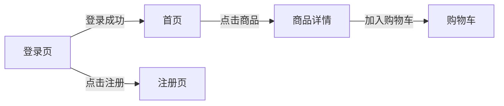
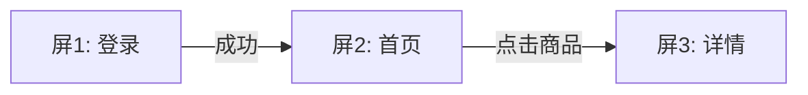

# UI to ASCII 参考手册

本文件是 [SKILL.md](SKILL.md) 的展开参考，包含 ASCII 绘制规范、组件画法库、多屏流程图模板与完整产物样例。

---

## ASCII 绘制规范

### 字符集

| 用途 | 字符 |
|------|------|
| 四角 | `┌` `┐` `└` `┘` |
| 直线 | `─`（横）`│`（竖） |
| 交叉/分隔 | `├` `┤` `┬` `┴` `┼` |
| 强调外框（可选） | `╔ ╗ ╚ ╝ ═ ║`（用于弹层/模态框区分层级） |

**规则**：
- 同一张图内框线风格统一（默认单线 `─│`，模态/浮层可用双线 `═║` 以示区分）。
- 竖线 `│` 必须上下对齐；横线用 `─` 铺满框宽。
- 中文占 2 字符宽，按**视觉宽度**对齐（1 汉字≈2 空格），右框线对不齐时在文字右侧补空格即可，不强求逐像素。
- 整体宽度 ≤ 80 字符（复杂图 ≤ 100）。

### 组件画法库

**输入框**：
```
用户名  [____________________]
```

**按钮**（主/次用文字区分，尺寸靠标注表补充）：
```
[   登录   ]      ( 取消 )
```

**复选框 / 单选框**：
```
[x] 已勾选    [ ] 未勾选
(o) 选中项    ( ) 未选项
```

**下拉框**：
```
[ 请选择        ▼ ]
```

**图标 / 图片占位**：
```
[img]   [icon]   (●)   [图]
```

**列表 / 卡片**：
```
┌──────────────────────────┐
│ (●) 标题文字         ①    │
│     副标题/描述           │
├──────────────────────────┤
│ (●) 标题文字              │
│     副标题/描述           │
└──────────────────────────┘
```

**标签页 / Tab**：
```
┌─────┬─────┬─────┐
│ 全部│ 进行│ 完成│
└─────┴─────┴─────┘
```

**带区域划分的整页骨架**：
```
┌────────────────────────────────────────┐
│  Logo            导航1  导航2  [头像]     │ ← 顶栏
├──────────┬─────────────────────────────┤
│ 菜单A     │                             │
│ 菜单B     │        主内容区              │
│ 菜单C     │                             │
│          │                             │
├──────────┴─────────────────────────────┤
│              底栏 / 版权                 │
└────────────────────────────────────────┘
```

---

## 多屏流程图模板

多屏或含跳转时，在文件顶部放一张 Mermaid 流程图串联各屏：

````markdown

````

> 注意：Mermaid 代码块用三反引号 ` ```mermaid `；本模板外层用四反引号仅为在本文档中展示，实际写入产物时用三反引号。

---

## 产物文件模板

### 单屏模板

````markdown
# {界面名} — ASCII 布局

> 来源：设计稿转存 | 转换日期：{YYYY-MM-DD}
> 说明：本文件由 UI 设计稿转换而来，ASCII 图还原相对布局，标注见下表。

## 布局

```
┌────────────────────────────────────────┐
│  ← 返回        登录            ①         │
├────────────────────────────────────────┤
│                                        │
│   手机号  [____________________] ②      │
│                                        │
│   密码    [____________________]        │
│                                        │
│   [x] 记住我            忘记密码?        │
│                                        │
│         [        登录        ] ③        │
│                                        │
│         还没账号？去注册                 │
└────────────────────────────────────────┘
```

## 标注

| 编号 | 类型 | 目标元素 | 标注内容 |
|------|------|----------|----------|
| ① | 字体 | 标题"登录" | 18px，加粗，#333 |
| ② | 尺寸 | 输入框 | 宽 320px，高 44px，圆角 8px |
| ③ | 颜色 | 登录按钮 | 背景 #1677FF，文字 #FFF |

## 待确认项

- ⚠️ [待确认] 输入框之间的间距（图中未标注）
- ⚠️ [待确认] 页面背景色
````

### 多屏模板

````markdown
# {流程名} — ASCII 布局

> 来源：设计稿转存（{N} 屏） | 转换日期：{YYYY-MM-DD}

## 跳转流程



## 屏 1：登录

```
{ASCII 图 + 锚点}
```

| 编号 | 类型 | 目标元素 | 标注内容 |
|------|------|----------|----------|
| ① | ... | ... | ... |

## 屏 2：首页

```
{ASCII 图 + 锚点}
```

| 编号 | 类型 | 目标元素 | 标注内容 |
|------|------|----------|----------|
| ① | ... | ... | ... |

## 待确认项

- ⚠️ [待确认] ...
````

---

## 完整样例（登录页）

以下是一个从"带标注的登录页设计稿"转换而来的完整产物示例，可作为质量基准参考：

````markdown
# 登录页 — ASCII 布局

> 来源：设计稿转存 | 转换日期：2026-01-15

## 布局

```
┌──────────────────────────────────────────┐
│                                          │
│                [ LOGO ] ①                 │
│                                          │
│         欢迎登录                          │
│                                          │
│   ┌────────────────────────────────┐     │
│   │ 手机号 [___________________]  ② │     │
│   └────────────────────────────────┘     │
│   ┌────────────────────────────────┐     │
│   │ 密码   [___________________]    │     │
│   └────────────────────────────────┘     │
│                                          │
│   [x] 记住登录            忘记密码? ③      │
│                                          │
│        [          登录          ] ④       │
│                                          │
│   ──────────  或  ──────────             │
│                                          │
│        (微信)    (QQ)    (Apple) ⑤        │
│                                          │
└──────────────────────────────────────────┘
```

## 标注

| 编号 | 类型 | 目标元素 | 标注内容 |
|------|------|----------|----------|
| ① | 尺寸 | Logo | 120×120px，居中 |
| ② | 尺寸 | 输入框 | 宽 300px，高 48px，圆角 24px，边框 #DDD |
| ③ | 颜色 | 忘记密码链接 | #1677FF，14px |
| ④ | 颜色/尺寸 | 登录按钮 | 背景渐变 #1677FF→#0958D9，宽 300px，高 48px，圆角 24px |
| ⑤ | 交互 | 第三方登录图标 | 点击拉起对应授权，图标 40×40px |

## 待确认项

- ⚠️ [待确认] 页面整体背景（图中似为浅灰，未标注色值）
- ⚠️ [待确认] "欢迎登录"标题字号
````

---

## 反模式（避免）

| 反模式 | 正确做法 |
|--------|----------|
| 图看不清就按常识猜尺寸/色值 | 标 `[待确认]`，请用户补充 |
| ASCII 里画了图中没有的组件 | 只画确实存在的元素 |
| 框线不对齐、竖线错位 | 等宽对齐，宁留白不错位 |
| 占位符混用（一会 `[img]` 一会 `[图片]`） | 全文统一一套占位符 |
| 标注直接堆在 ASCII 里挤乱布局 | 用编号锚点 + 独立标注表 |
| 给 ASCII 代码块指定语言（如 ` ```python `） | 用无语言的 ` ``` ` 代码块，避免高亮破坏对齐 |
